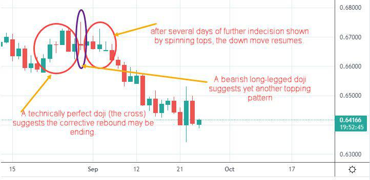

Algorithmic trading has become a cornerstone of modern financial markets, revolutionizing the way trades are executed and investments are managed. This innovative approach leverages advanced mathematical models and computing technology to automate and optimize trading decisions. The core advantage of algorithmic trading lies in its ability to process vast amounts of data at speeds unattainable by human traders, thereby enhancing market efficiency and offering new investment opportunities.

Technology has played a pivotal role in this evolution, transforming trade mechanisms from manual, time-consuming processes to sophisticated, automated systems. The adoption of high-speed internet, powerful computing resources, and big data analytics has paved the way for complex trading algorithms that can execute numerous transactions per second and operate across global markets.



Within this technological framework, Bullet Trade emerges as a novel algorithmic trading strategy. Known for its precision and speed, Bullet Trade employs algorithms designed to identify and capitalize on short-term market opportunities. Unlike traditional trading methods, which may rely on human intuition and slower response times, Bullet Trade utilizes algorithmic precision to achieve its objectives, thereby distinguishing itself from other trading strategies.

Algorithmic trading has proven its relevance in today's fast-paced financial environment. Traders and investors benefit from reduced transaction costs, mitigated human error, and the elimination of emotional biases that often hamper decision-making. Moreover, algorithmic trading enables strategies such as high-frequency trading, market-making, and arbitrage, which are essential for maintaining market liquidity and stability.

Understanding these modern investment options is crucial for investors seeking to capitalize on the advantages offered by algorithmic trading. As technology continues to evolve, trade mechanisms will undoubtedly become even more sophisticated, offering enhanced tools and strategies for investment. This sets the stage for a deeper exploration of the various investment options facilitated by these advanced trade mechanisms, providing investors with the insights needed to navigate the increasingly complex financial landscape.

## Table of Contents

## Understanding Trade Mechanisms

Trade mechanisms are fundamental structures that facilitate the buying and selling of financial assets in markets, encompassing a range of processes and systems that ensure trades are executed efficiently and transparently. These mechanisms have transformed significantly over the years, primarily due to technological advancements.

Initially, trade mechanisms were predominantly manual, with brokers on trading floors physically exchanging assets and employing various hand signals and verbal agreements to finalize transactions. This process, while foundational, was labor-intensive and had limitations in terms of speed and accuracy. As technology progressed, electronic trading systems emerged, enabling the automatic execution of trades through complex algorithms, thereby revolutionizing financial markets.

The advancement to automated trade mechanisms was pivotal in enhancing market efficiency. Automated systems can process vast amounts of data with greater speed and precision than manual methods. This efficiency reduces the time it takes to complete transactions and minimizes discrepancies in pricing, contributing to fairer and more stable market conditions. Consequently, modern trade mechanisms play a crucial role in maintaining [liquidity](/wiki/liquidity-risk-premium), ensuring price transparency, and facilitating the continuous adjustment of asset prices in response to new information.

There are several types of trade mechanisms in contemporary financial markets:

1. **High-Frequency Trading (HFT):** This approach leverages powerful computers to execute a large number of orders at extremely high speeds. HFT firms often engage in practices that seek to gain small profits from minute price discrepancies, trading hundreds of thousands or even millions of shares in a single day.

2. **Market-Making:** Market makers provide liquidity to the markets by quoting both buy and sell prices for financial instruments. They earn a spread between these prices and facilitate trading by being ready to buy or sell assets at publicly quoted prices, thus ensuring that other investors can trade without significant delay.

3. **Arbitrage:** This strategy involves the simultaneous purchase and sale of the same asset in different markets to exploit price differentials. Algorithmic systems detect these discrepancies in milliseconds and execute transactions before the market corrects itself, profiting from the difference.

The role of regulatory bodies in overseeing trade mechanisms is integral to maintaining market integrity and investor confidence. Regulatory agencies such as the Securities and Exchange Commission (SEC) in the United States oversee that trading practices are fair and transparent. They set rules to deter market manipulation, ensure best execution standards for trades, and limit the risks associated with high-speed trading practices that could contribute to market [volatility](/wiki/volatility-trading-strategies) or unfairness.

In summary, trade mechanisms have evolved from manual processes to highly sophisticated automated systems, enhancing market efficiency and stability. Various forms of trading, such as high-frequency trading, market-making, and [arbitrage](/wiki/arbitrage), utilize these mechanisms to optimize transactions. Regulatory oversight is essential to maintain the integrity and fair operation of these modern trade mechanisms, ensuring they benefit the financial markets and their participants.

## Investment Options in Algorithmic Trading

Algorithmic trading has revolutionized traditional investment landscapes by offering diverse options tailored to a wide array of financial instruments and strategies. One popular investment option within [algorithmic trading](/wiki/algorithmic-trading) is high-frequency trading ([HFT](/wiki/high-frequency-trading-strategies)), which leverages advanced algorithms to capitalize on minute price discrepancies in very short time frames, often milliseconds. This type of trading requires substantial technology and infrastructure investment to minimize latency, enabling traders to execute orders faster than their competitors.

Another prevalent strategy is [statistical arbitrage](/wiki/statistical-arbitrage), which utilizes statistical models to identify and exploit price inefficiencies between correlated financial instruments. For instance, pairs trading, a form of statistical arbitrage, involves monitoring the spread between two historically correlated stocks; when the spread diverges from its historical average, trades are executed to profit from the expected convergence.

Benefits of algorithmic trading strategies are numerous. They significantly enhance the speed and efficiency of trades, surpassing human capabilities in analyzing and acting upon market data. Algorithms process vast amounts of data to identify profitable opportunities and execute orders almost instantaneously. This speed not only reduces transaction costs but also increases market liquidity. Additionally, algorithmic trading minimizes human error and emotional decision-making, providing a more disciplined approach to investing. 

However, risks associated with algorithmic trading should not be overlooked. One major concern is the potential for algorithmic strategies to amplify market volatility, especially in times of unexpected financial events. There are also technical risks, such as software bugs or network failures, which could lead to significant financial losses. To mitigate these risks, traders often incorporate rigorous [backtesting](/wiki/backtesting) and stress testing into their strategy development. Backtesting involves applying the trading algorithm to historical data to evaluate its performance. This practice, alongside continuous monitoring, ensures that the algorithms perform as intended under various market conditions.

When comparing traditional investment options to algorithmic investment strategies, several differences are evident. Traditional investments often rely on [fundamental analysis](/wiki/fundamental-analysis), where investors evaluate financial statements and market conditions to make decisions. This approach is typically slower and may involve subjective judgment. In contrast, algorithmic strategies are based on quantitative methods, relying on mathematical models and computational techniques to dissect market movements.

Real-world examples of successful algorithmic investment strategies abound. Renaissance Technologies, a [hedge fund](/wiki/hedge-fund-trading-strategies) founded by James Simons, effectively employs algorithmic models, reportedly yielding a 66% annual return before fees from 1988 to 2018 for its Medallion Fund. Additionally, firms like Citadel and Two Sigma have harnessed algorithmic trading to manage billions in assets, consistently outperforming many traditional asset management firms.

In conclusion, algorithmic trading offers distinct investment opportunities characterized by increased speed, efficiency, and the ability to handle complex datasets. While there are inherent risks, careful management and strategic implementation of algorithms can lead to significant financial success, marking algorithmic trading as a formidable force in contemporary financial markets.

## Bullet Trade: A Unique Algorithmic Trading Strategy

Bullet Trade represents a novel and distinct approach within the sphere of algorithmic trading. This strategy is characterized by its precision and speed, leveraging cutting-edge technology to execute highly targeted trades. The primary distinction of Bullet Trade from other algorithmic trading strategies lies in its focus on pinpoint accuracy and minimal execution time. By employing sophisticated algorithms and real-time data analysis, Bullet Trade aims to capitalize on micro-movements in market prices, often executing trades in milliseconds.

The operational framework of Bullet Trade is centered around advanced computational models that predict short-term price fluctuations. These models incorporate [machine learning](/wiki/machine-learning) techniques to continuously improve their predictive accuracy. The strategy typically involves high-frequency trading (HFT) elements but distinguishes itself through its targeted trade executions aimed at specific market inefficiencies or arbitrage opportunities. The integration of [artificial intelligence](/wiki/ai-artificial-intelligence) allows Bullet Trade algorithms to adapt to changing market conditions rapidly, thereby optimizing trade decisions.

Historically, Bullet Trade has demonstrated success in diverse market environments. Empirical evidence suggests that this strategy can yield significant returns by exploiting price discrepancies across various asset classes. For instance, during periods of heightened market volatility, Bullet Trade has been able to maintain robust performance by rapidly adjusting its trading parameters in response to real-time data.

However, Bullet Trade is not without its challenges. One of the primary risks associated with this strategy is the potential for over-reliance on algorithmic models, which may lead to substantial losses if market conditions alter unexpectedly. Additionally, the high-speed nature of Bullet Trade requires substantial technical infrastructure and continuous monitoring, posing significant operational risks. There is also the danger of increasing market fragmentation, where liquidity becomes dispersed across various trading venues, making it challenging for Bullet Trade to execute at optimal prices.

In summary, Bullet Trade offers a unique approach to algorithmic trading, distinguished by its focus on speed and precision. While it has shown promising results historically, it also requires careful management of inherent risks and operational challenges.

## Benefits of Using Algorithmic Trading in Investment

Algorithmic trading offers a myriad of benefits that have revolutionized the investment landscape, providing traders with enhanced tools to optimize their strategies. One of the foremost advantages is the speed and efficiency with which trades are executed. Algorithms can process orders at a fraction of a second, a capability that is indispensable in modern financial markets where timeliness is crucial. This speed mitigates delays that could lead to missed opportunities or unfavorable price shifts.

Another significant benefit is the reduction in human error and the minimization of emotional decision-making. Emotions such as fear and greed can adversely affect trading decisions, leading to irrational actions. Algorithms operate based on predefined criteria and data, ensuring consistency and objectivity in trade executions. This leads to more disciplined and unbiased trading practices, ultimately contributing to higher accuracy and reliability.

Algorithmic trading also offers the capacity for backtesting and strategy refinement. Backtesting involves using historical data to assess how a trading strategy would have performed in the past. This facilitates the elimination of ineffective strategies and the enhancement of potential returns by optimizing the algorithm before it is deployed in live markets. Python, with libraries such as pandas and [backtrader](/wiki/backtrader), is a popular tool for such tasks:

```python
import pandas as pd
import backtrader as bt

# Define a simple moving average crossover strategy
class SmaCross(bt.SignalStrategy):
    def __init__(self):
        sma1, sma2 = bt.ind.SMA(period=10), bt.ind.SMA(period=30)
        self.signal_add(bt.SIGNAL_LONG, sma1 > sma2)

# Load historical data
data = bt.feeds.YahooFinanceData(dataname='AAPL', fromdate=pd.to_datetime('2010-01-01'), todate=pd.to_datetime('2020-01-01'))

# Set up Cerebro engine
cerebro = bt.Cerebro()
cerebro.addstrategy(SmaCross)
cerebro.adddata(data)
cerebro.run()
cerebro.plot()
```

Moreover, algorithmic trading contributes to increased liquidity in the markets and a reduction in the costs associated with trading. By facilitating quicker and more efficient trade executions, algorithms enable smoother operations and tighter spreads, leading to more liquid markets. This efficiency in execution often results in lower transaction costs for investors, thereby enhancing net returns.

Lastly, algorithmic trading provides heightened customization and flexibility in developing specific trading strategies. Traders can tailor algorithms to align with their unique risk preferences and investment goals, allowing for highly personalized approaches. This flexibility supports the implementation of a broad spectrum of strategies, from simple moving average crossovers to sophisticated statistical arbitrage models.

Together, these attributes illustrate the profound impact of algorithmic trading on modern investment practices, underscoring its importance as a tool for achieving optimal financial outcomes.

## Challenges and Considerations in Algorithmic Trading

Algorithmic trading is a sophisticated aspect of modern financial markets, but it presents several technical and financial challenges that traders must navigate. One significant challenge is the risk of over-optimization, often referred to as "curve fitting." This occurs when a trading algorithm is excessively tailored to historical data, resulting in strategies that appear highly profitable in backtesting but fail in real-world, volatile market conditions. Over-optimized algorithms might exploit random patterns that aren't persistent, leading to significant losses when market conditions change.

The unpredictable nature of financial markets emphasizes the need for continuous monitoring and adjustment of trading algorithms. Market dynamics are influenced by countless factors, including economic indicators, geopolitical events, and trader behavior. As these factors evolve, algorithms that were once profitable can become obsolete or even counterproductive without regular updates. Traders must establish robust monitoring systems to track algorithm performance and implement adjustments swiftly.

Legal and ethical considerations, particularly concerning high-frequency trading (HFT), add another layer of complexity. HFT involves executing large numbers of orders at extremely high speeds, often capitalizing on minuscule price discrepancies. While HFT can enhance market liquidity and efficiency, it also raises concerns about market fairness and stability. Issues such as the potential for market manipulation and the creation of "flash crashes"—brief, intense market downturns—have prompted regulatory scrutiny. Traders and firms must navigate these ethical concerns while adhering to legal frameworks, staying abreast of regulations from bodies such as the U.S. Securities and Exchange Commission (SEC) and the European Securities and Markets Authority (ESMA).

Finally, keeping pace with regulatory changes is paramount in algorithmic trading. Regulatory environments are continually adapting to address the complexities introduced by technological advancements in trading. Compliance with new rules is not only necessary to avoid legal repercussions but also to ensure the trust and integrity of financial markets. As regulations evolve, traders must remain informed and adapt their algorithms accordingly to maintain legal compliance and competitive advantage.

## Conclusion

Modern trading mechanisms have been revolutionized by the advent of technology, significantly shifting the landscape from traditional manual methods to sophisticated algorithmic strategies. This transition underscores the importance of technology in enhancing trade execution speed, precision, and efficiency. As we journey through the insights provided in this article, it becomes evident that the integration of technology into trading platforms has resulted in more streamlined and efficient market operations, highlighting its pivotal role.

Algorithmic trading stands out as a contemporary investment option that harnesses statistical models and computational resources to optimize trading decisions. With strategies like Bullet Trade emerging as notable examples, investors now have access to tools that offer unique opportunities and benefits. The allure of algorithmic trading lies not only in the ability to execute trades rapidly but also in reducing human errors, providing opportunities for strategy backtesting, and achieving substantial cost efficiencies. Such capabilities invite investors to reconsider their traditional investment approaches and potentially integrate algorithmic solutions into their portfolios.

The future of trading mechanisms and investment options seems poised for further technological enhancements and innovations. As algorithmic trading continues to evolve, it is essential for investors and market participants to stay informed about the latest developments and to embrace these changes proactively. This proactive stance will ensure that they capitalize on the technological advancements driving modern financial markets.

In closing, the call to action is clear: ongoing research and learning in algorithmic trading are crucial. Investors and stakeholders are encouraged to deepen their understanding of algorithmic strategies, explore their potential, and prepare for a future where technology will increasingly dictate the dynamics of trading and investment.

## References & Further Reading

[1]: ["Advances in Financial Machine Learning"](https://www.amazon.com/Advances-Financial-Machine-Learning-Marcos/dp/1119482089) by Marcos Lopez de Prado

[2]: ["Evidence-Based Technical Analysis: Applying the Scientific Method and Statistical Inference to Trading Signals"](https://www.amazon.com/Evidence-Based-Technical-Analysis-Scientific-Statistical/dp/0470008741) by David Aronson

[3]: ["Machine Learning for Algorithmic Trading"](https://github.com/stefan-jansen/machine-learning-for-trading) by Stefan Jansen

[4]: ["Quantitative Trading: How to Build Your Own Algorithmic Trading Business"](https://www.amazon.com/Quantitative-Trading-Build-Algorithmic-Business/dp/1119800064) by Ernest P. Chan

[5]: Aldridge, I. (2013). ["High-Frequency Trading: A Practical Guide to Algorithmic Strategies and Trading Systems."](https://www.amazon.com/High-Frequency-Trading-Practical-Algorithmic-Strategies/dp/1118343506) Wiley.