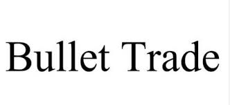

## Table of Contents

## What is bullet trade?

Bullet trade is a type of trade where someone buys and sells a financial product quickly. The goal is to make a small profit from small changes in the price. People who do bullet trade often use computers and special software to help them. This kind of trade is common in places like stock markets and forex markets.

Bullet trade can be risky because prices can change very quickly. If the price goes the wrong way, the trader could lose money. That's why it's important for people who do bullet trade to know a lot about the market and to have good tools to help them. Some people make a lot of money from bullet trade, but it's not easy and it's not for everyone.

## How does bullet trade differ from traditional trading?

Bullet trade is different from traditional trading because it happens very quickly. In traditional trading, people might buy a stock or another financial product and hold onto it for a long time, hoping the price will go up. They might keep it for weeks, months, or even years. Bullet traders, on the other hand, buy and sell in seconds or minutes. They are trying to make a small profit from tiny changes in the price, and they do this many times a day.

Another big difference is the use of technology. Bullet traders often use special software and computers to help them make decisions and execute trades faster than a human could. This technology can look at a lot of information very quickly and make trades based on that information. Traditional traders might use some technology, but they often rely more on their own research and understanding of the market. This means bullet trading can be more complicated and risky, but it can also be very profitable for those who are good at it.

## What are the basic mechanisms of bullet trade?

The basic mechanism of bullet trade involves quickly buying and selling financial products to make a small profit from small price changes. Traders use special software and computers to watch the market closely and make trades very fast. This software can look at a lot of information, like price movements and news, and decide when to buy or sell. The goal is to do many trades in a short time, hoping that the small profits from each trade will add up to a big profit overall.

Bullet trade is different from traditional trading because it focuses on speed and small price movements. Traditional traders might buy a stock and hold it for a long time, hoping the price will go up. Bullet traders, on the other hand, might buy and sell the same stock many times in one day. This makes bullet trade more risky, but it can also be more rewarding if done right. The key to success in bullet trade is having good technology and knowing a lot about the market.

## What are the common platforms used for bullet trade?

People who do bullet trade often use special computer programs called trading platforms. Some popular platforms for bullet trade are MetaTrader 4 and MetaTrader 5. These platforms let traders see the market and make trades very quickly. They also have tools that can help traders decide when to buy and sell. Another platform that is used a lot is NinjaTrader. It is known for being fast and having many tools that can help with bullet trade.

Other platforms that are used for bullet trade include cTrader and TradingView. cTrader is known for its fast trading and easy-to-use interface. TradingView is popular because it has a lot of charts and tools that can help traders see what the market is doing. All these platforms are made to help traders do bullet trade, which means buying and selling financial products quickly to make small profits.

## What are the key advantages of engaging in bullet trade?

One big advantage of bullet trade is the chance to make money fast. Because bullet traders buy and sell quickly, they can take advantage of small price changes in the market. If they do many trades in a day, these small profits can add up to a big amount. This means bullet traders can make money faster than traditional traders who hold onto their investments for a long time.

Another advantage is that bullet trade uses special technology that can help traders make better decisions. The software used in bullet trade can look at a lot of information very quickly and decide when to buy or sell. This can help traders find good opportunities they might miss if they were trading by themselves. Plus, the technology can make trades faster than a person could, which can be important in a market where prices change quickly.

## What risks should beginners be aware of when starting with bullet trade?

Bullet trade can be risky for beginners because it happens very fast. If you don't know a lot about the market, you might make a mistake and lose money. The prices can change in just a few seconds, and if you buy something and the price goes down right after, you could lose money. Also, the special software that helps with bullet trade can be hard to use at first. If you don't know how to use it well, you might miss good chances to make money or make trades at the wrong time.

Another big risk is that bullet trade can make you feel stressed. When you are trying to make quick decisions all the time, it can be hard to stay calm. If you let your feelings control your trades, you might make bad choices. Also, because bullet trade can be profitable, some beginners might start trading with too much money, hoping to make a lot of money fast. This can lead to big losses if things don't go well. It's important for beginners to start small and learn slowly to avoid these risks.

## How can one optimize their strategies in bullet trade?

To optimize your strategies in bullet trade, it's important to use the right tools and understand the market well. Start by choosing a good trading platform like MetaTrader 4 or NinjaTrader, which can help you make trades quickly and give you the information you need. These platforms often have special tools called indicators that can help you see trends and patterns in the market. Spend time learning how to use these tools well, and practice with them to get better at spotting good times to buy and sell. Also, keep learning about the market by reading news and understanding what makes prices go up or down. The more you know, the better you can predict what will happen next.

Another way to optimize your bullet trade strategies is to manage your money carefully. Don't use all your money at once because bullet trade can be risky. Instead, start with a small amount and slowly increase it as you get better. Set clear rules for yourself about when to stop trading if you're losing money, so you don't lose too much. It's also helpful to keep a record of your trades to see what works and what doesn't. By looking at your past trades, you can learn from your mistakes and improve your strategies over time. Remember, the key to success in bullet trade is to be patient and keep learning.

## What are the advanced tools and technologies used in bullet trade?

In bullet trade, advanced tools and technologies play a big role in helping traders make quick decisions and execute trades faster. One important tool is [algorithmic trading](/wiki/algorithmic-trading) software, which uses math formulas to decide when to buy and sell. This software can look at a lot of data very quickly and make trades based on that data. Another advanced tool is high-frequency trading ([HFT](/wiki/high-frequency-trading-strategies)) systems, which are designed to make thousands of trades in a second. These systems use special computers and fast internet connections to trade as quickly as possible. They can help traders take advantage of tiny price changes that happen in just a few seconds.

Other advanced technologies include [machine learning](/wiki/machine-learning) and [artificial intelligence](/wiki/ai-artificial-intelligence) (AI). These technologies can help traders predict what the market will do next by learning from past data. They can find patterns that humans might miss and make better trading decisions. Also, many bullet traders use real-time data feeds and advanced charting software to keep an eye on the market. These tools show the latest prices and trends, helping traders make quick and informed choices. By using these advanced tools and technologies, bullet traders can improve their chances of making money, but it's important to understand them well and use them carefully.

## How does regulation impact bullet trade practices?

Regulation has a big impact on bullet trade because it sets rules that traders have to follow. Different countries have different rules about what traders can and can't do. For example, some places might limit how much money you can trade with or how fast you can make trades. These rules are there to make sure the market is fair and to stop people from doing things that could hurt other traders or the market as a whole. If a trader breaks these rules, they could get in trouble and might have to pay a fine or even stop trading.

Regulation also affects the tools and technology that bullet traders use. Some rules might say what kind of software you can use or how you have to keep records of your trades. This can make bullet trade more complicated because traders have to make sure they are following all the rules while trying to make quick trades. But regulation can also help make the market safer and more trustworthy, which is good for everyone who trades. So, while it might make things harder for bullet traders, regulation is important for keeping the market fair and stable.

## What are the latest trends in bullet trade?

One of the latest trends in bullet trade is the increasing use of artificial intelligence (AI) and machine learning. These technologies help traders make better decisions by looking at a lot of data and finding patterns that humans might miss. More and more bullet traders are using AI to predict what the market will do next and to make trades at the best times. This can make bullet trade more successful, but it also means traders need to learn how to use these new tools.

Another trend is the growing importance of regulation. Governments and financial authorities are making more rules to make sure bullet trade is fair and safe. These rules can affect how fast traders can make trades or what kind of technology they can use. While this might make bullet trade more complicated, it's important for keeping the market honest and protecting everyone who trades. Bullet traders need to keep up with these rules and make sure they follow them to avoid getting in trouble.

## How do expert traders leverage bullet trade for maximum gains?

Expert traders use bullet trade to make money fast by buying and selling financial products quickly. They use special software and computers that help them see small changes in the market and make trades very fast. These tools can look at a lot of information and decide when to buy or sell. Expert traders also use strategies like setting clear rules for when to stop trading if they're losing money. This helps them avoid big losses and keep their profits. By doing many trades in a day, they can make small profits that add up to a big amount.

Another way expert traders leverage bullet trade is by using advanced technologies like artificial intelligence and machine learning. These technologies help them predict what the market will do next by learning from past data. This can give them an edge over other traders who don't use these tools. Expert traders also keep learning about the market and stay up-to-date with new rules and regulations. This helps them trade safely and make the most of their opportunities. By combining fast trading, smart technology, and careful planning, expert traders can maximize their gains in bullet trade.

## What future developments can we expect in the field of bullet trade?

In the future, we can expect more use of artificial intelligence and machine learning in bullet trade. These technologies will get better at looking at a lot of data and finding patterns that humans might miss. This can help traders make better decisions and make more money. Also, the software used for bullet trade will become faster and easier to use. This will make it easier for more people to start bullet trading and do it well.

Another big change we might see is more rules and regulations for bullet trade. Governments and financial authorities want to make sure the market is fair and safe for everyone. These new rules could change how fast traders can make trades or what kind of technology they can use. While this might make bullet trade more complicated, it's important for keeping the market honest. Overall, the future of bullet trade will likely involve smarter technology and more rules to make it safer and more profitable.

## References & Further Reading

[1]: ["Advances in Financial Machine Learning"](https://www.amazon.com/Advances-Financial-Machine-Learning-Marcos/dp/1119482089) by Marcos Lopez de Prado

[2]: ["Evidence-Based Technical Analysis: Applying the Scientific Method and Statistical Inference to Trading Signals"](https://www.amazon.com/Evidence-Based-Technical-Analysis-Scientific-Statistical/dp/0470008741) by David Aronson

[3]: ["Machine Learning for Algorithmic Trading"](https://github.com/stefan-jansen/machine-learning-for-trading) by Stefan Jansen

[4]: ["Quantitative Trading: How to Build Your Own Algorithmic Trading Business"](https://www.amazon.com/Quantitative-Trading-Build-Algorithmic-Business/dp/1119800064) by Ernest P. Chan

[5]: Aldridge, I. (2013). ["High-Frequency Trading: A Practical Guide to Algorithmic Strategies and Trading Systems."](https://www.amazon.com/High-Frequency-Trading-Practical-Algorithmic-Strategies/dp/1118343506) Wiley.