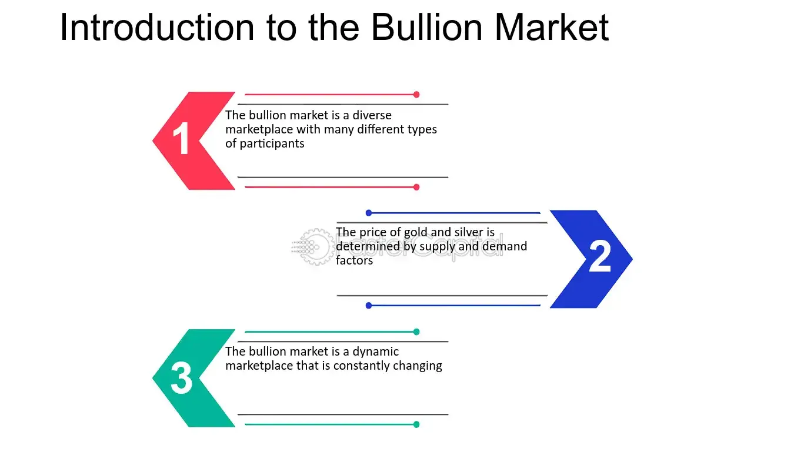

## Table of Contents

## What is the bullion market?

The bullion market is where people buy and sell gold, silver, and other precious metals in the form of bars or coins. These metals are called bullion. People trade bullion because it is seen as a safe way to keep their money. Bullion is often used as an investment, and its price can go up and down based on what is happening in the world.

The bullion market works like other markets, but it has some special features. It is a global market, meaning people from all over the world can buy and sell bullion. The price of bullion is usually set in big trading centers like London and New York. People can buy bullion from banks, dealers, or online. The market is also influenced by things like mining costs, interest rates, and how strong a country's money is.

## What are the main types of bullion?

The main types of bullion are gold and silver. Gold bullion is very popular because it is seen as a safe investment. People like to buy gold bars and coins because they think gold will keep its value over time. Gold is also easy to store and sell when needed. Silver bullion is another common type. It is less expensive than gold, so more people can afford it. Silver is used in jewelry and industry too, which can affect its price.

Another type of bullion is platinum. Platinum is rarer than gold and silver, which makes it more expensive. It is used a lot in making car parts and jewelry. Because it is not as common, the platinum market can be smaller and more affected by changes in industry needs. Palladium is also a type of bullion. Like platinum, it is used in cars and other industries. Palladium can be very valuable, but its price can change a lot because it depends on how much is needed for industry.

Overall, these metals - gold, silver, platinum, and palladium - are the main types of bullion. They are traded around the world and can be a good way for people to invest their money. Each type has its own special features and reasons why people might want to buy it.

## How does the bullion market function?

The bullion market is where people buy and sell gold, silver, platinum, and palladium in the form of bars or coins. It works like other markets, but it is special because it is global. People from all over the world can trade bullion, and the prices are usually set in big cities like London and New York. Banks, dealers, and online platforms are places where people can buy and sell bullion. The price of bullion can change every day based on what is happening around the world, like changes in mining costs, interest rates, and the strength of different countries' money.

The market for bullion is influenced by how much people want to buy and how much is available to sell. If more people want to buy gold than there is gold to sell, the price will go up. If there is more gold than people want to buy, the price will go down. Bullion is seen as a safe way to keep money because it usually keeps its value over time. People buy bullion as an investment, hoping that its price will go up in the future. The market can be affected by big events like economic crises or changes in industry needs, which can make the price of bullion go up or down quickly.

## What factors influence bullion prices?

Many things can change the price of bullion like gold, silver, platinum, and palladium. One big [factor](/wiki/factor-investing) is how much people want to buy it. If more people want to buy gold than there is gold to sell, the price will go up. Another factor is how much it costs to mine the metals. If it costs more to get gold out of the ground, the price of gold might go up too. Interest rates also play a role. When interest rates are low, people might buy more bullion because they can't get good returns from other investments like savings accounts.

The strength of different countries' money can also affect bullion prices. If a country's money gets weaker, people might buy more bullion to protect their money's value. Big events like economic crises or changes in industry needs can make the price of bullion go up or down quickly. For example, if there is a big demand for platinum in car making, the price of platinum might go up. All these factors together make the price of bullion change every day.

## What are the differences between gold and silver bullion?

Gold and silver bullion are both precious metals that people buy and sell, but they have some big differences. Gold is usually more expensive than silver. This is because there is less gold in the world, and it is seen as a safe way to keep money. People often buy gold bars and coins because they think gold will keep its value over time. Gold is also easier to store and sell when needed. On the other hand, silver is less expensive, so more people can afford it. Silver is used a lot in jewelry and industry, which can make its price go up and down based on how much is needed.

Another difference is how much gold and silver are used in the world. Gold is mostly used for investments and jewelry, while silver has more uses in industry. Silver is used in things like electronics, solar panels, and medicine. This means the price of silver can be affected by what is happening in these industries. Gold, on the other hand, is less affected by industry needs and more by big events like economic crises. So, while both gold and silver are good for investing, they can behave differently in the market because of their different uses and costs.

## How can someone invest in bullion?

Someone can invest in bullion by buying gold, silver, platinum, or palladium in the form of bars or coins. They can do this through banks, dealers, or online platforms. When someone buys bullion, they are hoping that its price will go up over time so they can sell it later for more money. It's a good idea to do some research and find a trusted seller to make sure they are getting real bullion at a fair price. Some people also choose to store their bullion in a safe place, like a home safe or a bank's safety deposit box.

Another way to invest in bullion is through exchange-traded funds (ETFs) that track the price of gold or silver. These funds let people invest in bullion without having to buy and store the physical metal themselves. ETFs can be bought and sold just like stocks, making it easier for some people to invest in bullion. No matter how someone chooses to invest, it's important to remember that the price of bullion can go up and down based on what is happening in the world. So, investing in bullion can be a good way to keep money safe, but it's not without risks.

## What are the risks associated with investing in bullion?

Investing in bullion like gold, silver, platinum, and palladium can be risky because the price can go up and down a lot. Big events like economic crises or changes in industry needs can make the price of bullion change quickly. For example, if there is suddenly a big need for silver in electronics, the price might go up. But if there is a big economic problem, people might sell their bullion, making the price go down. So, someone who invests in bullion might lose money if they need to sell it when the price is low.

Another risk is that someone might buy fake bullion. There are people who try to sell fake gold or silver bars and coins. If someone buys fake bullion, they could lose a lot of money. It's important to buy from trusted sellers and to check the bullion to make sure it is real. Also, storing bullion can be a problem. If someone keeps their bullion at home, they need a safe place to store it. If they use a bank's safety deposit box, they might have to pay for it. So, there are risks to think about when deciding to invest in bullion.

## How do geopolitical events affect the bullion market?

Geopolitical events can make the price of bullion go up or down a lot. When there are big problems in the world, like wars or big changes in governments, people might get scared about their money. They might think that their country's money will lose value, so they buy more gold or silver to keep their money safe. This can make the price of bullion go up because more people want to buy it. For example, if there is a war in a country that makes a lot of gold, it might be harder to get gold, and the price could go up.

On the other hand, some geopolitical events can make the price of bullion go down. If a big country's economy gets better, people might feel safer about their money and not want to buy as much bullion. They might invest their money in other things like stocks or savings accounts. This can make the price of bullion go down because there is less demand for it. So, geopolitical events can change how people feel about their money, and this can make the price of bullion move a lot.

## What role do central banks play in the bullion market?

Central banks have a big role in the bullion market because they buy and sell a lot of gold. When a central bank buys more gold, it can make the price of gold go up. This is because central banks are big and important buyers, so when they buy more gold, other people might want to buy it too. Central banks buy gold to keep their country's money safe. If they think their money might lose value, they might buy more gold to protect it. So, what central banks do can change how much people want to buy gold and how much it costs.

Central banks also hold a lot of gold in their reserves. This means they keep gold in a safe place and don't sell it often. But if a central bank decides to sell some of its gold, it can make the price of gold go down. This is because there is more gold for people to buy, so the price might not be as high. Central banks might sell gold if they need money or if they think their country's money is safe enough without it. So, central banks can affect the bullion market a lot by buying and selling gold and by keeping it in their reserves.

## How is the purity and authenticity of bullion verified?

The purity and authenticity of bullion are checked in different ways to make sure people get what they pay for. One common way is to look at the stamp on the bullion. Gold and silver bars and coins usually have a stamp that shows how pure they are. For example, a stamp might say "999" for gold that is 99.9% pure. People can also use special tools to test the bullion. There are machines that can tell if gold or silver is real by checking its weight and how it conducts electricity. These tests help make sure the bullion is not fake.

Another way to check bullion is to get it tested by a professional. Some companies and labs have experts who can look at bullion and tell if it is real and how pure it is. They might use acid tests, where they put a little acid on the bullion to see if it reacts in a certain way. They can also use X-ray machines to see inside the bullion and make sure it is not just a fake with a gold or silver coating. By using these methods, people can feel more sure that their bullion is real and worth what they paid for it.

## What are the trends in the global bullion market?

The global bullion market has seen some big changes in recent years. One trend is that more people are buying gold and silver as a safe way to keep their money. This is because there have been a lot of economic problems and uncertainty in the world. When people are worried about their money, they often buy more gold and silver. Another trend is that central banks are buying more gold to keep in their reserves. They do this to make their country's money safer. These trends can make the price of gold and silver go up because more people want to buy them.

Another trend in the bullion market is the rise of online buying and selling. More people are buying gold and silver online because it is easy and they can find good deals. This has made the market bigger and more global. But it also means people need to be careful to buy from trusted sellers so they don't get fake bullion. Also, the use of silver in industry, like electronics and solar panels, is growing. This can make the price of silver go up and down based on how much is needed for these industries. So, the global bullion market is changing and growing in many ways.

## How do futures and options work in the context of the bullion market?

Futures and options are ways for people to buy and sell gold and silver without actually having the metal. In the bullion market, a futures contract is an agreement to buy or sell a certain amount of gold or silver at a set price on a future date. People use futures to guess what the price of gold or silver will be later. If they think the price will go up, they might buy a futures contract now and sell it later for more money. If they think the price will go down, they might sell a futures contract now and buy it back later for less money. This can be risky because if the price doesn't go the way they thought, they could lose money.

Options are a bit different. An option gives someone the right, but not the obligation, to buy or sell gold or silver at a set price before a certain date. There are two types of options: calls and puts. A call option lets someone buy gold or silver at a set price, while a put option lets them sell it at a set price. People buy options to protect themselves from big changes in the price of gold or silver. For example, if someone owns gold and is worried the price might go down, they might buy a put option to sell it at a good price if that happens. Options can be less risky than futures because the person doesn't have to use them if the price doesn't change the way they thought.

## What is the role of algorithmic trading in gold markets?

Algorithmic trading has significantly transformed gold trading by enabling automated and data-driven decision-making processes. Algorithms in [algorithmic trading](/wiki/algorithmic-trading) process vast amounts of market data with the aim of identifying trading opportunities swiftly, which is crucial in a volatile market environment characteristic of gold trading. Through sophisticated computational methods, algorithmic trading allows traders to act on real-time data, enhancing both the speed and accuracy of trade execution.

A variety of algorithmic models are employed to predict market movements effectively. Among these are trend analysis and regression models, both pivotal in interpreting market directions. Trend analysis involves examining historical price movements to recognize ongoing patterns, thereby predicting future price directions. Algorithms can automate this process and quickly adjust strategies based on emerging trends. Regression models, which analyze the relationships between variables, are used to forecast future movements by understanding how different factors influence gold prices. A simple linear regression model to predict gold prices ($Y$) can be represented as:

$$
Y = \beta_0 + \beta_1X_1 + \beta_2X_2 + \ldots + \beta_nX_n + \epsilon
$$

where $X_1, X_2, \ldots, X_n$ are the predictor variables, $\beta_0, \beta_1, \ldots, \beta_n$ are the coefficients to be determined, and $\epsilon$ is the error term.

Furthermore, AI algorithms are increasingly being utilized to enhance trading efficiency and accuracy. Machine learning models, for example, can recognize complex patterns in historical data to make informed predictions about future price movements. Techniques such as neural networks and decision trees are applied to improve prediction accuracy and adapt to new market conditions by learning from new data inputs. Python libraries such as Scikit-learn and TensorFlow provide the necessary tools for implementing these AI models in gold trading algorithms.

Integration of AI-driven strategies helps optimize returns while minimizing risks associated with gold trading. AI models continuously analyze market patterns and adjust trading strategies accordingly, ensuring that traders capitalize on the best available opportunities while mitigating potential downsides. The dynamic nature of AI models allows for the continuous evolution of trading strategies, necessary for staying competitive in an ever-changing market landscape. This adaptability is crucial in optimizing returns and effectively managing risks in gold trading, positioning AI and algorithmic trading as indispensable tools for modern traders.

## References & Further Reading

[1]: "The London Bullion Market: A Guide" by Grendon International Research Pty Ltd. [London Bullion Market Association](https://goldbarsworldwide.com/gold-publications-by-nigel-desebrock/)

[2]: Lopez de Prado, M. (2018). ["Advances in Financial Machine Learning"](https://www.amazon.com/Advances-Financial-Machine-Learning-Marcos/dp/1119482089). Wiley.

[3]: Chan, E. P. (2008). ["Quantitative Trading: How to Build Your Own Algorithmic Trading Business"](https://github.com/ftvision/quant_trading_echan_book). Wiley.

[4]: Jansen, S. (2020). ["Machine Learning for Algorithmic Trading: Second Edition"](https://github.com/stefan-jansen/machine-learning-for-trading). Packt Publishing.

[5]: Aronson, D. R. (2007). ["Evidence-Based Technical Analysis: Applying the Scientific Method and Statistical Inference to Trading Signals"](https://onlinelibrary.wiley.com/doi/book/10.1002/9781118268315). Wiley.