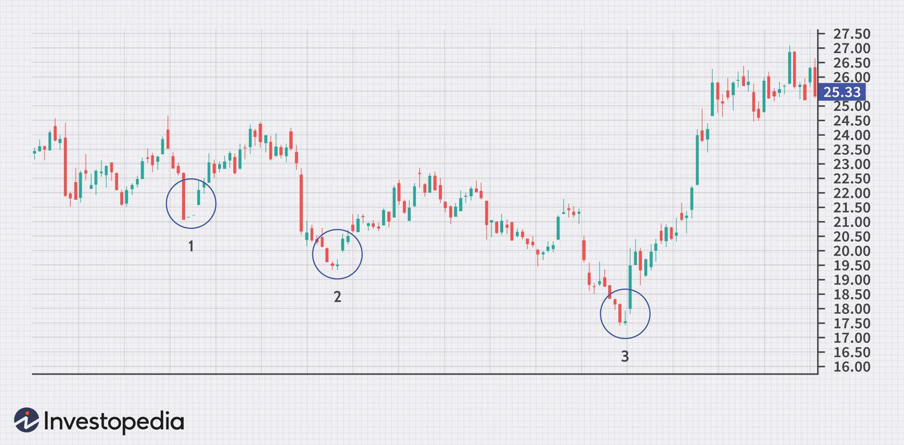

Candlestick patterns are crucial tools in technical analysis, offering traders visual insights into market sentiment by representing price movements over a specific period. These patterns derive their significance from their ability to provide potential predictions regarding the future direction of a market. Among these, the Bullish Abandoned Baby pattern stands out for its effectiveness in signaling a reversal of a downtrend into an uptrend. This pattern is distinguished by its structure, featuring a series of three candlesticks: a long bearish candle followed by a doji that gaps below the bearish candle, and finally, a bullish candle that gaps above the doji. This distinct formation is often interpreted as a sign of a potential shift in market sentiment from bearish to bullish, indicating that buyers might gain control.

Understanding the Bullish Abandoned Baby pattern provides traders with an edge, as it can help predict shifts in market momentum. In particular, traders can leverage this pattern to identify strategic entry and exit points in their trades, potentially leading to more optimized trading decisions. With the increasing prevalence of algorithmic trading, candlestick patterns like the Bullish Abandoned Baby are now analyzed through sophisticated algorithms that can efficiently scan multiple markets for these signals.



Algorithmic trading platforms can exploit such patterns to automate trading strategies, reducing human error and enhancing response times to market changes. As these algorithms can quickly identify and act upon the formation of a Bullish Abandoned Baby pattern, they offer opportunities for traders to capitalize on market shifts with precision. The exploration of the Bullish Abandoned Baby pattern and its application in algorithmic trading highlights its significance as both a traditional analytical tool and a modern algorithmic asset.

## Table of Contents

## What is a Bullish Abandoned Baby Candlestick Pattern?

A Bullish Abandoned Baby is a distinctive and rare three-candlestick pattern that functions as a reversal indicator in technical analysis, notably signaling the potential end of a downward price trend. Its formation begins with a bearish candle that signifies continued selling pressure in the market. This is immediately followed by a doji candle, characterized by a small real body and signifying indecision among traders. The doji appears with a gap down from the previous candle, indicating a potential exhaustion of the initial bearish momentum. Finally, a bullish candle emerges, gapping up from the doji, which represents renewed buying interest and the onset of an upward price movement.

The psychological undertones of this pattern suggest a transition in market sentiment. Initially, traders are largely bearish, leading to the formation of the downward gap and the doji, reflecting uncertainty. The subsequent bullish candle illustrates a decisive shift where buying pressure overwhelms selling forces, often resulting in a price increase.

This candlestick pattern's rarity enhances its significance as it provides a clearer indication of a potential shift from a bearish to a bullish trend. Its utility lies not only in identifying market reversals but also in potentially forecasting substantial gains, making it a valuable insight for traders looking to capitalize on changing market dynamics.

## Technical Analysis of Bullish Abandoned Baby

Technical analysts identify the Bullish Abandoned Baby as a key indicator for the end of a downtrend, often marked by three distinct candlesticks. The formation requires a precise sequence beginning with a significant bearish candle, followed by a doji with a gap down, and concluding with a bullish candle gapping up. This pattern signifies a potential transition from bearish to bullish sentiment in the market.

### Components of the Pattern

1. **Large Down Candle**: The initial candlestick in this formation is a strong bearish candle, indicating continued selling pressure. This sets the stage for the pattern by displaying clear negative sentiment.

2. **Gapped Doji**: The pivotal component of the pattern, the doji, which forms after a gap down, illustrates market indecision. Its gapped position disconnects it from the previous bearish sentiment, suggesting a halt in momentum.

3. **Bullish Recovery**: The final candlestick displays a gap up and is bullish in nature. This recovery candle signifies a shift in momentum as buyers take control, potentially marking the start of an upward trend.

### Correlation with Other Indicators

Technical analysts often corroborate the Bullish Abandoned Baby pattern with supplementary indicators such as the Relative Strength Index (RSI) and moving averages. 

- **RSI**: The RSI can signal whether an asset is oversold, supporting the potential for a bullish reversal when the Bullish Abandoned Baby pattern emerges.

- **Moving Averages**: A crossover or proximity to moving averages might provide additional confirmation of a trend reversal when observed alongside the Bullish Abandoned Baby pattern.

### Psychological Analysis

The psychology underlying the Bullish Abandoned Baby pattern reflects a cycle of indecision and subsequent bullish conviction. Initially, the strong bearish candle suggests overwhelming selling pressure. The doji introduces uncertainty, highlighting a balance between buying and selling forces. The final bullish candle confirms the buyers' dominance, potentially setting off a new bullish phase. Understanding these psychological elements can enhance a trader's ability to interpret market movements accurately.

Incorporating this pattern into trading strategies requires a keen eye for these specific candlestick formations and their accompanying technical indicators, thereby offering traders a means to anticipate market reversals reliably.

## Algo Trading With Bullish Abandoned Baby Patterns

Algorithmic traders utilize the Bullish Abandoned Baby pattern to identify strategic entry and [exit](/wiki/exit-strategy) points in financial markets. This rare three-candlestick formation can indicate a reversal from a downtrend to an uptrend, providing traders with potential opportunities to capitalize on price movements.

Trading algorithms are specifically designed to scan and detect such patterns across multiple markets efficiently. By leveraging computational power, these algorithms can process vast amounts of data and identify opportunities in real-time. The use of algorithms allows traders to execute trades based on the Bullish Abandoned Baby pattern swiftly, which can be pivotal in gaining an advantage in fast-moving markets.

Risk management is a crucial aspect of trading using the Bullish Abandoned Baby pattern. Implementing risk management parameters such as stop-losses and profit targets is essential to mitigate potential losses and secure gains. For example, a stop-loss order can be set just below the lowest point of the pattern to limit downside risk, while a profit target can be placed at a level where historical data or technical indicators suggest a likely reversal or consolidation point.

Backtesting strategies play a significant role in assessing the viability of trading this pattern. By analyzing historical data, traders can gauge the effectiveness of the Bullish Abandoned Baby pattern under different market conditions. Backtesting involves applying the trading strategy to past data to evaluate performance, variability, and potential profitability. Here is a simple example of a Python code snippet to backtest this pattern using historical price data:

```python
import pandas as pd

def identify_bullish_abandoned_baby(data):
    for i in range(2, len(data)-1):
        if (data['Close'][i-2] < data['Open'][i-2] and  # Bearish first candle
            data['Open'][i] == data['Close'][i] and  # Doji
            data['Open'][i] < data['Close'][i-1] and  # Gap down after first candle
            data['Open'][i+1] > data['Close'][i] and  # Gap up before third candle
            data['Close'][i+1] > data['Open'][i+1]):  # Bullish third candle
            print("Bullish Abandoned Baby pattern found on day:", i)

# Example usage
# Load your historical OHLC data into a DataFrame
data = pd.read_csv('historical_data.csv')
identify_bullish_abandoned_baby(data)
```

When employed effectively, [algorithmic trading](/wiki/algorithmic-trading) with the Bullish Abandoned Baby pattern can offer traders a method to harness these powerful market signals. However, as with any trading strategy, due diligence combined with rigorous testing and validation is essential to optimize performance and reduce risk exposure.

## Example Case Studies

Historical data provides valuable insights into the practical application of the Bullish Abandoned Baby pattern in stock market trading. For example, the stock of Macy's Inc. exhibited this pattern in February 2016, signaling a reversal of a prolonged downtrend. The occurrence was marked by a significant gap between a doji and the preceding bearish candle, followed by a bullish candle that closed above the midpoint of the first candle. This configuration indicated a potential shift in market sentiment from bearish to bullish. Subsequently, Macy's stock price saw an upward trajectory, reinforcing the pattern's effectiveness in identifying reversal opportunities.

Similarly, during March 2020, Adobe Inc. demonstrated a textbook example of a Bullish Abandoned Baby pattern amidst a volatile market environment caused by the initial impact of the COVID-19 pandemic. The sequence started with a long bearish candle, indicative of prevailing pessimism among traders. This was followed by a doji with a noticeable gap down, reflecting a phase of market indecision. The pattern was completed with a strong bullish candle that gapped up, confirming the emergence of buyer dominance. Accompanied by a notable increase in trading [volume](/wiki/volume-trading-strategy), this pattern served as a precursor to Adobe's subsequent recovery in stock price.

These case studies provide empirical validation for the Bullish Abandoned Baby pattern, showcasing its potential to serve as a reliable indicator for market reversals. By analyzing such occurrences in historical data, traders and algorithmic models can better discern the pattern's nuances, improving their ability to predict future price movements and refine their trading strategies accordingly.

## Advantages and Limitations

The Bullish Abandoned Baby candlestick pattern offers several advantages as a tool for traders seeking potential market reversals. Its reliability as a bullish reversal indicator is one of its major strengths. When identified accurately, this pattern suggests a high probability of trend reversal from bearish to bullish, providing traders with a strategic edge in timing their entry into the market. The pattern's rarity further enhances its value; it serves as a unique signal sought by traders who aim to capitalize on infrequent but high-probability opportunities.

However, the limitations of the Bullish Abandoned Baby pattern must also be considered. A primary limitation is the pattern's strict criteria, which necessitate precise conditions for its formation: a preceding downtrend, a doji with a gap down, and a bullish candle gapping up. These requirements can restrict the number of viable trading opportunities, as such conditions do not frequently occur together in the market.

Moreover, traders should exercise caution regarding false signals. The appearance of a similar candlestick formation does not always guarantee a genuine Bullish Abandoned Baby pattern. Misinterpretations can lead to suboptimal trading decisions. To mitigate such risks, it is recommended that traders complement the Bullish Abandoned Baby pattern with additional technical indicators, such as the Relative Strength Index (RSI) or moving averages. These indicators can provide a broader context of market conditions, enhancing the robustness of trading strategies that incorporate the pattern.

In summary, while the Bullish Abandoned Baby pattern presents significant advantages through its reliability and rarity, traders must remain vigilant of its strict formation criteria and the potential for false signals. Complementary technical analysis tools are essential to optimize decision-making and risk management when trading based on this pattern.

## Conclusion

The Bullish Abandoned Baby pattern is a valuable component within a trader's toolkit, particularly when integrated into algorithmic trading systems. This pattern's ability to signal potential reversals makes it a significant indicator for identifying market shifts, thereby presenting lucrative trading opportunities. Traders who master the recognition of this pattern can better anticipate transitions from bearish to bullish trends, enabling strategic entry points. However, successful implementation of this pattern necessitates meticulous analysis and stringent risk management. 

Traders should be cautious of employing the Bullish Abandoned Baby pattern without the support of other technical indicators and comprehensive market analysis. Incorporating elements such as moving averages or relative strength index (RSI) can enhance pattern reliability. Moreover, due to its rarity, traders should be vigilant against false positives, ensuring that all criteria for the pattern are strictly met before executing trades.

Continuous research and methodical [backtesting](/wiki/backtesting) are essential for traders aiming to utilize this pattern effectively. Algorithmic traders, in particular, can benefit from coding and testing their strategies using historical data to ascertain the pattern's effectiveness in varying market conditions. Through iterative refinement of these algorithms, traders can optimize their strategies, thus boosting their potential for trading success.

## References & Further Reading

[1]: Bulkowski, T. (2008). ["Encyclopedia of Candlestick Charts"](https://onlinelibrary.wiley.com/doi/book/10.1002/9781119202288). John Wiley & Sons.

[2]: Nison, S. (2001). ["Japanese Candlestick Charting Techniques: A Contemporary Guide to the Ancient Investment Techniques of the Far East"](https://archive.org/details/japanesecandlest0000niso). Prentice Hall Press.

[3]: Pring, M. J. (2002). ["Technical Analysis Explained: The Successful Investor's Guide to Spotting Investment Trends and Turning Points"](https://www.amazon.com/Technical-Analysis-Explained-Fifth-Successful/dp/0071825177). McGraw-Hill.

[4]: Murphy, J. J. (1999). ["Technical Analysis of the Financial Markets: A Comprehensive Guide to Trading Methods and Applications"](https://archive.org/details/technicalanalysi0000murp). New York Institute of Finance.

[5]: Chan, E. P. (2009). ["Quantitative Trading: How to Build Your Own Algorithmic Trading Business"](https://github.com/ftvision/quant_trading_echan_book). John Wiley & Sons.