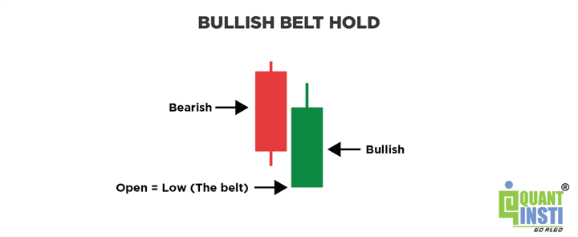

Understanding candlestick patterns is vital for traders aiming to make informed decisions. Among these patterns, the bullish belt hold serves as a significant indicator used to pinpoint potential upward trends in market prices. It is characterized by a single candlestick that opens at the low of the session and closes near its high, demonstrating strong buying pressure. This pattern often signals a possible reversal from a downtrend to an uptrend, making it a valuable tool for traders seeking to identify shifts in market sentiment.

With the advent of algorithmic trading, the application of candlestick patterns like the bullish belt hold has gained new dimensions. Algorithmic trading involves the use of computer programs to execute trades based on pre-established criteria, offering speed and precision beyond manual trading capabilities. Integrating the bullish belt hold pattern into such automated strategies allows traders to systematically capture market reversals and take advantage of bullish market trends.



This article will explore the characteristics and significance of the bullish belt hold pattern and its effective utilization in algorithmic trading. By the conclusion, readers will gain a comprehensive understanding of how to incorporate this pattern into their trading strategies, enhancing their ability to make timely and profitable trading decisions.

## Table of Contents

## Understanding the Bullish Belt Hold Candlestick Pattern

The bullish belt hold candlestick pattern is a key indicator in technical trading, known for its ability to signal potential reversals in a downtrend. This single candlestick pattern forms when a trading session opens at its lowest point and closes near the session's high, creating a candle with a long body and minimal upper wick. The absence of a significant lower wick further emphasizes strong buying pressure throughout the session.

This pattern is initiated by a bearish market environment where prices have been declining. At the open, selling pressure persists momentarily, establishing the low of the session. However, as the session progresses, buyer interest increases, driving prices higher and closing near the session's peak. This price movement exemplifies a potential shift from bearish to bullish market sentiment, often piquing traders' interest as a precursor to a market reversal.

Recognizing the bullish belt hold pattern involves more than simply observing the candlestick's shape. Traders must consider the broader market context, including preceding price trends and [volume](/wiki/volume-trading-strategy) indicators. High trading volume during the formation of the pattern can provide additional confirmation that the bullish reversal is sustainable. Moreover, analyzing the pattern's position within the overall price chart aids in assessing its reliability as a reversal signal.

Being adept at identifying this pattern is essential for traders seeking to capitalize on emerging bullish trends. By integrating the pattern into their trading analysis, traders gain insights into market dynamics and potential entry points, allowing for enhanced decision-making and strategic planning in volatile markets.

## Why the Bullish Belt Hold Pattern Matters in Trading

Successful trading relies on accurately predicting market movements, and the bullish belt hold pattern is an essential tool for this purpose. This candlestick pattern emerges during a market downtrend and serves as a potential indicator of a reversal. It is characterized by a single candle that opens at the session's low and closes near its high, often with little to no upper shadow, signifying that buyers have taken control and pushed prices higher throughout the trading period. By identifying such shifts in market sentiment, traders can anticipate subsequent upward movements.

The bullish belt hold pattern is valued for its ability to offer a straightforward signal of buyer dominance. When this pattern appears, it suggests that selling pressure is diminishing and buying interest is surging, marking a possible trend reversal. This insight gives traders an advantage by highlighting moments when the balance of power in the market is changing. 

Integrating the bullish belt hold pattern into one's trading strategy enhances the ability to capitalize on profitable opportunities. By recognizing the pattern early, traders can enter positions poised to benefit from ensuing bullish trends. Moreover, the pattern can be used in conjunction with other technical indicators or trading signals to confirm reversals, thereby improving the accuracy of trade execution and minimizing risks.

Incorporating the bullish belt hold pattern into a broader trading framework requires understanding its nuances and the context in which it appears. Recognizing these patterns amidst varying market conditions ensures traders adapt and refine their strategies accordingly. This approach enables traders to exploit market inefficiencies and potentially enhance their overall trading success, ensuring that they remain agile and responsive to market dynamics.

## Implementing the Bullish Belt Hold Pattern in Algo Trading

Algorithmic trading relies on software solutions to automate trading decisions and executions based on algorithmic rules. Integrating the bullish belt hold pattern into an algorithm demands precision in defining the conditions under which the pattern is identified. The bullish belt hold is characterized by a single candle that opens at its lowest point and closes near its high point within a trading session, typically signaling a reversal from a downtrend to an uptrend. 

To program an algorithm for this pattern, the trader must ensure that the software is capable of recognizing these specific conditions. This involves a set of logical rules and parameters such as:

- **Open Price Condition**: The candlestick must open at or near the lowest price of the trading session.
- **Close Price Condition**: The closing price should be significantly higher, near the high of the session, to confirm buying pressure.
- **Trading Volume**: High trading volume may also be considered an additional confirmation for the authenticity of the pattern.

A sample Python code snippet demonstrating these conditions using a hypothetical data array might look like this:

```python
def is_bullish_belt_hold(candle):
    open_price, close_price, low_price, high_price = candle['open'], candle['close'], candle['low'], candle['high']
    # Condition checks
    open_near_low = (open_price <= low_price * 1.01)  # Open is within 1% of the low
    close_near_high = (close_price >= high_price * 0.99)  # Close is within 1% of the high
    body_length = close_price - open_price

    # Determine the pattern
    return open_near_low and close_near_high and body_length > 0

# Sample candle data
candle = {'open': 100, 'close': 150, 'low': 99, 'high': 152}
print(is_bullish_belt_hold(candle))  # Outputs: True or False based on conditions
```

By automating these checks, traders can deploy algorithms that operate in real-time, capturing potential market reversals as they occur. Moreover, the automation facilitates swift execution, mitigating the delays inherent in manual trading. This efficiency allows traders to capitalize on bullish trends effectively.

Traders should also consider optimizing the algorithm by incorporating safety measures such as stop-loss and take-profit levels to manage risk effectively. It is integral to continually refine these parameters, adjusting them based on historical [backtesting](/wiki/backtesting) data to ensure optimal performance under various market conditions. 

Adapting the algorithm to recognize such trading patterns not only renders the trading process more efficient but also increases the trader’s ability to exploit favorable market conditions with minimal human intervention.

## Developing an Algorithmic Strategy Using the Bullish Belt Hold

A successful algorithmic strategy leveraging the bullish belt hold pattern requires constructing a framework of precise rules that facilitate the effective timing and execution of trades. The initial step involves rigorous backtesting, which assesses the pattern's performance across diverse market conditions to validate its reliability. This process not only provides historical insights but also helps in understanding how the pattern may react under varying market dynamics.

In building this strategy, establishing specific parameters for stop-loss placements, profit targets, and overall risk management is crucial. Stop-loss orders should ideally be placed at a level that minimizes potential losses while allowing for normal market fluctuations. For instance, a stop-loss could be set just below the low of the bullish belt hold candlestick, providing a safety net without stifling potential gains. Conversely, profit targets should be aligned with expected market movements, possibly using historical price changes post-pattern formation as a guide.

To further strengthen the strategy, it is advantageous to combine the bullish belt hold with other technical indicators. Indicators such as the Relative Strength Index (RSI) or Moving Averages can offer additional confirmation signals. For example, implementing a rule that executes a buy only if the bullish belt hold occurs alongside an RSI reading above 30 can help filter out potential false signals in oversold conditions.

Here's a basic Python implementation that outlines how one might begin programming an algorithm to identify and act on the bullish belt hold pattern, incorporating these elements:

```python
import pandas as pd

def is_bullish_belt_hold(row):
    return row['open'] == row['low'] and (row['close'] - row['open']) / row['open'] > 0.01

def signal_generation(data):
    signals = []
    for i in range(1, len(data)):
        if is_bullish_belt_hold(data.iloc[i]):
            if data.iloc[i-1]['rsi'] < 30:  # Example condition with RSI
                signals.append((i, 'buy'))
    return signals

def execute_strategy(data):
    data['rsi'] = compute_rsi(data['close'])  # Replace with actual RSI calculation
    signals = signal_generation(data)
    # Implement stop-loss and take-profit logic
    return signals

# Sample usage with historical data
historical_data = pd.DataFrame({
    'open': [...],
    'close': [...],
    'low': [...],
    'high': [...],
    # Add other necessary columns like 'rsi'
})

signals = execute_strategy(historical_data)
```

This example demonstrates how to define a simple strategy that identifies bullish belt holds while considering RSI values. Traders can expand on this foundation by integrating more sophisticated risk management techniques and leveraging additional indicators to further validate potential entry points. Comprehensive backtesting and continuous optimization will ensure the strategy adapts to evolving market conditions, thereby enhancing its effectiveness.

## Challenges and Considerations in Algo Trading with Bullish Belt Hold

Algorithmic trading brings significant advantages, such as executing trades with speed and precision, but it also presents challenges that must be managed effectively. When using the bullish belt hold pattern, traders should be particularly aware of the following considerations:

1. **Market Volatility and Sentiment Shifts**: The reliability of the bullish belt hold pattern can be compromised during periods of high market volatility or rapid sentiment changes. This pattern, which indicates a potential reversal from bearish to bullish trends, can become less predictive if market conditions shift unpredictably. Sudden news events or economic reports can lead to quick sentiment changes, causing the pattern to provide false signals.

2. **Continuous Monitoring and Strategy Adjustment**: An essential component of success in algorithmic trading is the ability to monitor algorithm performance and adjust strategies as needed. This involves real-time tracking of trades and market conditions to ensure the algorithm adapts to any significant changes. A strategic approach is necessary to recalibrate the algorithm’s parameters based on ongoing performance data and external market influences.

3. **Avoiding Over-Optimization**: Over-optimization occurs when an algorithm is excessively tailored to perform well under historical data conditions, potentially leading to poor performance in live markets. Traders should strive for a balance between optimization and robustness, ensuring that their algorithms retain the ability to function under diverse market conditions without being overly reliant on past data patterns.

4. **Regulatory Compliance**: Operating within the regulatory framework is crucial to avoid legal and financial risks associated with algorithmic trading. Traders need to stay informed about regulations impacting algorithmic strategies, such as those imposed by financial authorities like the Securities and Exchange Commission (SEC) or the European Securities and Markets Authority (ESMA), especially as they relate to automated decision-making and market manipulations.

In conclusion, while [algorithmic trading](/wiki/algorithmic-trading) with the bullish belt hold pattern offers substantial potential benefits, addressing these challenges through diligent monitoring, taking a measured approach to optimization, and ensuring regulatory compliance will enhance the strategy's effectiveness and sustainability.

## Conclusion

The bullish belt hold candlestick pattern serves as a vital instrument for traders, offering insights into potential market reversals. When seamlessly integrated into algorithmic trading systems, this pattern can significantly streamline the process, leading to more informed and efficient decision-making. This integration facilitates the automated identification of market opportunities, allowing traders to act swiftly on bullish movements.

To harness the full potential of the bullish belt hold pattern, traders must have a deep understanding of its characteristics and behaviors. This understanding is pivotal in creating a robust trading strategy. The nuances of the pattern, such as its occurrence during downtrends and its indication of buying pressure, must be meticulously analyzed and incorporated into the trading algorithm. By establishing criteria for pattern recognition, traders can set precise entry and [exit](/wiki/exit-strategy) points that maximize profit while managing risks effectively.

As trading environments are dynamic and continuously evolving, staying informed and adaptable is crucial. Continuous learning about market trends and advances in trading technology is essential for maintaining a competitive edge. Traders should routinely evaluate and adjust their strategies to account for changes in market [volatility](/wiki/volatility-trading-strategies), sentiment shifts, and other external factors that might affect the reliability of candlestick patterns.

Ultimately, traders who adeptly apply the bullish belt hold pattern within their algorithmic trading framework can improve their overall performance. By leveraging this pattern, coupled with a thorough understanding of market conditions and strategic planning, traders are better positioned to achieve consistent success in their trading endeavors.

## References & Further Reading

[1]: ["Japanese Candlestick Charting Techniques"](https://drive.google.com/file/d/0B_CADMk621uLNDEyZTEzZjYtMmZjOS00ZmUyLTlhYmYtN2E1YTViOWRiOTdi/view) by Steve Nison

[2]: Bergstra, J., Bardenet, R., Bengio, Y., & Kégl, B. (2011). ["Algorithms for Hyper-Parameter Optimization."](https://dl.acm.org/doi/10.5555/2986459.2986743) Advances in Neural Information Processing Systems 24.

[3]: ["Advances in Financial Machine Learning"](https://www.amazon.com/Advances-Financial-Machine-Learning-Marcos/dp/1119482089) by Marcos Lopez de Prado

[4]: ["Evidence-Based Technical Analysis: Applying the Scientific Method and Statistical Inference to Trading Signals"](https://www.amazon.com/Evidence-Based-Technical-Analysis-Scientific-Statistical/dp/0470008741) by David Aronson

[5]: ["Quantitative Trading: How to Build Your Own Algorithmic Trading Business"](https://www.amazon.com/Quantitative-Trading-Build-Algorithmic-Business/dp/1119800064) by Ernest P. Chan

[6]: ["Machine Learning for Algorithmic Trading"](https://github.com/stefan-jansen/machine-learning-for-trading) by Stefan Jansen

[7]: Murphy, J.J. (1999). ["Technical Analysis of the Financial Markets: A Comprehensive Guide to Trading Methods and Applications"](https://archive.org/details/technicalanalysi0000murp)