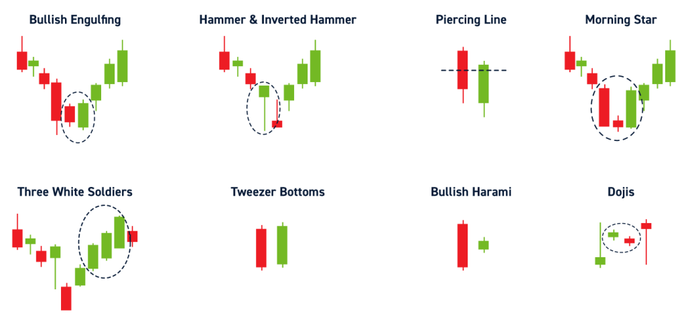

## Table of Contents

## What is a candlestick pattern in stock trading?

A candlestick pattern is a way to show how a stock's price moves in a day on a chart. It looks like a candle with a wide part and lines sticking out from the top and bottom. The wide part is called the body, and it shows the opening and closing prices of the stock. If the body is filled or dark, it means the stock closed lower than it opened. If the body is empty or light, it means the stock closed higher than it opened. The lines sticking out are called wicks or shadows, and they show the highest and lowest prices the stock reached during the day.

Candlestick patterns can help traders guess what might happen next with the stock's price. For example, a pattern called "doji" happens when the opening and closing prices are very close, making the body very small. This can mean that buyers and sellers are not sure what to do next, and the stock's price might change direction soon. Another pattern, called "hammer," looks like a hammer and can mean that the stock's price might start going up after being down for a while. By looking at these patterns, traders can make better decisions about when to buy or sell a stock.

## What does 'bullish' mean in the context of stock trading?

In stock trading, 'bullish' means that people think the price of a stock or the whole market will go up. When someone is bullish, they believe it's a good time to buy stocks because they expect to make money as the prices rise. This feeling can come from good news about a company, like strong earnings, or from positive things happening in the economy, like lower unemployment.

Bullish traders often look for signs that tell them it's a good time to buy. They might see patterns on stock charts, like certain candlestick patterns, that suggest prices will go up soon. When a lot of people feel bullish, it can lead to more buying, which pushes the prices even higher. This is why being bullish is important in understanding what might happen next in the stock market.

## Can you explain the basic structure of a candlestick?

A candlestick shows how a stock's price moved in a day on a chart. It looks like a candle with a wide part called the body and lines sticking out from the top and bottom called wicks or shadows. The body of the candlestick shows the opening and closing prices of the stock. If the body is filled or dark, it means the stock closed lower than it opened. If the body is empty or light, it means the stock closed higher than it opened.

The wicks or shadows of the candlestick show the highest and lowest prices the stock reached during the day. The top of the upper wick shows the highest price, and the bottom of the lower wick shows the lowest price. By looking at the body and the wicks, you can see how the stock's price changed throughout the day. This helps traders understand what happened and guess what might happen next with the stock's price.

## What are some common bullish candlestick patterns beginners should know?

A common bullish candlestick pattern that beginners should know is the Hammer. It looks like a hammer and happens when a stock's price goes down a lot during the day but then goes back up near the opening price by the end of the day. The body of the Hammer is small and at the top, and there's a long lower wick. This pattern can mean that the stock's price might start going up after being down for a while. It's like the stock is trying to "hammer" out a bottom and get ready to rise.

Another simple bullish pattern is the Bullish Engulfing. This happens when you see two candlesticks next to each other. The first one is a small bearish candlestick (where the stock closed lower than it opened), and the second one is a bigger bullish candlestick (where the stock closed higher than it opened). The body of the second candlestick completely covers or "engulfs" the body of the first one. This pattern can mean that buyers are taking over from sellers, and the stock's price might start going up soon.

## How does the Hammer pattern indicate a bullish trend?

The Hammer pattern shows up on a chart when a stock's price drops a lot during the day but then goes back up near where it started by the end of the day. It looks like a hammer because it has a small body at the top and a long lower wick. The small body means the opening and closing prices were close together, and the long lower wick shows that the stock reached a much lower price during the day but then bounced back up.

This pattern can mean that the stock's price might start going up after being down for a while. When you see a Hammer, it's like the stock is trying to find its bottom and get ready to rise. Traders see this as a sign that buyers are stepping in after a big drop, which could lead to a bullish trend where the stock's price goes up.

## What is the significance of the Bullish Engulfing pattern?

The Bullish Engulfing pattern is a sign that a stock's price might start going up. It happens when you see two candlesticks next to each other. The first one is a small bearish candlestick, which means the stock closed lower than it opened. The second one is a bigger bullish candlestick, where the stock closed higher than it opened. The body of the second candlestick completely covers or "engulfs" the body of the first one. This pattern shows that buyers are taking over from sellers, which could mean the stock's price is about to rise.

When traders see a Bullish Engulfing pattern, they think it's a good time to buy the stock. This is because the pattern suggests that the selling pressure is weakening and buying pressure is getting stronger. It's like the buyers are stepping in with more force, which can lead to a bullish trend where the stock's price goes up. So, this pattern is important because it can help traders guess what might happen next with the stock's price.

## How can the Morning Star pattern be used to predict a bullish reversal?

The Morning Star pattern is a sign that a stock's price might start going up after being down for a while. It's made of three candlesticks. The first one is a long bearish candlestick, which means the stock closed much lower than it opened. The second one is a small candlestick that can be either bullish or bearish, and it shows that the stock's price didn't change much from the opening to the closing. The third one is a long bullish candlestick, meaning the stock closed much higher than it opened. This pattern looks like a star in the morning sky, which is why it's called the Morning Star.

When you see the Morning Star pattern, it means that the sellers were in control at first, but then they started to lose power. The small middle candlestick shows that the stock's price wasn't moving much, which can mean that buyers and sellers are not sure what to do next. Then, the long bullish candlestick shows that buyers are taking over and pushing the price up. Traders see this as a sign that the stock's price might keep going up, so it's a good time to buy. This pattern helps traders guess when a stock's price might change direction from going down to going up.

## What are the key differences between the Piercing Line and the Bullish Engulfing patterns?

The Piercing Line and the Bullish Engulfing patterns both show that a stock's price might start going up. They both happen after the stock's price has been going down. The main difference is how the second candlestick looks compared to the first one. In the Piercing Line pattern, the first candlestick is a long bearish one, meaning the stock closed much lower than it opened. The second candlestick is a bullish one, where the stock closes higher than it opened, and its body goes up into the body of the first candlestick but doesn't cover it completely. It goes at least halfway up the first candlestick's body.

In the Bullish Engulfing pattern, the first candlestick is also a bearish one, but the second candlestick is a bullish one that is bigger. The body of the second candlestick completely covers or "engulfs" the body of the first candlestick. This means the second candlestick's opening price is lower than the first candlestick's closing price, and its closing price is higher than the first candlestick's opening price. Both patterns suggest that buyers are starting to take over from sellers, but the Bullish Engulfing pattern shows a stronger shift because the second candlestick is bigger and completely covers the first one.

## How do traders use the Three White Soldiers pattern to confirm a bullish trend?

The Three White Soldiers pattern is a sign that a stock's price might keep going up. It's made of three long bullish candlesticks that show up one after the other. Each candlestick opens within the body of the one before it and closes higher than the one before it. This pattern happens after the stock's price has been going down, so it's like the stock is marching up with three soldiers.

Traders use the Three White Soldiers pattern to feel more sure that the stock's price will keep going up. When they see these three strong bullish candlesticks, it tells them that buyers are in control and the stock's price is likely to keep rising. This pattern is a strong sign of a bullish trend because it shows a steady and strong move up in the stock's price.

## What advanced techniques can be used to increase the reliability of bullish candlestick patterns?

To make bullish candlestick patterns more reliable, traders often use other tools and methods to check if the pattern is a good sign. One way is to look at other technical indicators, like the Relative Strength Index (RSI) or the Moving Average Convergence Divergence (MACD). If these indicators also show that the stock's price might go up, it makes the candlestick pattern more trustworthy. Another way is to look at the volume of the stock being traded. If the volume goes up when the bullish pattern happens, it means more people are buying the stock, which can make the pattern more reliable.

Traders also look at the bigger picture by using different time frames. For example, if a bullish pattern shows up on a daily chart and also on a weekly chart, it's a stronger sign that the stock's price might go up. Another technique is to wait for a confirmation after seeing the pattern. This means waiting for the next candlestick to also be bullish before making a decision. By using these extra checks, traders can feel more sure that the bullish candlestick pattern is a good sign to buy the stock.

## How do volume and other technical indicators enhance the analysis of bullish candlestick patterns?

Volume and other technical indicators can make bullish candlestick patterns more trustworthy. When a bullish pattern shows up on a chart, traders look at the volume to see if more people are buying the stock. If the volume is high when the bullish pattern happens, it means there's a lot of interest in the stock, which makes the pattern a stronger sign that the price might go up. For example, if you see a Bullish Engulfing pattern with high volume, it's more likely that the stock's price will keep rising because many people are buying.

Other technical indicators like the Relative Strength Index (RSI) or the Moving Average Convergence Divergence (MACD) also help confirm bullish candlestick patterns. These indicators show if the stock is overbought or oversold and can signal if a price change is likely. If the RSI is moving up from a low level when you see a bullish pattern, it adds to the belief that the stock's price will go up. By using volume and other indicators together with candlestick patterns, traders can make better guesses about what the stock's price might do next.

## What are some limitations and potential pitfalls of relying solely on bullish candlestick patterns for trading decisions?

Relying only on bullish candlestick patterns for trading decisions can be risky because these patterns don't always work. Sometimes, a pattern might look like a good sign, but the stock's price doesn't go up like you expect. This can happen because many things can affect a stock's price, like news about the company or what's happening in the whole economy. If you only look at candlestick patterns, you might miss these other important things.

Another problem is that candlestick patterns can be tricky to spot correctly. Different traders might see the same chart and see different patterns, which can lead to different decisions about buying or selling. Also, if too many traders see the same pattern and decide to buy at the same time, it can push the price up too fast, but then it might fall back down quickly. This is called a "false signal," and it can make you lose money if you're not careful. So, it's a good idea to use other tools and information along with candlestick patterns to make better trading choices.

## How can one balance risk and reward?

Balancing risk and reward is a fundamental aspect of investment strategies, vital for optimizing returns while minimizing potential losses. Investment strategies inherently involve exposure to risk, but through careful management, the expected reward can be maximized. 

**Risk Management Tools:** One of the primary tools used in managing risk is the stop-loss order. A stop-loss order is an automatic order placed with a broker to buy or sell a stock once it reaches a certain price level. This mechanism serves to limit an investor's loss on a position in a security, offering protection in highly volatile markets. By executing trades at predetermined price levels, stop-loss orders prevent substantial losses by automatically closing out positions that move against the investor, thereby securing a portion of the investment capital.

**Diversification:** Diversifying investments across various asset classes, sectors, and industries is another effective method of mitigating risk. The principle of diversification is based on the idea that a varied portfolio is less susceptible to the adverse effects of a single underperforming investment. By spreading investments, the negative performance of one asset can be counterbalanced by the positive performance of another. This strategy can be mathematically modeled using the concept of portfolio variance, which is calculated as:

$$
\sigma^2_p = \sum_{i=1}^{n} w_i^2 \sigma_i^2 + \sum_{i=1}^{n}\sum_{j=i+1}^{n} 2w_iw_j \sigma_i \sigma_j \rho_{ij}
$$

Where $\sigma^2_p$ is the portfolio variance, $w_i$ and $w_j$ are the weights of the individual assets in the portfolio, $\sigma_i$ and $\sigma_j$ are their standard deviations, and $\rho_{ij}$ is the correlation between the assets. A lower correlation among diversified assets leads to reduced portfolio risk.

**Historical Performance Evaluation:** Analyzing historical performance data is crucial for refining risk management strategies. By reviewing past market data, investors can identify successful strategies and avoid those that have historically led to losses. This evaluation involves assessing key metrics such as return on investment (ROI), volatility, and drawdowns to uncover patterns that can inform future decision-making.

**Continuous Learning:** The dynamic nature of the stock market necessitates continuous learning and adaptation. Investors should regularly update their knowledge base and strategies to accommodate new market conditions and emerging trends. This proactive approach can lead to more informed decision-making and improved risk-reward outcomes.

Balancing risk and reward effectively requires a combination of strategic planning and practical tools. By employing stop-loss orders, diversifying investments, evaluating past performance, and maintaining an adaptive mindset, investors can enhance their strategies towards achieving consistent success in stock trading.

## References & Further Reading

[1]: Bergstra, J., Bardenet, R., Bengio, Y., & Kégl, B. (2011). ["Algorithms for Hyper-Parameter Optimization."](https://papers.nips.cc/paper/4443-algorithms-for-hyper-parameter-optimization) Advances in Neural Information Processing Systems 24.

[2]: ["Advances in Financial Machine Learning"](https://www.amazon.com/Advances-Financial-Machine-Learning-Marcos/dp/1119482089) by Marcos Lopez de Prado

[3]: ["Evidence-Based Technical Analysis: Applying the Scientific Method and Statistical Inference to Trading Signals"](https://www.amazon.com/Evidence-Based-Technical-Analysis-Scientific-Statistical/dp/0470008741) by David Aronson

[4]: ["Machine Learning for Algorithmic Trading"](https://github.com/PacktPublishing/Machine-Learning-for-Algorithmic-Trading-Second-Edition) by Stefan Jansen

[5]: ["Quantitative Trading: How to Build Your Own Algorithmic Trading Business"](https://books.google.com/books/about/Quantitative_Trading.html?id=j70yEAAAQBAJ) by Ernest P. Chan