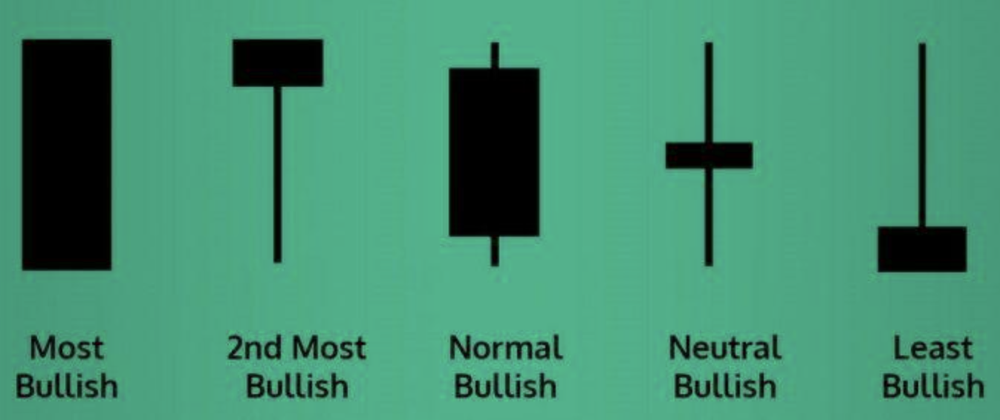

## Table of Contents

## What is a bullish candlestick pattern?

A bullish candlestick pattern is a type of chart pattern used in stock market analysis that suggests a potential rise in the price of a stock or other financial asset. It usually shows that buyers are gaining control over the market, which could lead to an increase in the asset's price. Traders and investors look for these patterns to make decisions about when to buy stocks, hoping to profit from the expected price increase.

These patterns can appear in different forms, but they all share the common feature of indicating a shift towards a more positive market sentiment. Some common bullish patterns include the "hammer," which has a small body and a long lower wick, showing that the price dropped but then recovered strongly, and the "bullish engulfing," where a small bearish candle is followed by a larger bullish candle that completely covers it, suggesting a strong reversal from a downward trend to an upward one. Recognizing these patterns can help traders make more informed decisions.

## How can beginners identify a bullish candlestick pattern on a chart?

Beginners can start identifying bullish candlestick patterns by looking at the shapes of the candles on a price chart. Each candle represents price movement over a specific time period, like a day or an hour. A bullish pattern often shows up when the candle's body, which is the wide part, is filled with a lighter color, usually green or white, indicating that the closing price was higher than the opening price. The length of the body and the presence of wicks, or shadows, at the top and bottom of the candle can also give clues. For example, a "hammer" pattern has a small body at the top and a long lower wick, showing that the price went down a lot but then bounced back up.

Another common pattern to watch for is the "bullish engulfing" pattern. This happens when you see two candles next to each other. The first one is a smaller, bearish candle (usually red or black) where the closing price is lower than the opening price. The second candle is a larger, bullish one that completely covers the first candle's body. This suggests that after a period of falling prices, buyers have stepped in strongly, pushing the price up and possibly starting a new upward trend. By keeping an eye out for these simple patterns, beginners can start to understand where the market might be heading.

## What are the most common types of bullish candlestick patterns?

The most common types of bullish candlestick patterns are the hammer, the bullish engulfing pattern, and the morning star. The hammer is easy to spot because it looks like a hammer with a small body at the top and a long lower wick. This pattern shows that even though the price dropped a lot during the day, it came back up near the opening price by the end. It's a sign that buyers are starting to take control after a period of falling prices. The bullish engulfing pattern is another common one. It happens when you see a small bearish candle followed by a larger bullish candle that completely covers the first candle's body. This suggests a strong shift from sellers to buyers, which can signal the start of an upward trend.

The morning star pattern is a bit more complex but still important. It consists of three candles. The first is a long bearish candle, showing that sellers were in control. The second candle is small and can be either bullish or bearish, showing uncertainty in the market. The third candle is a long bullish one, indicating that buyers have taken over, pushing the price up significantly. This pattern often appears at the end of a downtrend and can signal a reversal to an uptrend. By learning to recognize these patterns, beginners can better understand when the market might be turning bullish.

## Can you explain the significance of a Hammer pattern in bullish trends?

A Hammer pattern is important in bullish trends because it shows that the price of a stock or asset went down a lot during the day but then bounced back up near the opening price by the end. This looks like a hammer on the chart, with a small body at the top and a long lower wick. When you see this pattern after prices have been falling, it suggests that the sellers were pushing the price down, but the buyers stepped in strongly at the end of the day, pushing the price back up. This can be a sign that the downward trend might be ending and that buyers are starting to take control.

The Hammer pattern is especially useful for traders because it can signal a potential reversal in the market. If you spot a Hammer after a series of falling prices, it might be a good time to think about buying the stock or asset, hoping that the price will start to go up. But, it's important to wait for confirmation from the next candle or other signs in the market before making a decision. Not every Hammer pattern leads to a bullish trend, but it's a good clue to watch out for if you're looking for signs that the market might be turning around.

## How does a Bullish Engulfing pattern indicate a potential reversal?

A Bullish Engulfing pattern can tell you that the market might start going up soon. It happens when you see two candles next to each other. The first one is a small, bearish candle where the closing price is lower than the opening price. This shows that sellers were in charge that day. But then, the next candle is bigger and bullish, with the closing price higher than the opening price. This bigger candle completely covers the first candle's body, which means buyers took over strongly and pushed the price up a lot. This change from a small bearish candle to a big bullish one suggests that the downward trend might be ending and an upward trend might be starting.

Seeing a Bullish Engulfing pattern is like getting a hint that the market mood is changing. It shows that after a period of falling prices, buyers are stepping in with more power than the sellers. This can be a good sign for traders to think about buying the stock or asset, hoping that the price will keep going up. But, it's smart to wait for more signs or another candle to confirm that the trend is really turning around before making a decision. Not every Bullish Engulfing pattern leads to a big price increase, but it's a useful pattern to watch for if you're looking for signs of a potential reversal.

## What role does the Morning Star pattern play in predicting bullish movements?

The Morning Star pattern is a sign that the price of a stock or asset might start going up soon. It's made up of three candles. The first candle is long and red, showing that the price went down a lot that day. The second candle is small and can be either red or green, which means the market was unsure and the price didn't move much. The third candle is long and green, showing that the price went up a lot. When you see this pattern after prices have been falling, it's like a signal that the sellers are losing power and the buyers are starting to take over. This can mean that the downward trend is ending and an upward trend might begin.

Seeing a Morning Star pattern can help traders decide when to buy a stock or asset. If you spot this pattern after a period of falling prices, it might be a good time to think about buying, hoping that the price will start to go up. But, it's important to wait for more signs or another candle to confirm that the trend is really changing before making a decision. Not every Morning Star pattern leads to a big price increase, but it's a useful pattern to watch for if you're looking for signs that the market might be turning around.

## How can the Three White Soldiers pattern confirm a bullish trend?

The Three White Soldiers pattern is a strong sign that the price of a stock or asset is going to keep going up. It's made up of three long green candles in a row. Each candle opens within the body of the previous candle and closes higher than the last one. This pattern shows that buyers are in control and pushing the price up more and more each day. When you see this after prices have been going down or staying the same, it's a good hint that the market is turning bullish and the upward trend is getting stronger.

Seeing the Three White Soldiers pattern can help traders feel more sure about buying a stock or asset. If you spot this pattern after a time when prices were falling or not moving much, it might be a good time to buy, hoping that the price will keep going up. But, it's smart to wait for more signs or another candle to make sure the trend is really changing before you decide. Not every Three White Soldiers pattern leads to a big price increase, but it's a useful pattern to watch for if you're looking for signs that the market is getting more bullish.

## What are the key differences between a Piercing Line and a Bullish Engulfing pattern?

A Piercing Line and a Bullish Engulfing pattern both show that the market might start going up soon, but they look a bit different. A Piercing Line happens when you see two candles next to each other. The first one is a long red candle, showing that the price went down a lot that day. The second candle is green and opens lower than the first candle's close but closes above the middle of the first candle's body. This means buyers came in strong at the end of the second day, pushing the price up a lot but not all the way past the first day's opening price.

On the other hand, a Bullish Engulfing pattern also has two candles, but the second candle completely covers the first one's body. The first candle is a small red one, showing that the price went down a little. The second candle is a big green one that opens below the first candle's close and closes above the first candle's open. This shows that buyers took over very strongly on the second day, pushing the price up past the first day's opening price. So, the main difference is that the Bullish Engulfing pattern shows a stronger reversal because the second candle completely covers the first one, while the Piercing Line shows a strong but not as complete reversal.

## How do volume and other indicators enhance the reliability of bullish candlestick patterns?

Volume and other indicators can make bullish candlestick patterns more reliable. When you see a bullish pattern like a Hammer or a Bullish Engulfing, it's good to check the [volume](/wiki/volume-trading-strategy). If the volume is high on the day the bullish pattern happens, it means more people are buying, which makes the pattern stronger. High volume shows that the buyers are really in control and the upward move is more likely to keep going. Also, if other indicators like the Relative Strength Index (RSI) or Moving Averages are showing bullish signs at the same time, it adds more confidence that the price will go up.

For example, if the RSI is moving up from being oversold and the price breaks above a key Moving Average at the same time you see a bullish candlestick pattern, it's a strong sign that the market might be turning bullish. These extra signs help confirm what the candlestick pattern is telling you. So, by looking at volume and other indicators together with candlestick patterns, you can make better guesses about whether the price will really go up.

## Can you discuss the psychological factors behind the formation of bullish candlestick patterns?

Bullish candlestick patterns show what people are thinking and feeling about a stock or asset. When you see these patterns, it means that buyers are starting to feel more hopeful and confident. For example, when a Hammer pattern appears after prices have been going down, it shows that even though the price dropped a lot during the day, buyers stepped in at the end and pushed it back up. This tells us that the buyers are getting stronger and might take over soon. The same goes for a Bullish Engulfing pattern, where a small bearish candle is followed by a big bullish one. This shows that after a day of selling, buyers came back with a lot more energy, which can make other people feel more positive about the stock.

These patterns also show a change in how people feel about the market. When a Morning Star pattern shows up, it's like a signal that the sellers are losing power and the buyers are taking over. The first long red candle shows that sellers were in control, but the small second candle and the long green third candle show that buyers are starting to feel more confident and are pushing the price up. This shift in feelings can make more people want to buy, which helps start a new upward trend. So, by watching these patterns, you can see how people's feelings about the market are changing, which helps predict where prices might go next.

## What advanced strategies can traders use to capitalize on bullish candlestick patterns?

Traders can use advanced strategies to make the most out of bullish candlestick patterns. One way is to combine these patterns with other technical indicators like the Moving Average Convergence Divergence (MACD) or the Relative Strength Index (RSI). If a bullish pattern like a Hammer or Bullish Engulfing appears at the same time as the MACD line crosses above its signal line or the RSI moves up from being oversold, it's a strong sign that the price might go up. Traders can then use this information to decide when to buy. They might also set stop-loss orders just below the pattern's low to limit their risk if the price doesn't go up as expected.

Another strategy is to use multiple timeframes to confirm the bullish pattern. For example, if a Bullish Engulfing pattern shows up on a daily chart, traders can look at a shorter timeframe like an hourly chart to see if smaller patterns or trends are also pointing up. This can give them more confidence that the price will keep going up. Traders might also look at the volume during the pattern's formation. If the volume is high when the bullish pattern happens, it means more people are buying, which makes the pattern more reliable. By combining these strategies, traders can make better decisions and increase their chances of making a profit from bullish candlestick patterns.

## How do market conditions and asset types affect the effectiveness of bullish candlestick patterns?

Market conditions and the type of asset you're looking at can change how well bullish candlestick patterns work. In a strong bull market, where prices are going up a lot, these patterns can be very helpful. They can show you when the price might keep going up. But in a bear market, where prices are falling, these patterns might not be as good at predicting a big price increase. The overall mood of the market can make bullish patterns more or less reliable. Also, if there's a lot of news or big events happening, the patterns might not work as well because the market can react in unexpected ways.

The type of asset also matters. Bullish patterns might work well for stocks, but they can be less reliable for other things like commodities or [forex](/wiki/forex-system). Stocks can have clearer trends because they're influenced by company news and earnings. But commodities and forex can be more affected by things like weather, politics, or global economic changes, which can make their price movements harder to predict with just candlestick patterns. So, it's important to think about the market conditions and the type of asset when you're using these patterns to make trading decisions.

## References & Further Reading

[1]: Bergstra, J., Bardenet, R., Bengio, Y., & Kégl, B. (2011). ["Algorithms for Hyper-Parameter Optimization."](https://papers.nips.cc/paper/4443-algorithms-for-hyper-parameter-optimization) Advances in Neural Information Processing Systems 24.

[2]: ["Advances in Financial Machine Learning"](https://www.amazon.com/Advances-Financial-Machine-Learning-Marcos/dp/1119482089) by Marcos Lopez de Prado

[3]: ["Evidence-Based Technical Analysis: Applying the Scientific Method and Statistical Inference to Trading Signals"](https://www.amazon.com/Evidence-Based-Technical-Analysis-Scientific-Statistical/dp/0470008741) by David Aronson

[4]: ["Machine Learning for Algorithmic Trading"](https://github.com/stefan-jansen/machine-learning-for-trading) by Stefan Jansen

[5]: ["Quantitative Trading: How to Build Your Own Algorithmic Trading Business"](https://books.google.com/books/about/Quantitative_Trading.html?id=j70yEAAAQBAJ) by Ernest P. Chan