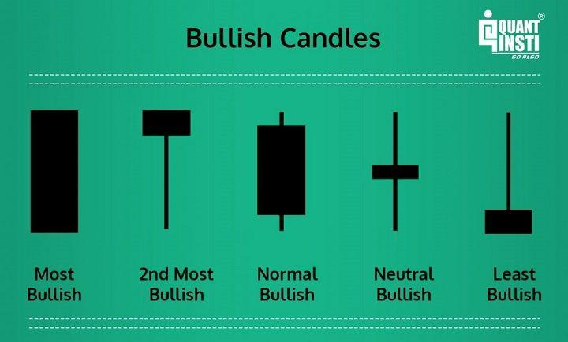

Algorithmic trading, commonly known as algo trading, is a method of executing orders utilizing automated pre-programmed trading instructions. These instructions account for variables such as time, price, and volume, and rely heavily on identifying patterns to make informed decisions. Among various patterns, bullish patterns are of particular significance as they indicate potential upward movements in asset prices. Recognizing and understanding these patterns can provide traders with a strategic advantage, optimizing their trading strategies to capture the maximum potential returns, especially in volatile market conditions.

Bullish patterns, when effectively incorporated into trading algorithms, can enhance decision-making processes by offering systematic approaches that reduce reliance on emotional judgments. These patterns form the backbone of many trading strategies, as they signal possible increases in asset values, thus presenting opportunities for profitable trades. With the rapid advancement in data analytics and computational power, traders can analyze vast amounts of historical data to identify these patterns, backtest their strategies, and improve the precision of their trading algorithms.



This article explores various bullish patterns that are frequently used in algorithmic trading and highlights their importance in refining trading strategies. By understanding how these patterns function, traders can improve the timing of their entry and exit points in the market, thereby increasing the likelihood of achieving favorable outcomes. Moreover, the article emphasizes the significance of validifying these patterns using additional technical indicators and implementing robust risk management practices to mitigate potential losses. As algorithmic trading continues to evolve, staying well-versed with emerging patterns and their applications remains critical for traders seeking to maintain a competitive edge.

## Table of Contents

## Understanding Bullish Patterns

Bullish patterns, fundamental components in technical analysis, serve as vital indicators for predicting potential upward movements in asset prices. These patterns help traders identify opportunities to buy assets with the expectation of price appreciation. Commonly recognized bullish patterns include the Hammer, Bullish Engulfing, and the Inverse Head and Shoulders, each possessing unique characteristics that signal potential reversal or continuation of an upward trend.

The Hammer pattern typically forms at the bottom of a downtrend, characterized by a small body and a long lower shadow, suggesting potential reversal in market sentiment from bearish to bullish. A Hammer does not guarantee a reversal; rather, it signals traders to watch for confirmation in the following market movements.

Bullish Engulfing, another prevalent pattern, appears in downtrends and indicates a potential reversal to an upward movement. This pattern involves a smaller bearish candle followed by a larger bullish candle that completely encompasses the previous candle’s body, suggesting increased buying pressure. Traders often look for increased trading volumes accompanying the Bullish Engulfing pattern as confirmation of sentiment change.

The Inverse Head and Shoulders pattern is identified by three troughs, with the middle trough (head) being the lowest, flanked by two higher troughs (shoulders), signaling a potential reversal from a bearish to bullish trend. This pattern is complete once the price breaks above the resistance line formed by connecting the peaks between the troughs, indicating a shift in [momentum](/wiki/momentum).

Identifying these patterns is essential for traders aiming to exploit upward price trends. Successful recognition and understanding of bullish patterns enable traders to enter positions at points that are statistically more likely to result in profitable trades.

## Role of Bullish Patterns in Algo Trading

In [algorithmic trading](/wiki/algorithmic-trading), incorporating bullish patterns into algorithms transforms subjective market analysis into systematic, rule-based trading strategies. By codifying these patterns, such as the Hammer, Bullish Engulfing, and Inverse Head and Shoulders, into algorithmic frameworks, traders can automate the identification of potential upward trends and capitalize on these movements. These bullish patterns act as signals that determine optimal entry and [exit](/wiki/exit-strategy) points for transactions, thus optimizing trading outcomes.

The efficacy of employing bullish patterns in algorithmic trading lies in their ability to be tested and refined through [backtesting](/wiki/backtesting). Backtesting involves conducting simulations using historical data to evaluate the performance of a trading strategy over past market conditions. This process enables traders to assess the reliability of their chosen bullish patterns and adjust strategies as necessary to improve their predictive power and profitability.

To illustrate, consider a Python script that seeks to identify and act on the Bullish Engulfing pattern:

```python
import pandas as pd

def identify_bullish_engulfing(data):
    # Determining if current data displays a Bullish Engulfing pattern
    pattern = (data['Close'].shift(1) < data['Open'].shift(1)) & \
              (data['Close'] > data['Open']) & \
              (data['Close'] > data['Open'].shift(1)) & \
              (data['Open'] < data['Close'].shift(1))
    return pattern

# Example usage on a stock's historical data
historical_data = pd.read_csv('historical_stock_data.csv')
bullish_signal = identify_bullish_engulfing(historical_data)
```

This Python snippet demonstrates how to structurally detect and leverage the Bullish Engulfing pattern for algorithmic trades. By quantitatively defining patterns through such programmable logic, traders transcend subjective biases, implementing consistent and reproducible trading decisions.

Furthermore, backtesting these algorithms with historical data is pivotal to optimizing strategies. This involves iteratively testing and refining the algorithm to align with patterns that consistently predict price movement. Statistical models play a key role in this process, providing robust validation when patterns result in reliable predictive accuracy. Successful backtesting can significantly enhance decision-making, turning complex market signals into practical, actionable trading insights efficiently executed by algorithms.

## Common Bullish Patterns Used in Algo Trading

In algorithmic trading, recognizing and leveraging common bullish patterns can significantly enhance trading strategies and outcomes. Among the plethora of patterns available, the Cup and Handle, Bull Flag, and Inverse Head and Shoulders have gained prominence due to their reliability and the critical insights they provide into market trends.

The Cup and Handle pattern is distinguished by its high success rate and substantial profit potential. This pattern resembles the silhouette of a teacup, where the 'cup' forms after a gradual round-bottomed recovery from a downtrend, followed by a consolidation phase that shapes the 'handle'. The [breakout](/wiki/breakout-trading) from the handle is typically seen as a bullish signal, suggesting that prices may rise further. This shape indicates market consolidation with potential for continuation in an upward trend. Algorithmic trading systems can be programmed to identify the formation of this pattern using criteria such as the curve's smoothness, [volume](/wiki/volume-trading-strategy) metrics, and the breakout above the handle's resistance level.

The Bull Flag pattern, another popular pattern within algorithmic trading, is generally categorized as a continuation pattern. After a significant upward price movement, the market often experiences a brief consolidation or 'flag' phase, where prices move in a tight range, slightly retracing the dominant trend. During this phase, traders might interpret the reduced [volatility](/wiki/volatility-trading-strategies) as a precursor to the continuation of the existing uptrend. Algorithmic systems can be crafted to exploit this by monitoring for periods of low volatility following a strong price movement and anticipating a breakout continuation. The pattern's structure typically resembles a flag on a pole, with the 'flag' part indicating the consolidation.

The Inverse Head and Shoulders pattern is particularly valued for its indication of a reversal from a downward to an upward trend. This pattern consists of three troughs; the middle trough (the 'head') is the deepest, flanked by two shallower troughs (the 'shoulders'). The neckline, connecting the peaks, serves as a critical breakout level. Upon successful breakout above this neckline, a bullish reversal is often anticipated. In algorithmic trading, recognition of this pattern involves monitoring the size and symmetry of the troughs and confirming the breakout with increased volume or complementary indicators that suggest a shift in momentum.

Implementing these bullish patterns in algorithmic trading requires a deep understanding of the graphical formations, complemented by quantitative analysis to validate the anticipated outcomes. The ability to codify these patterns and dynamically adapt to varied market conditions can provide traders with a significant edge in anticipating and capitalizing on market movements.

## Validating Bullish Patterns with Indicators

Incorporating additional indicators when analyzing bullish patterns can significantly increase their reliability for trading decisions. Two widely employed indicators are volume analysis and moving averages, both of which offer substantial insights when validating bullish signals.

Volume analysis serves as an essential tool for confirming the strength of bullish patterns. An upward price movement accompanied by increasing trading volume typically suggests a stronger and more reliable bullish signal. High volume signifies higher trading activity, indicating that more participants support the upward movement. This consensus can reduce the likelihood of a false bullish signal caused by temporary market fluctuations or low-volume trades. Practically, traders often prefer an uptrend characterized by rising volume to confirm that the market sentiment is genuinely bullish, enhancing the reliability of the pattern being observed.

Moving averages are another useful indicator that can be combined with bullish patterns to reduce false positives. A moving average smooths out price data by creating a constantly updated average price, which can help identify the general trend over a specific period. For instance, the 50-day moving average can be used in conjunction with a bullish pattern to determine the trend's potential strength. If a bullish pattern forms above the moving average, it may indicate a more stable and sustained upward trend, whereas a pattern forming below the moving average could warrant caution. Traders often rely on crossover strategies, where short-term moving averages cross above long-term moving averages, to confirm bullish trends. This crossover acts as a signal that a new bullish phase may be beginning.

Moreover, combining multiple indicators can refine strategy accuracy. For example, implementing a trading algorithm could involve coding a rule that triggers a buy order when a bullish pattern is confirmed by both rising volume and a favorable moving average crossover. Python can be employed to backtest these strategies, helping traders assess historical performance and optimize algorithmic decision-making. Here's a simple Python code snippet demonstrating how a combination of volume and a moving average crossover can be used to generate bullish signals:

```python
import pandas as pd
import numpy as np

def calculate_moving_average(data, window):
    return data['Close'].rolling(window=window).mean()

def find_bullish_signal(data, short_window, long_window):
    data['Short_MA'] = calculate_moving_average(data, short_window)
    data['Long_MA'] = calculate_moving_average(data, long_window)
    data['Volume_Trend'] = data['Volume'].pct_change() > 0

    data['Bullish_Signal'] = (data['Short_MA'] > data['Long_MA']) & data['Volume_Trend']

    return data['Bullish_Signal']

# Example usage
# df is a DataFrame containing 'Close' and 'Volume' columns with stock data
short_period = 50
long_period = 200
bullish_signals = find_bullish_signal(df, short_period, long_period)
```

By leveraging multiple indicators, traders can better ascertain the validity of bullish patterns, thus reducing the risk of entering trades based on unreliable signals. This multi-indicator approach aids in enhancing the overall success rate of trading strategies.

## Benefits of Incorporating Bullish Patterns in Trading Algorithms

Incorporating bullish patterns into trading algorithms offers a structured framework that minimizes emotional biases, a common pitfall in manual trading decisions. Emotions like fear and greed can lead to irrational trading choices, often resulting in financial losses. By utilizing algorithms that recognize bullish patterns automatically, traders ensure that decisions are based on predefined criteria rather than on fleeting emotional states. This systematic approach is critical for maintaining discipline and consistency in executing trades.

The automation of trading strategies through algorithmic recognition of bullish patterns is another significant advantage. Once a pattern is identified and codified, the algorithm can execute trades flawlessly 24/7 without human intervention. This constant vigilance allows traders to capitalize on market opportunities as soon as they appear, reducing the likelihood of missed trading events due to human delays. Additionally, automated systems can process vast amounts of data and execute trades at speeds beyond human capability, thereby optimizing trading efficiency.

Bullish patterns are crucial for identifying early trend movements, offering traders a strategic edge in capturing potential profit opportunities. For instance, recognizing a Cup and Handle pattern or a Bull Flag pattern allows algorithms to initiate buy orders during initial upward trends, potentially achieving gains before the broader market catches on. The ability to detect and act upon these signals early is invaluable in fast-paced markets where prices can change rapidly.

Moreover, by integrating bullish patterns into trading algorithms, traders can employ backtesting strategies to refine the accuracy and reliability of their models. This involves using historical market data to simulate trades and assess how different patterns would have performed under various market conditions. The insights gained from backtesting enable traders to optimize their algorithms, enhancing their potential returns while minimizing risks associated with false signals.

In summary, the integration of bullish patterns in trading algorithms offers multiple benefits, including systematic decision-making, strategy automation, and early trend detection. These advantages collectively contribute to maximizing potential returns and maintaining a disciplined approach to trading.

## Challenges and Risk Management

Bullish patterns, while instrumental in algorithmic trading, are not infallible and can occasionally lead to erroneous results, thereby eliciting potential losses. Understanding the inherent risks and implementing effective risk management techniques is crucial for traders aiming to mitigate these downsides.

One of the primary strategies for risk management in trading is the implementation of stop-loss orders. A stop-loss order is a predetermined price at which a trader agrees to exit a trade to limit potential losses on a position. By establishing a stop-loss, traders can protect their capital from significant downturns that may occur if a bullish pattern fails to materialize as expected. For example, in Python, a basic strategy implementing stop-loss could be represented as follows:

```python
def calculate_stop_loss(entry_price, percentage_loss):
    stop_loss = entry_price * (1 - percentage_loss/100)
    return stop_loss

# Example usage
entry_price = 100  # Entered trade at $100
stop_loss = calculate_stop_loss(entry_price, 5)  # 5% stop-loss limit
print(f"The stop-loss price is set at: ${stop_loss}")
```

Beyond the mechanical implementation of stop-loss orders, traders must engage in continuous analysis of their algorithms' performance. Market conditions are ever-changing and require adaptive trading strategies. This continuous evaluation entails backtesting algorithms with historical data to assess their accuracy and profitability under various market scenarios. Here, statistical measures such as Sharpe Ratio or Sortino Ratio may be employed to evaluate the risk-adjusted returns. For example:

```python
import numpy as np

# Function to calculate the Sharpe Ratio
def calculate_sharpe_ratio(returns, risk_free_rate=0.01):
    excess_returns = returns - risk_free_rate
    return np.mean(excess_returns) / np.std(excess_returns)

# Example data
daily_returns = np.array([0.02, 0.01, -0.005, 0.03, 0.015])  # Sample daily returns
sharpe_ratio = calculate_sharpe_ratio(daily_returns)
print(f"The Sharpe Ratio is: {sharpe_ratio}")
```

Additionally, market conditions encompass external factors such as economic indicators, political events, or sudden news, which can significantly impact asset prices. Hence, traders should routinely update their algorithms and consider diversified strategies to minimize exposure to specific market segments and improve resilience against unpredictable variables.

Properly managing challenges requires an integrated approach to combine various bullish patterns with diverse indicators and robust risk frameworks. By remaining vigilant and continually refining trading strategies, traders can reduce the potential risks associated with algorithmic trading and improve their capacity to leverage bullish patterns successfully.

## Conclusion

Bullish patterns are essential in refining algorithmic trading strategies by providing traders with signals for potential upward price movements. These patterns, when accurately identified and implemented, can significantly enhance the performance of trading algorithms through improved timing of entry and exit points. However, to ensure the successful implementation of these patterns, traders must validate them using multiple indicators. Additional technical indicators, such as moving averages or volume analysis, can enhance the reliability of these patterns, thereby reducing the likelihood of false signals and improving trade success rates.

Effective risk management is also critical in mitigating the inherent risks associated with bullish patterns. Implementing strategies like stop-loss orders can help manage potential losses when trades do not unfold as anticipated. Continually assessing algorithm performance and adjusting strategies to reflect changing market conditions is necessary to maintain optimal performance.

As algorithmic trading evolves, traders must stay informed about emerging patterns and techniques. Keeping abreast of advancements in financial markets and technology ensures traders retain a competitive edge. This continuous learning and adaptation are vital to leveraging bullish patterns successfully in dynamic and often volatile trading environments.

## References & Further Reading

[1]: Bergstra, J., Bardenet, R., Bengio, Y., & Kégl, B. (2011). ["Algorithms for Hyper-Parameter Optimization."](https://papers.nips.cc/paper/4443-algorithms-for-hyper-parameter-optimization) Advances in Neural Information Processing Systems 24.

[2]: ["Advances in Financial Machine Learning"](https://www.amazon.com/Advances-Financial-Machine-Learning-Marcos/dp/1119482089) by Marcos Lopez de Prado

[3]: ["Evidence-Based Technical Analysis: Applying the Scientific Method and Statistical Inference to Trading Signals"](https://www.amazon.com/Evidence-Based-Technical-Analysis-Scientific-Statistical/dp/0470008741) by David Aronson

[4]: ["Machine Learning for Algorithmic Trading"](https://github.com/stefan-jansen/machine-learning-for-trading) by Stefan Jansen

[5]: ["Quantitative Trading: How to Build Your Own Algorithmic Trading Business"](https://books.google.com/books/about/Quantitative_Trading.html?id=j70yEAAAQBAJ) by Ernest P. Chan