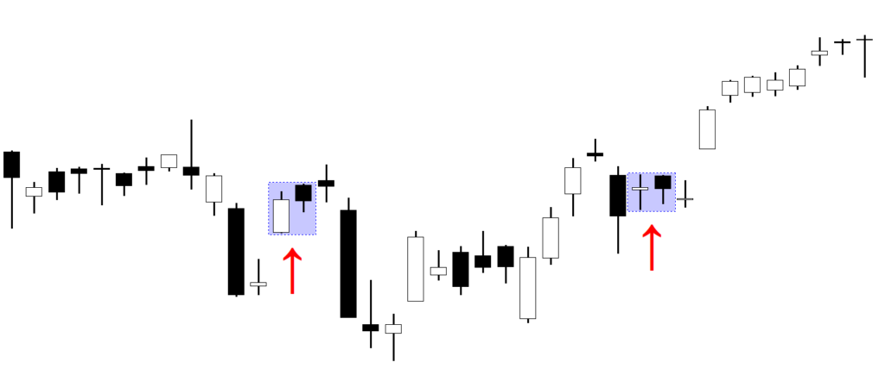

In the fast-paced world of trading, understanding market signals can significantly impact trading outcomes. Among these signals, bearish reversals and bullish divergences are crucial indicators that investors and traders use to navigate the stock market. Bearish reversals typically suggest potential downturns, where the market may shift from an uptrend to a downtrend. Recognizing these signals helps traders anticipate market corrections and protect their investments.

Conversely, bullish divergences point to potential upward movements by indicating that current downtrends might soon reverse. By identifying discrepancies between price action and underlying momentum indicators, such as the Relative Strength Index (RSI) or the Moving Average Convergence Divergence (MACD), traders can foresee market advances even when the price sets new lows.



Algorithmic trading, characterized by computer-executed instructions and strategies, is transforming how financial markets operate. By incorporating signals like bearish reversals and bullish divergences into algorithmic trading algorithms, traders can automate the decision-making process, enabling them to quickly and efficiently respond to market changes. These automated systems can continuously scan multiple markets, analyze vast amounts of data, and execute trades based on pre-set parameters, thereby reducing human error and emotional bias.

This article explores the concepts of bearish reversals, bullish divergences, and their integration into algorithmic trading strategies. Through a comprehensive understanding of these concepts, traders can improve the accuracy and consistency of their trading strategies, leveraging advanced technologies to enhance their market position.

## Table of Contents

## Understanding Bearish Reversals

A bearish reversal indicates a potential decline in market prices, signaling a possible shift from an uptrend to a downtrend. This phenomenon is critical for traders who aim to anticipate market movements, allowing them to make informed selling decisions before a downturn.

Technical traders often use bearish reversals to predict downward price movements by identifying specific candlestick patterns or oscillator signals. Common candlestick patterns that indicate bearish reversals include the "Evening Star," "Shooting Star," and "Bearish Engulfing" patterns. These patterns suggest that selling pressure may soon override buying momentum, marking the end of an uptrend. Similarly, oscillator signals such as the Relative Strength Index (RSI) and Moving Average Convergence Divergence (MACD) are instrumental in identifying bearish reversals. These oscillators provide overbought signals, which often precede price retracements, by indicating that the asset is overvalued and due for a correction.

Recognizing when bulls are losing market grip is key to leveraging bearish reversals. Traders rigorously monitor the price action and [volume](/wiki/volume-trading-strategy) to determine when buying interest starts to wane. Typically, diminishing trading volumes during the latter stages of an uptrend can serve as an early warning signal. Traders might also pay attention to divergence patterns, where the price continues to rise while indicators such as RSI or MACD show declining [momentum](/wiki/momentum)—suggesting a weakening trend. By accurately identifying the transition from bullish to bearish conditions, traders can establish optimal [exit](/wiki/exit-strategy) strategies and preserve capital before the market turns against them.

## Decoding Bullish Divergences

Bullish divergences occur when the price of a security reaches a new low, yet an oscillator indicates a higher low, suggesting that the downward momentum is waning. This discrepancy between price and momentum offers traders a potential signal that a reversal to an upward trend is imminent. In essence, while the price continues to decline, the oscillator suggests that selling pressure is decreasing, hinting at a possible strengthening of buying interest.

Oscillators such as the Relative Strength Index (RSI) and the Moving Average Convergence Divergence (MACD) are instrumental in detecting such divergences. The RSI, for instance, measures the speed and change of price movements, oscillating between zero and 100. Typically, an RSI value below 30 indicates that a security is oversold, potentially flagging a bullish divergence if it starts increasing while the price declines. Similarly, the MACD, derived from the difference between short-term and long-term exponential moving averages, can highlight bullish divergences when its histogram or signal line rises against falling prices.

Mathematically, suppose $P_t$ represents the price at time $t$, while $O_t$ denotes the oscillator reading at the same time. Bullish divergence criteria can be expressed as:
- $P_t < P_{t-n}$ (Price makes a new low)
- $O_t > O_{t-n}$ (Oscillator makes a higher low)

Here, $n$ signifies a previous point in time. Implementing bullish divergence in algorithmic structures involves programming conditions to detect patterns like the ones described above:

```python
def detect_bullish_divergence(prices, oscillator, n=1):
    """
    Detect potential bullish divergences in trading data.

    :param prices: List of prices at different time intervals
    :param oscillator: List of oscillator values corresponding to the prices
    :param n: Look-back period to compare price and oscillator lows
    :return: Boolean indicating if a bullish divergence is detected
    """
    if prices[-1] < prices[-1-n] and oscillator[-1] > oscillator[-1-n]:
        return True
    return False

# Example usage:
prices = [105, 102, 100, 99, 101]
oscillator = [30, 32, 35, 34, 40]
print(detect_bullish_divergence(prices, oscillator))  # Output: True
```

Understanding the significance of these oscillators is vital for effectively leveraging bullish divergences. The divergence itself signifies the transition from bearish to bullish momentum, often before it is reflected in the price change, allowing for potentially advantageous entry points into a trade. Familiarity with oscillator behavior and its interaction with price movements enables traders to better anticipate upward price surges, enhancing their trading strategies and outcomes. Properly identifying and acting on these signals can significantly contribute to more informed decision-making processes and improved trading performance.

## Algorithmic Trading and Technical Signals

Algorithmic trading employs a systematic approach to executing trades using automated and pre-set instructions, allowing for speed, precision, and the elimination of human emotion from trading decisions. This efficiency is particularly important when integrating technical signals like bearish reversals and bullish divergences, which help inform trading strategies based on anticipated market movements.

A key aspect of [algorithmic trading](/wiki/algorithmic-trading) is its ability to process vast amounts of market data, performing real-time analysis that enables immediate order executions. Integrating technical signals into these algorithms involves programming specific conditions under which trades should be initiated or terminated. For example, a bearish reversal might be identified by certain formations in candlestick patterns or drops in correlated oscillator values. Algorithms can be configured to recognize these conditions and sell assets or short positions accordingly.

Conversely, a bullish divergence can indicate potential upward movements. This typically occurs when the price reaches a new low, yet corresponding oscillators, such as the Relative Strength Index (RSI) or Moving Average Convergence Divergence (MACD), do not reach corresponding new lows. This divergence can serve as an entry signal, prompting algorithms to initiate or increase long positions in anticipation of a price increase.

Configuration of trading algorithms to capitalize on these signals can be achieved through several programming strategies. For instance, the following is an example of a simple Python pseudocode that uses RSI for detecting a bullish divergence:

```python
def is_bullish_divergence(prices, rsi):
    # Identify two significant lows in price
    price_low1 = find_local_min(prices)
    price_low2 = find_next_low(prices, price_low1)

    # Compare corresponding RSI values at those lows
    rsi_low1 = rsi[price_low1]
    rsi_low2 = rsi[price_low2]

    # Bullish divergence: Price makes a new low, RSI does not
    return prices[price_low2] < prices[price_low1] and rsi_low2 > rsi_low1

# Basic trading signal logic for algorithmic trading
def trading_decision(prices, rsi):
    if is_bullish_divergence(prices, rsi):
        return "Buy"
    else:
        return "Hold"

# Sample data and execution
prices = [...]
rsi = calculate_rsi(prices)
decision = trading_decision(prices, rsi)
```

By identifying such conditions and integrating them into algorithms, traders are equipped to make data-driven decisions that adapt swiftly to market changes. The automation of these processes not only enhances the speed of trading reactions but also ensures consistent strategy application, free from emotional biases that could cloud judgment. Furthermore, these algorithms can be backtested using historical data to evaluate performance efficacy before live deployment, ensuring that they are well-tuned to market conditions and capable of maximizing potential gains while minimizing risks.

The effective use of technical signals in algorithmic trading highlights the blend of computational power and financial acumen, offering traders a robust toolset to navigate complex market environments with precision and confidence.

## Using Divergence Oscillators in Algo Trading

Oscillators are integral to algorithmic trading, serving as essential tools to identify potential market reversals and establish timely entry and exit points. Among these, the Relative Strength Index (RSI) and Moving Average Convergence Divergence (MACD) are widely used due to their ability to provide insights into the momentum and trend strength of market assets.

The RSI is a momentum oscillator that measures the speed and change of price movements, oscillating between 0 and 100. It is primarily used to identify overbought or oversold conditions in a market. A common practice is to use a 14-day RSI, whereby a value above 70 indicates overbought conditions, and a value below 30 suggests oversold conditions. In the context of divergence, a bullish divergence is recognized when the asset price makes a new low, but the RSI does not, suggesting a potential upward reversal. Conversely, a bearish divergence occurs when the asset price hits a new high, but the RSI does not, possibly indicating an impending downtrend.

MACD, on the other hand, is a trend-following momentum indicator that shows the relationship between two moving averages of an asset's price. The MACD line is calculated by subtracting the 26-period Exponential Moving Average (EMA) from the 12-period EMA. A signal line, typically a 9-day EMA of the MACD line, is plotted on top to act as a trigger for buy or sell signals. Bullish divergence in MACD is identified when the price reaches lower lows while the MACD line forms higher lows, suggesting weakening selling pressure. A bearish divergence is detected when the price records higher highs but the MACD line registers lower highs, indicating declining buying momentum.

Integrating these divergence oscillators into trading algorithms allows for automated identification and execution of trades based on pre-defined rules. Python, a popular language for algorithmic trading, offers libraries such as TA-Lib and Pandas, which facilitate the implementation of RSI and MACD calculations. Below is a basic implementation example using Python:

```python
import talib
import pandas as pd

# Assuming 'data' is a DataFrame with 'close' prices
data['RSI'] = talib.RSI(data['close'], timeperiod=14)
data['MACD'], data['MACD_signal'], _ = talib.MACD(data['close'], fastperiod=12, slowperiod=26, signalperiod=9)

# Example condition for bullish divergence
bullish_rsi_divergence = (data['RSI'] > data['RSI'].shift(1)) & (data['close'] < data['close'].shift(1))
bullish_macd_divergence = (data['MACD'] > data['MACD'].shift(1)) & (data['close'] < data['close'].shift(1))

# Set entry signals
data['Signal'] = 0
data.loc[bullish_rsi_divergence | bullish_macd_divergence, 'Signal'] = 1
```

By detecting divergences between price action and oscillator readings, trading algorithms can be fine-tuned to optimize entry and exit points, potentially enhancing trade outcomes. The precise timing provided by these oscillators aids in mitigating risks and capitalizing on favorable market conditions, making them invaluable in the toolbox of algorithmic traders.

## Risk Management and Strategy Optimization

Effective risk management is a cornerstone in algorithmic trading systems, particularly when utilizing signals such as bearish reversals and bullish divergences. These systems require meticulous planning and execution to balance the potential for profit with the inherent market risks.

Backtesting is an essential first step in optimizing trading strategies. Through [backtesting](/wiki/backtesting), traders can simulate trading with historical data to examine how a strategy might perform in real-world conditions. This process allows for the adjustment of algorithm parameters to enhance performance and reduce risks. The goal is to achieve a balance where potential returns are maximized while minimizing the risk of significant losses or drawdowns. An effective backtesting approach often involves:

1. **Data Integrity:** Ensuring that historical data used in backtesting is accurate and consistent. Poor data quality can lead to misleading results.
2. **Sample Size:** Utilizing an extensive data set to account for various market conditions, ensuring the strategy is robust and adaptable.
3. **Performance Metrics:** Evaluating metrics such as Sharpe ratio, maximum drawdown, and win/loss ratio to assess the strategy's risk-adjusted returns.

Incorporating stop-loss and take-profit protocols is another critical aspect of risk management. Stop-loss orders automatically sell a security when it reaches a predetermined price, thereby restricting potential losses. Conversely, take-profit orders lock in profits by selling a security once it hits a target price. This automated approach helps mitigate emotional decision-making, ensuring that the trading system consistently adheres to predefined risk parameters.

Below is a simple Python implementation that demonstrates the concept of stop-loss and take-profit within a trading algorithm context:

```python
def apply_risk_management(entry_price, stop_loss_pct, take_profit_pct, current_price):
    stop_loss_price = entry_price * (1 - stop_loss_pct / 100)
    take_profit_price = entry_price * (1 + take_profit_pct / 100)

    if current_price <= stop_loss_price:
        return "Sell (Stop Loss Triggered)"
    elif current_price >= take_profit_price:
        return "Sell (Take Profit Triggered)"
    else:
        return "Hold"

# Example Usage:
entry_price = 100  # Initial entry price of the trade
stop_loss_pct = 5  # 5% stop loss
take_profit_pct = 10  # 10% take profit
current_price = 95  # Current market price

action = apply_risk_management(entry_price, stop_loss_pct, take_profit_pct, current_price)
print(action)  # Output: "Sell (Stop Loss Triggered)"
```

This script highlights the systematic decision-making process reactive to price fluctuations, providing an essential safeguard against excessive losses while allowing profits to be captured automatically.

In summary, effective risk management through rigorous backtesting and the structured use of stop-loss and take-profit protocols helps create a resilient trading strategy. By adhering to these practices, traders can capitalize on market signals while maintaining stringent control over risks, thereby enhancing their algorithmic trading system's overall reliability and performance.

## Conclusion

Bearish reversals and bullish divergences are crucial tools within technical analysis that provide significant insights into potential market directional changes. These signals are highly valuable to traders for anticipating and responding to shifts in market trends. When effectively integrated into algorithmic trading systems, they can substantially improve strategy accuracy and reliability.

Algorithmic trading, relying on these technical signals, can automate decision-making processes, reducing human error and leveraging real-time data analysis. Traders can program their algorithms to detect specific patterns indicative of bearish reversals, such as specific candlestick formations or oscillator thresholds. Similarly, identifying bullish divergences—where there is a disparity between price action and momentum indicators—can signal an impending upward trend, allowing for strategic entry points.

The automation and precision offered by integrating these signals into trading algorithms enhance traders' ability to execute orders with timing and precision that manual trading processes could rarely replicate. For instance, using Python libraries such as TA-Lib or Pandas, traders can write scripts to identify divergences using oscillators like the Relative Strength Index (RSI) or the Moving Average Convergence Divergence (MACD):

```python
import talib
import pandas as pd

# Calculate the RSI
data['RSI'] = talib.RSI(data['Close'], timeperiod=14)

# Identify divergences
bullish_divergence = (data['RSI'].diff() > 0) & (data['Close'].diff() < 0)
bearish_reversal = (data['RSI'].diff() < 0) & (data['Close'].diff() > 0)
```

By leveraging such strategies, traders can better manage their portfolios, ensuring that their trading systems are not just reactive but also predictive. This strategic use of technical analysis signals within algorithmic trading can lead to improved performance, lower risk exposure, and optimized trade execution.

Continued advancements in algorithmic trading technologies promise to further expand the application and efficacy of bearish reversals and bullish divergences. As computational power increases and more sophisticated algorithms are developed, these signals' potential to forecast market behavior will likely enhance, offering even more refined insights and strategic advantages in financial markets.

## References & Further Reading

[1]: Bergstra, J., Bardenet, R., Bengio, Y., & Kégl, B. (2011). ["Algorithms for Hyper-Parameter Optimization."](https://dl.acm.org/doi/10.5555/2986459.2986743) Advances in Neural Information Processing Systems 24.

[2]: ["Advances in Financial Machine Learning"](https://www.amazon.com/Advances-Financial-Machine-Learning-Marcos/dp/1119482089) by Marcos Lopez de Prado

[3]: ["Evidence-Based Technical Analysis: Applying the Scientific Method and Statistical Inference to Trading Signals"](https://www.amazon.com/Evidence-Based-Technical-Analysis-Scientific-Statistical/dp/0470008741) by David Aronson

[4]: ["Machine Learning for Algorithmic Trading"](https://github.com/stefan-jansen/machine-learning-for-trading) by Stefan Jansen

[5]: ["Quantitative Trading: How to Build Your Own Algorithmic Trading Business"](https://www.amazon.com/Quantitative-Trading-Build-Algorithmic-Business/dp/1119800064) by Ernest P. Chan