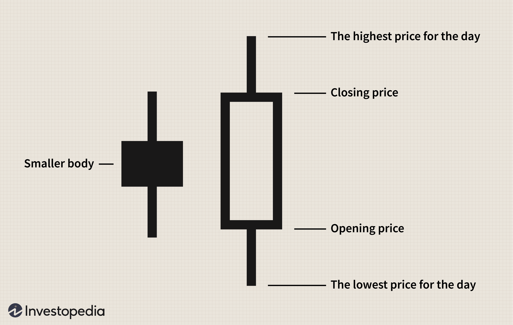

## Table of Contents

## What is a Bullish Engulfing Pattern?

A Bullish Engulfing Pattern is a type of candlestick pattern that traders use to spot potential upward movements in the stock market. It happens when a small bearish (downward) candle is followed by a larger bullish (upward) candle. The bullish candle completely covers or "engulfs" the body of the previous bearish candle. This pattern suggests that the sellers were initially in control, but the buyers have taken over, pushing the price up significantly.

This pattern is considered a strong signal for a possible reversal in the market trend. It often appears at the end of a downtrend, indicating that the downward movement might be over and an upward trend could be starting. Traders look for this pattern as a sign to buy, hoping to profit from the expected rise in price. However, it's important to use other indicators and analysis methods along with the Bullish Engulfing Pattern to make more informed trading decisions.

## How does a Bullish Engulfing Pattern form on a chart?

A Bullish Engulfing Pattern forms on a chart when you see two specific candles next to each other. The first candle is small and red, showing that the price went down that day. The second candle is big and green, showing that the price went up a lot the next day. The green candle starts lower than where the red candle ended, but it goes up so much that it completely covers the red candle. This means the top and bottom of the green candle are outside the top and bottom of the red candle.

This pattern often shows up when prices have been going down for a while. When you see this pattern, it's like the market is saying, "Enough with the falling prices, let's start going up!" It's a sign that buyers are now stronger than sellers. If you're looking at a chart and you see this pattern, it might be a good time to think about buying, because the price could start going up soon. But remember, it's always smart to look at other things on the chart too, not just this one pattern.

## What are the key characteristics of a Bullish Engulfing Pattern?

A Bullish Engulfing Pattern is easy to spot on a chart. It happens when you see a small red candle followed by a big green candle. The red candle shows that the price went down a little bit. The green candle starts lower than where the red candle ended, but then it goes up so much that it completely covers the red candle. This means the green candle's top and bottom are outside the red candle's top and bottom.

This pattern usually shows up after prices have been going down for a while. It's like a signal that the downward trend might be over and prices could start going up. When you see this pattern, it means buyers are getting stronger than sellers. It's a good hint that it might be a smart time to buy, because the price could go up soon. But, it's always a good idea to check other things on the chart too, not just this one pattern.

## Can you explain the psychology behind a Bullish Engulfing Pattern?

The psychology behind a Bullish Engulfing Pattern shows how traders feel about the market. When you see a small red candle, it means the price went down a little, and sellers were in control. But then, the big green candle that follows shows that buyers suddenly became much stronger. They were so strong that they pushed the price up a lot, covering the whole red candle. This big change shows that the mood in the market switched from being worried about falling prices to feeling hopeful about rising prices.

This pattern often happens after prices have been going down for a while. When traders see the Bullish Engulfing Pattern, they start to believe that the downward trend might be over. They think that the buyers are now taking over, and it could be a good time to buy. This hope and belief in a new upward trend is what makes the Bullish Engulfing Pattern important. It's like a signal that tells traders, "Hey, things might be looking up now!"

## What are the ideal market conditions for spotting a Bullish Engulfing Pattern?

The best time to spot a Bullish Engulfing Pattern is when the market has been going down for a while. Imagine prices have been falling, and people are feeling worried about it. This is when the pattern is most powerful because it shows a big change in how people feel. If you see a small red candle followed by a big green candle that covers it, it's like a signal that the downward trend might be over. The market was going down, but now it's trying to go up.

It's also important to look at where the pattern happens on the chart. If it shows up near a strong support level, where prices usually stop going down, it's even more likely to mean prices will start going up. Traders pay attention to these spots because they know the market might be ready to change direction. So, if you see a Bullish Engulfing Pattern after a downtrend and near a support level, it's a good hint that it might be time to buy, because the price could go up soon.

## How can a Bullish Engulfing Pattern be used to predict potential price movements?

A Bullish Engulfing Pattern can help traders guess what the price might do next. When you see this pattern, it means the price went down a little bit first, but then it went up a lot. This big change shows that people who want to buy are now stronger than people who want to sell. If this pattern happens after prices have been going down for a while, it's a sign that the downward trend might be over. Traders see this and think it might be a good time to buy, hoping the price will keep going up.

To use the Bullish Engulfing Pattern to predict price movements, it's important to look at where it shows up on the chart. If it appears near a support level, where prices usually stop going down, it's even more likely that the price will start going up. Traders watch these spots closely because they know the market might be ready to change direction. So, if you see a Bullish Engulfing Pattern after a downtrend and near a support level, it's a good hint that the price could go up soon. But remember, it's always smart to check other things on the chart too, not just this one pattern.

## What is the difference between a Bullish Engulfing Pattern and a Bearish Engulfing Pattern?

A Bullish Engulfing Pattern and a Bearish Engulfing Pattern are two different candlestick patterns that traders use to guess where the price might go next. A Bullish Engulfing Pattern happens when you see a small red candle followed by a big green candle. The green candle starts lower than where the red candle ended, but it goes up so much that it completely covers the red candle. This pattern usually shows up after prices have been going down for a while, and it means that buyers are now stronger than sellers. It's a sign that the downward trend might be over, and prices could start going up.

On the other hand, a Bearish Engulfing Pattern is the opposite. It happens when you see a small green candle followed by a big red candle. The red candle starts higher than where the green candle ended, but it goes down so much that it completely covers the green candle. This pattern usually shows up after prices have been going up for a while, and it means that sellers are now stronger than buyers. It's a sign that the upward trend might be over, and prices could start going down. Both patterns are important for traders to watch because they show big changes in how people feel about the market.

## How reliable is the Bullish Engulfing Pattern as a trading signal?

The Bullish Engulfing Pattern can be a helpful sign for traders, but it's not perfect. It shows up when a small red candle is followed by a big green candle that covers it. This often happens after prices have been going down for a while, and it means buyers might be getting stronger than sellers. When traders see this pattern, they might think it's a good time to buy because the price could start going up. But, the pattern doesn't always work. Sometimes, the price keeps going down even after a Bullish Engulfing Pattern shows up.

To make better guesses about where the price might go, traders should look at other things on the chart too. They should check if the pattern happens near a support level, where prices usually stop going down. They can also use other tools and signs to help them decide. The more things that point to the price going up, the more likely the Bullish Engulfing Pattern is to be right. But no single pattern is perfect, so it's smart to be careful and use other information too.

## What are some common mistakes traders make when using the Bullish Engulfing Pattern?

One common mistake traders make when using the Bullish Engulfing Pattern is relying on it too much. They see the pattern and think the price will definitely go up, but that's not always true. The pattern is just one hint, and it doesn't work every time. Traders need to look at other things on the chart too, like where the pattern happens and other signs that might show the price will go up.

Another mistake is not waiting for confirmation. Some traders buy right away when they see a Bullish Engulfing Pattern, but it's better to wait a bit to see if the price really does start going up. If the next candle after the pattern is also green, it's a stronger sign that the price might keep going up. Jumping in too fast can lead to losing money if the pattern turns out to be wrong.

## Can you provide an example of a successful trade using a Bullish Engulfing Pattern?

Imagine you're watching a stock that's been going down for a few weeks. You see a small red candle one day, showing that the price dropped a little bit. But the next day, you see a big green candle that starts lower than where the red candle ended, but then goes up so much that it covers the whole red candle. This is a Bullish Engulfing Pattern, and it happens right near a support level where the price usually stops going down. You decide to wait one more day to see if the price keeps going up, and it does. The next candle is also green, confirming the pattern.

Feeling confident, you buy the stock. Over the next few days, the price keeps going up just like you hoped. You make a nice profit and sell the stock when it reaches a resistance level, where the price usually stops going up. This trade was successful because you saw the Bullish Engulfing Pattern at the right time, waited for confirmation, and used other signs like the support level to make your decision. It's a good example of how using the pattern carefully can lead to a winning trade.

## How can the Bullish Engulfing Pattern be combined with other technical indicators for better results?

Using the Bullish Engulfing Pattern with other technical indicators can help traders make better guesses about where the price might go. One way to do this is by looking at the Relative Strength Index (RSI). If you see a Bullish Engulfing Pattern and the RSI is below 30, it means the stock might be oversold. This makes the pattern even stronger because it shows that the price could be ready to go up. Another useful tool is the Moving Average Convergence Divergence (MACD). If the MACD line crosses above the signal line right after you see the Bullish Engulfing Pattern, it's a good sign that the price might keep going up.

Traders can also use support and resistance levels to make their decisions better. If a Bullish Engulfing Pattern shows up near a strong support level, it's more likely that the price will start going up. This is because the support level is a place where the price usually stops going down. Volume is another important thing to check. If the [volume](/wiki/volume-trading-strategy) goes up a lot when you see the Bullish Engulfing Pattern, it means more people are buying, which makes the pattern even more powerful. By combining these indicators with the Bullish Engulfing Pattern, traders can feel more confident about their guesses and make smarter trades.

## What advanced strategies can be employed to maximize the effectiveness of trading with Bullish Engulfing Patterns?

To make the most out of trading with Bullish Engulfing Patterns, traders can use a strategy called position sizing. This means deciding how much of their money to put into a trade based on how sure they are about the pattern. If the Bullish Engulfing Pattern shows up after a long downtrend and near a strong support level, a trader might feel more sure about it and decide to put more money into the trade. But if they're not as sure, maybe because the pattern is not as clear or the market is too unpredictable, they might put in less money to be safer. This way, they can make bigger profits when they're right and lose less when they're wrong.

Another advanced strategy is to use stop-loss orders to protect their money. A stop-loss order is like a safety net that tells the computer to sell the stock if the price goes down to a certain level. This helps traders limit how much they can lose if the Bullish Engulfing Pattern doesn't work out. For example, if a trader buys a stock after seeing the pattern, they might set a stop-loss order just below the lowest point of the green candle. This way, if the price goes down instead of up, the stop-loss order will kick in and sell the stock before the trader loses too much money. By using these strategies together, traders can be smarter and safer when trading with Bullish Engulfing Patterns.

## References & Further Reading

[1]: Nison, S. (1991). ["Japanese Candlestick Charting Techniques: A Contemporary Guide to the Ancient Investment Techniques of the Far East"](https://archive.org/details/japanesecandlest0000niso). Prentice Hall Press.

[2]: Elder, A. (1993). ["Trading for a Living: Psychology, Trading Tactics, Money Management"](https://www.amazon.com/Trading-Living-Psychology-Tactics-Management/dp/0471592242). Wiley.

[3]: Chan, E. (2009). ["Algorithmic Trading: Winning Strategies and Their Rationale"](https://github.com/ftvision/quant_trading_echan_book). Wiley.

[4]: Murphy, J. J. (1999). ["Technical Analysis of the Financial Markets: A Comprehensive Guide to Trading Methods and Applications"](https://archive.org/details/technicalanalysi0000murp). New York Institute of Finance.

[5]: Jansen, S. (2020). ["Machine Learning for Algorithmic Trading"](https://github.com/stefan-jansen/machine-learning-for-trading). Packt Publishing.