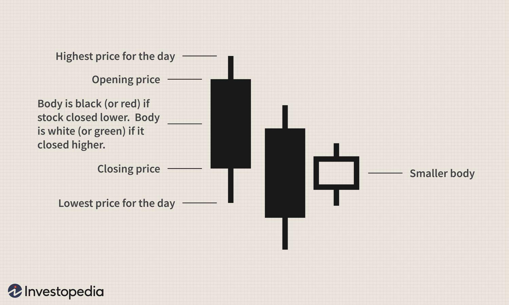

## Table of Contents

## What is a candlestick pattern in trading?

A candlestick pattern is a way to show how the price of something, like a stock or a currency, changes over time. Each "candlestick" on a chart represents what happened to the price during a specific time, like a day or an hour. The candlestick has a wide part, called the body, which shows the opening and closing prices. If the closing price is higher than the opening price, the body is usually colored white or green. If it's lower, the body is usually colored black or red. The thin lines above and below the body, called wicks or shadows, show the highest and lowest prices during that time.

Candlestick patterns can help traders guess what might happen next with the price. For example, a pattern called "Doji" happens when the opening and closing prices are very close, making the body very small. This can mean that buyers and sellers are unsure about the price, and it might change direction soon. Another common pattern is the "Hammer," which has a small body and a long lower wick. This can mean that the price might start going up after being down. By looking at these patterns, traders can make better decisions about when to buy or sell.

## What is the Bullish Harami pattern?

The Bullish Harami pattern is a two-candle pattern that traders look for when they think the price of something, like a stock or a currency, might start going up. The first candle in this pattern is a big one, and it can be either red or black, which means the price went down that day. The second candle is smaller and usually green or white, showing that the price went up a bit. The key thing is that the second candle's body is completely inside the first candle's body, like a baby inside a mother's belly. That's why it's called "Harami," which means pregnant in Japanese.

When traders see a Bullish Harami pattern, it can mean that the downward trend might be ending. The big first candle shows that sellers were in control, pushing the price down. But then, the smaller second candle shows that buyers are starting to come back, and they managed to push the price up a little. This can be a sign that the price might keep going up. Traders often look for other signs too, like where the pattern appears on the chart or other patterns nearby, to be more sure about their guesses.

## How does the Bullish Harami pattern form on a chart?

The Bullish Harami pattern forms on a chart when you see two candles next to each other. The first candle is big and shows that the price went down a lot that day. It's usually colored red or black. This big candle means that sellers were strong and in control. The second candle is smaller and shows that the price went up a little. It's usually colored green or white. The important part is that the body of the second candle fits completely inside the body of the first candle, like a baby inside a mother's belly. That's why it's called "Harami," which means pregnant in Japanese.

When you see a Bullish Harami pattern, it might mean that the price could start going up soon. The big first candle shows that sellers were pushing the price down, but the smaller second candle shows that buyers are starting to come back and push the price up a bit. This pattern can be a sign that the downward trend is ending and that the price might start to rise. Traders often look at other things on the chart too, like where the pattern appears or other patterns nearby, to help them decide what might happen next.

## What does the Bullish Harami indicate about market sentiment?

The Bullish Harami pattern tells us that the market might be getting ready to change from feeling down to feeling up. When you see a big red or black candle first, it means sellers were strong and in control, pushing the price down. But then, a smaller green or white candle comes next, showing that buyers are starting to come back and push the price up a little. This change from a big down candle to a smaller up candle inside it shows that the sellers' power might be getting weaker and the buyers are starting to take over.

This pattern can be a sign that people in the market are starting to feel more hopeful about the price going up. The smaller second candle, fitting inside the first one, tells us that the strong downward trend could be ending. Traders see this as a hint that it might be a good time to buy, because the market sentiment seems to be shifting towards a more positive outlook.

## Can you explain the psychology behind the Bullish Harami pattern?

The psychology behind the Bullish Harami pattern is all about how people in the market feel and what they think might happen next. When the first big red or black candle appears, it shows that a lot of people were selling, pushing the price down. They were feeling worried or not happy about the price, so they wanted to get out. This big candle tells us that the sellers were really strong and in control that day.

But then, the second smaller green or white candle comes along. This candle is inside the first one, which means the price didn't go down as much as before. It shows that some buyers started to come back and were willing to buy at a higher price than where it closed the day before. This change from a big down candle to a smaller up candle tells us that the sellers' power is getting weaker, and the buyers are starting to feel more hopeful. It's like the market is taking a breath and thinking, "Maybe the price will go up from here."

## How reliable is the Bullish Harami pattern in predicting price movements?

The Bullish Harami pattern can be a helpful sign for traders, but it's not always right about what will happen next with the price. It's like a clue that the price might start going up, but it doesn't work every time. How well it works can depend on things like where it shows up on the chart, how strong the trend was before it appeared, and what other patterns or signs are around it. Traders often use the Bullish Harami along with other tools and signs to make better guesses about the market.

Even though the Bullish Harami can be useful, it's important not to rely on it alone. Sometimes, the price might keep going down even after you see a Bullish Harami. That's why smart traders look at the bigger picture and use other ways to check their guesses. By combining the Bullish Harami with other signs and tools, traders can feel more sure about their decisions and be ready for different things that might happen in the market.

## What are the key components to look for in identifying a Bullish Harami?

To spot a Bullish Harami pattern, you need to look for two candles next to each other on a chart. The first candle should be big and usually red or black, showing that the price went down a lot. This big candle tells you that sellers were strong and in control that day. The second candle should be smaller and usually green or white, showing that the price went up a bit. The important thing is that the body of the second candle fits completely inside the body of the first candle, like a baby inside a mother's belly.

This pattern can be a hint that the price might start going up soon. The big first candle shows that sellers were pushing the price down, but the smaller second candle inside it shows that buyers are starting to come back and push the price up a little. By looking for these two candles with the second one fitting inside the first, you can identify a Bullish Harami and use it to guess what might happen next with the price.

## What are common mistakes traders make when using the Bullish Harami pattern?

One common mistake traders make when using the Bullish Harami pattern is relying on it too much by itself. They might see the pattern and think the price will go up for sure, but the Bullish Harami is just a hint, not a promise. It's important to look at other things on the chart too, like where the pattern shows up and what other signs are around it. If traders only use the Bullish Harami without checking other clues, they might make bad guesses about what will happen next with the price.

Another mistake is not waiting for the right time to act. Some traders might see a Bullish Harami and jump to buy right away, but it's better to wait a bit to see if the price keeps going up after the pattern. If the price doesn't go up, the Bullish Harami might not mean much. Also, traders should think about how strong the trend was before the pattern appeared. If the trend was very strong down, the Bullish Harami might not be strong enough to change it. By being patient and looking at the bigger picture, traders can avoid making quick decisions based only on one pattern.

## How can the Bullish Harami be used in conjunction with other technical indicators?

Traders can use the Bullish Harami pattern along with other technical indicators to make better guesses about the market. For example, they might look at moving averages, which are lines on the chart that show the average price over time. If a Bullish Harami appears near a moving average line, it might be a stronger sign that the price could go up. Traders also use tools like the Relative Strength Index (RSI) to see if a stock is overbought or oversold. If the RSI shows that a stock is oversold and then a Bullish Harami appears, it could mean the price is ready to bounce back up.

Another way to use the Bullish Harami with other indicators is to look at [volume](/wiki/volume-trading-strategy), which shows how many people are buying and selling. If the volume goes up when the Bullish Harami appears, it might mean more people are starting to buy, making the pattern more reliable. Traders also pay attention to other patterns like support and resistance levels. If a Bullish Harami forms near a strong support level, it could be a good sign that the price might start going up from there. By combining the Bullish Harami with these other tools, traders can feel more sure about their decisions and be ready for different things that might happen in the market.

## What are the differences between the Bullish Harami and other bullish reversal patterns?

The Bullish Harami is a two-candle pattern where the first candle is big and usually red or black, showing that the price went down a lot. The second candle is smaller and usually green or white, fitting inside the body of the first candle. This pattern suggests that the downward trend might be ending and the price could start going up. Other bullish reversal patterns, like the Hammer or the Morning Star, also hint that the price might go up, but they look different. The Hammer has a small body and a long lower wick, showing that the price went down a lot but then came back up a bit. The Morning Star is a three-candle pattern where the first candle is big and down, the second is small and can be up or down, and the third is big and up, showing a clear change from down to up.

Each of these patterns tells us something different about what might happen next with the price. The Bullish Harami shows that buyers are starting to come back after a strong downward move, but it's a more subtle hint than the Hammer or the Morning Star. The Hammer shows a strong rejection of lower prices, which can be a more powerful sign that the price might go up. The Morning Star, with its three candles, gives a clearer picture of a change in trend from down to up. Traders often use these patterns together with other signs on the chart to make better guesses about what the price might do next.

## Can the Bullish Harami pattern be effectively used in different time frames?

Yes, the Bullish Harami pattern can be used on different time frames like daily, hourly, or even minute charts. On a daily chart, it might tell you that the price could go up over the next few days. On an hourly chart, it might mean the price could go up in the next few hours. The key thing is to look at the same two candles, one big down candle followed by a smaller up candle inside it, no matter what time frame you're using. But remember, the shorter the time frame, the quicker the price might move, so you need to be ready to act fast.

Even though the Bullish Harami can work on different time frames, it's good to think about how strong the pattern is on each one. On longer time frames like daily or weekly charts, the Bullish Harami might be a stronger sign because it shows what's happening over a longer time. On shorter time frames like hourly or minute charts, the pattern might be less reliable because the market can change quickly. So, it's smart to use the Bullish Harami along with other signs on the chart to feel more sure about what the price might do next, no matter which time frame you're looking at.

## What are some real-world examples of the Bullish Harami pattern leading to successful trades?

Imagine a trader named Sarah who was watching the stock of a tech company. She saw a big red candle on the daily chart, showing the price had dropped a lot that day. The next day, a smaller green candle appeared, fitting completely inside the body of the red candle from the day before. Sarah recognized this as a Bullish Harami pattern. She waited to see if the price would keep going up, and it did. A few days later, the stock's price had risen by 10%, so Sarah made a good profit from her trade.

Another example is John, who trades [forex](/wiki/forex-system). He was looking at the EUR/USD pair on an hourly chart and noticed a big down candle followed by a smaller up candle inside it, forming a Bullish Harami. John also checked the RSI and saw that the pair was oversold, which made him feel more sure about the pattern. He decided to buy and set a stop-loss just below the low of the Bullish Harami pattern. Over the next few hours, the EUR/USD price went up, and John was able to close his trade with a nice gain.

## Question: How effective is backtesting the Bullish Harami pattern in algorithmic trading strategies?

Backtesting is a critical step in evaluating the effectiveness of the Bullish Harami pattern within [algorithmic trading](/wiki/algorithmic-trading) strategies. This process involves applying historical market data to test whether the pattern yields profitable trading outcomes and to refine the algorithm's performance.

The first step in [backtesting](/wiki/backtesting) the Bullish Harami pattern is selecting a comprehensive historical dataset that represents various market conditions. This dataset should cover a sufficiently long period to include different market phases, such as bull and bear markets, ensuring a robust testing environment. Traders typically source this data from reputable financial data providers or stock exchanges.

After acquiring the data, the next step is algorithmically identifying the Bullish Harami pattern. This involves programming a trading algorithm to detect the characteristic two-candlestick formation: a large bearish candle followed by a smaller bullish candle fully contained within the preceding bearish candle's body. Here is a basic example of how this can be implemented in Python using libraries like Pandas for data handling:

```python
import pandas as pd

def is_bullish_harami(df):
    conditions = [
        (df['Close'].shift(1) < df['Open'].shift(1)) &  # Previous candle is bearish
        (df['Open'] > df['Close']) &  # Current candle is bullish
        (df['Open'] < df['Close'].shift(1)) &  # Current open is less than previous close
        (df['Close'] > df['Open'].shift(1))  # Current close is greater than previous open
    ]
    return df[conditions]

# Assuming df is a DataFrame with Date, Open, High, Low, Close columns
bullish_harami_signals = is_bullish_harami(df)
```

Once the Bullish Harami patterns are identified, the algorithm can simulate trades. Typically, the simulation involves entering a buy position upon the completion of the pattern and holding it for a precalculated period or until a predefined stop-loss or take-profit level is reached. Key metrics such as win rates, profit [factor](/wiki/factor-investing), and risk-adjusted returns like the Sharpe ratio can then be calculated to evaluate the strategy's effectiveness.

For example, the Sharpe ratio, which measures the risk-adjusted return, can be computed as follows:

$$
\text{Sharpe Ratio} = \frac{E[R_p - R_f]}{\sigma_p}
$$

Where:
- $E[R_p - R_f]$ is the expected return of the portfolio minus the risk-free rate.
- $\sigma_p$ is the standard deviation of the portfolio's excess return.

The goal of backtesting is to validate and optimize the algorithm. Key considerations include ensuring statistical significance, avoiding overfitting to past data, and confirming that the pattern's detected profitability is not due to chance. A well-conducted backtest aids in making informed adjustments to enhance the trading strategy's performance, ensuring that it is poised to exploit the Bullish Harami pattern effectively in live market conditions.

## What are the conclusions and future prospects?

The Bullish Harami pattern is a reliable technique for identifying potential reversals in market trends. Characterized by its two-candlestick formation, it highlights shifts in [momentum](/wiki/momentum) from bearish to bullish, providing traders with strategic entry signals. As markets and technologies evolve, the relevance of the Bullish Harami pattern persists, offering traders an insightful window into market dynamics.

Recent advancements in algorithmic trading, particularly in [machine learning](/wiki/machine-learning) and [artificial intelligence](/wiki/ai-artificial-intelligence), have further enhanced the detection and utilization of such patterns. Machine learning algorithms can process vast amounts of historical and real-time market data, identifying subtle patterns and correlations that might escape manual analysis. For instance, [deep learning](/wiki/deep-learning) models can be trained to recognize candlestick patterns like the Bullish Harami with high accuracy, learning from a plethora of historical market scenarios to improve predictive accuracy.

The integration of artificial intelligence in this context can be represented by the equation:

$$
P(t) = f(H_t, W)
$$

where $P(t)$ is the prediction of price movement at time $t$, $H_t$ is the historical data considered up to time $t$, and $W$ represents the weight matrix learned by the model. Such models can dynamically adjust their parameters based on new data, improving their performance over time.

Python code can illustrate how algorithmic strategies can incorporate the Bullish Harami pattern:

```python
import pandas as pd

# Function to identify Bullish Harami pattern
def is_bullish_harami(data):
    return (data['Close'].shift(1) > data['Open'].shift(1)) & \
           (data['Close'] < data['Open'].shift(1)) & \
           (data['Open'] > data['Close'].shift(1))

# Example of using the function on a dataframe
data['Bullish Harami'] = is_bullish_harami(data)

# Entry signal based on Bullish Harami pattern
data['Entry Signal'] = data['Bullish Harami'] & (data['Indicator'] > data['Threshold'])
```

The adoption of such automated systems not only enhances the ability to harness the Bullish Harami but also allows for continuous adaptation and learning from new data streams, resulting in more robust and adaptive trading strategies. As AI continues to advance, the capacity to identify more complex, nuanced market patterns and integrate them with tools like the Bullish Harami will likely expand, presenting new opportunities for traders and investors.

## References & Further Reading

[1]: Elder, A. (1993). ["Trading for a Living: Psychology, Trading Tactics, Money Management"](https://www.amazon.com/Trading-Living-Psychology-Tactics-Management/dp/0471592242). Wiley.

[2]: Nison, S. (1991). ["Japanese Candlestick Charting Techniques: A Contemporary Guide to the Ancient Investment Techniques of the Far East"](https://www.amazon.com/Japanese-Candlestick-Charting-Techniques-Contemporary/dp/0139316507). Prentice Hall Press.

[3]: Bulkowski, T. N. (2008). ["Encyclopedia of Candlestick Charts"](https://onlinelibrary.wiley.com/doi/book/10.1002/9781119202288). Wiley Trading.

[4]: Chan, E. P. (2009). ["Quantitative Trading: How to Build Your Own Algorithmic Trading Business"](https://github.com/ftvision/quant_trading_echan_book). Wiley.

[5]: Lopez de Prado, M. (2018). ["Advances in Financial Machine Learning"](https://www.amazon.com/Advances-Financial-Machine-Learning-Marcos/dp/1119482089). Wiley.

[6]: Aronson, D. (2007). ["Evidence-Based Technical Analysis: Applying the Scientific Method and Statistical Inference to Trading Signals"](https://www.amazon.com/Evidence-Based-Technical-Analysis-Scientific-Statistical/dp/0470008741). Wiley.

[7]: Jansen, S. (2018). ["Machine Learning for Algorithmic Trading"](https://github.com/stefan-jansen/machine-learning-for-trading). Independently published.