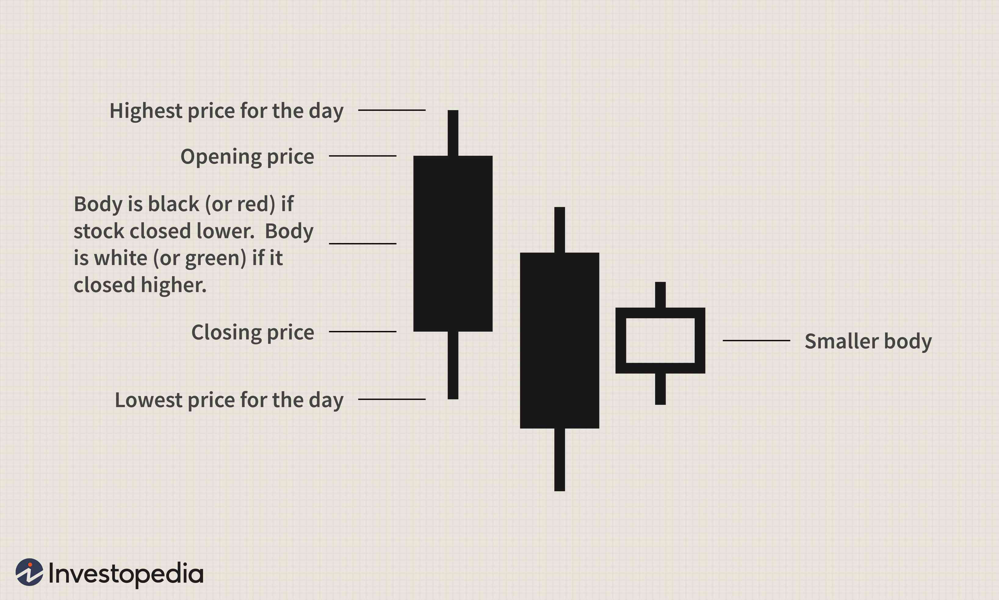

Candlestick patterns are essential tools in technical analysis, offering traders insights into market sentiment and potential future price movements. These patterns are visual representations of price action in a specified time frame and are used to identify possible reversals or continuations in trends. Among these, the Bullish Harami pattern stands out as a significant indicator of potential trend reversal, particularly signalling the possible end of a downtrend and the onset of an uptrend.

The Bullish Harami pattern consists of two candlesticks: a large bearish candle followed by a smaller bullish candle contained within the previous candle’s body. This formation indicates a shift in market sentiment from bearish to bullish, suggesting a potential reversal. The smaller bullish candle reflects the dwindling bearish momentum and the rise of buying interest, though this signal is often more reliable when confirmed with other technical indicators or patterns.



In the context of algorithmic trading, pattern recognition plays a crucial role in generating trading signals and making data-driven decisions. Algorithms can be programmed to detect patterns like the Bullish Harami and execute trades automatically once confirmed. This integration technologically empowers traders by eliminating emotional biases and allowing for high-speed execution across multiple markets, leveraging real-time data analysis for optimal trading outcomes.

Understanding and effectively using the Bullish Harami pattern in trading strategies involves recognizing its formation and implications accurately. Traders seek to leverage this pattern to position themselves advantageously when a trend reversal is anticipated. The objective is to capture the early stages of potential bullish trends, maximizing profit opportunities while minimizing risks by adhering to strategic entry and exit points, backed by further confirmation signals. As the financial markets continue to evolve, the ability of traders to adapt patterns like the Bullish Harami effectively will be pivotal in maintaining a competitive edge.

## Table of Contents

## Understanding the Bullish Harami Candlestick Pattern

The Bullish Harami candlestick pattern plays a significant role in technical analysis, predominantly recognized as an indicator of potential trend reversals. This two-candle pattern is composed of a large bearish (red or black) candle followed by a smaller bullish (green or white) candle. The appearance of the second candle within the body of the first candle is crucial; it resembles a mother holding a baby, hence the name "Harami," which means "pregnant" in Japanese.

To identify a Bullish Harami pattern, traders look for specific characteristics: on the first day, the market shows a strong downward movement, resulting in a long bearish candle, reflecting the ongoing bearish sentiment. On the subsequent day, a small bullish candle forms within the previous day's long body, signifying a decrease in selling pressure and the potential for a shift in market sentiment.

This pattern indicates a psychological shift among traders. The initial large bearish candle represents a market dominated by sellers, pushing prices downward. However, the second day's small bullish candle suggests that buyers are gaining confidence, potentially reversing the prior downtrend. This subtle change in sentiment can act as an early warning for a reversal, making the Bullish Harami a valuable tool for traders.

For a visual representation, consider the following scenario on a price chart: Imagine a long downward red candle followed by a smaller green candle, the body of which is entirely within the bounds of the previous day’s red candle. Such a formation hints at indecision and a potential change in market direction.

In practical applications, traders often prefer to use additional indicators to confirm the Bullish Harami signal, such as examining [volume](/wiki/volume-trading-strategy) levels or utilizing [momentum](/wiki/momentum) indicators like the Relative Strength Index (RSI) or Moving Average Convergence Divergence (MACD). These confirmatory tools help enhance the reliability of the pattern and provide more robust trading signals.

To better grasp the Bullish Harami pattern, traders might also utilize charting software to plot these formations historically, helping visualize when and how this pattern has emerged and the subsequent price action that followed. Such chart analysis can help traders develop a more nuanced understanding of the Bullish Harami’s function within varied market conditions.

## Benefits and Risks of Using the Bullish Harami Pattern

The Bullish Harami pattern is a potent tool in the technical analyst's arsenal for identifying potential trend reversals in financial markets. This pattern provides traders with several advantages, making it a popular choice for those looking to capitalize on early signs of a bullish reversal. However, as with any technical indicator, there are inherent risks and the potential for false signals, necessitating a careful and comprehensive approach to trading.

### Advantages of Using Bullish Harami for Spotting Reversals

The primary advantage of the Bullish Harami pattern lies in its ability to indicate potential bullish reversals, particularly after a sustained downtrend. By identifying this pattern, traders can position themselves to capture upward price movements early, thereby potentially maximizing profits. The Bullish Harami consists of a large bearish candle followed by a smaller bullish candle that is contained within the prior candle's body, signifying a halting of selling pressure and the emergence of bullish sentiment. This shift is crucial for traders seeking to enter long positions ahead of an upward movement.

### Potential False Signals and the Need for Confirmation

Despite its utility, the Bullish Harami is not infallible. False signals can occur, especially in volatile markets where price movements are erratic. To mitigate these risks, traders are advised to confirm the Bullish Harami pattern with additional technical indicators such as the Relative Strength Index (RSI) or the Moving Average Convergence Divergence (MACD). For instance, an RSI below 30, coupled with a Bullish Harami, may strengthen the case for a potential reversal. Furthermore, examining volume data can be beneficial; a decrease in volume during a downtrend followed by a Bullish Harami pattern may suggest reducing selling pressure.

### Risk Mitigation Strategies

To effectively trade based on the Bullish Harami, traders should employ several risk mitigation strategies. Utilizing stop-loss orders can help limit potential losses if the pattern does not result in a reversal. It's also prudent to set profit targets and adjust them as the trade progresses. Diversifying trades and not relying solely on this pattern can reduce exposure to market uncertainties. Additionally, [backtesting](/wiki/backtesting) the pattern on historical data can provide insights into its reliability across different market conditions.

### Successful and Failed Scenarios

Historical scenarios exemplify both the successes and pitfalls associated with trading the Bullish Harami pattern. For example, in a successful scenario, a trader might identify the Bullish Harami at the end of a prolonged downtrend, confirmed by an upturn in RSI. The subsequent upward price move validates the pattern, allowing the trader to realize significant gains. Conversely, a failed scenario might occur when a Bullish Harami forms amidst a strong downtrend with high market [volatility](/wiki/volatility-trading-strategies). Despite the pattern, the bearish trend continues, underscoring the necessity for confirmation.

In conclusion, while the Bullish Harami pattern is a valuable indicator for spotting potential bullish reversals, its effective use requires confirmation from other indicators and prudent risk management. By employing a holistic approach, traders can enhance the reliability of their trading decisions and better navigate the complexities of financial markets.

## Spotting and Trading the Bullish Harami Pattern

Identifying the Bullish Harami pattern in real-time trading involves observing two specific candlesticks on a price chart. This pattern begins with a large bearish candle, followed by a smaller bullish candle that resides within the range of the preceding bearish candle. The smaller bullish candle signifies a potential shift in market sentiment, suggesting that selling pressure may be subsiding and a reversal could follow. Recognizing this pattern in a timely manner is crucial for traders looking to capitalize on potential market reversals.

To confirm the Bullish Harami pattern, traders often rely on additional technical indicators to bolster the signal's reliability. The Relative Strength Index (RSI), for instance, can be employed to assess whether an asset is oversold, thereby suggesting an upcoming reversal. If the RSI is below 30, it enhances the credibility of the Bullish Harami signal. Similarly, the Moving Average Convergence Divergence (MACD) can be utilized to confirm the pattern. A bullish crossover in the MACD line following the Bullish Harami pattern can indicate a strengthening upward momentum, validating the likelihood of a trend reversal.

When constructing entry and [exit](/wiki/exit-strategy) strategies based on the Bullish Harami pattern, it is essential to define clear parameters. An entry point might be set just above the high of the bullish candle, allowing for confirmation of the pattern as price action moves in the anticipated direction. Stop-loss orders could be strategically placed below the low of the bearish candle to manage risk effectively. For exits, traders could consider using technical levels, such as previous resistance points, or employ trailing stops to capture gains as the asset appreciates.

The automation of Bullish Harami detection can be accomplished through [algorithmic trading](/wiki/algorithmic-trading) strategies using Python. Below is a sample code snippet demonstrating how to detect the Bullish Harami pattern:

```python
import pandas as pd

def detect_bullish_harami(df):
    """
    Detects Bullish Harami pattern in candlestick data.

    :param df: DataFrame with columns ['Open', 'High', 'Low', 'Close']
    :return: DataFrame with additional 'Bullish_Harami' column as a boolean indicator
    """
    df['Bullish_Harami'] = False

    for i in range(1, len(df)):
        prev_open, prev_close = df['Open'][i-1], df['Close'][i-1]
        curr_open, curr_close = df['Open'][i], df['Close'][i]

        # Check for Bullish Harami pattern
        if (prev_open > prev_close and                       # Previous candle is bearish
            (curr_open < curr_close) and                      # Current candle is bullish
            (curr_open > prev_close) and                      # Current open is greater than previous close
            (curr_close < prev_open)):                        # Current close is less than previous open
            df.at[i, 'Bullish_Harami'] = True

    return df

# Example Usage
# Assuming `data` is a DataFrame with OHLC data
# data_with_pattern = detect_bullish_harami(data)
```

This code evaluates each pair of consecutive candles to identify the presence of a Bullish Harami pattern, marking such occurrences in a new column. Utilizing such automated detection enhances trading efficiency, enabling real-time strategy implementation.

## Incorporating the Bullish Harami into Algorithmic Trading

Incorporating the Bullish Harami pattern into algorithmic trading involves a systematic approach to pattern recognition, trade execution, and continual refinement. Recognizing this candlestick pattern can enhance algorithmic strategies, particularly in identifying potential trend reversals. The process involves several key steps: recognition, execution, error handling, and validation through backtesting.

To begin, integrating Bullish Harami recognition requires designing algorithms that scan market data for qualifying patterns. The algorithm must identify a large bearish candlestick followed by a smaller bullish candlestick, where the latter is contained within the previous bearish candle's body. This recognition can be formalized using conditions on open, close, high, and low prices:

1. The bearish candle's open price is higher than its close price.
2. The bullish candle's open and close prices are both within the body of the previous bearish candle.

For instance, a simplified Python function to detect this pattern might look like this:

```python
def is_bullish_harami(open1, close1, open2, close2):
    return open1 > close1 and open2 < close2 and open2 > close2 and close2 < open1

# Example usage with candlestick data
if is_bullish_harami(bearish_open, bearish_close, bullish_open, bullish_close):
    print("Bullish Harami detected")
```

In trading algorithms, automated systems execute trades when the Bullish Harami pattern is confirmed by additional indicators or signals, such as the Relative Strength Index (RSI) or Moving Average Convergence Divergence (MACD). Automation is crucial for swift trade execution, reducing the latency between pattern recognition and order placement.

Error handling and system adjustments are critical for improving pattern detection accuracy. Adjustments may involve calibrating the sensitivity of detection parameters, such as tweaking thresholds for pattern recognition or employing noise filters. Machine learning algorithms can also be introduced to refine pattern recognition by learning from misclassified instances and adapting criteria accordingly.

Backtesting is essential to validate the effectiveness of the Bullish Harami within algorithmic strategies. Historical market data is used to simulate trades and measure the pattern's predictive power. Key performance metrics such as win rates, drawdowns, and risk-adjusted returns assess the strategy's viability. Backtesting results guide optimizations, like adjusting stop-loss limits or integrating additional confirmation indicators to boost strategy robustness.

By applying this structured process, traders can enhance their algorithmic strategies, leveraging Bullish Harami patterns for potentially more effective trading decisions. Such an approach requires constant refinement and adaptation to maintain alignment with evolving market conditions.

## Backtesting Bullish Harami in Algo Trading Strategies

Backtesting is a critical process in the development of robust trading strategies, as it allows traders to evaluate the effectiveness of a trading plan by simulating trades using historical data. This retrospective analysis is essential for determining how a trading strategy, such as the Bullish Harami candlestick pattern, would have performed under various market conditions. The primary goal of backtesting is to identify potential weaknesses or areas for improvement in a strategy before applying it in a live trading environment.

To backtest the Bullish Harami pattern, historical price data is essential. This data provides the necessary inputs to identify occurrences of the Bullish Harami and simulate trading decisions based on the pattern's signals. Typically, traders use software or programming languages like Python, with libraries such as pandas and numpy, to organize and analyze this data. The process involves iterating through historical datasets to locate instances of the pattern and record the outcomes of hypothetical trades initiated upon its recognition.

```python
import pandas as pd

def detect_bullish_harami(df):
    bullish_harami = []
    for i in range(1, len(df)):
        prev_day = df.iloc[i - 1]
        curr_day = df.iloc[i]
        if (prev_day['Close'] < prev_day['Open'] and
            curr_day['Close'] > curr_day['Open'] and
            curr_day['Open'] > prev_day['Close'] and
            curr_day['Close'] < prev_day['Open']):
            bullish_harami.append(True)
        else:
            bullish_harami.append(False)
    bullish_harami.append(False) # Last day can't be a bullish harami
    return bullish_harami

# Assuming df is a DataFrame with historical OHLC data
df['BullishHarami'] = detect_bullish_harami(df)
```

Once instances of the Bullish Harami are identified, specific trade parameters must be optimized based on backtest results. These parameters can include entry and exit points, stop-loss orders, and take-profit levels. Optimization involves testing various configurations to determine the most profitable and least risky set of parameters. For example, adjusting the stop-loss distance in relation to recent lows or tweaking the exit strategy based on trailing stop could significantly impact the backtest outcomes.

Key performance metrics play an essential role in assessing the validity of a backtested strategy. These metrics include:

1. **Win Rate**: This is the ratio of profitable trades to total trades executed, providing a straightforward measure of the strategy's success.
2. **Risk-Adjusted Returns**: Calculating metrics such as the Sharpe Ratio, which evaluates the return of the strategy relative to its risk, allows traders to compare different strategies on a risk-adjusted basis. The Sharpe Ratio is defined as:
$$
   \text{Sharpe Ratio} = \frac{E[R - R_f]}{\sigma}

$$

   Where $E[R - R_f]$ is the expected return of the portfolio minus the risk-free rate, and $\sigma$ is the standard deviation of the portfolio's excess return.

3. **Drawdown Analysis**: Examining the maximum drawdown, or the peak-to-trough decline during the backtest period, helps in understanding the potential risk exposure.

These metrics empower traders to make informed decisions about the strategy's potential real-world application, ensuring that only robust and reliable strategies are deployed in live trading environments. As a result, backtesting stands as a powerful tool for refining the use of the Bullish Harami pattern in algorithmic trading strategies.

## Best Practices and Common Mistakes

When effectively using the Bullish Harami pattern in trading strategies, several best practices and common mistakes should be considered to optimize performance and minimize risks.

### Best Practices

1. **Confirmation with Other Indicators**: Rather than relying solely on the Bullish Harami pattern, it is crucial to confirm its validity with additional technical indicators. Commonly used indicators include the Relative Strength Index (RSI), Moving Average Convergence Divergence (MACD), and volume analysis. For example, an RSI value above 30 after a Bullish Harami pattern may suggest a stronger potential for a reversal, while a rising MACD histogram can confirm bullish momentum.

2. **Timeframe Consideration**: The timeframe in which the pattern appears can significantly impact its reliability. Shorter timeframes may produce more noise and false signals, while longer timeframes tend to offer more reliable patterns. Thus, it is advisable to analyze the Bullish Harami pattern within the context of daily or weekly charts to increase accuracy.

3. **Combine with Fundamental Analysis**: Integrating fundamental analysis with pattern-based strategies can provide a comprehensive view of potential market movements. Monitoring economic announcements, corporate earnings, and industry trends can offer additional context that supports or refutes the signals given by a Bullish Harami pattern.

4. **Risk Management**: Implementing sound risk management strategies is essential when trading based on the Bullish Harami pattern. This involves setting stop-loss orders to limit potential losses and using position sizing to control exposure to individual trades.

### Common Mistakes

1. **Overreliance on the Pattern**: One of the most frequent mistakes is overreliance on the Bullish Harami pattern without considering market conditions or other indicators. The pattern should be seen as part of a broader trading strategy, not a standalone signal.

2. **Ignoring Market Trends**: Attempting to trade against a strong prevailing trend based solely on a Bullish Harami signal can lead to suboptimal outcomes. Traders should be cautious about interpreting this pattern as a reversal signal in a strongly trending market.

3. **Lack of a Structured Trading Plan**: Entering trades without a well-defined plan that includes entry, exit, and risk management criteria is a common pitfall. A structured plan helps mitigate emotional decisions and allows for consistent strategy execution.

4. **Neglecting Backtesting and Strategy Refinement**: Failing to backtest the Bullish Harami pattern within a proposed strategy can result in unexpected performance issues. Regular backtesting and ongoing strategy refinement are crucial for adapting to changing market conditions and ensuring the robustness of trading strategies.

By adhering to these best practices and avoiding common mistakes, traders can enhance their use of the Bullish Harami pattern, integrating it effectively within broader trading strategies to achieve more consistent results.

## Conclusion and Future Prospects

Trading the Bullish Harami pattern offers valuable insights into potential trend reversals, providing traders with opportunities to anticipate market movements. A key takeaway is the pattern's ability to signify a shift in market sentiment from bearish to bullish, acting as a precursor to price increases. However, the effectiveness of the Bullish Harami pattern is highly dependent on context and must be confirmed with additional technical indicators to mitigate false signals, ensuring a well-rounded trading strategy.

Looking ahead, pattern recognition continues to evolve with advancements in technology. Algorithmic trading is increasingly integrating sophisticated pattern recognition techniques, bolstering their capability to execute strategies efficiently. In particular, [artificial intelligence](/wiki/ai-artificial-intelligence) (AI) and [machine learning](/wiki/machine-learning) are revolutionizing how patterns like Bullish Harami are detected and leveraged. These technologies offer enhanced accuracy and adaptability, as they can continuously learn from extensive datasets, improving their predictive power over time.

As AI models become more refined, traders are encouraged to iteratively refine their strategies. Backtesting and simulation remain vital in assessing the past performance of patterns, allowing for the optimization of trading parameters. Furthermore, adapting strategies to evolving market conditions is crucial, as economic factors and market dynamics are in constant flux. By merging technical analysis with broader market insights, traders can develop robust strategies that not only leverage pattern recognition but also align with an ever-changing trading environment.

Thus, staying abreast of technological advancements will be paramount for traders seeking to harness the full potential of Bullish Harami patterns. Engaging with continuous education and integrating newfound tools can provide competitive advantages, enhancing both accuracy and profitability in the trading landscape.

## References & Further Reading

1. **Books and Scholarly Articles:**
   - Steven Nison's "Japanese Candlestick Charting Techniques" is a seminal work that introduced the Western world to the art of candlestick charting, providing deep insights into various candlestick patterns, including the Bullish Harami.
   - Alexander Elder's "Trading for a Living: Psychology, Trading Tactics, Money Management" discusses a holistic approach to trading, including the use of technical patterns in trading strategy.
   - "Technical Analysis of the Financial Markets" by John J. Murphy is a comprehensive guide that covers the essentials of technical analysis, including candlestick patterns.
   - "Algorithmic Trading: Winning Strategies and Their Rationale" by Ernie Chan provides insights into developing and implementing algorithmic trading strategies, a valuable resource for incorporating patterns like the Bullish Harami in systematic trading.

2. **Online Articles and Resources:**
   - Investopedia offers a variety of articles on candlestick patterns and technical analysis fundamentals, including detailed explanations of patterns like the Bullish Harami.
   - The Chartered Market Technician (CMT) Association provides various resources, including webinars and white papers, on technical analysis and trading strategies.

3. **Trading Courses and Certifications:**
   - The Chartered Market Technician (CMT) Program is a well-regarded certification that covers technical analysis, including candlestick patterns.
   - Coursera offers courses such as "Financial Markets" by Yale University, which provides a foundation in understanding market dynamics, including technical analysis aspects.
   - Udemy has a range of courses focused on candlestick charting and algorithmic trading, suitable for beginners and experienced traders.

4. **Online Platforms for Strategy Development and Backtesting:**
   - TradingView is an online platform that provides tools for charting and backtesting, ideal for traders looking to explore patterns like the Bullish Harami in different market contexts.
   - QuantConnect and Quantopian are platforms that offer extensive libraries and environments for developing and backtesting algorithmic trading strategies, supporting the integration of candlestick patterns.

