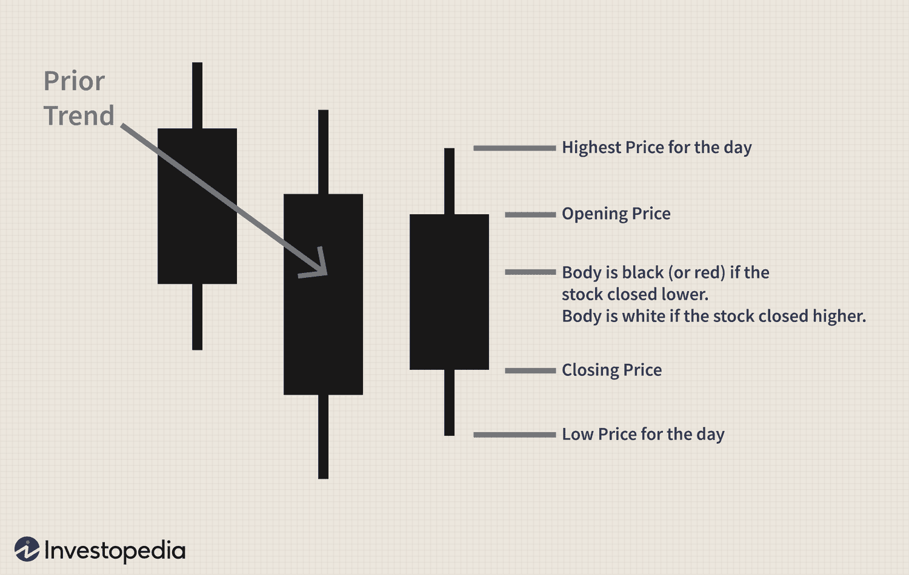

Candlestick patterns are a cornerstone of technical analysis, serving as a tool for traders to interpret market behavior by visualizing price movements over specified time frames. Originating from 18th century Japan for predicting rice prices, these patterns have become pivotal in modern trading strategies. They offer insights into potential future market movements by illustrating opening, closing, high, and low prices of financial instruments.

One such pattern, the bullish homing pigeon, stands out for its indication of a potential bullish reversal. This pattern emerges during a downtrend and consists of two candles: the first being a long, bearish candle followed by a smaller bearish candle contained within the prior candle's range. This visual tells traders that the selling pressure may be waning and a reversal could be imminent.



Understanding the bullish homing pigeon candlestick pattern is critical for algorithmic trading. Algorithmic trading, which leverages computer programs to execute trades based on various signals, heavily relies on technical patterns to make logical, data-driven trading decisions. The bullish homing pigeon pattern can be integrated into such a system to enhance predictive models and refine strategies, assisting traders in making timely entry decisions during downtrends.

The aim of this article is to understand the bullish homing pigeon pattern comprehensively and its applications in algorithmic trading systems. As algorithmic trading continues to evolve and dominate financial markets, accounting for over 60% of trading volumes in some exchanges, the integration of traditional patterns like the bullish homing pigeon into quantitative models is more relevant than ever. Such integration not only aids traders in optimizing their strategies but also keeps them adaptable and informed in a fast-paced market environment.

## Table of Contents

## Understanding Candlestick Patterns

Candlestick patterns, originating from the Japanese rice markets in the 18th century, have become integral to modern technical analysis. They were initially developed by Munehisa Homma, a rice trader, who within the Dojima Rice Market in Osaka, documented their effectiveness in capturing market sentiment and price movements. Today, these patterns aid traders and analysts in assessing and forecasting potential shifts in asset prices.

A candlestick represents a trading session's price movement and comprises four essential components: the open, close, high, and low prices. The rectangular body signifies the range between the opening and closing prices, while the wicks or shadows extend to the highest and lowest prices reached during the period. If the close is higher than the open, the candlestick is typically white or green, signaling a bullish session. Conversely, if the close is lower, the candlestick is black or red, indicating bearish sentiment.

Popular candlestick patterns fall into various categories, primarily based on their predictive implications. These include patterns like Doji, Hammer, and Engulfing, each bearing unique meanings. For instance, the Hammer is deemed a bullish reversal pattern, emerging at the end of a downtrend and indicating a potential increase in buying pressure.

The importance of candlestick patterns stems from their ability to distill complex market data into straightforward, visual cues. Traders and analysts utilize these patterns to identify trends and potential reversals, assisting in informed decision-making. By providing insights into the market sentiment, candlestick patterns enable market participants to gauge the strength of buyers or sellers, ultimately shaping their strategies in trading environments.

## What is a Bullish Homing Pigeon Pattern?

The bullish homing pigeon pattern is a relatively rare candlestick formation indicative of a potential bullish reversal. This pattern is generally viewed as a signal that the current downtrend may be losing [momentum](/wiki/momentum), providing a possible buying opportunity for traders. The pattern consists of two consecutive candlesticks within a declining market context.

### Detailed Description

A bullish homing pigeon pattern is composed of two bearish candlesticks. The first candlestick is long and bearish, reflecting strong selling pressure. The second candlestick is also bearish but exhibits a smaller body and is entirely engulfed by the body of the first candlestick. This formation suggests a reduction in selling pressure, potentially leading to a reversal.

### Visual Representation

To visualize the pattern, imagine a candlestick chart with the following characteristics:
- The first candle opens high and closes significantly lower, resulting in a long red body.
- The second candle opens within the body of the first candle and closes lower than it opens, yet the close is higher than the close of the first candle. This results in a smaller, engulfed red candle.

### Conditions for Formation

Several conditions are necessary for the formation of a bullish homing pigeon pattern:
1. **Downtrend Presence**: This pattern primarily occurs at the end of a downtrend or a bearish corrective phase.
2. **Two Consecutive Bearish Candles**: Both candlesticks must have bearish characteristics, with the latter being shorter and contained entirely within the first.
3. **Reduced Momentum**: The second candle's reduced size signifies a slowing of downward momentum, hinting at potential stabilization or reversal.

### Psychological Implications

The bullish homing pigeon pattern reflects a shift in market sentiment. Initially, strong bearish sentiment dominates, as evidenced by the first long candle. However, the smaller and engulfed second candle suggests that sellers are losing control, and buyers might start entering the market, preparing for a possible upward movement.

### Comparison with Other Bullish Reversal Patterns

Unlike more well-known bullish reversal patterns such as the bullish engulfing pattern or the morning star, the bullish homing pigeon is less pronounced in signaling a trend reversal. The bullish engulfing pattern is considered more robust because a bullish candle completely engulfs a preceding bearish candle, indicating a stronger shift in sentiment.

The morning star, another bullish reversal pattern, involves a three-candlestick formation and typically requires a specific sequence involving a smaller candle between a long bearish and a long bullish candle. In contrast, the bullish homing pigeon involves only two candles and lacks the strong bullish confirmation candle seen in some other patterns.

Understanding the nuances of the bullish homing pigeon pattern can assist traders in identifying potential reversal points in a market, facilitating better-informed trading decisions. This pattern should be used in conjunction with other technical analysis tools to verify validity and improve predictive accuracy.

## Technical Analysis of the Bullish Homing Pigeon

The bullish homing pigeon pattern is a unique two-candlestick formation that signals potential bullish reversals, particularly after a downtrend. Understanding the intricacies of this pattern can help traders make informed decisions in financial markets.

### Step-by-Step Analysis of the Bullish Homing Pigeon Pattern

1. **Pattern Structure**: The bullish homing pigeon consists of two specific candlesticks:
    - The first candlestick is typically a long bearish candle, indicating a strong selling momentum.
    - The second candlestick must be a smaller bearish candle that closes above the close of the first candle but within its body, signifying a deceleration of the selling pressure.

2. **Key Features**:
   - **Size and Color**: The first candle is larger and bearish (e.g., red or black), while the second is smaller but also bearish. 
   - **Placement**: The second candle must be contained within the body of the first candle. This is akin to an "inside day" where the range of the newer candle is within the previous day.

### Identification of the Pattern within Market Charts

To effectively identify the bullish homing pigeon pattern, traders examine historical price charts with a focus on candlestick patterns. The overlap of the second candle within the first one’s range indicates a potential reversal in bearish sentiment. Traders often employ financial charting software to highlight such formations and can enhance their analysis with Python scripts for pattern detection. A basic skeleton of such a script is:

```python
import pandas as pd

def find_bullish_homing_pigeon(data):
    for i in range(1, len(data)):
        first_candle = data.iloc[i-1]
        second_candle = data.iloc[i]
        if (first_candle['Close'] < first_candle['Open'] and 
            second_candle['Close'] < second_candle['Open'] and 
            second_candle['Close'] > first_candle['Close'] and 
            second_candle['Open'] < first_candle['Open'] and 
            second_candle['Low'] >= first_candle['Low'] and 
            second_candle['High'] <= first_candle['High']):
            print("Bullish homing pigeon pattern found on index", i)

# Example usage with a DataFrame `market_data` containing 'Open', 'High', 'Low', 'Close' columns
find_bullish_homing_pigeon(market_data)
```

### Key Indicators and Confirmation Signals

While the bullish homing pigeon itself is a suggestive pattern, confirmation through additional technical indicators is advised:
- **Volume Analysis**: A tapering volume with the formation of the pattern can reinforce the notion of selling exhaustion.
- **Momentum Indicators**: Tools like the Relative Strength Index (RSI) can offer additional context, especially in identifying oversold conditions.
- **Support Levels**: If the pattern forms near a historical support level, it may further affirm a reversal.

### Typical Market Scenarios

Bullish homing pigeon patterns predominantly appear in downtrends and serve as a potential precursor to a bullish reversal. These are more reliable in well-established downtrends when traders anticipate potential reversals, especially in scenarios demonstrating market fatigue.

### Case Studies or Historical Examples

Historical analysis showcases instances where the bullish homing pigeon anticipated significant upward price movements. An example could be examined from March 2020, around the COVID-19 driven market [volatility](/wiki/volatility-trading-strategies). In various equity indices, this pattern emerged following drastic sell-offs, soon followed by a reversal rally as market sentiment adjusted to global fiscal responses. Traders analyzing such patterns had an opportunity to capitalize on the ensuing price corrections.

Overall, the integrative examination of candlestick formations like the bullish homing pigeon in conjunction with other analytical tools can significantly enhance predictive accuracy and inform robust trading strategies.

## Integrating Bullish Homing Pigeon Pattern into Algorithmic Trading

Algorithmic trading has revolutionized the financial markets by utilizing predictive models and technical indicators to automate trading decisions. When integrating specific patterns like the bullish homing pigeon into trading algorithms, thorough understanding and analysis are imperative.

Indicators and predictive models are central to [algorithmic trading](/wiki/algorithmic-trading). They analyze historical data to forecast future price movements, providing traders with a systematic approach to capturing market opportunities. Automated systems rely heavily on the computational power to quickly analyze large datasets and execute trades based on predefined criteria, reducing emotional decision-making.

**Steps for Incorporating the Bullish Homing Pigeon Pattern:**

1. **Pattern Identification**: Algorithms need to be programmed to detect the specific conditions requisite for the bullish homing pigeon pattern—a two-candle formation signifying potential bullish reversal. This includes a bearish candlestick followed by a smaller bearish candle that is completely engulfed within the first, suggesting diminishing seller strength.

```python
def is_bullish_homing_pigeon(candlestick_series):
    # Check that series has at least two data points
    if len(candlestick_series) < 2:
        return False

    first_candle = candlestick_series[-2]
    second_candle = candlestick_series[-1]

    # Ensure both candles are bearish
    if first_candle['close'] >= first_candle['open'] or second_candle['close'] >= second_candle['open']:
        return False

    # Check that the second candle is engulfed within the first
    if second_candle['open'] > first_candle['open'] or second_candle['close'] < first_candle['close']:
        return False

    return True
```

2. **Integration into Algo Systems**: Incorporate this detection mechanism within the larger framework of an algorithmic trading system to scan multiple markets simultaneously.

3. **Signal Confirmation**: Before executing trades, confirm the pattern with other technical indicators like moving averages or RSI to validate the bullish reversal signal.

**Backtesting Strategies:**

Conducting backtests is crucial to evaluate the economic feasibility of the bullish homing pigeon pattern. This involves using historical market data to simulate how the algorithm would have performed in past trading conditions. Key metrics such as profitability ratio, win rate, and maximum drawdown are used to assess performance.

```python
from statsmodels.diagnostics import acorr_ljungbox

def backtest_strategy(data, lookback_period=20):
    signals = []
    for i in range(lookback_period, len(data)):
        if is_bullish_homing_pigeon(data[i - lookback_period:i]):
            signals.append({'date': data.index[i], 'signal': 'buy'})
    return signals

# Use Ljung-Box test for the randomness of buy signals
p_value_threshold = 0.05
serial_correlation = acorr_ljungbox([sig['signal'] == 'buy' for sig in signals], lags=[10], return_df=True)
```

**Challenges and Limitations:**

Candlestick patterns, while a valuable tool, often suffer from subjectivity and noise in high-frequency environments. Algorithms must be diligently crafted to filter out market noise and prevent overfitting, ensuring robust performance across various conditions.

- Noise Filtering: Implement statistical measures or machine learning techniques to filter out false signals.
- Market Conditions: Recognize that changing market dynamics may reduce the reliability of patterns.

**Best Practices for Live Trading:**

- **Continuous Monitoring**: Implement systems that monitor market conditions and tweak strategy parameters dynamically.
- **Risk Management**: Utilize stop-loss orders and position sizing to manage risk effectively.
- **Regular Review**: Conduct regular performance reviews and recalibrate models as necessary to align with shifting market conditions.

Integrating the bullish homing pigeon pattern into algorithmic trading can enhance decision-making and exploit market inefficiencies, provided that it is done with precision, backed by rigorous testing, and supported by complementary indicators.

## Advantages and Limitations

The bullish homing pigeon pattern offers several advantages when included in a trader's arsenal of strategies. Primarily, this pattern serves as a potential indicator of a bullish reversal, providing traders with early signals for entry into a long position. Recognizing such patterns can enhance a trader's ability to capitalize on price movements by facilitating timely and informed decision-making. This pattern can be especially valuable in volatile markets where rapid changes in price direction are common.

However, relying solely on candlestick patterns such as the bullish homing pigeon can present limitations. Candlestick patterns are inherently subjective and can sometimes produce false signals, given that they do not incorporate market fundamentals or quantifiable measures. As a result, traders using only these patterns might encounter challenges in consistently achieving favorable outcomes. It is pertinent to remember that while these patterns indicate potential market sentiment, they do not provide definitive forecasts of market movements.

To overcome the inherent limitations of candlestick patterns, traders can combine the bullish homing pigeon with other technical indicators. For example, integrating moving averages, Relative Strength Index (RSI), or Moving Average Convergence Divergence (MACD) provides additional layers of confirmation for potential trades. By adding these indicators, traders can improve the accuracy of their predictions and reduce the likelihood of false signals. Each of these indicators contributes a different perspective, such as momentum or trend direction, thus enhancing the decision-making process.

Addressing common misconceptions, it is important to understand that candlestick patterns do not always lead to significant price changes and should not be interpreted in isolation. Traders often misconstrue these patterns as definitive predictors, which can lead to misinformed trading decisions. Instead, they should be regarded as tools that depict potential market sentiment shifts, ideally used in conjunction with broader market analysis.

For traders looking to mitigate the risks associated with trading on candlestick patterns, diversification of strategies is key. Incorporating a variety of analytical approaches and maintaining adaptability in various market conditions can reduce exposure to the inherent risks of reliance on a single method. Additionally, rigorous [backtesting](/wiki/backtesting) and learning from historical data can offer insights into pattern reliability and assist in honing strategy accuracy. Continuous education and market research also play significant roles in refining trading expertise and improving outcomes. By understanding both the advantages and limitations of candlestick patterns, traders can better navigate the complexities of financial markets.

## Conclusion

The bullish homing pigeon pattern serves as a valuable insight into market sentiment and potential bullish reversals, characterized by the unique combination of two candlesticks where the second is a smaller body within a larger body of the first. This pattern signifies a possible halting of downward momentum, suggesting a period where buyers are gaining control, or at the very least, sellers are losing their grip. In trading, understanding such technical patterns allows traders to make more informed decisions, anticipating market shifts that might not be immediately obvious through other analyses.

Integrating traditional technical analysis techniques, like the bullish homing pigeon pattern, within algorithmic trading frameworks enhances the ability to automatically and rapidly interpret market data. Algorithmic trading benefits from incorporating these patterns by systematically identifying potential reversal signals that could be profited from in fast-moving markets. By blending traditional skillsets with cutting-edge technology, traders can achieve an improved edge, reacting strategically to market movements with the precision offered by computational models.

Continuous learning and adaptation are crucial for traders who aspire to succeed in the dynamic landscape of financial markets. As strategies and technologies evolve, so too should the approach of any competent trader. It is vital to remain open to new methods and data sources while also refining existing skills and strategies.

Continued research and development stand as pillars in the trading community. The constantly changing nature of global markets necessitates ongoing innovation, ensuring that traders have access to more refined tools and theories. Engaging with advanced resources and training opportunities is recommended for those aiming to deepen their comprehension of technical analysis and algorithmic trading. Expanding knowledge with high-quality resources helps traders build robust, adaptable strategies, ensuring they are well-prepared for both current and future market conditions.

## References & Further Reading

[1]: Nison, S. (1991). ["Japanese Candlestick Charting Techniques: A Contemporary Guide to the Ancient Investment Techniques of the Far East"](https://drive.google.com/file/d/0B_CADMk621uLNDEyZTEzZjYtMmZjOS00ZmUyLTlhYmYtN2E1YTViOWRiOTdi/view). New York Institute of Finance.

[2]: Siegel, J. (2002). ["Stocks for the Long Run: The Definitive Guide to Financial Market Returns & Long Term Investment Strategies"](https://archive.org/details/stocksforlongrun0000sieg_o4p9). McGraw-Hill Education.

[3]: Brown, S. J., & Jennings, R. H. (1989). ["On Technical Analysis"](https://academic.oup.com/rfs/article-abstract/2/4/527/1586060). Management Science, 35(8), 867-884.

[4]: Murphy, J. J. (1999). ["Technical Analysis of the Financial Markets: A Comprehensive Guide to Trading Methods and Applications"](https://archive.org/details/technicalanalysi0000murp). New York Institute of Finance.

[5]: Chan, E. P. (2008). ["Quantitative Trading: How to Build Your Own Algorithmic Trading Business"](https://github.com/ftvision/quant_trading_echan_book). Wiley.