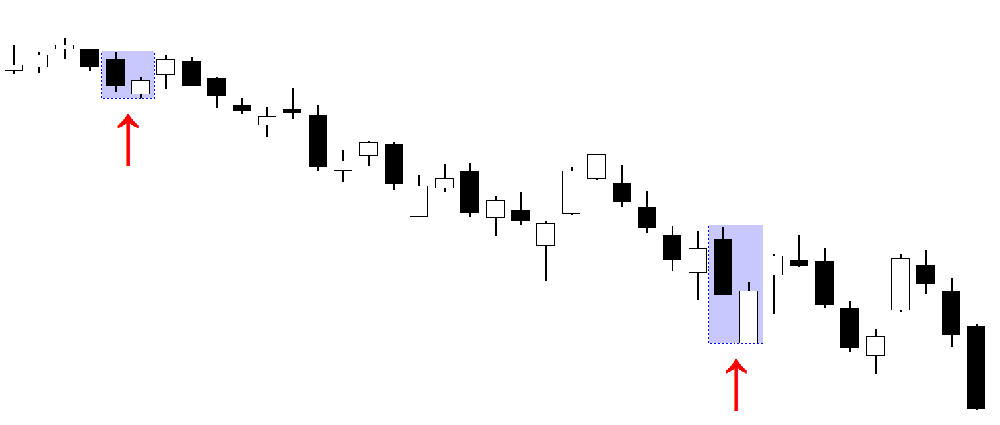

## Table of Contents

## What is a bullish thrusting candlestick pattern?

A bullish thrusting candlestick pattern is a two-candle formation that appears in a downtrend and suggests that the trend might be about to change to an uptrend. The first candle in this pattern is a long bearish candle, meaning its closing price is much lower than its opening price. This shows that sellers were in control during that period. The second candle is a bullish one, meaning it opens lower than the previous candle's close but closes higher. However, the close of the second candle does not go above the midpoint of the first candle's body. This is what makes it a thrusting pattern.

This pattern is called "thrusting" because the second candle thrusts into the body of the first candle but does not go beyond its midpoint. This can signal that buyers are starting to push back against the sellers, but they are not strong enough yet to reverse the trend completely. Traders watch for this pattern because it might mean that the downtrend is losing steam and a reversal could be coming soon. If the price starts to move up after this pattern, it could be a good time to buy.

## How does a bullish thrusting pattern form on a chart?

A bullish thrusting pattern forms on a chart when there are two candles in a row. The first candle is a long one where the price goes down a lot. It starts at a high price and ends at a much lower price. This shows that sellers were in control and the price was going down. The second candle starts at a lower price than where the first candle ended. But during that second candle, the price starts to go up. It goes up enough to get into the middle part of the first candle, but it doesn't go past the middle of the first candle's body. This means the buyers are trying to push the price up, but they are not strong enough to go all the way.

This pattern can be a sign that the price might start going up soon. It shows that even though the price was going down, the buyers are starting to fight back. If the price keeps going up after you see this pattern, it might be a good time to buy. But if the price keeps going down, the pattern might not mean much. So, it's important to watch what happens after the pattern forms to see if it's a good sign or not.

## What are the key components of a bullish thrusting pattern?

A bullish thrusting pattern has two main parts. The first part is a long bearish candle. This candle shows that the price went down a lot during that time. It starts at a high price and ends at a much lower price. This means that sellers were in control and the price was going down.

The second part is a bullish candle that comes right after the bearish one. This candle starts at a lower price than where the first candle ended. During this candle, the price starts to go up. It goes up enough to get into the middle part of the first candle, but it doesn't go past the middle of the first candle's body. This shows that buyers are trying to push the price up, but they are not strong enough to go all the way.

## Can you explain the psychology behind a bullish thrusting pattern?

The psychology behind a bullish thrusting pattern shows how buyers and sellers are fighting over the price. When you see the first long bearish candle, it means the sellers were really strong and they pushed the price down a lot. They were in control and made the price go down. This makes people who are watching the market think that the price will keep going down.

But then, the second candle starts to change things. It begins at a lower price than where the first candle ended, but during that time, the buyers start to push back. They make the price go up, but not all the way past the middle of the first candle. This shows that the buyers are starting to fight the sellers, but they are not strong enough to win completely yet. It's like they are trying to stop the price from going down more. If the price keeps going up after this pattern, it might mean the buyers are getting stronger and the price could start to go up for real.

## How reliable is the bullish thrusting pattern as a trading signal?

The bullish thrusting pattern can be a helpful sign for traders, but it's not always perfect. It tells us that after a big drop in price, buyers are starting to push back. This might mean the price could start going up soon. But, it's important to remember that this pattern doesn't always work. Sometimes, even after you see this pattern, the price might keep going down. So, it's a good idea to look at other signs and information before deciding to buy or sell.

Traders often use the bullish thrusting pattern along with other tools to make better choices. They might look at other patterns, charts, or news about the market to see if the pattern is a good sign this time. If other signs also say the price might go up, then the bullish thrusting pattern can be more useful. But if other signs say the price might keep going down, then this pattern might not be a good signal to follow. So, it's best to use it carefully and with other information.

## What are the differences between a bullish thrusting pattern and other bullish reversal patterns?

A bullish thrusting pattern is different from other bullish reversal patterns because it shows a specific way that buyers start to fight back against sellers. In a bullish thrusting pattern, after a big drop in price shown by a long bearish candle, the next candle starts lower but goes up into the middle of the first candle's body. This shows that buyers are trying to stop the price from falling more, but they are not strong enough to push the price past the middle of the first candle. Other bullish reversal patterns might show a stronger push from buyers. For example, a bullish engulfing pattern has a second candle that completely covers the first candle, showing a stronger reversal signal.

Another common bullish reversal pattern is the hammer, which has a small body and a long lower shadow. This pattern shows that the price dropped a lot during the candle but then came back up near the opening price, showing that buyers are fighting back strongly at the bottom. Unlike the thrusting pattern, the hammer doesn't need a previous bearish candle to form, and it can signal a reversal on its own. In contrast, the bullish thrusting pattern needs the bearish candle first to show the initial downward movement before the buyers start to push back. So, while all these patterns can signal a potential change in trend, the way they form and the strength of the reversal signal can be quite different.

## What markets and timeframes are best suited for trading the bullish thrusting pattern?

The bullish thrusting pattern can be used in many different markets, like stocks, [forex](/wiki/forex-system), and commodities. It works well in markets where there is a lot of trading and prices move up and down a lot. This pattern can be helpful in markets that have clear trends, so traders can see when the trend might change. It's important to look at how the market usually moves and if the pattern fits with what you see in that market.

For timeframes, the bullish thrusting pattern can be used on different charts, from short-term ones like 5-minute or 15-minute charts, to longer-term ones like daily or weekly charts. Shorter timeframes can be good for quick trades where you want to catch small changes in the price. Longer timeframes are better if you want to hold onto a trade for a longer time and see bigger changes in the price. It's a good idea to try out the pattern on different timeframes to see what works best for you and fits with your trading plan.

## How can a trader confirm a bullish thrusting pattern?

To confirm a bullish thrusting pattern, a trader should look at what happens after the pattern forms. They need to see if the price starts to go up after the second candle. If the price keeps going up, it can mean the pattern is a good sign and the trend might be changing. But if the price keeps going down, the pattern might not mean much. So, it's important to wait and see what the price does next before deciding to buy.

Traders can also use other tools to help confirm the pattern. They might look at other patterns or charts to see if they also say the price might go up. For example, if the price is close to a support level or if other indicators like the Relative Strength Index (RSI) are showing that the price might go up, it can make the bullish thrusting pattern more reliable. By using these extra signs, traders can feel more sure about their decision to follow the pattern.

## What are common entry and exit strategies when trading a bullish thrusting pattern?

When trading a bullish thrusting pattern, a common entry strategy is to wait for the price to go up after the second candle. You want to see the price move higher to confirm that the pattern is working. Once you see the price start to go up, you can buy. Some traders might wait for the price to go above the high of the second candle or even the high of the first candle to be more sure. This way, they can feel more confident that the trend is really changing and the price will keep going up.

For exiting a trade based on a bullish thrusting pattern, you need to think about when to sell to make a profit and when to sell to avoid losing too much money. To take profits, you might set a target price that is a certain distance above where you bought. This could be based on how the price has moved in the past or where you think it might go next. To avoid big losses, you can set a stop-loss order below the low of the second candle or even the low of the first candle. This way, if the price starts to go down instead of up, you can sell before you lose too much money. It's important to keep watching the price and be ready to change your plan if the market changes.

## Can you discuss any variations or modifications of the bullish thrusting pattern?

The bullish thrusting pattern can have some variations or modifications that traders might see. One variation could be a slightly longer second candle that goes a bit past the midpoint of the first candle's body. This doesn't change the pattern a lot, but it might make the signal a bit stronger. Another variation could be if there is a small gap down between the first and second candles. This gap shows that the price dropped a bit before the buyers started to push back, which can make the pattern more interesting to traders.

These variations can help traders understand more about what the market is doing. If the second candle goes a bit past the midpoint, it might mean the buyers are a bit stronger than usual. If there is a gap down before the second candle, it might mean the price dropped fast before the buyers stepped in. Traders need to think about these small changes when they are looking at the pattern. They can help decide if the pattern is a good sign to follow or if it might not work this time.

## What risk management techniques should be used when trading based on a bullish thrusting pattern?

When trading based on a bullish thrusting pattern, it's important to use good risk management techniques to protect your money. One key technique is setting a stop-loss order. This means you decide on a price below the low of the second candle or even the first candle where you will sell if the price goes down. This helps you avoid losing too much money if the pattern doesn't work and the price keeps going down. Another technique is to only risk a small part of your money on each trade. This way, even if you lose on a trade, you won't lose all your money.

Another important risk management technique is to use a take-profit order. This means you decide on a price above where you bought where you will sell to make a profit. This helps you lock in your gains if the price goes up like you hoped. It's also a good idea to keep watching the market and be ready to change your plan if things don't go as expected. By using these techniques, you can trade more safely and have a better chance of making money over time.

## How can technical indicators be combined with the bullish thrusting pattern to improve trading decisions?

Using technical indicators along with the bullish thrusting pattern can help traders make better decisions. One way to do this is by looking at the Relative Strength Index (RSI). If the RSI shows that the price is oversold, it means the price has gone down a lot and might be ready to go back up. If you see this along with a bullish thrusting pattern, it can make the pattern more reliable. Another useful indicator is the Moving Average Convergence Divergence (MACD). If the MACD line crosses above the signal line right after the bullish thrusting pattern, it can be a good sign that the price will keep going up.

Another way to use technical indicators is by looking at support and resistance levels. If the bullish thrusting pattern forms near a strong support level, it can mean that the price is less likely to go down more and more likely to start going up. This can make the pattern a stronger signal to buy. Also, using [volume](/wiki/volume-trading-strategy) indicators can help. If the volume goes up during the second candle of the bullish thrusting pattern, it shows that more people are buying, which can make the pattern more reliable. By combining these indicators with the bullish thrusting pattern, traders can feel more confident in their trading decisions.

## How can risk be managed in bullish thrusting trades?

Effective risk management is crucial to maintaining profitability when trading bullish thrusting patterns, as well as in broader financial strategies. Ensuring that trades are executed with appropriate risk parameters can protect capital and enhance long-term trading success. Here are key aspects of risk management that should be considered:

**Stop-Loss and Take-Profit Levels**

Stop-loss orders are essential tools for limiting downside risk. They automatically trigger a sell order when a security's price falls to a predetermined level, capping potential losses. Similarly, take-profit orders enable traders to lock in gains by executing a sell order when prices reach a set target. Consider a situation where a trader identifies a bullish thrusting pattern; a stop-loss might be placed just below the low of the thrusting pattern, while a take-profit target could be set at a resistance level or a specific risk/reward ratio (e.g., 1:2 or 1:3).

Python code for a basic stop-loss and take-profit mechanism might look like this:

```python
def manage_trade(entry_price, stop_loss_percent, take_profit_percent):
    stop_loss_price = entry_price * (1 - stop_loss_percent / 100)
    take_profit_price = entry_price * (1 + take_profit_percent / 100)
    return stop_loss_price, take_profit_price

entry_price = 100
stop_loss_percent = 5
take_profit_percent = 10
stop_loss, take_profit = manage_trade(entry_price, stop_loss_percent, take_profit_percent)
print(f"Stop Loss: {stop_loss}, Take Profit: {take_profit}")
```

**Position Sizing and Diversification**

Position sizing refers to determining the appropriate amount of capital to allocate to a particular trade. This can be calculated using the formula:

$$
\text{Position Size} = \frac{\text{Account Risk}}{\text{Risk per Trade}}
$$

Where account risk is the total capital a trader is willing to risk on a trade (typically a small percentage of the total account balance) and risk per trade is the amount potentially lost if the trade goes against the trader.

Diversification involves spreading investments across various assets to minimize exposure to any single market movement. By diversifying, the impact of an adverse event affecting one asset class can be mitigated by the performance of others.

**Automating Risk Management Tactics**

Algorithmic trading systems can be programmed to automatically enforce risk management strategies, ensuring trades are executed consistently and swiftly. This is especially beneficial in fast-moving markets where human reaction times may lag. An algorithm could monitor market prices and execute stop-loss or take-profit orders without manual intervention.

Here's an example in Python of using algorithms to track real-time prices and manage trades:

```python
import time
def check_prices(current_price, stop_loss, take_profit):
    if current_price <= stop_loss:
        return "Sell", stop_loss
    elif current_price >= take_profit:
        return "Sell", take_profit
    return "Hold", current_price

while market_open:
    current_price = get_current_market_price()
    action, price = check_prices(current_price, stop_loss, take_profit)
    if action == "Sell":
        execute_order(action, price)
    time.sleep(1)
```

**Monitoring and Adjusting Risk Parameters**

To prevent significant losses, it is crucial to continuously monitor trades and adjust risk parameters in response to market changes. Regularly reviewing trade outcomes, market conditions, and the performance of risk management strategies can provide insights into the effectiveness of these measures and identify areas for improvement.

By utilizing stop-loss and take-profit levels, ensuring sensible position sizing and diversification, and leveraging algorithmic automation, traders can improve their ability to manage risk while trading bullish thrusting patterns. Effective risk management ensures the longevity and profitability of their trading endeavors.

## References & Further Reading

[1]: Bulkowski, T. (2008). ["Encyclopedia of Candlestick Charts."](https://onlinelibrary.wiley.com/doi/book/10.1002/9781119202288) Wiley.

[2]: Nison, S. (1991). ["Japanese Candlestick Charting Techniques."](https://www.amazon.com/Japanese-Candlestick-Charting-Techniques-Second/dp/0735201811) New York Institute of Finance.

[3]: Lopez de Prado, M. (2018). ["Advances in Financial Machine Learning."](https://www.amazon.com/Advances-Financial-Machine-Learning-Marcos/dp/1119482089) Wiley.

[4]: Chan, E. (2009). ["Quantitative Trading: How to Build Your Own Algorithmic Trading Business."](https://github.com/ftvision/quant_trading_echan_book) Wiley.

[5]: Jansen, S. (2020). ["Machine Learning for Algorithmic Trading: Predictive models to extract signals from market and alternative data for systematic trading strategies with Python."](https://www.amazon.com/Machine-Learning-Algorithmic-Trading-alternative/dp/1839217715) Packt Publishing.