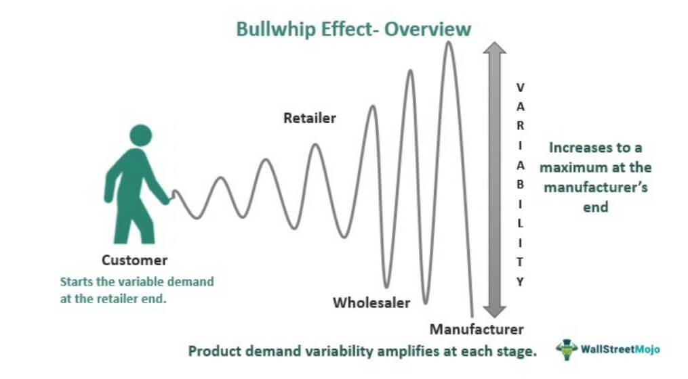

Supply chain management represents a cornerstone of today's global economy, facilitating the seamless movement of goods and services across borders and through various stages of production and distribution. It encompasses a series of complex processes, from sourcing materials to manufacturing and delivering products to consumers. Among the most pressing challenges within this field are demand forecasting, the bullwhip effect, and supply chain variability, each of which can significantly impact business efficiency and profitability.

Demand forecasting stands as a critical component, enabling companies to predict consumer demand accurately, thereby optimizing inventory levels and reducing costs. However, inaccuracies in forecasting can lead to either stockouts or excessive inventory, both of which can erode profit margins and customer satisfaction.

The bullwhip effect, characterized by demand signal distortion as orders travel up the supply chain, further complicates effective supply chain management. Even minor fluctuations in consumer demand can cause substantial variances in order volumes, leading to inefficiencies and increased costs. This phenomenon highlights the vital importance of communication and transparency throughout the supply network to minimize distortions.

Supply chain variability, which refers to unpredictable fluctuations in supply processes, can adversely affect supply chain performance and ultimately disrupt customer satisfaction. It results from several factors, including demand variability, supply disruptions, and inefficient processes, necessitating robust strategies to manage and mitigate its effects.

Amidst these challenges, algorithmic trading emerges as a modern solution that can substantially alleviate some of these issues. By employing advanced algorithms and data analytics, businesses can enhance the accuracy of demand forecasts, reduce the bullwhip effect, and manage supply chain variability more effectively. The integration of algorithmic methods not only facilitates faster and more informed decision-making but also promotes resilience and flexibility within the supply chain.

This article explores the interconnectedness of demand forecasting, the bullwhip effect, and supply chain variability, with a specific focus on how algorithmic trading can address these challenges. It examines how businesses can leverage technology to bolster supply chain resilience, ultimately driving competitive advantage in a rapidly evolving global market.

## Table of Contents

## Understanding Demand Forecasting

Demand forecasting is a critical component of supply chain management, involving the prediction of future product demand to optimize various operational processes, reduce costs, and improve customer satisfaction. Accurate demand forecasts enable businesses to efficiently manage inventory levels, ensure product availability, reduce holding costs, and enhance overall supply chain performance. 

Traditional demand forecasting methods often rely on historical sales data, judgmental approaches, or straightforward statistical techniques such as moving averages and exponential smoothing. These methods, while foundational, can be limited in their ability to account for complex, rapidly changing market conditions. Their reliance on historical data can often lead to inaccuracies, especially in dynamic industries or during unforeseen events such as economic shifts or global pandemics.

Modern data-driven approaches have transformed demand forecasting by leveraging vast amounts of data and advanced analytical techniques. Machine learning algorithms and big data analytics offer significant advantages by identifying complex patterns and relationships within data sets that traditional methods might miss. For instance, [machine learning](/wiki/machine-learning) models can incorporate various data types, such as social media trends, economic indicators, and weather patterns, thereby refining the forecast accuracy.

The impact of accurate demand forecasting on supply chain efficiency cannot be overstated. It minimizes the bullwhip effect, whereby small fluctuations in consumer demand lead to large variances in order quantities up the supply chain. Precise forecasts also facilitate just-in-time (JIT) inventory practices, reducing waste and storage costs while maintaining high service levels. 

Technology plays a crucial role in enhancing forecast accuracy by providing tools for real-time data collection and analysis. Advanced forecasting platforms integrate machine learning algorithms and predictive analytics to continually refine forecasts as new data becomes available. For example, Python libraries such as TensorFlow and scikit-learn offer robust frameworks for developing machine learning models for demand prediction.

Despite technological advancements, businesses still face challenges in achieving precise demand forecasts. Data quality and availability remain significant issues, as inaccurate or incomplete data can lead to misguided forecasts. Additionally, external factors such as unforeseen global events present uncertainties that can disrupt even the most sophisticated models. Unpredictable changes in consumer behavior, supply chain disruptions, and geopolitical events further complicate forecasting efforts.

To address these challenges, businesses are increasingly adopting integrated business planning processes that align demand forecasts with supply chain strategies, ensuring agility and responsiveness to changes. Advanced collaborative tools also foster better communication across departments, promoting a unified approach to demand planning and execution. 

In conclusion, as businesses navigate the complexities of modern supply chains, demand forecasting remains a pivotal element in achieving operational success, with technology and data analytics offering a path towards more accurate and adaptable models.

## The Bullwhip Effect in Supply Chains

The bullwhip effect refers to the phenomenon where small fluctuations in consumer demand at the retail level cause progressively larger fluctuations in demand at the wholesale, distributor, manufacturer, and raw material supplier levels. This effect highlights the challenges businesses face in maintaining supply chain stability and efficiency. The bullwhip effect is mainly caused by factors such as demand forecast updates, order batching, price fluctuations, and rationing or shortage gaming. Each of these factors contributes to demand information distortion as it moves upstream in the supply chain.

Historically, the bullwhip effect has significantly impacted businesses. A classic example is Procter & Gamble's supply chain for diapers during the late 1990s. Despite relatively stable consumer buying patterns, P&G observed huge fluctuations in orders placed by distributors and retailers. This led to inefficient production schedules and inventory management, driving up costs and reducing service levels. Similarly, Hewlett-Packard experienced wild swings in demand for its printers, prompting the company to reassess its supply chain strategies. These examples underline how seemingly minor changes in consumer behavior can lead to major disruptions in order quantity throughout the supply chain.

Mathematically, the bullwhip effect can be expressed using the variance of orders placed ($\sigma^2_o$) and the variance of demand ($\sigma^2_d$). The bullwhip ratio is defined as:
$$
\text{Bullwhip Ratio} = \frac{\sigma^2_o}{\sigma^2_d}
$$
A bullwhip ratio greater than one indicates that the variability in orders exceeds the variability in demand, confirming the presence of the effect.

To mitigate the bullwhip effect, businesses can adopt various strategies. These include implementing inventory management practices that emphasize smaller, more frequent replenishments to avoid big batch orders. Sharing real-time demand data with all supply chain partners can also alleviate distorted demand signals. Additionally, companies can work on stabilizing prices to reduce fluctuations caused by forward buying and gaming of rationing systems.

Effective communication and transparency are crucial to minimizing supply chain distortions. By sharing point-of-sale data, production schedules, and inventory levels, businesses can foster trust and alignment between different tiers of the supply chain. This communication reduces uncertainty and allows for better synchronization of operations.

By understanding and addressing the root causes of the bullwhip effect, companies can enhance supply chain agility and responsiveness, ultimately leading to more stable and cost-effective operations.

## Supply Chain Variability and Its Implications

Supply chain variability refers to fluctuations and unpredictability in different segments of the supply chain, affecting everything from raw material procurement to customer delivery. This variability arises due to several factors, including demand fluctuations, supply disruptions, and lead time variability. Understanding why supply chain variability occurs is essential for businesses striving to maintain efficient operations and high customer satisfaction.

Variability can significantly impact supply chain performance by introducing inefficiencies and increasing costs. When variability is high, it often leads to overstocking or stockouts, both of which can be costly for businesses. Overstocking ties up capital in unsold inventory, while stockouts can result in lost sales and damage to customer relationships. Consequently, variability must be managed to ensure smooth operations and meet customer expectations consistently.

Several factors contribute to increased variability in supply chains. Demand variability is a primary contributor; shifts in consumer preferences or unexpected demand spikes can catch companies off guard. Supply-side factors, such as supplier reliability and quality issues, also play a significant role. Additionally, lead time variability, where the time taken for goods to move through the supply chain fluctuates, can further complicate planning and forecasting efforts.

To manage and reduce supply chain variability, businesses can employ various techniques. One effective method is demand smoothing, involving strategies like promotions to influence demand patterns positively. Companies can also optimize inventory levels through just-in-time (JIT) practices to reduce the risk of overstocking. Collaborating closely with suppliers to improve reliability and implementing advanced tracking of goods to reduce lead time variability are other common tactics.

Flexibility and responsiveness are crucial in modern supply chain management. The ability to adapt quickly to changes helps businesses avoid disruptions and maintain service levels. This includes developing agile processes and investing in responsive information systems that allow for real-time adjustments. By focusing on these areas, companies can not only reduce variability but also create a competitive edge that enhances overall supply chain resilience.

## Algorithmic Trading in Addressing Supply Chain Challenges

Algorithmic trading, originally used in financial markets to execute orders at high speed and optimal price, is increasingly being applied to supply chain management. The core principles of [algorithmic trading](/wiki/algorithmic-trading) involve leveraging computer algorithms to automate decision-making processes based on predefined criteria and real-time data analysis. This capability is utilized effectively to address challenges such as demand forecasting, the bullwhip effect, and supply chain variability.

### Real-Time Solutions to Demand Forecasting

One of the major advantages of algorithmic trading is its capability to offer real-time solutions to demand forecasting in supply chains. Traditional demand forecasting often relies on historical data and can be slow to respond to market changes. In contrast, algorithmic systems can continuously process vast amounts of data, including sales figures, market trends, and even social media sentiment, to produce accurate, up-to-the-minute forecasts. 

By employing data analytics, machine learning, and [artificial intelligence](/wiki/ai-artificial-intelligence), these algorithms can identify patterns and predict demand with enhanced precision. This not only reduces the lag between demand changes and supply chain response but also helps in aligning production and inventory levels more closely with actual market needs.

### Reducing the Bullwhip Effect

The bullwhip effect, where small fluctuations in consumer demand can cause significant variations in upstream supply chain orders, often leads to inefficiencies such as overstocking or stockouts. Algorithmic trading can mitigate this effect by providing improved demand signal processing and enhanced information sharing across the supply chain. Techniques such as real-time inventory tracking and automated order adjustments allow for quicker reactions to true demand signals, reducing the amplitude of fluctuations.

For example, predictive modeling algorithms can simulate various demand scenarios and automatically adjust procurement and inventory policies. Such approaches lead to more stable ordering patterns and a damping of the oscillations that typify the bullwhip effect.

### Case Studies of Successful Algorithmic Interventions

Several companies have successfully integrated algorithmic strategies into their supply chain management, yielding significant benefits. A notable case is that of retail giants like Walmart or Amazon, which use algorithms to predict consumer preferences and optimize inventory across thousands of SKUs in real time. These systems allow for rapid adjustment to changes in sales velocity, helping maintain lean inventory levels while ensuring product availability.

In another example, Ford Motor Company has utilized algorithms for optimizing assembly lines and supplier coordination. By analyzing production schedules, inventory levels, and supplier performance data, algorithms can propose adjustments that keep the supply chain agile and responsive.

### Future Trends: Integration of AI and Machine Learning

The future of supply chain management rests heavily on the integration of advanced AI and machine learning technologies. These advancements promise even more considerable improvements in forecasting accuracy and supply chain efficiency. Machine learning models can be trained on diverse datasets to identify not just linear patterns but also complex, non-linear relationships affecting supply chain dynamics.

Moreover, adaptive algorithms that learn and evolve from new data inputs are expected to revolutionize supply chain decision-making. Such systems could autonomously adjust strategies in real-time, rapidly adapting to disruptions or opportunities without human intervention.

In conclusion, algorithmic trading provides a robust toolkit for addressing some of the core challenges in supply chains. As technology continues to evolve, its influence is set to expand further, offering businesses an opportunity to enhance resilience, efficiency, and responsiveness in their operations.

## Conclusion

In today's rapidly evolving global market, the nexus between demand forecasting, the bullwhip effect, and supply chain variability highlights the complexity and interconnectedness of modern supply chain management. Demand forecasting is fundamental as it allows businesses to anticipate consumer needs accurately, reducing errors in inventory management and ensuring product availability. However, inaccuracies in forecasting can precipitate the bullwhip effect, where small changes in consumer demand result in increasingly larger variances in supply chain orders, causing inefficiencies and increased costs. Supply chain variability further compounds these challenges by introducing uncertainties that can impact customer satisfaction and operational performance.

Algorithmic trading emerges as a pivotal solution in bolstering supply chain resilience. By harnessing the power of algorithms, businesses can process vast amounts of data in real-time, leading to more accurate forecasting and quicker response times. This not only mitigates the bullwhip effect by providing more reliable data to inform decision-making but also enhances the overall adaptability and efficiency of the supply chain. Algorithmic interventions have already demonstrated success in reducing the repercussions of demand fluctuations and supply chain disruptions.

The continuous advancement of technology presents unprecedented opportunities for businesses aiming to gain a competitive advantage. By integrating cutting-edge tools like artificial intelligence and machine learning into supply chain operations, companies can achieve superior predictive accuracy and operational agility. This evolution towards a digital supply chain ecosystem underscores the importance of embracing technological innovations to address traditional challenges.

As the supply chain landscape continues to shift, businesses are encouraged to explore innovative solutions that can convert challenges into opportunities for growth and improvement. The landscape of supply chain management is not static; it is an ever-evolving field that demands adaptation and forward-thinking strategies. By investing in and adopting such technologies, companies can ensure they remain competitive in an increasingly complex and dynamic global market environment.

## References & Further Reading

[1]: Lee, H. L., Padmanabhan, V., & Whang, S. (1997). ["The Bullwhip Effect in Supply Chains."](https://sloanreview.mit.edu/article/the-bullwhip-effect-in-supply-chains/) Management Science, 43(4), 546-558.

[2]: Chopra, S., & Meindl, P. (2016). ["Supply Chain Management: Strategy, Planning, and Operation."](https://books.google.com/books/about/Supply_Chain_Management_Strategy_Plannin.html?id=gPDQCQAAQBAJ) Pearson Education.

[3]: Cachon, G. P., & Fisher, M. (2000). ["Supply Chain Inventory Management and the Value of Shared Information."](https://www.jstor.org/stable/2661582) Management Science, 46(8), 1032-1048.

[4]: Silver, E. A., Pyke, D. F., & Peterson, R. (1998). ["Inventory Management and Production Planning and Scheduling."](https://www.researchgate.net/publication/229124356_Inventory_Management_and_Production_Scheduling) Wiley.

[5]: Chen, F., Drezner, Z., Ryan, J. K., & Simchi-Levi, D. (2000). ["Quantifying the Bullwhip Effect in a Simple Supply Chain: The Impact of Forecasting, Lead Times, and Information."](https://pubsonline.informs.org/doi/abs/10.1287/mnsc.46.3.436.12069) Management Science, 46(3), 436-443.