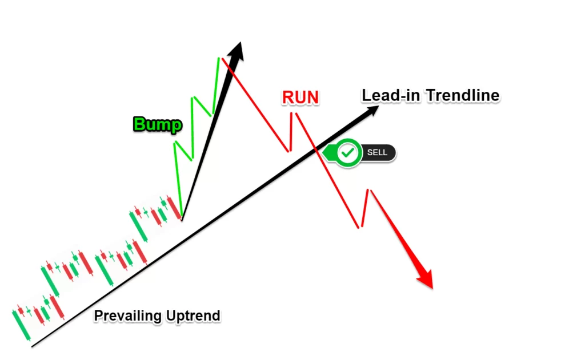

Algorithmic trading is a complex domain where precision, speed, and data-driven decisions are essential for success. As traders seek to enhance their strategies, recognizing chart patterns that predict market movements becomes increasingly important. One such pattern, the Bump and Run pattern, serves as an invaluable tool for identifying potential trend reversals. By understanding this pattern, traders can better position themselves to take advantage of market developments and refine their trading strategies for optimized outcomes.

The Bump and Run pattern provides a framework for traders to anticipate significant shifts in market dynamics. This pattern is instrumental in signaling possible trend reversals, making it a critical component of many trading strategies. Properly identifying and utilizing this pattern can lead to more informed trading decisions, potentially improving the profitability of trades.



As we examine the Bump and Run pattern, the formation of the pattern, its role in algorithmic trading, and its broader practical implications are discussed. We also touch upon statistical insights that underscore the importance of the Bump and Run pattern, offering traders a quantitative basis to leverage this tool effectively in their trading operations.

The objective is to provide a comprehensive understanding of the Bump and Run pattern, equipping traders with the knowledge to incorporate this pattern into their trading systems, thereby enhancing their ability to capitalize on market movements. By doing so, traders can aim to achieve a higher level of precision and effectiveness in algorithmic trading.

## Table of Contents

## What is the Bump and Run Pattern?

The Bump and Run pattern is a reversal chart pattern that was first introduced by Thomas Bulkowski. It is utilized by traders to identify potential trend reversals in financial markets. The appearance of the pattern is typically associated with a sharp upward or downward price movement followed by a reversal, often as a consequence of speculative excess.

The Bump and Run pattern progresses through three distinct phases:

1. **The Lead-in Phase**: During this initial stage, the asset's price follows a consistent trendline. The slope of this trendline is relatively moderate, reflecting a stable price movement underpinned by regular trading activity.

2. **The Bump Phase**: This phase is marked by a rapid price change, which steepens the trendline. Such abrupt price movements are frequently driven by heightened speculative activity. Traders observe a sharp upward or downward spike, which indicates a noticeable deviation from the steady trend established during the lead-in phase.

3. **The Run Phase**: The run phase represents the reversal process where the price action retraces and breaks through the original trendline established during the lead-in phase. This break is a critical signal of a trend reversal. It often indicates the exhaustion of the speculative excess seen in the Bump phase and the start of a new price direction.

Understanding each phase of the Bump and Run pattern is essential for traders aiming to anticipate potential market reversals and capitalize on these shifts. The identification of this pattern can provide valuable insights into possible future price movements, enabling traders to make informed decisions.

## Phases of the Bump and Run Pattern

The Bump and Run pattern is a technical chart formation that aids in predicting potential trend reversals in financial markets. Accurately identifying this pattern hinges on understanding its three key phases:

1. **The Lead-in Trend**: This initial phase sets the stage for the subsequent pattern development by establishing a consistent trendline marked by steady price movements and normal trading volumes. In this phase, the trendline should exhibit a gradual slope, reflecting stable trading conditions without significant price volatility. Technical analysts often use trendlines during this stage to gauge the general direction and momentum of the market, ensuring that the movements are neither too steep nor erratic.

2. **The Bump**: Characterized by a rapid price escalation or decline, the Bump phase is distinct due to the intensified speculative trading activity. This activity typically results in a sharp alteration of the trendline's slope. A hallmark of this phase is the substantial increase in trading volume, as investors rush to capitalize on the perceived market movement. The Bump phase often culminates in a peak or trough, creating a pronounced deviation from the established trendline of the Lead-in phase. This distinctive rapid movement is crucial for identifying the Bump and Run pattern, as it signifies the potential for trend exhaustion.

3. **The Run**: Following the dramatic price shift in the Bump phase, the Run phase signals the onset of a trend reversal. During this phase, the price retraces back towards the original trendline established in the Lead-in phase, ultimately breaking through it. This breakthrough is indicative of a shift in market sentiment and momentum, pointing towards a reversal from the previous trend direction. The Run phase is confirmed once the price decisively breaks the trendline and continues on a new path, often leading traders to anticipate further movement contrary to the Bump phase. This is the critical phase for traders to validate the completion of the Bump and Run pattern, offering potential trading opportunities.

Understanding these phases is essential for traders seeking to capitalize on the Bump and Run pattern, as it allows for timely identification and strategic decision-making in anticipation of market reversals.

## Application in Algorithmic Trading

Utilizing the Bump and Run pattern in [algorithmic trading](/wiki/algorithmic-trading) involves incorporating its recognition into automated systems. Traders employ pattern recognition software, which scans market data for distinct phases of the Bump and Run pattern to trigger buy or sell orders according to predefined conditions. This pattern's characteristic of indicating potential reversals makes it applicable in both bullish and bearish market contexts. In bullish scenarios, this would involve detecting the pattern to potentially short or sell an asset, while in bearish markets, traders might look for buying opportunities once the reversal is confirmed.

Integration into algorithmic trading necessitates the development of software that can effectively identify the Bump, characterized by a rapid price movement often on increased [volume](/wiki/volume-trading-strategy), and the Run, where a price retracement occurs, breaking the established trendline. The challenge is to reliably code these conditions. For instance, a simple pseudocode in Python for recognizing a Bump and Run pattern could involve calculating trendlines and detecting deviations using historical price data:

```python
def detect_bump_and_run(prices, volume):
    lead_in_trend = calculate_trend(prices[:lead_in_period])

    for i in range(lead_in_period, len(prices)):
        current_trend = calculate_trend(prices[i-lead_in_period:i])

        if volume[i] > threshold and is_steep_trend(current_trend, lead_in_trend):
            if breaks_trend(prices[i:], lead_in_trend):
                return "Bump and Run Detected"

    return "Pattern Not Detected"
```

Incorporating statistical analysis and [backtesting](/wiki/backtesting) is crucial for optimizing this pattern's use in trading algorithms. Backtesting allows traders to evaluate how the Bump and Run pattern would have performed historically by analyzing past market data. It can also aid in tweaking the parameters used for pattern recognition—such as the steepness of the bump or the volume threshold—based on historical success rates.

The application of the Bump and Run pattern in automated trading systems is enhanced by leveraging modern computational tools and statistical insights. This can include [machine learning](/wiki/machine-learning) approaches that refine pattern recognition and optimize trade execution strategies, aiming to maximize potential returns while minimizing the risk of false signals. By backtesting the pattern across diverse market conditions and asset classes, traders can refine their algorithms to be more responsive and adaptable to changing market dynamics.

## Statistical Insights and Backtesting

Despite the subjective nature of the Bump and Run pattern, statistical insights are crucial for evaluating its effectiveness in market situations. Thomas Bulkowski's extensive research offers valuable data that traders can utilize. In his study spanning 500 stocks, the reversal bottom pattern exhibited an average rise of 37%, while the top reversal pattern displayed an average decline of 24%. Both configurations had a false signal rate of approximately 19%.

These [statistics](/wiki/bayesian-statistics) serve as a guiding benchmark for traders aiming to harness this pattern's potential. The probability of success derived from historical analysis can significantly influence trading decisions, providing a quantitative perspective amidst the subjective elements of chart pattern identification.

Backtesting plays a pivotal role in refining the application of the Bump and Run pattern within trading strategies. By analyzing historical data, traders can assess the pattern's performance, tweak their algorithms, and set optimized triggers for buy or sell orders. A typical approach to backtesting might involve simulating trades based on historical price data whenever the pattern is recognized, evaluating the outcome in terms of profitability, risk, and drawdown.

Here is a simple Python pseudocode example illustrating a backtesting concept for the Bump and Run pattern:

```python
import pandas as pd

def detect_bump_and_run(data):
    # Placeholder for the pattern detection logic
    # Return signals for identified patterns
    return signals

def backtest_strategy(data, signals):
    initial_balance = 10000  # Starting with $10,000
    balance = initial_balance
    for index, signal in signals.iterrows():
        if signal['buy_signal']:
            # Execute buy logic
            balance -= data.loc[index, 'price']
        elif signal['sell_signal']:
            # Execute sell logic
            balance += data.loc[index, 'price']
    return balance

data = pd.read_csv('historical_stock_data.csv')
signals = detect_bump_and_run(data)
final_balance = backtest_strategy(data, signals)
print(f'Final balance after backtesting: {final_balance}')
```

This example highlights the basic framework for integrating the Bump and Run pattern into a backtesting environment, allowing for iterative refinement and aiming to improve trading outcomes based on historical performance insights.

## Challenges in Implementation

Implementing the Bump and Run pattern in a trading strategy is fraught with challenges due to its inherently subjective nature. The pattern’s identification relies heavily on visual recognition, making it difficult for traders to create algorithms that can reliably discern its conditions. Unlike more straightforward technical indicators, such as moving averages or volume oscillators, the Bump and Run pattern does not have a simple mathematical formula that algorithms can easily process. Instead, its recognition often requires qualitative judgment, which is not straightforward to encode into binary logic.

One of the main issues is the variability in visual interpretation among traders. What one trader may consider a legitimate Bump phase in the pattern, another might view differently based on the angle of price ascension or the volume spike. This variability complicates the coding process, as algorithms need precise criteria to function effectively. For instance, defining a "steep ascent" in price terms requires setting distinct parameters for price change percent and time period, which might vary depending on the asset or market conditions.

Furthermore, backtesting strategies for the Bump and Run pattern face significant obstacles. Since the pattern is hard to standardize, establishing a consistent set of rules for historical analysis becomes problematic. Backtesting requires a dependable definition to apply across sample data, ensuring that each pattern occurrence is measured under the same conditions. This is challenging for Bump and Run, where human judgment often determines whether a pattern is present. Programming languages, such as Python, might handle this complexity through machine learning models trained on historical data to identify the pattern. However, even with advanced models, the subjectivity introduces potential for misclassification and increased false signals.

Addressing these challenges requires a combination of advanced computational techniques and rigorous statistical validation. Machine learning models can help by analyzing vast amounts of data and determining probabilistic patterns, yet they still require a substantial set of labeled examples for training. Incorporating an ensemble of technical indicators might provide a more objective basis for pattern recognition, though this introduces further complexity into the trading algorithm.

Ultimately, the successful implementation of the Bump and Run pattern into an algorithmic trading system necessitates a careful blend of technical expertise, market understanding, and continual system optimization to manage the subjectivity and maintain robustness against diverse market scenarios.

## Conclusion

The Bump and Run pattern offers traders a strategic advantage by pinpointing potential reversal opportunities. Successful application in algorithmic trading requires overcoming several challenges, particularly in the accurate identification and automation of the pattern. Advanced technology plays a crucial role here, enabling the optimization of trading strategies by incorporating sophisticated pattern recognition algorithms. By integrating these technologies, traders can enhance their responsiveness and precision in executing trades based on the Bump and Run pattern.

Critical to this optimization process is the analysis of statistical insights and backtesting. These methodologies allow traders to evaluate the pattern's historical performance, measure the probability of success, and refine strategies accordingly. By employing backtesting, traders can simulate the effect of the Bump and Run pattern on various trading scenarios, effectively reducing the risk associated with false signals and improving decision-making.

Continuous adaptation and strategy refinement remain essential components of successful trading. As market dynamics shift, traders must stay vigilant, adjusting their criteria and algorithms to ensure alignment with current trends. By maintaining a proactive stance and incorporating technological advancements, traders can sustain a competitive edge, leveraging the Bump and Run pattern to its fullest potential.

## FAQs

Q: How do traders identify the Bump and Run pattern?  
A: Traders look for specific signals when identifying the Bump and Run pattern. Initially, they observe a rapid increase or decrease in price, which steepens the original trendline. This is the Bump phase, characterized by excessive speculative trading. Subsequently, traders watch for a break in the original trendline during the Run phase, which signifies a potential trend reversal. These elements form the basis for identification of the pattern.

Q: Can the Bump and Run pattern be automated in trading systems?  
A: Yes, automation of the Bump and Run pattern is feasible within trading systems. Algorithms can be designed to recognize the pattern by interpreting price movements and detecting significant trendline breaks. However, the challenge lies in the subjective nature of the pattern’s conditions, making reliable detection difficult. Advanced pattern recognition software and machine learning can improve accuracy, but disparity in data interpretation may still pose challenges.

Q: What is the significance of Bulkowski’s research for traders?  
A: Thomas Bulkowski's research provides valuable statistical insights crucial for traders analyzing the Bump and Run pattern. His study involving 500 stocks demonstrated that reversal bottom patterns led to an average rise of 37%, while top reversals resulted in an average decline of 24%. These statistics afford traders a quantifiable measure of the pattern’s effectiveness, aiding in risk assessment and strategy formulation. Additionally, Bulkowski noted a false signal rate of 19%, which highlights potential limitations that traders must consider.

## References & Further Reading

[1]: Bulkowski, T. (2005). ["Encyclopedia of Chart Patterns"](https://books.google.com/books/about/Encyclopedia_of_Chart_Patterns.html?id=tIwlEAAAQBAJ). Wiley.

[2]: Jansen, S. (2020). ["Machine Learning for Algorithmic Trading: Second Edition"](https://github.com/PacktPublishing/Machine-Learning-for-Algorithmic-Trading-Second-Edition). Packt Publishing.

[3]: Lopez de Prado, M. (2018). ["Advances in Financial Machine Learning"](https://www.amazon.com/Advances-Financial-Machine-Learning-Marcos/dp/1119482089). Wiley.

[4]: Aronson, D.R. (2007). ["Evidence-Based Technical Analysis: Applying the Scientific Method and Statistical Inference to Trading Signals"](https://www.amazon.com/Evidence-Based-Technical-Analysis-Scientific-Statistical/dp/0470008741). Wiley.

[5]: Chan, E.P. (2009). ["Quantitative Trading: How to Build Your Own Algorithmic Trading Business"](https://github.com/ftvision/quant_trading_echan_book). Wiley.