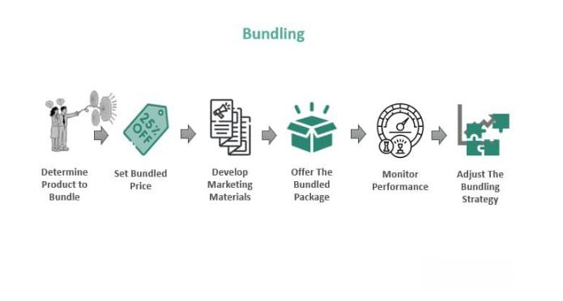

Marketing strategies are essential for businesses to maximize revenue and drive growth. Among these strategies, product bundling has become particularly effective across diverse industries. This approach involves selling a combination of products or services as a single package, often at a discounted price compared to purchasing each item separately. Product bundling not only encourages higher sales volumes but also enhances customer satisfaction by offering perceived value.

In addition to traditional bundling techniques, integrating modern technology like algorithmic trading presents new opportunities to refine these strategies. Algorithmic trading employs sophisticated mathematical models to analyze market data and execute trades at optimal moments. When combined with product bundling, this can offer businesses powerful insights into consumer behavior, allowing them to tailor their offerings more precisely.



This article will explore how product bundling, a strategy gaining traction, can be utilized alongside algorithmic trading to enhance overall business efficiency. Furthermore, the integration of algorithms, such as the Apriori algorithm, provides a method for uncovering hidden sales patterns and frequent itemsets, which can inform strategic bundling decisions. The Apriori algorithm works by identifying correlations between different products or services, making it a valuable tool for industries aiming to optimize their bundling strategies and achieve a competitive edge.

## Table of Contents

## Understanding Product Bundling as a Marketing Strategy

Product bundling is a marketing strategy that involves selling multiple products or services together at a discounted rate, compared to purchasing them separately. This approach serves multiple purposes, including increasing sales volume, clearing out excess inventory, and enhancing customer satisfaction by providing added value.

Two primary forms of product bundling can be identified: mixed bundling and pure bundling. Mixed bundling offers consumers the flexibility to purchase items either bundled or individually. In contrast, pure bundling requires the purchase of a combined package, with individual items not available separately.

The rationale behind product bundling is rooted in economic and psychological theories. Economically, bundling can lead to price discrimination where consumers with varying willingness to pay are captured under one pricing mechanism. Psychologically, the perception of receiving a deal can incentivize consumers to make a purchase they might not have considered otherwise.

A common occurrence of product bundling is seen within software packages where various applications are sold as a suite, offering consumers a more comprehensive solution at a reduced price. Similarly, telecom companies often provide service bundles including internet, television, and phone services in a single package, which can be more cost-effective than availing each service separately.

The effectiveness of product bundling relies significantly on understanding consumer preferences and behaviors. Analyzing trends and demands allows companies to create bundles that appeal to the targeted market segment, ultimately driving higher engagement and sales.

## Advantages of Product Bundling

Product bundling offers several advantages that can significantly enhance a business's performance and market position. By combining multiple products or services into a single package, companies can capitalize on established consumer behaviors and maximize revenue potential.

### Increased Average Order Value (AOV)
One primary benefit of product bundling is its ability to increase the Average Order Value (AOV). By presenting customers with packages that include multiple products or services at a reduced combined price compared to purchasing each item separately, businesses can incentivize larger purchases. For instance, if a customer is initially interested in buying one product, showing a bundle at a competitive price can encourage them to spend more than they originally planned. The mathematical representation behind calculating the increase in AOV with bundling could be simplified as:

$$
\text{AOV\_bundle} = \frac{\sum (\text{Bundle Sales Value})}{\text{Total Bundle Transactions}}
$$

This increase in AOV not only amplifies immediate revenue but also enhances long-term profitability by encouraging more substantial transactions.

### Improved Customer Retention
Product bundling can also lead to improved customer retention. Bundles can offer customers more personalized and value-driven choices, thereby enhancing the overall user experience. The more value a customer perceives they receive from a purchase, the more likely they are to return, fostering brand loyalty. By strategically designing bundles that meet consumer preferences and needs, businesses can increase repeat transactions and create a stable customer base.

### Efficient Inventory Management
Bundling can be an effective strategy for managing inventory, particularly when dealing with slow-moving or overstocked items. By including these items in bundles, businesses can clear out surplus stock more efficiently, reducing waste and storage costs. This helps maintain optimal inventory levels and reallocate resources toward more in-demand products. For example, combining newer, popular products with older stock can create attractive bundle options that expedite inventory turnover.

### Enhanced Competitive Edge
Creating well-conceived bundles allows businesses to differentiate themselves from competitors. Unique bundles with exclusive offers can make a brand stand out, attracting customers who are seeking greater value and variety. Bundling not only helps in capturing market share but also strengthens brand identity as consumers associate the brand with value and innovation. This competitive edge is vital in markets where product differentiation is minimal and price wars are common.

Overall, product bundling can serve as a strategic tool for enhancing business metrics such as sales growth, customer retention, and market positioning. By understanding and implementing effective bundling strategies, companies can unlock new avenues for growth and sustainable competitive advantage.

## Integrating Algorithmic Trading and Product Bundling

Algorithmic trading uses sophisticated mathematical models to execute trades at the most advantageous times, employing historical data patterns for strategic decision-making. In the context of product bundling, [algorithmic trading](/wiki/algorithmic-trading) principles can be harnessed to optimize sales strategies, allowing businesses to forecast consumer trends and preferences with greater accuracy.

Integrating algorithmic trading with product bundling involves leveraging predictive analytics to identify potential bundle offers that align closely with historical purchasing patterns. This can enhance marketing effectiveness and drive increased revenue. For example, by using algorithms like Apriori, which is designed to discover frequent itemsets, companies can ascertain products that are often purchased together and create attractive bundle deals that resonate with customer buying behavior.

The Apriori algorithm functions by identifying associations between various items. It uses the concept of support, which measures how frequently a set of items appears in a dataset, and confidence, which evaluates the likelihood of an item being purchased given that another item is purchased. The mathematical representation for support and confidence are as follows:

- **Support (A -> B)**: This is calculated as the proportion of transactions that contain the itemset A ∪ B. For a set of transactions T, support is given by:
$$
  \text{Support}(A \to B) = \frac{\text{Number of transactions containing both A and B}}{\text{Total number of transactions}}

$$

- **Confidence (A -> B)**: This is the likelihood that a transaction containing itemset A will also contain itemset B, given by:
$$
  \text{Confidence}(A \to B) = \frac{\text{Support}(A \cup B)}{\text{Support}(A)}

$$

Here is a basic Python implementation illustrating how Apriori can be used to discover frequent itemsets:

```python
from mlxtend.frequent_patterns import apriori, association_rules
import pandas as pd

# Example data
data = {'milk': [1, 0, 1, 1, 0],
        'bread': [1, 1, 1, 0, 0],
        'butter': [0, 1, 1, 1, 0],
        'jam': [0, 0, 1, 0, 1]}

# Data frame creation
df = pd.DataFrame(data)

# Applying the apriori algorithm
frequent_itemsets = apriori(df, min_support=0.2, use_colnames=True)

# Deriving the rules
rules = association_rules(frequent_itemsets, metric="confidence", min_threshold=0.5)

print(rules)
```

By using Apriori, businesses can strategically design bundles that not only appeal to existing purchasing habits but also encourage consumers to purchase more than they initially intended. This results in improved sales and a more efficient marketing strategy, as resources are focused on bundles that have a high potential for success based on empirical data. Moreover, integrating this approach with real-time data through algorithmic trading mechanisms enables businesses to adapt swiftly to changing market conditions, further enhancing their competitive edge.

## Case Studies and Examples

Many industries have effectively implemented product bundling strategies, resulting in increased sales and customer engagement. A prevalent example can be seen in technology companies, which often deploy software suites as bundled offerings. These bundles typically include combinations of applications, such as word processors, spreadsheets, and presentation software, collectively sold at a lower price point than purchasing each application individually. This approach not only drives the adoption of their entire product ecosystem but also locks consumers into long-term usage of their software, ultimately fostering customer loyalty.

Retailers frequently capitalize on seasonal bundle offers as a way to increase sales during specific periods. For instance, during holiday seasons, retailers may bundle related products, such as winter clothing items or festive decorations, enticing customers to purchase more through attractive discounts. This technique not only helps in boosting sales [volume](/wiki/volume-trading-strategy) but also aids in managing inventory effectively by clearing out stock tied to specific seasons.

A notable case study involves a beauty brand that reported a substantial 30% increase in sales by offering bundles of skincare products. By bundling complementary products such as cleansers, toners, and moisturizers, the brand was able to enhance the perceived value of its offerings. This strategy not only increased the average basket size for transactions but also improved the overall customer experience by providing a comprehensive skincare solution, fostering a more loyal customer base.

In the financial sector, bundling strategies have been employed by brokers who offer multiple investment services as a single package. This approach allows clients to access a diverse range of financial products, such as stock trading accounts, retirement planning, and wealth management services, under one comprehensive suite. Utilizing technology, brokers can analyze customer data to tailor these bundles to individual investor preferences and risk profiles, resulting in optimized offerings that meet varied client needs.

These examples illustrate the versatility and effectiveness of product bundling across industries, demonstrating how bundling not only enhances sales and customer satisfaction but also serves as a strategic tool for inventory management and market differentiation.

## Challenges and Considerations

Product bundling, while offering numerous advantages, also introduces several challenges that businesses must navigate effectively. One primary challenge is inventory management. When products are bundled together, it creates complexities in stock management, as retailers need to ensure that all components of the bundle are available. Shortages in one product can prevent the sale of the entire bundle, potentially leading to lost revenue. Thus, maintaining optimal inventory levels for each product in the bundle is crucial for smooth operations.

Operational complexities further arise from the need to carefully analyze product compatibility and customer preferences. Not all products naturally complement each other, and without alignment with consumer needs, the bundling strategy may fail to deliver the expected results. Businesses must employ data-driven approaches to understand customer purchasing patterns and preferences to craft appealing bundles. This often involves using advanced analytics or [machine learning](/wiki/machine-learning) algorithms to evaluate consumer data and identify bundles that are likely to succeed.

Another significant consideration is the need for continuous monitoring and adjustment of bundling strategies based on performance data. Markets and consumer preferences are dynamic, meaning that what works today might not be effective tomorrow. Businesses should implement mechanisms to track the performance of their bundles, analyzing sales data to determine popularity and profitability. This can be achieved through automated systems that provide real-time insights, allowing businesses to adapt their strategies promptly. 

In summary, while product bundling can enhance sales and improve customer satisfaction, it requires meticulous planning and execution. Ensuring that bundling strategies are well-crafted, data-informed, and adaptable to market changes will help businesses overcome these inherent challenges.

## Future of Product Bundling and Algorithm Integration

As technology progresses, product bundling strategies are anticipated to become increasingly sophisticated and data-driven, significantly benefiting from advancements in [artificial intelligence](/wiki/ai-artificial-intelligence) (AI) and machine learning. These technologies can analyze vast datasets to identify intricate patterns in consumer behavior, thereby enabling businesses to create personalized and highly effective bundling strategies. For example, AI can segment customers based on purchasing history and preferences, allowing companies to tailor bundles that appeal specifically to different customer groups.

AI algorithms, such as neural networks, can predict the likelihood of a consumer purchasing a certain bundle by analyzing past transaction data and individual purchasing behavior. Machine learning models can be trained on historical sales data to forecast which products are often bought together, optimizing the composition of product bundles. This results in bundles that not only meet customer needs more accurately but also enhance customer satisfaction and loyalty.

On the other hand, the integration of algorithmic trading with product bundling represents a burgeoning area of innovation within business strategies. Algorithmic trading, which employs mathematical models to determine optimal trading times based on historical data patterns, can significantly enhance the efficiency and effectiveness of product bundling strategies. By predicting market trends and customer preferences, businesses can optimize their bundling offers to maximize revenue.

The Apriori algorithm, commonly used within data mining, is capable of identifying frequent itemsets—combinations of products that often appear together in customer transactions. This information can be used to form effective product bundles that closely align with observed buying behavior. For instance, the Apriori algorithm can be implemented using Python as follows:

```python
from mlxtend.frequent_patterns import apriori, association_rules
import pandas as pd

# Sample transaction data
data = {'Product1': [1, 0, 1, 0, 1],
        'Product2': [1, 1, 0, 0, 1],
        'Product3': [0, 1, 1, 1, 0],
        'Product4': [0, 0, 1, 1, 0]}

df = pd.DataFrame(data)

# Apply Apriori
frequent_itemsets = apriori(df, min_support=0.6, use_colnames=True)
rules = association_rules(frequent_itemsets, metric="confidence", min_threshold=0.7)

print(rules)
```

This code demonstrates how the Apriori algorithm can be applied to transactional data to uncover potential product bundles based on customer purchasing patterns. By aligning product bundling with algorithmic trading capabilities, businesses can achieve a significant leap in strategic insights, thereby optimizing revenue streams and enhancing their operational robustness.

As these technologies continue to evolve, the fusion of AI, machine learning, and algorithmic trading with product bundling is poised to offer unprecedented insights and competitive advantages to businesses willing to leverage these advancements. This evolution will likely lead to more dynamic and responsive marketing strategies, where bundles are not only customized in real-time but also strategically priced to optimize profit margins while meeting consumer demand effectively.

## Conclusion

Product bundling remains a powerful strategy for businesses aiming to maximize sales and customer satisfaction. It offers a way to increase the average order value and improve customer loyalty by providing additional value to consumers. This strategy not only helps in inventory management but also in setting a brand apart from its competitors.

When bundling is combined with technologies like algorithmic trading, businesses can achieve significant competitive advantages. Algorithmic trading employs mathematical models to analyze historical data and predict trends or patterns, which can be leveraged to form optimal bundles that align with consumer behavior. The integration of these technologies can transform traditional bundling strategies, allowing businesses to forecast demand more accurately and customize offers that meet evolving consumer preferences.

As the market landscape continues to evolve, it is imperative for businesses to adapt and innovate. By tapping into big data, machine learning, and artificial intelligence, companies can gain deeper insights into consumer behavior, which can drive more sophisticated, efficient bundling strategies. These technologies enable the analysis of large data sets to uncover hidden patterns, improving decision-making and resource allocation. Such adaptability is crucial for maintaining a competitive edge as consumer expectations shift and markets become more dynamic. 

In conclusion, product bundling, especially when intertwined with advanced technologies like algorithmic trading, presents a lucrative opportunity for businesses to boost revenue and enhance customer satisfaction while staying ahead in a rapidly changing business environment.

## References & Further Reading

[1]: ["Product Bundling in Consumer Markets: Effects of Valuation, Investment, and Price Structures"](https://www.sciencedirect.com/science/article/pii/S016781169900004X) by Koen Pauwels and Scott A. Neslin, Journal of Forecasting.

[2]: Bapna, R., Jank, W., & Shmueli, G. (2004). ["Price Optimization in Electronic Retailing using Flexible Price Bundling."](https://www.sciencedirect.com/science/article/abs/pii/S0167923607001674) Marketing Science, 23(4), 683-684.

[3]: ["Machine Learning in Finance: From Theory to Practice"](https://link.springer.com/book/10.1007/978-3-030-41068-1) by Matthew F. Dixon, Igor Halperin, and Paul Bilokon.

[4]: Agrawal, R., & Srikant, R. (1994). ["Fast Algorithms for Mining Association Rules."](https://www.vldb.org/conf/1994/P487.PDF) Proceedings of the 20th VLDB Conference, Santiago, Chile.

[5]: ["Automated Trading with R: Quantitative Research and Platform Development"](https://link.springer.com/book/10.1007/978-1-4842-2178-5) by Chris Conlan.