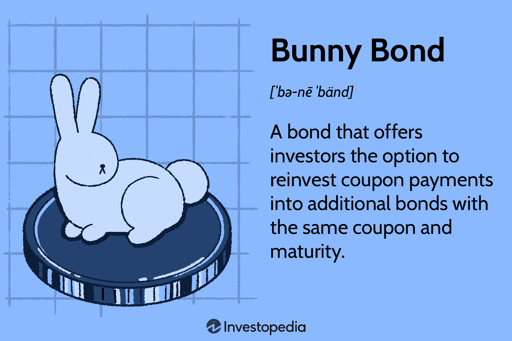

## Table of Contents

## What are Bunny Bonds?

Bunny Bonds are a fun way to help kids learn about numbers and how they can be broken down into smaller parts. They use bunnies to show how a number can be split into two smaller numbers that add up to the original number. For example, if you have the number 5, you can show it as a big bunny and then split it into two smaller bunnies, one with 2 and one with 3, because 2 + 3 = 5.

This method makes learning math more interesting for young children. By using bunnies, kids can see and understand that numbers can be made up of different pairs. This helps them learn addition and subtraction more easily. It's like playing a game while learning important math skills.

## How do Bunny Bonds work?

Bunny Bonds help kids learn math by showing numbers as bunnies. Imagine you have a big bunny that stands for the number 5. You can split this big bunny into two smaller bunnies. One small bunny can be 2, and the other can be 3. When you put these two small bunnies together, they make the big bunny again because 2 + 3 equals 5. This way, kids see that numbers can be broken into smaller parts and put back together.

Using bunnies makes learning fun and easy. Kids can play with the bunnies and see how different pairs of numbers add up to the same big number. For example, the number 6 can be shown as a big bunny and split into a bunny of 4 and a bunny of 2, or a bunny of 5 and a bunny of 1. By playing with these bunnies, kids learn that there are many ways to make a number, which helps them understand addition and subtraction better.

## What is the history behind Bunny Bonds?

Bunny Bonds were created to make learning math fun for kids. A teacher named Emma thought of the idea a few years ago. She wanted to help her students understand numbers better. Emma used bunnies because kids love animals, and it makes learning more exciting. She started using Bunny Bonds in her classroom and saw that her students were learning math more easily and enjoying it too.

Since then, more teachers have started using Bunny Bonds. They found that it helps kids see numbers in a new way. By breaking numbers into smaller parts with bunnies, kids can learn addition and subtraction without feeling bored. Bunny Bonds have become a popular way to teach math because they make learning feel like playing a game.

## Who can invest in Bunny Bonds?

Bunny Bonds are not real financial investments. They are a fun way to teach kids about math using bunnies. So, no one can actually invest money in Bunny Bonds. They are just a tool for learning, not something you can buy or sell.

If you are looking for a way to help kids learn math, Bunny Bonds can be a great choice. Teachers and parents can use them to make learning fun. Kids enjoy playing with the bunnies and seeing how numbers work, which helps them understand math better.

## What are the benefits of investing in Bunny Bonds?

Bunny Bonds are not real investments, so you can't put money into them. They are a fun way to help kids learn math. Instead of investing money, teachers and parents can use Bunny Bonds to make learning fun. Kids enjoy playing with the bunnies and seeing how numbers can be split and put back together. This helps them understand math better without feeling bored.

Using Bunny Bonds can make a big difference in how kids learn. When kids see numbers as bunnies, they find it easier to understand addition and subtraction. They can play with the bunnies and see different ways to make a number. This makes learning feel like a game, which helps kids stay interested and learn more quickly.

## What are the risks associated with Bunny Bonds?

Bunny Bonds are not real investments, so there are no financial risks like losing money. They are just a fun way to teach kids math. But, if you use Bunny Bonds to teach, there might be some small risks. For example, if kids only learn with bunnies, they might not understand numbers without them. It's important to use Bunny Bonds along with other ways of teaching math.

Also, some kids might find Bunny Bonds confusing if they don't like bunnies or if the idea is too new for them. Teachers and parents need to watch and see if Bunny Bonds are helping or making things harder. If kids get too used to seeing numbers as bunnies, they might have trouble when they see numbers in other ways. So, it's good to mix Bunny Bonds with other math activities to help kids learn in different ways.

## How are Bunny Bonds different from traditional bonds?

Bunny Bonds are not like traditional bonds at all. Traditional bonds are a way for people to invest money. When you buy a traditional bond, you give money to a company or government, and they promise to pay you back with interest after a certain time. Bunny Bonds, on the other hand, are not something you can buy or invest in. They are just a fun way to teach kids about numbers using bunnies.

Bunny Bonds help kids learn math by showing numbers as bunnies that can be split into smaller parts. For example, a big bunny can be split into two smaller bunnies to show how numbers can be added or subtracted. Traditional bonds don't have anything to do with teaching math or using bunnies. They are all about money and investments, and they don't involve any fun or games. So, Bunny Bonds and traditional bonds are very different things.

## What is the typical yield of Bunny Bonds?

Bunny Bonds don't have a typical yield because they are not real investments. They are just a fun way to help kids learn math. You can't buy Bunny Bonds or get money back from them like you can with real bonds. So, there's no money to be made from Bunny Bonds.

Instead of thinking about yield, Bunny Bonds are about helping kids understand numbers better. When kids play with the bunnies and see how numbers can be split and put back together, they learn addition and subtraction in a fun way. This makes learning math easier and more enjoyable for them.

## How can one purchase Bunny Bonds?

You can't buy Bunny Bonds because they are not real investments. They are just a fun way to help kids learn math. Bunny Bonds use bunnies to show how numbers can be split into smaller parts. This helps kids understand addition and subtraction better.

Instead of buying Bunny Bonds, teachers and parents can use them to make learning fun. They can draw bunnies or use toys to show kids how numbers work. This makes math feel like a game, which helps kids stay interested and learn more easily.

## What are the tax implications of investing in Bunny Bonds?

Bunny Bonds are not real investments, so there are no tax implications. You can't buy Bunny Bonds or make money from them. They are just a fun way to help kids learn math using bunnies.

When kids play with Bunny Bonds, they see numbers as bunnies that can be split into smaller parts. This helps them understand addition and subtraction better. Since Bunny Bonds are not about money, there's nothing to report on your taxes.

## How do Bunny Bonds contribute to environmental conservation?

Bunny Bonds do not directly contribute to environmental conservation. They are not real investments or products that you can buy. Bunny Bonds are just a fun way to help kids learn math. They use bunnies to show how numbers can be split into smaller parts, which helps kids understand addition and subtraction better.

Since Bunny Bonds are not about money or real products, they don't have any impact on the environment. They are a teaching tool used in classrooms or at home to make learning fun. If you want to help the environment, you would need to look at other ways, like recycling or using less energy.

## What advanced strategies can be used to optimize returns from Bunny Bonds?

Bunny Bonds are not real investments, so there are no strategies to optimize returns from them. They are just a fun way to help kids learn math. You can't buy Bunny Bonds or make money from them. They use bunnies to show how numbers can be split into smaller parts, which helps kids understand addition and subtraction better.

If you want to help kids learn math better with Bunny Bonds, you can use them in different fun ways. For example, you can make up games where kids split and combine bunnies to practice math. You can also use different colors or sizes of bunnies to make learning more interesting. But remember, Bunny Bonds are just for learning, not for making money.

## What are Bunny Bonds and how do they work?

Bunny bonds offer a unique feature in the bond market by allowing investors to reinvest their coupon payments into additional bonds of the same issuer. This characteristic distinguishes them from traditional bonds, where coupon payments are typically received as cash. By providing the option to reinvest these periodic payments, bunny bonds effectively address reinvestment risk—a significant concern for bondholders, especially in fluctuating [interest rate](/wiki/interest-rate-trading-strategies) environments.

Reinvestment risk occurs when an investor receives coupon payments or principal repayments at maturity and must reinvest these funds in another bond or financial instrument. If interest rates decline, the investor may face a lower return on these reinvested funds. Bunny bonds mitigate this risk by automatically channeling the coupon payments into additional bonds, thus maintaining the initial yield structure. The ability to reinvest coupons without having to manually purchase additional bonds can help ensure consistent income and a stable investment strategy.

For investors seeking to compound their investments over time, bunny bonds present a compelling opportunity. By continually purchasing additional bonds with coupon payments, investors can potentially enhance their overall returns. This compounding effect is akin to the benefits experienced through dividend reinvestment plans in equity markets, where reinvesting dividends allows for the purchase of more shares, thereby increasing potential gains.

Mathematically, the compounding effect of bunny bonds can be expressed similarly to a compound interest formula, where the future value (FV) of an investment is given by:

$$
FV = P(1 + r/n)^{nt}
$$

In this context:
- $P$ is the principal amount (initial investment in bunny bonds),
- $r$ is the annual coupon rate,
- $n$ is the number of times the coupon is reinvested per year,
- $t$ is the number of years the investment is held.

The automatic reinvestment of coupons in bunny bonds reflects the value of $n$ being equal to the frequency of coupon payments, which typically is semi-annual or annual in bond markets.

Overall, the strategic advantage of bunny bonds lies in their ability to simplify the reinvestment process and compound returns, making them an attractive option for investors focusing on long-term growth in their bond portfolios.

## What is the Role of Reinvestment in Bond Strategies?

Reinvestment is a critical aspect of bond strategies that helps investors enhance the performance of their portfolios. By choosing to reinvest coupon payments, investors can effectively increase their yield and improve the overall success of their investments over time. This strategy works by taking the periodic interest payments from a bond, known as coupons, and using them to purchase additional bonds or similar securities. Consequently, the investor earns interest on the original investment and the reinvested amounts, leading to a compounding effect that can significantly boost returns without needing additional initial capital.

Bunny bonds are particularly designed to support reinvestment strategies, as they allow investors to automatically reinvest their coupon payments into new bonds. This feature minimizes the reinvestment risk—the uncertainty associated with finding new opportunities to invest coupon payments at an equivalent or better rate of return. By reinvesting automatically through bunny bonds, there is less worry about interest rate fluctuations impacting reinvestment returns since the acquired bonds typically match the original bond's terms and conditions.

In practice, reinvestment can be understood through the formula for compound interest:

$$
A = P \left(1 + \frac{r}{n}\right)^{nt}
$$

where:
- $A$ is the amount of money accumulated after n years, including interest.
- $P$ is the principal amount (initial investment).
- $r$ is the annual interest rate (decimal).
- $n$ is the number of times that interest is compounded per year.
- $t$ is the time the money is invested for in years.

Bunny bonds simplify the reinvestment process by ensuring that coupon payments are consistently and automatically reinvested, aligning with an investor's long-term strategy for compounding growth. This makes them an attractive choice for those committed to maximizing their investment's potential over time while mitigating the complexities associated with manual reinvestment decision-making.

## References & Further Reading

[1]: Chaumont, Z. (2021). ["How Bunny Bonds Work in Fixed Income Markets."](https://www.sifma.org/resources/research/statistics/us-fixed-income-securities-statistics/) Investopedia.

[2]: Choudhury, R. (2022). ["Algorithmic Trading in the Bond Market."](https://www.sciencedirect.com/science/article/pii/S0957417422006479) CFA Institute.

[3]: ["Fixed Income Securities: Tools for Today's Markets"](https://www.amazon.com/Fixed-Income-Securities-Markets-Finance/dp/1119835550) by Bruce Tuckman and Angel Serrat

[4]: Treynor, J. L. (2018). ["Reinvestment Risk and Coupon Bond Yields."](https://fastercapital.com/content/Bond-Reinvestment-Risk--Mitigating-Bond-Reinvestment-Risk-in-a-Rising-Rate-Environment.html) Financial Analysts Journal, Vol. 66, No. 4.

[5]: ["Quantitative Trading: How to Build Your Own Algorithmic Trading Business"](https://www.amazon.com/Quantitative-Trading-Build-Algorithmic-Business/dp/1119800064) by Ernest P. Chan

[6]: Satchell, S., & Scowcroft, A. (2000). ["Forecasting Non-linear Time Series in Financial Markets: A Comparative Study of Algorithmic and Non-algorithmic Approaches."](http://www.knowcat.cn/p/20241219/2199130.html) Journal of Analytics in Finance.

[7]: ["Handbook of Fixed-Income Securities"](https://www.amazon.com/Handbook-Fixed-Income-Securities-Ninth/dp/1260473899) by Frank J. Fabozzi

[8]: Farmer, J. D., & Skouras, S. (2013). ["Developments in Quantitative Finance: Trading Strategies."](https://www.tandfonline.com/doi/full/10.1080/14697688.2012.757636) Quantitative Finance.