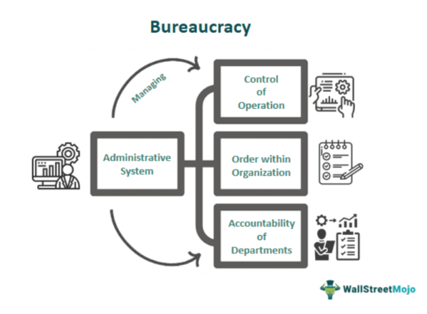

In today’s fast-paced and dynamic business environment, understanding organizational structures is crucial. Bureaucracies, with their multilayered systems and processes, play a significant role in large entities and government agencies. These structures are designed to provide uniformity and control, ensuring that operations are managed systematically. Within this context, algorithmic trading emerges as a modern trading mechanism that leverages automation technologies to execute trades with precision and speed. 

The relationship between bureaucratic systems and algorithmic trading is complex. Bureaucracies, known for their meticulous adherence to established processes, must adapt to incorporate the rapid advancements of algorithmic trading. By examining bureaucratic structures, their effect on operational efficiency, and their influence on algorithmic trading, we can gain valuable insights into the support or disruption that such systems can present to technological advancements in the financial sector.



How bureaucracy impacts algorithmic trading and vice-versa reveals important lessons about the evolving nature of organizational structures. The challenge lies in bridging the traditional strengths of bureaucratic systems with the demands of an innovative and fast-moving trading landscape. Through this analysis, it becomes evident how these systems interact and the implications of their convergence, paving the way for an understanding that can guide future developments in both areas.

## Table of Contents

## Understanding Bureaucratic Organizational Structures

Bureaucracy refers to the administration of complex organizations characterized by multilayered systems aimed at ensuring uniformity and control. This concept notably traces its origins to the sociological theories of Max Weber, who identified key characteristics of bureaucracies. Weber's model underscores a structured hierarchy that delineates authority and responsibility within an organization, ensuring each member knows their role and the flow of command is clear. Formal rules are established to maintain consistency and predictability in operations, a critical component that helps in managing extensive entities where procedural accuracy is paramount.

In addition to hierarchy and rules, Weber's framework highlights the specialization of labor. Each division or department within a bureaucratic organization has specific functions and expertise, allowing for division of labor that theoretically enhances efficiency and productivity. Recruitment within these structures is based on merit and technical expertise, offering a systematized mode of hiring that emphasizes qualifications and competence.

Despite the apparent benefits offered by bureaucratic systems in managing large-scale operations, such structures are frequently critiqued for their rigidity. The layered arrangement and strict adherence to established protocols can slow down decision-making processes, making it difficult for organizations to adapt swiftly to change. This inflexibility is a significant challenge in today's fast-evolving business environments, where innovation and rapid adaptability are crucial for sustained competitiveness.

Moreover, strict bureaucratic frameworks can sometimes stifle creativity and innovation. When employees are bound by rigid procedures and hierarchical oversight, their capacity to think outside the box and propose novel solutions is often limited. Nevertheless, bureaucracies remain an integral part of organizational governance, particularly in areas where adherence to specific standards and legal requirements is critical. This systematized approach ensures procedural correctness and facilitates accountability within complex organizational structures.

## Impacts of Bureaucracy on Efficiency and Innovation

Bureaucratic systems are crucial in maintaining efficiency within organizations by enforcing consistency and order through standardized processes. These systems ensure that tasks are executed systematically, thereby minimizing errors and maintaining a predictable operational environment. The hierarchical structure inherent in bureaucracies can facilitate clear lines of communication and accountability, allowing for well-defined roles and responsibilities. This clarity can often lead to improved productivity, as each member of the organization understands their specific functions and the expectations placed upon them.

However, the same characteristics that enable bureaucracies to enhance efficiency can also present significant obstacles to innovation and flexibility. The rigid nature of bureaucratic systems often gives rise to what is colloquially known as 'red tape'—a multitude of regulations and procedures that can slow down decision-making and stifle creativity. As a result, organizations may find it challenging to swiftly adapt to changing market conditions or integrate new technologies effectively. This rigidity can be a significant barrier to maintaining a competitive edge in fast-paced industries.

To address these challenges, modern businesses need to optimize bureaucratic structures by balancing their traditional strengths with contemporary demands for agility and innovation. One approach involves refining internal processes to reduce unnecessary complexity while maintaining necessary standards and procedures. This reduction in complexity can be achieved through the implementation of streamlined workflows and the adoption of technologies that automate routine tasks, freeing up human resources for more strategic and creative endeavors.

Furthermore, fostering a culture of innovation within a bureaucratic framework requires encouraging open communication and collaboration across all levels of the organization. Encouraging employee feedback and participatory decision-making can help break down the barriers to innovation typically associated with strict hierarchical systems. Additionally, investing in training and development programs that emphasize creative thinking and problem-solving can equip employees with the skills necessary to navigate and improve bureaucratic processes.

Technological advancements also hold significant potential for transforming bureaucratic systems into more dynamic and adaptable frameworks. Implementing data analytics and decision-support tools can facilitate faster, evidence-based decision-making, allowing organizations to respond more effectively to external changes. By leveraging digital communication platforms, businesses can enhance information flow and collaboration, thereby increasing organizational agility.

In conclusion, while bureaucratic systems play a vital role in ensuring efficiency through standardization, they can hinder innovation if not managed thoughtfully. Modern businesses must integrate strategies that account for both the advantages of structured processes and the necessity for agility and innovation to remain competitive in today's dynamic market environments.

## Algorithmic Trading within Bureaucratic Frameworks

Algorithmic trading, commonly known as algo trading, is characterized by rapid decision-making and execution of trades via computerized systems. This modern trading mechanism often clashes with the procedural and methodical pace emblematic of bureaucratic frameworks. The essential challenge lies in integrating the need for speed inherent in [algorithmic trading](/wiki/algorithmic-trading) with the meticulous processes and regulatory compliance required by bureaucratic systems.

Incorporating algorithmic trading within such a framework demands a delicate balance between operational efficiency and adherence to regulatory requirements. The inclusion of regulatory oversight in bureaucratic systems can influence key aspects of algorithmic trading, from ethical considerations to risk management. For instance, ensuring compliance with laws like the European Union's Markets in Financial Instruments Directive (MiFID II) becomes crucial. MiFID II emphasizes investor protection and increased transparency in financial markets and is one example of how bureaucratic systems attempt to regulate the high-speed domain of algo trading.

Bureaucratic oversight can also play a pivotal role in addressing ethical concerns and managing the risks associated with algorithmic trading. Unanticipated rapid market movements and flash crashes are potential risks, which necessitate stringent control measures. Governing bodies may implement specific circuit breakers and other protective mechanisms to mitigate these risks and ensure market stability. The ethical implications of automated decision-making further underline the need for oversight, as programmed biases or errors in algorithms can have significant financial repercussions.

To align the demands of algorithmic trading with bureaucratic structures, organizations might explore innovative operational models. This includes enhanced technological integration to foster a more agile and responsive environment. The adoption of advanced data analytics, [machine learning](/wiki/machine-learning), and AI technologies can help bureaucratic institutions become more adaptable without sacrificing regulatory compliance. For instance, employing blockchain technology may streamline transaction approvals while maintaining robust audit trails for regulatory purposes.

In conclusion, the intersection of algorithmic trading and bureaucratic frameworks calls for a strategic approach that marries the dynamic nature of technology with the structured mechanisms of bureaucracy. By leveraging innovative technologies and re-evaluating existing processes, organizations can create a balanced operational framework that harnesses the potential of algorithmic trading while upholding the integrity and regulatory standards of bureaucratic systems.

## Optimizing Bureaucracies for Modern Business Needs

Modernizing bureaucracies to meet the evolving needs of contemporary businesses involves the strategic integration of technological innovations and organizational frameworks that promote flexibility and engagement. Central to this endeavor is the incorporation of feedback systems that enable continuous improvement and responsiveness to internal and external changes. By implementing robust feedback mechanisms, organizations can systematically gather insights from employees and stakeholders, thereby enhancing decision-making processes and identifying areas for improvement.

Refining communication technologies stands as another pivotal strategy in optimizing bureaucracies. With advancements in digital communication tools, organizations can streamline interactions and reduce unnecessary delays in information flow. For instance, adopting platforms that facilitate real-time collaboration and data sharing can significantly decrease the time required for bureaucratic approvals and enhance overall operational efficiency. These platforms can range from enterprise resource planning (ERP) systems to advanced communication software like Slack or Microsoft Teams, which support dynamic and agile communication.

Fostering a culture that values employee engagement is equally crucial in transforming bureaucratic structures. When employees are actively involved in decision-making and innovation processes, organizations benefit from increased motivation and enhanced performance. This approach encourages a shift from rigid hierarchical systems to more collaborative and empowered work cultures. Techniques such as participatory governance, where employees have a voice in the decision-making process, can lead to more adaptable and resilient organizational frameworks.

Technological advancements offer vast opportunities for reshaping bureaucracies by facilitating faster, data-driven decisions. The application of data analytics and [artificial intelligence](/wiki/ai-artificial-intelligence) can enhance organizational intelligence, allowing leadership to make informed decisions quickly. For example, predictive analytics can help in foreseeing market trends or identifying potential bottlenecks in operational workflows, thus fostering a proactive rather than reactive management style.

Python, being a versatile programming language, is widely used for developing tools that assist in streamlining bureaucratic processes. Here is a simple example of using Python to automate routine data processing tasks:

```python
import pandas as pd

# Load data into a DataFrame
data = pd.read_csv('organizational_data.csv')

# Process data
processed_data = data[(data['status'] == 'active') & (data['employee_engagement_score'] > 70)]

# Export processed data for further analysis
processed_data.to_csv('processed_organizational_data.csv', index=False)
```

This Python snippet demonstrates the ease with which routine data processing can be automated, freeing up valuable time for employees to focus on innovative and strategic tasks rather than mundane administrative work.

Ultimately, the successful modernization of bureaucracies hinges on the balance between maintaining procedural integrity and embracing change. Organizations must preserve the core values and order that bureaucratic structures provide while allowing for flexibility in decision-making processes to keep pace with technological and market advances. This harmonious integration results in organizational frameworks that not only sustain existing strengths but also foster contemporary business dynamics characterized by agility and innovation.

## Conclusion

Bureaucracies, with their structured and process-driven nature, remain a pivotal element in the administrative framework of large organizations. These systems provide a bedrock for systematic order and consistent regulation, ensuring that numerous functions across complex entities are conducted with precision and uniformity. Despite these attributes, bureaucracies encounter challenges, notably rigidity and inefficiency, which can detract from their operational effectiveness.

The evolving landscape of modern industries, particularly sectors like algorithmic trading, underscores the necessity for bureaucratic systems to embrace adaptability. The rapidly changing market conditions and technological advancements require that bureaucratic frameworks evolve to meet new demands. Successful integration of technology into bureaucratic operations can mitigate the inherent constraints of traditional systems, thus enhancing their responsiveness and efficiency.

To realize the full potential of bureaucratic structures, organizations must acknowledge and address their limitations. This involves reevaluating existing processes, cultivating a culture open to change, and investing in innovative solutions that bridge the gap between structural stability and flexibility. By doing so, entities can harness the strengths of their bureaucratic frameworks while simultaneously capitalizing on the benefits of modern innovations. This dual approach can lead to a more efficient and agile organizational environment, better positioned to thrive in an ever-changing business landscape.

## References & Further Reading

[1]: Weber, M. (1946). *From Max Weber: Essays in Sociology*. Oxford University Press.

[2]: Lopez de Prado, M. (2018). [*Advances in Financial Machine Learning*](https://www.amazon.com/Advances-Financial-Machine-Learning-Marcos/dp/1119482089). Wiley.

[3]: Aronson, D. R. (2006). [*Evidence-Based Technical Analysis: Applying the Scientific Method and Statistical Inference to Trading Signals*](https://www.amazon.com/Evidence-Based-Technical-Analysis-Scientific-Statistical/dp/0470008741). Wiley.

[4]: Jansen, S. (2020). [*Machine Learning for Algorithmic Trading*](https://github.com/stefan-jansen/machine-learning-for-trading). Independently published.

[5]: Chan, E. P. (2008). [*Quantitative Trading: How to Build Your Own Algorithmic Trading Business*](https://github.com/ftvision/quant_trading_echan_book). Wiley.