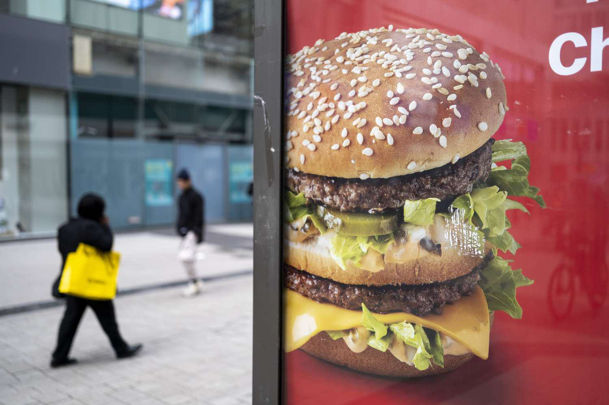

## Table of Contents

## What is Burgernomics?

Burgernomics is a fun way to understand how much money is worth in different countries. It uses the price of a Big Mac from McDonald's to compare the value of money around the world. This idea is called the Big Mac Index. It was first thought of by a magazine called The Economist in 1986. They used the Big Mac because it is sold in many countries and is pretty much the same everywhere.

The Big Mac Index helps people see if a country's money is too strong or too weak compared to another country's money. For example, if a Big Mac costs $5 in the United States but 4 euros in France, and if $1 equals 1 euro, then the euro might be too weak. This simple idea helps explain big economic ideas in a way that is easy to understand. It's not perfect, but it gives a quick look at how money works around the world.

## How does Burgernomics relate to the Big Mac Index?

Burgernomics is just another name for the Big Mac Index. It's a simple way to see how the value of money changes from one country to another. The Big Mac Index was created by The Economist magazine in 1986. They chose the Big Mac because it's sold in many countries and is pretty much the same everywhere, making it a good thing to compare.

The idea behind the Big Mac Index is to use the price of a Big Mac to understand if a country's money is too strong or too weak compared to another country's money. For example, if a Big Mac costs $5 in the United States but 4 euros in France, and if $1 equals 1 euro, the euro might be seen as too weak. This helps people understand big economic ideas in a simple way, even though it's not perfect, it gives a quick look at how money works around the world.

## What is the purpose of using a burger to measure economic concepts?

Using a burger, like the Big Mac, to measure economic concepts makes it easier for people to understand big ideas about money. The Big Mac is sold in many countries and is pretty much the same everywhere. This means it can be used to compare the value of money between different places. For example, if a Big Mac costs more in one country than another, it might mean that the money in the first country is worth less.

This simple idea, called the Big Mac Index, helps people see if a country's money is too strong or too weak compared to another country's money. It's not perfect, but it gives a quick and easy way to look at how money works around the world. By using something familiar like a burger, it makes the complex world of economics easier to understand for everyone.

## How is the price of a Big Mac used to compare different currencies?

The price of a Big Mac is used to compare different currencies by looking at how much it costs in different countries. If a Big Mac costs $5 in the United States and 4 euros in France, and if $1 equals 1 euro, then the euro might be seen as too weak. This is because you would need less euros to buy the same burger in France than dollars in the U.S.

This simple comparison helps people understand if a country's money is worth more or less than another country's money. It's called the Big Mac Index, and it's a fun way to look at big economic ideas. Even though it's not perfect, it gives a quick and easy way to see how money works around the world by using something familiar like a burger.

## What are the limitations of using Burgernomics to assess economic value?

Burgernomics, or the Big Mac Index, has some problems when we use it to understand how much money is worth in different places. One big issue is that the cost of a Big Mac can be different because of things like how much it costs to rent a place, what workers get paid, and even what people like to eat in different countries. For example, if a Big Mac is cheaper in one country, it might not mean their money is worth less. It could just mean that it's cheaper to make the burger there.

Another problem is that the Big Mac Index doesn't take into account all the other things that can change how much money is worth. Things like taxes, how much it costs to move things around the world, and even what the government does with money can make a big difference. So, while the Big Mac Index is a fun and easy way to look at money around the world, it's not perfect and can sometimes give us the wrong idea about how strong or weak a country's money really is.

## Can Burgernomics predict economic trends, and if so, how?

Burgernomics, or the Big Mac Index, can give us a quick look at how money might change in value between countries. If the price of a Big Mac goes up a lot in one country compared to another, it might mean that the money in that country is getting weaker. This can be a simple way to see if big changes might be coming in how much things cost or how strong a country's money is.

However, Burgernomics is not very good at predicting exact economic trends because it doesn't look at all the things that can change the economy. Things like what the government does, how much it costs to make things, and what people want to buy can all affect the economy in ways that a burger price can't show. So, while it can give us a fun and simple idea of what might happen, it's not something we should use to make big decisions about money or the economy.

## How has Burgernomics evolved since its inception?

Since it started in 1986, Burgernomics, or the Big Mac Index, has changed a lot. At first, it was just a fun way to help people understand big economic ideas using the price of a Big Mac. Over time, it has become more popular and is now used by many people to quickly see how money works around the world. The Economist magazine, which created it, updates the Big Mac Index every year to keep it fresh and useful.

One big change is that the Big Mac Index now includes more than just the price of the burger. It also looks at things like taxes and how much it costs to make the burger in different places. This helps make the index more accurate. Also, the idea has been used with other products, like Starbucks coffee, to see if the same ideas work with different things. Even though it's not perfect, Burgernomics keeps getting better and is a helpful tool for understanding money around the world.

## What are some real-world applications of Burgernomics in economic policy?

Burgernomics, or the Big Mac Index, helps people understand how money works around the world in a simple way. Governments and businesses can use it to see if their money is too strong or too weak compared to other countries. For example, if a Big Mac costs a lot more in one country than another, it might mean that the money in that country is worth less. This can help them make decisions about things like how much to charge for things they sell in different countries or how much to pay workers.

Even though the Big Mac Index is not perfect, it can be a quick way for policymakers to check if their money is in line with other countries. It can help them decide if they need to do something to make their money stronger or weaker. For example, if a country sees that its Big Macs are much cheaper than in other places, they might think about changing their money policies to make their money worth more. This way, Burgernomics gives them a simple tool to keep an eye on their money's value.

## How do factors like local ingredient costs and labor influence Burgernomics?

Local ingredient costs and labor can change how much a Big Mac costs in different countries. If it costs more to buy the things needed to make a Big Mac, like beef or lettuce, in one place than another, the price of the burger will go up there. Also, if workers in a country get paid more, the cost to make the burger will be higher. This means the price of a Big Mac might be different even though the burger is the same everywhere.

These differences can make it hard to use the Big Mac Index to compare how much money is worth in different places. For example, if a Big Mac is cheaper in one country, it might not mean their money is worth less. It could just mean that it costs less to make the burger there. So, while the Big Mac Index is a fun way to look at money around the world, it's not perfect because it doesn't take into account all these local costs.

## What criticisms have economists levied against the use of Burgernomics?

Some economists say that using the Big Mac to understand how money works around the world is too simple. They think it doesn't take into account all the things that can change the price of a burger, like how much it costs to rent a place, what workers get paid, and even what people like to eat in different countries. For example, if a Big Mac is cheaper in one country, it might not mean their money is worth less. It could just mean that it's cheaper to make the burger there.

Another problem is that the Big Mac Index doesn't look at all the other things that can change how much money is worth. Things like taxes, how much it costs to move things around the world, and even what the government does with money can make a big difference. So, while the Big Mac Index is a fun and easy way to look at money around the world, it's not perfect and can sometimes give us the wrong idea about how strong or weak a country's money really is.

## How does Burgernomics adjust for differences in purchasing power parity?

Burgernomics, or the Big Mac Index, tries to show how much money is worth in different countries by looking at the price of a Big Mac. It uses the idea of purchasing power parity (PPP), which means that the same thing should cost the same amount in different places if you take into account how much money is worth. If a Big Mac costs more in one country than another, it might mean that the money in the first country is worth less. This helps people see if a country's money is too strong or too weak compared to another country's money.

However, Burgernomics doesn't perfectly adjust for differences in purchasing power parity because it doesn't look at all the things that can change the price of a Big Mac. Things like how much it costs to rent a place, what workers get paid, and even what people like to eat in different countries can make the price different. So, while the Big Mac Index is a simple way to understand how money works around the world, it's not perfect and can sometimes give us the wrong idea about how strong or weak a country's money really is.

## What advanced statistical methods are used to refine the accuracy of Burgernomics?

To make Burgernomics more accurate, economists use some fancy math tricks. They use something called regression analysis to look at how different things, like how much it costs to make the burger or how much workers get paid, affect the price of a Big Mac. This helps them see if the price difference between countries is really because of how much money is worth, or if it's because of other things.

Another way they try to make Burgernomics better is by using something called the hedonic price method. This method looks at how different parts of the Big Mac, like the beef or the bun, can change the price. By understanding these parts, economists can adjust the Big Mac Index to be more fair when comparing money between countries. Even with these methods, Burgernomics is still not perfect, but it helps give a better idea of how money works around the world.

## References & Further Reading

[1]: ["The Big Mac Index"](https://www.economist.com/interactive/big-mac-index) by The Economist

[2]: Rogoff, K. S. (1996). [“The Purchasing Power Parity Puzzle.”](https://scholar.harvard.edu/rogoff/publications/purchasing-power-parity-puzzle) Journal of Economic Literature, 34(2), 647-668.

[3]: Lyons, Richard K. (2001). ["The Economics of Currency Trading."](https://direct.mit.edu/books/monograph/2004/The-Microstructure-Approach-to-Exchange-Rates) Princeton University Press.

[4]: ["Advances in Financial Machine Learning"](https://www.amazon.com/Advances-Financial-Machine-Learning-Marcos/dp/1119482089) by Marcos Lopez de Prado

[5]: Brüggemann, Ralf. (2004). [“Explaining Purchasing Power Parities: An Econometric Analysis.”](https://link.springer.com/book/10.1007/978-3-642-17029-4) The Review of Economics and Statistics, 86(1), 346-350. 

[6]: ["Quantitative Trading: How to Build Your Own Algorithmic Trading Business"](https://github.com/LucindaYa/quant-resources/blob/master/Quantitative%20Trading%20How%20to%20Build%20Your%20Own%20Algorithmic%20Trading%20Business.pdf) by Ernest P. Chan

[7]: Froot, Kenneth A., Kim, Michael. (1992). ["Purchasing Power Parity, Real Exchange Rates, and Macroeconomic Data."](https://www.semanticscholar.org/paper/The-Law-of-One-Price-Over-700-Years-Froot-Kim/a0c05b0a89357bf891da8c153c7173c2ce30bdaa) National Bureau of Economic Research.