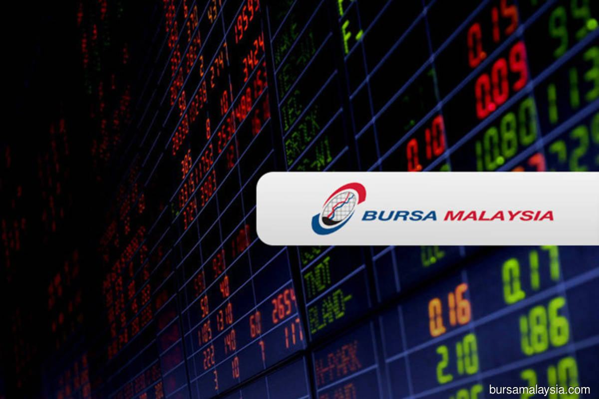

## Table of Contents

## What is Bursa Malaysia Derivatives Berhad?

Bursa Malaysia Derivatives Berhad is a company in Malaysia that deals with financial products called derivatives. These are special types of investments that get their value from something else, like stocks, commodities, or interest rates. The company helps people and businesses buy and sell these derivatives in a safe and organized way. It's like a marketplace where people can trade these financial products.

The main job of Bursa Malaysia Derivatives Berhad is to make sure that trading these derivatives is fair and transparent. They have rules and systems in place to prevent any cheating or unfair practices. This helps build trust among the people who use their services. By providing a reliable place to trade derivatives, the company helps the overall financial market in Malaysia to grow and stay strong.

## What types of derivative products does Bursa Malaysia Derivatives Berhad offer?

Bursa Malaysia Derivatives Berhad offers several types of derivative products. One main type is futures contracts. These are agreements to buy or sell something at a future date for a price agreed upon today. They have futures for things like crude palm oil, which is important in Malaysia because the country produces a lot of it. They also have futures for the FTSE Bursa Malaysia Kuala Lumpur Composite Index, which helps people bet on how the stock market will do.

Another type of derivative product they offer is options. Options give you the right, but not the obligation, to buy or sell something at a set price before a certain date. They have options on the same things as their futures, like crude palm oil and the stock market index. This lets people protect their investments or try to make money if they think the market will move in a certain way.

Lastly, they also offer products like [interest rate](/wiki/interest-rate-trading-strategies) futures and single stock futures. Interest rate futures help people manage the risk of changes in interest rates, which is important for banks and big companies. Single stock futures let people bet on the future price of individual company stocks. All these products help people and businesses manage risk and try to make money in different ways.

## How does one start trading on Bursa Malaysia Derivatives Berhad?

To start trading on Bursa Malaysia Derivatives Berhad, you first need to open an account with a brokerage firm that is a member of the exchange. You can find these firms on the Bursa Malaysia website or by asking friends who trade. Once you choose a brokerage, you'll need to fill out some forms and provide documents like your ID and proof of address. After your account is approved, you'll need to fund it with money. This money will be used to buy and sell the derivatives.

After your account is set up and funded, you can start trading. You'll use the brokerage firm's trading platform, which could be a website or a special software program. On this platform, you can see the prices of different derivatives like futures and options. To trade, you just need to choose what you want to buy or sell, enter the quantity, and confirm the order. Remember, trading derivatives can be risky, so it's a good idea to learn about them and maybe even take a [course](/wiki/best-algorithmic-trading-courses) before you start.

## What are the trading hours for Bursa Malaysia Derivatives Berhad?

The trading hours for Bursa Malaysia Derivatives Berhad are from 8:45 AM to 5:15 PM, Monday to Friday. These hours are when you can buy and sell things like futures and options. It's important to know these times so you can plan when to trade.

There are also times when trading stops for a little while. This is called a lunch break, and it happens from 12:30 PM to 2:30 PM. During this break, you can't trade, but you can still look at prices and get ready for when trading starts again. Knowing these times helps you manage your trading day better.

## What are the fees and charges associated with trading on Bursa Malaysia Derivatives Berhad?

When you trade on Bursa Malaysia Derivatives Berhad, you need to know about the fees and charges. There is a fee called the trading fee, which is a small percentage of the value of what you trade. This fee helps pay for the costs of running the exchange. There's also a clearing fee, which goes to the clearing house that makes sure all trades are safe and final. Both of these fees are usually around 0.03% to 0.04% of the trade value, but they can change, so it's good to check the latest rates.

Another important fee is the stamp duty, which is a tax on trading. It's a small amount, usually around 0.1% of the trade value, but it adds up. Your brokerage firm will also charge you a commission for their services. This commission can be different depending on which firm you use, so it's smart to compare a few before choosing. All these fees together can make a big difference in how much money you make or lose from trading, so it's important to understand them well.

## How does Bursa Malaysia Derivatives Berhad ensure market integrity and transparency?

Bursa Malaysia Derivatives Berhad works hard to make sure trading is fair and open for everyone. They have strict rules that everyone who trades must follow. These rules stop people from cheating or doing anything unfair. They also watch the market all the time to catch any strange behavior. If they see something wrong, they can stop it quickly to keep the market safe. By doing all this, they make sure that everyone can trust the market and feel safe when they trade.

They also use technology to help keep things clear and honest. They have systems that show all the prices and trades happening in real time. This way, everyone can see what's going on and know that the prices are real. They also have a special group of people who check everything to make sure it's all correct. This group can look into any problems and fix them. All these steps together help make sure that trading on Bursa Malaysia Derivatives Berhad is fair and everyone can trust it.

## What are the risks involved in trading derivatives on Bursa Malaysia Derivatives Berhad?

Trading derivatives on Bursa Malaysia Derivatives Berhad can be risky because the value of derivatives can change a lot. Since derivatives get their value from something else, like the price of crude palm oil or the stock market, if that thing changes a lot, the derivative can too. This means you could lose money quickly if the market moves against you. Also, trading derivatives often involves using borrowed money, which can make the risk even bigger because you might have to pay back more than you expected.

Another risk is that derivatives can be hard to understand. If you don't know how they work, you might make bad choices and lose money. Even if you do understand them, there's still the risk that the market might not move the way you think it will. It's important to learn about derivatives and maybe even practice trading with a small amount of money first before you start trading with a lot.

## Can foreign investors participate in trading on Bursa Malaysia Derivatives Berhad?

Yes, foreign investors can trade on Bursa Malaysia Derivatives Berhad. They need to open an account with a brokerage firm that is a member of the exchange. This means finding a firm that works with people from other countries and going through their process to set up an account. Once the account is open and funded, foreign investors can start trading just like local investors.

The rules for foreign investors might be a bit different, so it's important to check with the brokerage firm and understand any special requirements or restrictions. Trading from another country can also mean dealing with different time zones and possibly higher fees for transferring money. But with the right preparation, foreign investors can take part in the market and try to make money from trading derivatives.

## What are the key differences between futures and options traded on Bursa Malaysia Derivatives Berhad?

Futures and options are both types of derivatives you can trade on Bursa Malaysia Derivatives Berhad, but they work differently. A futures contract is an agreement to buy or sell something at a set price on a future date. For example, if you buy a futures contract for crude palm oil, you agree to buy it at the price set today, even if the price changes later. This means you have to go through with the deal no matter what happens to the price. Futures are often used by people who want to protect themselves from price changes or who think they know where prices are going.

On the other hand, an option gives you the right, but not the obligation, to buy or sell something at a set price before a certain date. If you buy an option on the stock market index, you can choose to buy or sell at the set price if it's good for you, but you don't have to if it's not. This makes options a bit less risky because you can walk away if the market doesn't move the way you hoped. People use options to protect their investments or to try to make money if they think the market will move in a certain way, but with less risk than futures.

## How has the volume of derivatives trading on Bursa Malaysia Derivatives Berhad evolved over the past decade?

Over the past decade, the [volume](/wiki/volume-trading-strategy) of derivatives trading on Bursa Malaysia Derivatives Berhad has shown a lot of ups and downs, but it has generally grown. At the start of the decade, trading volumes were pretty steady, but then they started to increase as more people got interested in derivatives like futures and options. This growth was helped by more education about derivatives and better technology that made trading easier. By the middle of the decade, trading volumes hit some high points, especially in products like crude palm oil futures, which are very important in Malaysia.

In the later years, there were some big changes in the market that affected trading volumes. Sometimes, big events like changes in the global economy or local market rules made volumes go up or down a lot. But overall, the trend has been upward, with more people and businesses using derivatives to manage their risks or try to make money. The exchange has worked hard to keep the market fair and safe, which has helped more people feel comfortable trading there.

## What regulatory frameworks govern Bursa Malaysia Derivatives Berhad?

Bursa Malaysia Derivatives Berhad follows rules set by the Securities Commission Malaysia, which is the main group that watches over the financial markets in Malaysia. The Securities Commission makes sure that everything in the market is fair and safe for everyone. They have laws like the Capital Markets and Services Act that tell Bursa Malaysia Derivatives Berhad how to run things and what they need to do to keep the market honest. The exchange also has its own rules that everyone who trades there has to follow, and these rules help make sure that trading is done the right way.

Another important group that helps keep things in order is the Bursa Malaysia Berhad itself, which owns Bursa Malaysia Derivatives Berhad. They have their own set of rules and guidelines that make sure the derivatives market works well. They watch the market all the time to stop any cheating or unfair practices. By working together, the Securities Commission and Bursa Malaysia Berhad help make sure that trading on Bursa Malaysia Derivatives Berhad is safe, fair, and open for everyone who wants to trade.

## What technological innovations has Bursa Malaysia Derivatives Berhad implemented to enhance trading?

Bursa Malaysia Derivatives Berhad has used new technology to make trading easier and faster. They have a special trading system called Bursa Trade that lets people buy and sell derivatives quickly and safely. This system shows prices in real time, so everyone can see what's happening in the market right away. They also use technology to check trades and make sure everything is fair. This helps stop any cheating and keeps the market honest.

Another big change is that they let people trade using computers and smartphones. This means traders can buy and sell derivatives from anywhere, not just from an office. They also have special software that helps people plan their trades and learn more about the market. All these new tools make trading easier and help more people join in. By using technology, Bursa Malaysia Derivatives Berhad keeps up with the latest ways to trade and makes sure the market stays safe and fair for everyone.

## References & Further Reading

- Bergstra, J., et al. The work on Algorithms for Hyper-Parameter Optimization investigates into methodologies that optimize trading systems, crucial for algorithmic trading where parameter tuning can dramatically affect outcomes. Hyper-parameter tuning enhances model performance by selecting the best parameters from a predefined space, offering improved trading strategy execution.

- Advances in Financial Machine Learning by Marcos Lopez de Prado offers insights into novel machine learning techniques that can be applied in financial contexts, including algorithmic trading. The book emphasizes the use of machine learning algorithms for predictive accuracy and their capability to process large financial datasets efficiently.

- *Evidence-Based Technical Analysis* by David Aronson provides a critical perspective on the use of technical indicators in trading. It advocates for empirical testing of trading strategies, which aligns with the objective approach needed in developing algorithmic trading systems that rely on evidence rather than intuition.

- Machine Learning for Algorithmic Trading by Stefan Jansen is an essential resource that details practical implementations of machine learning in financial markets. The book covers the development of prediction models, their validation, and deployment in live trading environments using Python—demonstrating the role of technology in modern trading strategies.

- *Quantitative Trading* by Ernest P. Chan simplifies the process of developing and implementing quantitative trading strategies. The book emphasizes the importance of backtesting and the necessity of robust programming skills for creating effective algorithmic trading systems. It is particularly useful for practitioners seeking to leverage quantitative methods to enhance trades on platforms like Bursa Malaysia.

