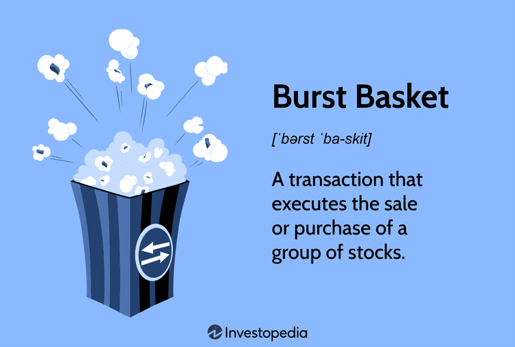

Algorithmic trading, often referred to as algo trading, has revolutionized the landscape of investment strategies by employing advanced technologies to enhance efficiency and precision. These technological advancements facilitate the execution of trades in financial markets through pre-programmed automated instructions, considering variables like price, timing, and volume. This transformation is largely driven by tools and strategies that optimize trading processes, one of which is the use of burst baskets.

Burst baskets are sophisticated trading tools that enable the simultaneous execution of multiple securities within a single transaction. This is pivotal in the fast-paced environment of modern financial markets. By aggregating a set of securities into a unified trading unit, burst baskets permit traders to efficiently handle high-density transactions while minimizing disruption in the market. The significance of burst baskets in contemporary algorithmic trading is underscored by their ability to enhance the precision and speed of trading operations, attributes crucial to maintaining competitiveness in today's market.



In the algorithmic trading framework, burst baskets are increasingly recognized for their ability to optimize trade execution. Their application spans various contexts, including index tracking and currency portfolio management, positioning burst baskets as invaluable within institutional investment and arbitrage strategies. By allowing investors to manage a diverse range of securities concurrently, they reduce operational complexity and potential market impact, which is particularly beneficial in volatile conditions.

Thus, burst baskets are not merely tools but represent a strategic advantage in modern trading, offering significant benefits through their flexibility and efficiency. As we explore their application and advantages further, the profound impact of these instruments on trading strategies becomes clear, emphasizing their role in the continued evolution of algorithmic trading practices.

## Table of Contents

## What is a Burst Basket?

A burst basket is a sophisticated trading mechanism that involves the execution of buying or selling a group of stocks as a single transaction. This strategy is distinctively characterized by its ability to consolidate multiple equities, typically numbering 15 or more, into a singular trading unit. Such transactions are primarily employed in environments requiring efficient and precise executions, notably within the contexts of index tracking and currency portfolio management.

In index tracking, burst baskets offer a streamlined method to replicate the performance of a specific index by simultaneously trading the constituent stocks in proportion to their weightings within the index. For example, if an index is composed of 20 stocks, a burst basket can execute trades across all these stocks instantaneously, ensuring that the portfolio mirrors the index’s behavior with high fidelity.

Currency portfolio management also benefits from burst baskets, especially for institutional investors who need to manage large-scale, diversified portfolios. These transactions are executed on major financial exchanges like the New York Stock Exchange (NYSE) and the Chicago Board Options Exchange (Cboe), providing a robust and liquid platform for high-[volume](/wiki/volume-trading-strategy) trading activities. The ability to perform these transactions efficiently is vital for institutional investors and arbitrageurs who seek to capitalize on market opportunities, minimize slippage, and achieve cost-effective execution.

The flexibility and efficiency of burst baskets lie in their programmatic nature, leveraging [algorithmic trading](/wiki/algorithmic-trading) systems to initiate and route orders based on pre-defined strategies. This underpins the capacity to manage vast quantities of trades with speed and precision, which is critical in today’s fast-paced trading environment where milliseconds can translate into substantial financial gains or losses.

Overall, burst baskets play a crucial role in modern trading by providing a method to manage diversified and complex portfolios while optimizing transaction efficiency on major trading exchanges.

## Understanding Burst Baskets in Trading

Burst baskets are a crucial element of program trading within the domain of algorithmic trading. They are designed to facilitate the execution of a large number of trades simultaneously, a feat achieved through sophisticated mathematical algorithms. These algorithms ensure that transactions involving high volumes of securities are executed swiftly and efficiently, minimizing delays and the risks associated with manual trading.

The core technological mechanism behind burst baskets is their reliance on advanced trading algorithms. These algorithms are constructed to parse large sets of market data in real-time, identifying optimal entry and [exit](/wiki/exit-strategy) points for executing trades. The speed of algorithmic execution is essential in fast-moving markets, where the slightest delay can lead to significant financial discrepancies.

Operationally, burst baskets function by packaging a group of transactions into a single trade, allowing this bundle to move through the trading system simultaneously. This bundling reduces the number of individual trades that need to be executed, lowering transaction costs and simplifying the administrative load on trading exchanges.

From a technical standpoint, burst baskets can be engineered using a variety of programming environments. Here's an example of a simplified Python pseudocode that outlines the mechanics of such a system:

```python
import numpy as np

def execute_burst_basket(stocks, allocations, capital):
    """
    Execute trades for a burst basket

    Parameters:
        stocks (list): List of stock symbols.
        allocations (list): Percentage allocations for each stock.
        capital (float): Total capital to be invested.

    Returns:
        dict: Executed trade details with stock symbol and shares.
    """
    trade_details = {}
    for stock, allocation in zip(stocks, allocations):
        investment_amount = capital * allocation
        share_price = get_current_price(stock)  # Assume function to fetch real-time price
        shares = investment_amount // share_price
        execute_trade(stock, shares)  # Assume function to execute trade
        trade_details[stock] = shares
    return trade_details

# Example usage
stocks = ['AAPL', 'GOOGL', 'MSFT']
allocations = [0.4, 0.3, 0.3]
capital = 1000000
trades = execute_burst_basket(stocks, allocations, capital)
```

In addition to facilitating high-speed transactions, burst baskets play a pivotal role in mitigating market impact. By executing a large volume of trades as a single transaction, they help distribute the effect of trades over multiple stocks, reducing the likelihood of causing adverse price movements in any single security. This distribution is particularly advantageous in markets with limited [liquidity](/wiki/liquidity-risk-premium), where large trades can otherwise dramatically affect stock prices.

Furthermore, burst baskets enhance trade efficiency by optimizing order execution. Their ability to evaluate various variables—such as market conditions, liquidity, and historical price patterns—ensures optimal timing and pricing, thereby maximizing the potential return on investment. In essence, the use of burst baskets optimizes the balance between transaction costs and market impact, leading to more efficient trading outcomes.

In conclusion, understanding the functionality and benefits of burst baskets is essential for traders seeking to leverage algorithmic strategies in modern financial markets. These baskets offer transformative advantages, allowing for the swift and efficient execution of complex trading strategies while minimizing potential market disruptions.

## Applications in Automated Trading

Burst baskets have emerged as a dynamic component of automated trading, offering a level of flexibility and precision that traditional tracking funds cannot match. Through the use of advanced algorithmic strategies, these baskets enable investment firms to create customized indices tailored to specific investment goals and market conditions. This customization allows for instant rebalancing, aligning investment strategies with the latest market trends and insights.

One of the key advantages of utilizing burst baskets in automated trading is their ability to deploy complex strategies across a diversified range of stocks simultaneously. Unlike traditional methods that may focus on a single security or a limited group, burst baskets can handle numerous securities in a single transaction. This strategy not only improves the speed and efficiency of trades but also maximizes the potential for exploiting [arbitrage](/wiki/arbitrage) opportunities.

Arbitrage, the simultaneous purchase and sale of an asset to profit from a difference in the price, is greatly enhanced through the use of burst baskets. By executing trades across multiple markets or exchanges simultaneously, traders can capitalize on minor discrepancies in pricing, thus securing profits that might otherwise be unattainable with slower, manual methods.

In high-frequency trading ([HFT](/wiki/high-frequency-trading-strategies)), where milliseconds can determine the difference between profit and loss, burst baskets are particularly valuable. Automated systems can rapidly execute large volumes of trades based on pre-programmed criteria, often utilizing algorithms that analyze data at lightning speeds to make informed trading decisions. For instance, a burst basket strategy can be coded in Python as follows:

```python
import numpy as np

# Example of a simple burst basket strategy
def calculate_basket_value(prices, shares):
    return np.dot(prices, shares)

stock_prices = np.array([150.0, 200.0, 75.0, 50.0, 125.0])  # example stock prices
shares_to_buy = np.array([10, 5, 20, 15, 8])  # shares corresponding to the stocks

basket_value = calculate_basket_value(stock_prices, shares_to_buy)
print(f"The total value of the basket is ${basket_value}")
```

In this example, a burst basket is created with varying quantities of shares in different stocks, showcasing the ability to distribute investments across multiple securities efficiently. This method is crucial for maintaining a balanced portfolio while reacting swiftly to market signals.

In conclusion, the application of burst baskets in automated trading represents a significant advancement in achieving strategic investment goals. By facilitating immediate rebalancing, executing diversified and complex trading strategies, and optimizing arbitrage and high-frequency trading operations, burst baskets provide investors with innovative tools to navigate the fast-paced landscape of modern financial markets.

## Advantages over Traditional Funds

Burst baskets offer distinct advantages over traditional investment vehicles such as Exchange-Traded Funds (ETFs) or mutual funds, primarily due to their customization capabilities. This feature allows investors to select specific stocks to include in their baskets, thus aligning more closely with their investment goals and strategies. Unlike traditional funds, which consist of predefined assets, burst baskets enable the selection of securities that align with specific market sectors or individual company performance preferences. This ability to tailor investments provides a strategic edge, particularly in rapidly changing market conditions where agility and precision are crucial.

The flexibility of burst baskets is evident in their capacity to overweight or underweight certain sectors or companies. This feature allows for dynamic portfolio management, accommodating strategic shifts based on market insights or changes in economic indicators. For instance, if an investor anticipates growth in the technology sector, a burst basket can be adjusted to increase exposure to tech stocks, enabling timely adaptation to market trends without the constraints of traditional fund structures.

From a cost perspective, burst baskets can offer a more favorable structure for institutional investors. The transactional nature of burst baskets can contribute to lower fee structures compared to the management fees typically associated with ETFs and mutual funds. Furthermore, their design may offer improved tax efficiency. Since investors can directly manage capital gains and losses within the basket, there are opportunities for tax-loss harvesting, strategic offsetting of gains, and hence, minimizing tax liabilities.

Additionally, the inherent flexibility of burst baskets makes them highly suitable for algorithmic trading strategies. They support algorithm-based strategic adjustments that are essential for capturing market efficiencies. Algorithms can quickly modify basket compositions and execute trades, optimizing returns by responding to micro-market movements and arbitrage opportunities. This capability is particularly advantageous in high-frequency trading contexts, where the speed of execution is paramount.

In summary, the customization, cost advantages, and adaptability of burst baskets present a compelling alternative to traditional funds, providing investors with the tools needed to navigate complex market environments and achieve their investment objectives with precision and efficiency.

## Case Studies and Examples

In recent years, the strategic implementation of burst baskets has been illustrated through numerous case studies, highlighting their significant role in achieving trading efficiency and maximizing returns on investment (ROI). One notable example can be seen in the practices of large hedge funds during periods of heightened market [volatility](/wiki/volatility-trading-strategies). During such times, the rapid execution of trades is paramount, and burst baskets enable these institutions to swiftly transact across multiple securities simultaneously, reducing the latency that can often occur with individual trades.

For instance, a research study focused on a [hedge fund](/wiki/hedge-fund-trading-strategies)'s utilization of burst baskets during the financial turbulence of March 2020. The fund employed burst basket strategies to capitalize on arbitrage opportunities that arose due to discrepancies between the actual value of the underlying assets and their corresponding index representations. By aggregating trades into a single basket transaction, the fund mitigated exposure to unfavorable price movements, thereby ensuring that the trades were executed at optimal prices with minimized market impact. This approach demonstrated superior performance when compared to traditional trading methodologies, which often succumb to slippage and higher transaction costs during volatile periods.

Additionally, a compelling example involves an asset management firm that outperformed its benchmark by using burst baskets to rebalance portfolios in response to major index changes. The firm’s strategy involved the real-time construction and execution of a basket of trades that mirrored the new index composition as adjustments were announced. This proactive tactic allowed the firm to maintain alignment with the index at a competitive cost, providing significant ROI advantages over competitors who relied on more conventional mutual fund or [ETF](/wiki/etf-trading-strategies) adjustments.

Another scenario exemplifying the efficacy of burst baskets was found in an institutional investor’s approach to executing a complex cross-border trade involving currency fluctuations. Here, the burst basket utilized algorithmic precision to account for real-time exchange rate shifts, enabling the investor to lock in favorable conversion rates across a diverse set of international equities. This strategic execution achieved a level of synchronization that would be unattainable through standard trade practices, thereby optimizing currency exposure and amplifying portfolio returns.

Such cases underscore the strategic advantage conferred by burst baskets, particularly in environments characterized by rapid changes and complexities. These examples highlight not only the efficiency gains achievable through aggregated trades but also the potential for significant ROI improvements compared to traditional, segmented trading processes.

## Challenges and Considerations

Implementing burst basket strategies in algorithmic trading presents several challenges and considerations that must be addressed to ensure effective execution. Key among these is the impact such trades can have on the market. Large burst basket transactions can lead to significant price movements, potentially affecting the market value of the securities involved. To mitigate this, sophisticated algorithms are developed to minimize market impact, utilizing advanced execution strategies, such as slicing orders into smaller chunks over time or using volume-weighted average price (VWAP) algorithms to blend with the market.

Technical challenges are also prominent. Developing robust algorithms requires expertise in quantitative finance and computer science, where maintaining real-time data feeds is crucial for informed decision-making. Real-time data allows for the timely adjustment of trading strategies based on current market conditions. The accuracy and speed of data processing are vital, and any latency can lead to suboptimal trading decisions.

Furthermore, regulatory compliance cannot be overlooked. Financial markets are heavily regulated, and trading strategies, including burst baskets, must adhere to various legal and compliance standards. Regulations may vary across jurisdictions, requiring firms to have a detailed understanding of the environments they operate in. This includes adhering to reporting requirements, maintaining audit trails, and ensuring that algorithms do not violate market manipulation laws.

Risk management is another critical consideration. Implementing burst baskets involves the simultaneous trading of multiple securities, which can increase exposure to various market risks. Traders must employ risk management techniques, such as diversification and hedging strategies, to mitigate potential losses. It is also important for trading systems to include fail-safes and backup plans to handle unexpected events or system failures.

Potential pitfalls in burst basket trading highlight the importance of strategic planning. Poorly constructed baskets might lack diversification, increasing concentration risk. Liquidity constraints can also pose challenges, as some stocks may be less liquid, thus affecting the ease of executing large transactions.

Overall, while burst baskets offer significant advantages in algorithmic trading, successfully implementing them requires careful consideration of market impact, technical challenges, regulatory compliance, and prudent risk management. Continuous monitoring and strategy refinement are essential to adapt to the ever-evolving market conditions and technological advancements.

## Future Trends in Basket Algo Trading

In the evolving landscape of basket algorithmic trading, emerging technologies like Artificial Intelligence (AI) and Machine Learning (ML) are playing pivotal roles in the development of burst basket strategies. These technologies enhance the ability to analyze large datasets in real time, providing more precise predictions and automated decision-making capabilities. AI and ML algorithms can identify patterns and correlations in market data that may not be apparent to human traders, thereby optimizing the execution of burst basket trades. For instance, ML models can be trained to predict market movements based on historical data, leading to more effective basket compositions and timing strategies.

The increasing complexity of global markets and evolving regulatory frameworks necessitate adaptive strategies in basket trading. As markets become more interconnected, the data driving decisions in one region can have implications across the globe. Regulations, such as the European Union’s Markets in Financial Instruments Directive II (MiFID II), impose stricter transparency and reporting requirements, impacting how algorithmic trading strategies, including burst baskets, are structured and executed. Traders must ensure compliance while maintaining the efficiency and speed that characterize burst baskets, leveraging technology to manage these dual objectives.

In the context of global financial markets, burst baskets are expected to gain prominence, given the growing demand for automation and efficiency. As institutional investors seek to diversify their portfolios and manage risk more effectively, burst baskets offer a mechanism to execute large, complex trades swiftly and with minimized market impact. The ability to customize these baskets allows for strategic responses to market signals in a way that traditional funds cannot match.

Predictions indicate that burst baskets will continue to evolve, integrating more sophisticated AI and ML techniques, such as [deep learning](/wiki/deep-learning) and [reinforcement learning](/wiki/reinforcement-learning). These advancements could lead to the development of self-optimizing trading systems, where strategies are continuously refined based on real-time performance data. Additionally, the use of blockchain technology for secure and transparent transaction recording may further enhance the appeal of basket trading, reducing potential friction and ensuring robust audit trails.

Overall, burst baskets are set to become increasingly integral to modern trading strategies as technological advancements continue to drive their evolution, enabling traders to navigate complex market environments with greater accuracy and efficiency.

## Conclusion

Burst baskets have emerged as a pivotal component in the evolving landscape of algorithmic trading. By enabling the execution of a group of stocks as a single transaction, they provide an effective solution for high-frequency trading and complex arbitrage strategies. This advanced tool allows traders and investment firms to efficiently manage large-volume trades while minimizing market impact—thus helping maintain market liquidity and stability.

In the context of modern trading practices, burst baskets offer significant strategic advantages. They facilitate the customization of trading strategies, allowing investors to tailor stock selections beyond the constraints of traditional funds. This flexibility enhances the ability to emphasize specific sectors or companies and adapt quickly to market changes. Furthermore, the cost and tax efficiencies afforded by burst baskets augment their attractiveness to institutional investors, streamlining operations and potentially generating superior financial returns.

The potential of burst baskets underscores the need for continuous innovation and learning in advanced trading technologies. With the rapid development of AI and [machine learning](/wiki/machine-learning), the possibilities for advancing burst basket strategies are substantial. Traders and technologists should stay abreast of these technological shifts to harness the full potential of burst baskets and gain a competitive edge.

In light of these opportunities, investors and firms are encouraged to actively explore and implement burst basket strategies. By integrating these advanced tools into their trading operations, they can enhance overall performance and secure a robust position in today’s fast-paced financial markets. Embracing this approach could be a decisive [factor](/wiki/factor-investing) in achieving long-term success and resilience amidst changing economic landscapes.

## References & Further Reading

[1]: Bergstra, J., Bardenet, R., Bengio, Y., & Kégl, B. (2011). ["Algorithms for Hyper-Parameter Optimization."](https://papers.nips.cc/paper/4443-algorithms-for-hyper-parameter-optimization) Advances in Neural Information Processing Systems 24.

[2]: ["Advances in Financial Machine Learning"](https://www.amazon.com/Advances-Financial-Machine-Learning-Marcos/dp/1119482089) by Marcos Lopez de Prado

[3]: ["Evidence-Based Technical Analysis: Applying the Scientific Method and Statistical Inference to Trading Signals"](https://www.amazon.com/Evidence-Based-Technical-Analysis-Scientific-Statistical/dp/0470008741) by David Aronson

[4]: ["Machine Learning for Algorithmic Trading"](https://github.com/stefan-jansen/machine-learning-for-trading) by Stefan Jansen

[5]: ["Quantitative Trading: How to Build Your Own Algorithmic Trading Business"](https://www.amazon.com/Quantitative-Trading-Build-Algorithmic-Business/dp/1119800064) by Ernest P. Chan