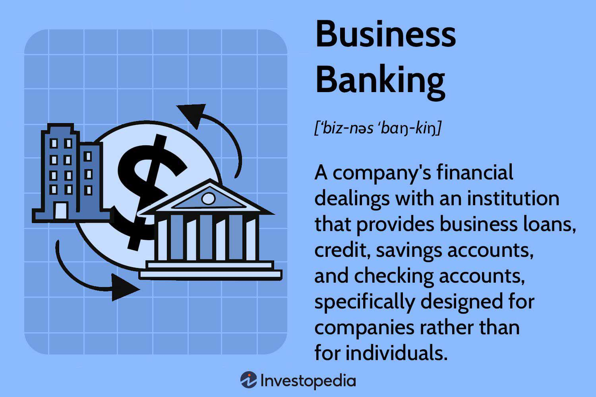

## Table of Contents

## What are business banking services?

Business banking services are financial services that banks offer to help businesses manage their money. These services include things like checking accounts, savings accounts, and loans. They help businesses keep track of their money, pay their bills, and save for the future. Business owners use these services to make sure they have enough money to run their business and grow it.

Some common business banking services include business credit cards, merchant services, and payroll services. Business credit cards help companies manage their expenses and can offer rewards or cash back. Merchant services allow businesses to accept payments from customers, like credit or debit card payments. Payroll services help businesses pay their employees easily and on time. All these services make it easier for businesses to handle their money and focus on running their business.

## Why are business banking services important for a company?

Business banking services are really important for a company because they help keep the company's money safe and organized. When a business has a special bank account, it can easily keep track of how much money is coming in and going out. This helps the business know if it is making a profit or if it needs to cut costs. Plus, having a business bank account makes it easier to pay bills and taxes, which is something every company has to do.

Another reason business banking services are important is that they help a company grow. Banks offer loans and credit that businesses can use to buy new things they need, like equipment or a bigger office. They also offer services like credit cards and merchant services, which make it easier for the business to buy things and get paid by customers. All these services help the business run smoothly and focus on getting bigger and better.

## What types of accounts are available for businesses?

There are different types of bank accounts that businesses can use. One common type is a business checking account. This account helps businesses keep their money safe and pay for things like bills and supplies. It's easy to use because businesses can write checks, use a debit card, or make online payments. Another type is a business savings account, which is good for saving money that the business doesn't need right away. This account can earn a little bit of interest, which means the money in the account can grow over time.

Some businesses might also use a merchant account. This special account lets businesses accept payments from customers using credit or debit cards. It's really helpful for stores and online businesses because it makes it easy for customers to pay. Another option is a business money market account, which is like a savings account but can offer a higher [interest rate](/wiki/interest-rate-trading-strategies). This account is good for businesses that want to save more money and earn more interest, but they might need to keep a higher balance in the account.

## How do business checking accounts differ from personal checking accounts?

Business checking accounts and personal checking accounts are different in a few ways. A business checking account is made for companies and helps them manage their money for things like paying bills and buying supplies. These accounts often let businesses write more checks and make more transactions than personal accounts. They might also have fees that are based on how much the business uses the account, like how many transactions they make. Business checking accounts can also help businesses keep their money separate from the owner's personal money, which is important for keeping good financial records.

Personal checking accounts, on the other hand, are made for people to use for their everyday money needs. These accounts usually have lower fees and fewer transaction limits because they are meant for personal use, like paying for groceries or rent. Personal checking accounts might also offer things like overdraft protection, which can help if someone spends more money than they have in their account. Overall, the main difference is that business checking accounts are designed to handle the bigger and more complex needs of a company, while personal checking accounts are simpler and meant for individual use.

## What are the benefits of using a business savings account?

A business savings account is a good way for companies to save money they don't need right away. It's like a safe place where the money can grow a little bit over time because the bank pays interest on the money in the account. This means the business can have more money to use later for things like buying new equipment or expanding the business. It's also a good way to keep the business's money separate from the owner's personal money, which can help with keeping good financial records and making sure the business stays organized.

Another benefit of using a business savings account is that it can help the business be ready for unexpected costs. Sometimes, things happen that the business didn't plan for, like a broken machine or a sudden drop in sales. Having money saved up in a business savings account can help the company pay for these surprises without having to borrow money or use money that was meant for something else. This can make the business stronger and more able to handle whatever comes its way.

## What is a merchant services account and how does it work?

A merchant services account is a special bank account that lets businesses accept payments from customers using credit or debit cards. It's really helpful for stores and online businesses because it makes it easy for customers to pay. When a customer pays with a card, the money goes into the merchant services account first. Then, after a short time, the bank moves the money into the business's regular checking account.

The way it works is pretty simple. When a customer swipes, inserts, or taps their card, the payment information goes to the bank that issued the card. The bank checks to make sure the customer has enough money or credit to pay. If everything is okay, the bank sends the money to the merchant services account. The business has to pay a small fee for using the merchant services account, but it's worth it because it makes it easier to get paid by customers.

## How can businesses manage cash flow using banking services?

Businesses can use banking services to keep an eye on their cash flow and make sure they have enough money to run their business. One way they do this is by using a business checking account to keep track of the money coming in and going out. Every time a customer pays or the business pays a bill, it goes through this account. This helps the business see if they are making more money than they are spending, which is really important for staying open and growing.

Another way banking services help with cash flow is through business savings accounts. Businesses can put extra money into these accounts to save for the future or for unexpected costs. The money in these accounts can also earn a little bit of interest, which means it can grow over time. By having a savings account, a business can make sure they have money ready when they need it, which helps them manage their cash flow better and stay strong even when things get tough.

## What are the features of online and mobile banking for businesses?

Online and mobile banking for businesses make it easy to handle money from anywhere. With these services, businesses can check their account balances, see what money is coming in and going out, and move money between accounts. They can also pay bills online, which saves time and makes sure payments are made on time. Another cool feature is that businesses can set up alerts to get a message when their account balance gets low or when a big payment comes in. This helps them keep an eye on their cash flow without having to go to the bank.

Mobile banking apps also let businesses do things like deposit checks by taking a picture of them with their phone. This means they don't have to go to the bank to deposit money, which saves time and keeps their money flowing smoothly. Some apps even let businesses manage their payroll, so they can pay their employees easily and on time. All these features help businesses stay organized and focus on growing, no matter where they are.

## How do business credit lines and loans work within banking services?

Business credit lines and loans are ways for banks to give businesses money when they need it. A business credit line is like a special account where a business can borrow money up to a certain limit. The business only pays interest on the money they actually use, and they can borrow and pay back the money as many times as they need to, as long as they stay within the limit. This is really helpful for businesses that need money for short-term things, like buying supplies or fixing equipment.

Business loans are different because they give businesses a lump sum of money that they have to pay back over time, with interest. These loans can be used for bigger things, like buying new equipment, expanding the business, or even starting a new business. The business and the bank agree on how much money the business will get, how long they have to pay it back, and what the interest rate will be. This helps businesses plan for the future and grow, but they need to make sure they can pay the loan back on time.

## What are the security measures in place for business banking?

Banks have strong security measures to keep business banking safe. They use things like encryption to protect the information that businesses send and receive when they use online or mobile banking. Encryption is like a secret code that only the bank and the business can understand. Banks also have firewalls to stop bad people from getting into their systems. They watch their systems all the time to make sure nothing strange is happening and can stop any attacks quickly.

Another way banks keep business banking secure is by making sure only the right people can use the accounts. They do this with things like multi-[factor](/wiki/factor-investing) authentication, which means a business owner might need to enter a password and then get a special code sent to their phone to log in. Banks also keep a close eye on the accounts to spot any weird activity, like if someone tries to take out a lot of money all at once. If they see something that doesn't look right, they can stop it and let the business know, so the business can stay safe.

## How can businesses optimize their banking services for international transactions?

Businesses can optimize their banking services for international transactions by using a bank that offers good rates for changing money from one country's currency to another. This can save the business money because they won't lose as much when they change currencies. Some banks also have special accounts just for businesses that do a lot of international work. These accounts can make it easier to send and receive money from other countries without having to pay big fees.

Another way businesses can optimize their banking services is by using online and mobile banking to keep an eye on their international transactions. They can see where their money is going and make sure everything is going smoothly, no matter where they are. Some banks also offer tools that help businesses avoid problems with different countries' rules about money, which can make international transactions safer and easier. By choosing the right bank and using the right tools, businesses can handle their international money matters more efficiently.

## What advanced financial management tools do banks offer to businesses?

Banks offer many advanced tools to help businesses manage their money better. One of these tools is called cash flow management software. This software helps businesses see where their money is coming from and where it's going. It can show them if they are spending too much in one area or if they need to save more for the future. Another tool is called financial forecasting. This helps businesses predict how much money they will make or spend in the future, so they can plan better and avoid surprises.

Another useful tool is treasury management services. These services help businesses handle their money more efficiently. For example, they can help businesses invest their extra money in a smart way, so it can grow over time. They also help businesses manage their debts and make sure they are paying their bills on time. Some banks also offer tools like expense tracking and reporting, which help businesses keep track of what they are spending money on and make reports to see where they can save money. All these tools make it easier for businesses to stay organized and grow.

## What is the Role of Corporate Finance?

Corporate finance involves a range of financial activities pivotal to a company's ability to manage its capital and make informed strategic decisions. These activities include investment decisions, financing decisions, and dividend policy decisions, which together form the backbone of effective corporate financial management.

Investment banks play a crucial role in corporate finance by offering advisory services for mergers and acquisitions (M&A), public offerings, and other significant transactions. These services include conducting due diligence, evaluating potential deals, structuring transactions, and providing market insights. For instance, during a merger, investment banks assess the strategic fit of the merging entities, ensure regulatory compliance, and aid in negotiating terms to maximize value for stakeholders involved.

Maximizing shareholder value is a core objective of corporate finance. This involves strategies that enhance a company's market valuation, such as optimizing capital budgeting—where firms decide which projects to invest in based on potential returns relative to associated risks. The net present value (NPV) method, for example, is frequently employed to assess the profitability of a project, calculated as:

$$
\text{NPV} = \sum \frac{R_t}{(1 + i)^t} - C_0
$$

Where $R_t$ is the net cash inflow during the period, $i$ is the discount rate, $t$ is the period, and $C_0$ is the initial investment cost.

Effective corporate finance management also involves making prudent financing decisions—deciding the optimal mix of debt and equity financing. The Weighted Average Cost of Capital (WACC) is a common tool to gauge the cost of capital, which acts as a hurdle rate for investment decisions. Companies strive to achieve a balance that minimizes WACC, as lower capital costs can lead to higher project valuations and thereby enhance shareholder wealth.

In addition to internal financial decisions, external factors such as market conditions and economic climates significantly impact corporate finance strategies. Corporations must continuously adapt to changes in global financial markets, interest rates, and regulatory environments. Strategic financial planning and risk management are critical in navigating these external challenges to sustain long-term business success.

Ultimately, effective management of corporate finance can lead to sustainable growth, improved profitability, and sustained competitive advantage for businesses, ensuring their long-term viability in a complex financial ecosystem.

## References & Further Reading

[1]: ["Corporate Finance (4th Edition)"](https://www.amazon.com/Corporate-Finance-4th-Pearson-Standalone/dp/013408327X) by Jonathan Berk and Peter DeMarzo

[2]: Harris, L. (2003). ["Trading & Exchanges: Market Microstructure for Practitioners."](https://www.amazon.com/Trading-Exchanges-Market-Microstructure-Practitioners/dp/0195144708) Oxford University Press.

[3]: Hasbrouck, J. (2007). ["Empirical Market Microstructure: The Institutions, Economics, and Econometrics of Securities Trading,"](https://archive.org/details/empiricalmarketm0000hasb) Oxford University Press.

[4]: Puschmann, T. (2017). "Fintech." Business & Information Systems Engineering, 59(1), 69-73. doi:10.1007/s12599-017-0464-6

[5]: Treleaven, P., Galas, M., & Lalchand, V. (2013). ["Algorithmic Trading Review."](https://dl.acm.org/doi/10.1145/2500117) Communications of the ACM, 56(11), 76-85.