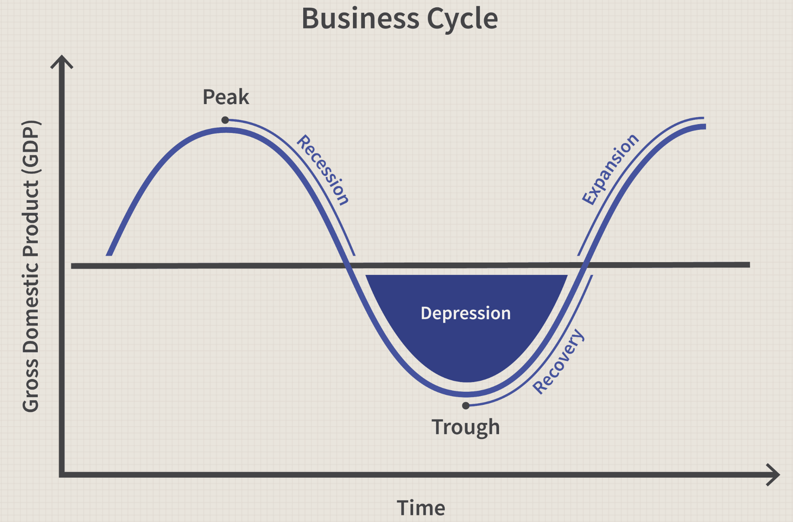

In the fast-paced world of finance, understanding economic indicators is crucial for successful algorithmic trading. With markets reacting rapidly to changes in economic landscapes, the ability to anticipate such fluctuations can provide significant competitive advantages. Business Cycle Indicators (BCIs) are essential tools in this context, offering insights into economic trends and turning points that play a pivotal role in shaping trading strategies.

BCIs consist of metrics that capture different stages of economic cycles, reflecting periods of expansion, peak, recession, and recovery. By interpreting these indicators, traders can gain a comprehensive understanding of the underlying economic environment in which financial decisions are made. This knowledge not only aids in predicting future market conditions but also helps mitigate risks associated with economic volatility.



For algorithmic traders, the integration of BCIs into their systems can optimize decision-making processes. These indicators allow for the adaptation of trading algorithms to different economic phases, ensuring that strategies remain aligned with the prevailing economic conditions. Moreover, they offer the potential to fine-tune trading parameters to better respond to economic expansions or contractions.

This article aims to explore the critical role of BCIs in gauging economic health and their applications within algorithmic trading frameworks. By examining the origins, evolution, and practical utility of these indicators, traders can enhance their ability to navigate complex economic landscapes and improve strategic financial decision-making.

## Table of Contents

## Understanding Business Cycle Indicators (BCIs)

Business Cycle Indicators (BCIs) are integral components in the analysis of economic cycles, consisting of three main types: leading, coincident, and lagging indicators. These indicators serve distinct roles in forecasting, dating, and confirming the phases of economic cycles.

Leading indicators are essential for anticipating future economic activity. By providing insights into upcoming economic changes, they allow traders and analysts to predict the direction in which an economy is headed. Key leading indicators include stock market performance, average weekly hours worked in manufacturing, new orders for durable goods, [interest rate](/wiki/interest-rate-trading-strategies) spreads, and consumer expectations. For instance, rising stock prices often presage economic expansion, as they suggest increased investor confidence and anticipated business growth. Conversely, declining new manufacturing orders may signal an impending slowdown.

Coincident indicators reflect the current state of the economy, moving in tandem with the general economic direction. These indicators include metrics such as gross domestic product (GDP), employment levels, personal income, and industrial production. By tracking these indicators, economists and traders gain a real-time picture of economic health, allowing them to make informed decisions aligned with prevailing economic conditions.

Lagging indicators, on the other hand, are used to confirm trends and turning points in the economic cycle. These indicators, which include unemployment rates, consumer price indices, and business inventory levels, typically change after the economy has begun to follow a particular trend. For example, an increase in the unemployment rate may confirm a recessionary phase, while a decrease might affirm an economic recovery.

The strategic application and understanding of BCIs are crucial for interpreting the economic environment in which trading decisions are made. They form an essential toolset for traders and investors looking to align their strategies with anticipated economic developments, ensuring a more responsive and informed approach to the dynamic landscape of financial markets.

## The History and Evolution of BCIs

The concept of Business Cycle Indicators (BCIs) was a groundbreaking development in economic analysis, initiated in the 1930s by Wesley Mitchell and Arthur Burns, who were associated with the National Bureau of Economic Research (NBER). Mitchell, along with Burns, focused on the empirical study of economic cycles. Their work laid the foundation for systematically understanding and interpreting cycles in economic activity, thus introducing a quantitative approach to a traditionally qualitative domain.

The principles behind BCIs gained traction and evolved with significant contributions in subsequent decades. The U.S. Department of Commerce played a pivotal role in popularizing BCIs during the 1960s. This period marked a formal acknowledgment of the utility of BCIs in informing economic policy and decision-making. The fact that economic indicators could pre-emptively signal the direction of the economy made them a valuable asset for economists and policymakers alike.

As the understanding of these indicators improved, institutional management also transitioned. The Conference Board, a global, independent business membership and research association, took over the responsibility for maintaining the system of BCIs. Under their stewardship, the indicators have been refined and expanded, reflecting advancements in economic theory and statistical methodology. This transition underscored the necessity for a dedicated entity to focus on the evolving needs of economic forecasting and analysis.

Today, BCIs are indispensable tools for economists and financial professionals. Their evolution reflects a broader historical development in economic modeling and forecasting. By allowing analysts to interpret and predict changes in the economic environment more accurately, BCIs contribute significantly to informed decision-making processes in finance and policy formulation.

## Interpreting BCIs in Economic Analysis

Interpreting Business Cycle Indicators (BCIs) requires a comprehensive approach that considers the broader economic landscape. These indicators, categorized as leading, coincident, and lagging, offer different perspectives on economic trends and are essential for making informed financial decisions.

Leading indicators, such as stock prices and manufacturing orders, typically change before the general economy does and can predict future economic activity. On the other hand, coincident indicators, like employment levels and personal income, move in tandem with the economy, providing real-time insights into its current state. Lagging indicators, including unemployment rates and corporate profits, change after the economy has already begun to follow a particular trend and serve to confirm patterns observed in leading and coincident indicators.

Traders and investors utilize BCIs to anticipate and navigate fluctuations within business cycles. By analyzing these indicators, they can identify potential turning points in the economy and adjust their strategies accordingly. To maximize the utility of BCIs, it is crucial to integrate them with other forms of economic data, such as Gross Domestic Product (GDP) figures, inflation rates, and interest rates. This comprehensive approach allows for a holistic understanding of economic conditions and their potential impacts on market behavior.

For instance, a trader might notice an upward trend in leading indicators, suggesting an upcoming economic expansion. By combining this data with a coincident indicator showing stable employment levels, the trader could anticipate a favorable market environment. Conversely, if leading indicators are declining while lagging indicators show rising unemployment, the trader might prepare for an economic downturn.

Ultimately, the effective use of BCIs in economic analysis involves not only understanding their individual signals but also synthesizing them within the context of other economic variables. This layered analysis provides a more complete picture of economic trends, enabling market participants to make strategic decisions with greater confidence.

## Application of BCIs in Algorithmic Trading

Algorithmic trading, a method that involves using pre-programmed strategies to execute trades, greatly benefits from the integration of Business Cycle Indicators (BCIs). These indicators allow trading algorithms to adapt to the different phases of economic cycles, improving decision-making during both expansions and contractions.

During periods of economic expansion, BCIs can signal opportunities for traders to adopt more aggressive strategies, capitalizing on increased market [momentum](/wiki/momentum). For instance, rising stock prices or increased manufacturing orders—typical leading indicators—may suggest a growing economy. This provides a basis for algorithms to increase equity exposure or invest in cyclical sectors that perform well during periods of growth.

Conversely, during economic contractions, BCIs can alert algorithms to potential risks, guiding a shift towards more conservative strategies. This could entail reallocating capital to defensive sectors or increasing cash reserves to mitigate losses. By recognizing signals such as declining employment rates or decreasing industrial production, algorithms can be programmed to reduce exposure to volatile assets.

Incorporating specific indicators such as GDP growth and inflation rates allows for more nuanced trade decisions. For example, Python can be used to implement these insights into [algorithmic trading](/wiki/algorithmic-trading) models:

```python
def adjust_strategy_based_on_bci(gdp_growth, inflation_rate):
    # Define thresholds for economic phases
    expansion_threshold = 2.0
    contraction_threshold = -1.0

    # Decision logic based on BCIs
    if gdp_growth > expansion_threshold and inflation_rate < 3.0:
        # Strategy for economic expansion
        return 'Aggressive strategy: Increase equity exposure'
    elif gdp_growth < contraction_threshold or inflation_rate > 4.0:
        # Strategy for economic contraction
        return 'Conservative strategy: Increase cash reserves'
    else:
        # Strategy for stable phases
        return 'Balanced strategy: Maintain diversified portfolio'

# Example usage
print(adjust_strategy_based_on_bci(2.5, 2.5))  # Output: Aggressive strategy: Increase equity exposure
```

The integration of BCIs into algorithmic trading allows for the fine-tuning of algorithms to better align with prevailing economic conditions, enhancing the potential for informed and profitable trade executions. This application assists traders in optimizing their portfolios relative to different economic scenarios, ultimately aiming for more consistent long-term returns.

## Challenges and Limitations of Using BCIs

While Business Cycle Indicators (BCIs) are valuable tools for understanding economic trends, their efficacy is subject to certain limitations and challenges. One major limitation is their accuracy and predictive power. Economic complexity implies that no single indicator, or even a group of indicators, can provide a complete picture of the economic landscape. This complexity is due to the multitude of interacting variables and the dynamic nature of global markets.

BCIs typically rely on historical data to identify patterns and make predictions about future economic performance. However, past trends may not always accurately reflect future events, especially in the face of unexpected economic shocks or geopolitical developments. For instance, a leading indicator such as stock market performance might not always correlate with economic health if influenced by speculative bubbles or regulatory changes.

Furthermore, the interpretation of BCIs is inherently subjective, requiring financial analysts and traders to exercise judgment alongside quantitative analysis. This can lead to different conclusions and trading strategies based on the same data. For example, two traders might analyze a drop in manufacturing orders (a leading indicator) and draw different inferences about its impact on economic growth, leading to divergent investment decisions.

Another challenge lies in the timing of the data. Leading indicators, while useful for predicting potential upturns or downturns, may give false signals resulting in premature or delayed responses in trading strategies. Coincident and lagging indicators, on the other hand, provide confirmation of economic conditions but might do so when it is too late to capitalize on trading opportunities arising from these conditions.

To address these challenges, traders must continually refine their strategies based on BCI insights and remain adaptive to new information. This involves not only monitoring a diverse set of indicators but also incorporating qualitative assessments and broader macroeconomic analyses. Advanced computational techniques, such as [machine learning](/wiki/machine-learning), can assist in processing and interpreting large datasets, thereby helping traders better understand the nuanced signals from BCIs.

Here’s a simple Python example demonstrating how one might combine multiple indicators to assess economic trends:

```python
import pandas as pd
import numpy as np
from sklearn.linear_model import LinearRegression

# Simulated dataset: GDP growth, stock prices (leading), and unemployment rates (lagging)
data = {
    'GDP_growth': np.random.normal(2, 0.5, 100),
    'Stock_prices': np.random.normal(0.5, 0.1, 100),
    'Unemployment': np.random.normal(5, 0.5, 100)
}

df = pd.DataFrame(data)

# Linear regression model to correlate leading and lagging indicators with GDP growth
X = df[['Stock_prices', 'Unemployment']]
y = df['GDP_growth']

model = LinearRegression()
model.fit(X, y)

# Coefficients can indicate how each indicator is correlated with GDP growth
print("Coefficients:", model.coef_)
```

This code provides a basic framework for analyzing multiple indicators together, thereby offering a more robust insight into economic conditions. However, the key is to remember the inherent limitations and remain flexible in strategy formulation.

## Conclusion

Business Cycle Indicators (BCIs) are essential tools for both understanding and predicting economic cycles, serving a critical role for traders and investors. They provide insights into the phases of economic activity, allowing market participants to make informed decisions based on expected economic trends. By incorporating BCIs into their analyses, traders can better anticipate market conditions, making them an indispensable component of strategic financial decision-making.

For algorithmic trading, the benefits of integrating BCIs are significant. Algorithmic strategies that account for shifts in the economic cycle can adjust trading positions during periods of expansion or contraction. This adaptability ensures that trading decisions are informed by a nuanced understanding of economic dynamics. By utilizing a broader analytical framework that combines BCIs with other economic indicators, algorithmic trading models can be optimized for precision and timeliness.

In an ever-evolving economic landscape, staying informed and adaptable in leveraging BCIs is crucial. Understanding the limitations and potential inaccuracies of BCIs is necessary for refining strategies and maintaining a competitive edge. Continuous analysis and fine-tuning, based on BCI insights, allow traders and investors to navigate economic fluctuations effectively. By doing so, they can enhance their ability to make strategic financial decisions that align with the underlying economic environment.

## References & Further Reading

[1]: Burns, A. F., & Mitchell, W. C. (1946). ["Measuring Business Cycles."](https://www.nber.org/system/files/chapters/c2980/c2980.pdf) National Bureau of Economic Research.

[2]: Zarnowitz, V. (1992). ["Business Cycles: Theory, History, Indicators, and Forecasting."](https://archive.org/details/businesscyclesth0000zarn) University of Chicago Press.

[3]: Lopez de Prado, M. (2018). ["Advances in Financial Machine Learning."](https://www.amazon.com/Advances-Financial-Machine-Learning-Marcos/dp/1119482089) John Wiley & Sons.

[4]: Chan, E. (2009). ["Quantitative Trading: How to Build Your Own Algorithmic Trading Business."](https://github.com/ftvision/quant_trading_echan_book) John Wiley & Sons.

[5]: Jansen, S. (2020). ["Machine Learning for Algorithmic Trading."](https://github.com/stefan-jansen/machine-learning-for-trading) Packt Publishing.