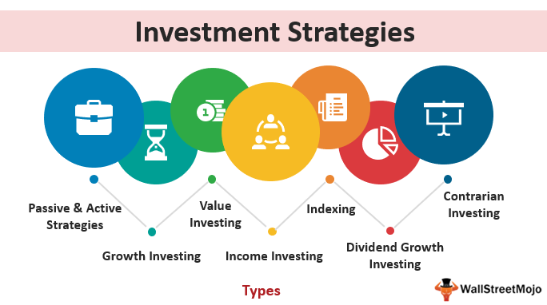

The world of investments provides a myriad of approaches for both individuals and institutions aiming to enhance their financial portfolios. Notably, Business Development Companies (BDCs) and algorithmic trading stand out as distinct opportunities within this landscape. BDCs serve as a bridge for investors to access private market investments, offering financial support to small and medium-sized enterprises (SMEs) which are otherwise difficult to invest in directly due to their stage of growth or financial distress. This makes BDCs a compelling option for those interested in venture capital-style investments outside the conventional public markets.

BDCs operate by extending loans or acquiring equity stakes in the companies they support, thus generating income through interest and dividends. Their unique structure and regulatory framework allow them to be publicly traded, thereby offering retail investors a chance to partake in these specialized investment opportunities. Understanding how BDCs function and their associated risks and rewards is crucial for investors considering this path.



On the other hand, algorithmic trading embodies the intersection of finance and technology, facilitating the automation of trading operations based on predefined criteria. This advanced trading approach enhances decision-making processes and optimizes trading efficiency by leveraging complex algorithms and high-speed computation. Algorithmic trading can identify optimal entry and exit points in various markets, such as commodities and stocks, often capturing opportunities that manual trading might overlook due to its inherent speed and precision. 

The synthesis of BDCs and algorithmic trading strategies offers a promising avenue for building a diversified investment portfolio. While BDCs provide access to high-yield, private equity-like investments, algorithmic trading can potentially augment portfolio performance through data-driven, timely market transactions. This article aims to equip readers with a thorough understanding of these investment strategies, shedding light on both their potential benefits and accompanying risks.

## Table of Contents

## Understanding Business Development Companies (BDCs)

A Business Development Company (BDC) is a publicly traded investment vehicle designed to provide financial support to small and medium-sized enterprises (SMEs) that are typically in distress or in the early stages of development. Established under the United States' Investment Company Act of 1940, BDCs were created to facilitate the flow of capital into privately held businesses that may lack access to traditional bank financing. BDCs primarily generate revenue through interest and dividends, which arise from extending loans or acquiring equity stakes in the companies they choose to support. This dual approach not only enables these entities to earn attractive returns but also creates the potential for capital appreciation through the equity positions they hold.

One of the significant advantages of BDCs is their structure and regulatory framework, which allows them to be publicly traded on major stock exchanges. This setup provides retail investors, who might not otherwise have the opportunity, access to venture capital-style investments. By purchasing shares in a BDC, investors effectively gain indirect exposure to a diversified portfolio of private market investments, including often elusive private companies.

Investing in BDCs carries distinct advantages, particularly in terms of dividend yields. Due to the nature of their business model and regulatory requirements, which mandate that BDCs distribute at least 90% of their taxable income to shareholders, they tend to offer relatively high dividend payouts compared to other investment vehicles. This attribute is particularly attractive for income-focused investors seeking regular returns from their portfolios.

However, it is crucial for investors to recognize the high-risk nature associated with BDC investments. The focus on smaller, often struggling enterprises means that BDCs are inherently exposed to higher credit risks. SMEs may be more susceptible to economic fluctuations, regulatory changes, and operational challenges than their larger counterparts. Consequently, BDC investments can experience significant [volatility](/wiki/volatility-trading-strategies), and the potential for defaults in loan repayments or declines in the value of equity stakes must be considered.

Investors must conduct thorough due diligence when evaluating potential BDC investments. Key considerations include analyzing the management team’s expertise, the quality of the BDC's portfolio assets, and historical performance metrics. Such diligent analysis can help mitigate some of the inherent risks and support informed decision-making.

## Investment Strategies for BDCs

When considering an investment in Business Development Companies (BDCs), investors can employ various strategies tailored to their financial goals and risk preferences. The primary attraction for many investors in BDCs is the potential for income generation through high dividend yields. BDCs typically distribute a significant portion of their income as dividends due to their regulated investment company (RIC) status, crucial for investors focused on generating steady cash flow. 

For investors aiming at capital appreciation, identifying BDCs with a proven track record of successful investments and consistent growth in net asset value (NAV) is essential. This involves examining a BDC's historical performance and strategy for selecting portfolio companies. BDCs with competencies in identifying promising investment opportunities and managing them efficiently tend to demonstrate stable or growing NAVs over time, adding value beyond dividends.

Another strategic consideration involves diversification across multiple BDCs. Diversifying investments can mitigate risks and reduce volatility associated with individual BDCs. Different BDCs often focus on varied sectors or types of loans, offering exposure across a spectrum of industries. This approach can help shield investors from market-specific downturns and leverage sector-specific growth.

A thorough analysis of a BDC's management is indispensable. The leadership's experience and expertise can significantly influence investment outcomes. Evaluating asset quality and examining historical performance can also provide vital insights. Analyzing metrics like default rates, recovery rates, and portfolio company performance can help investors assess the stability and potential risk associated with a particular BDC. 

Careful selection and diversification, combined with ongoing evaluation of a BDC's management and investment portfolio quality, can form a robust strategy for integrating BDCs into a well-rounded investment portfolio.

## The Role of Algorithmic Trading in Investment Strategies

Algorithmic trading, commonly referred to as algo trading, utilizes automated systems to execute trades based on predefined mathematical and statistical criteria, significantly enhancing trading efficiency and precision. This sophisticated method is instrumental in modern investment strategies due to its ability to minimize human errors and its capacity to operate across multiple markets simultaneously without the need for constant manual oversight.

At the core of [algorithmic trading](/wiki/algorithmic-trading) is its reliance on complex mathematical models and algorithms designed to optimize entry and [exit](/wiki/exit-strategy) points in various financial instruments, including commodities, stocks, and foreign exchange. By analyzing large data sets and market conditions in real time, these systems can identify patterns and trends that are not easily discernible to the human eye, thereby facilitating more informed trading decisions. This capability is particularly advantageous in high-frequency trading ([HFT](/wiki/high-frequency-trading-strategies)) scenarios where speed and accurateness are paramount. For example, the difference between capturing a profitable trading opportunity or missing it can often be measured in milliseconds, a timeframe within which human traders would struggle to compete.

The integration of algorithmic trading within a broader investment strategy, such as investments in Business Development Companies (BDCs), can potentially optimize portfolio returns. BDCs, which focus on providing capital to smaller, developing companies, may benefit from the enhanced decision-making abilities of algorithmic systems. As market conditions shift, algorithmic trading can make timely adjustments to investment holdings, ensuring alignment with current trends. This dynamic adjustment is crucial in volatile markets where rapid changes can lead to significant financial consequences.

Python, a widely used programming language in quantitative finance, offers tools like the `pandas` library for data analysis and `numpy` for numerical computation, both of which are beneficial in developing algorithmic trading strategies. Below is a simplified example of how Python can be used to implement a basic trading algorithm:

```python
import pandas as pd
import numpy as np

# Example data: stock prices
data = {
    'price': [150, 152, 149, 153, 155, 150, 147, 149, 152, 151]
}
df = pd.DataFrame(data)

# Simple Moving Average (SMA) strategy
short_window = 3
long_window = 5

df['short_mavg'] = df['price'].rolling(window=short_window, min_periods=1).mean()
df['long_mavg'] = df['price'].rolling(window=long_window, min_periods=1).mean()

# Generate signals
df['signal'] = 0
df['signal'][short_window:] = np.where(df['short_mavg'][short_window:] > df['long_mavg'][short_window:], 1, 0)

# Print the signals
print(df)
```

The example above demonstrates a simple trading strategy that generates buy signals when a short-term moving average crosses above a long-term moving average. This type of systematic approach can help investors navigate complex markets efficiently.

While algorithmic trading offers numerous benefits, it is not without risks. Technical failures, such as system malfunctions or connectivity issues, can disrupt trading activities, leading to unforeseen losses. Moreover, the reliance on historical data for model development may not always account for unprecedented market conditions, which can affect predictive accuracy. Consequently, investors and traders must remain vigilant and continuously monitor both the performance of their algorithmic models and the broader market landscape to ensure sustained efficacy and alignment with financial objectives.

## Advantages and Risks of BDCs and Algo Trading

Business Development Companies (BDCs) provide investors with unique opportunities to engage in private market investments that are traditionally out of reach for individual investors. A significant advantage of investing in BDCs is the potential for high dividend yields. This is primarily due to their mandate to distribute 90% of their profits as dividends to shareholders, as stipulated by regulatory frameworks[1]. Additionally, BDCs offer diversification by investing in a variety of small to medium-sized enterprises across different industries.

Despite these benefits, BDCs come with inherent risks. The focus on smaller, often financially unstable companies can lead to increased market volatility which, in turn, can impact the stability of returns. Moreover, BDCs are sensitive to [interest rate](/wiki/interest-rate-trading-strategies) fluctuations, potentially affecting their profitability and, consequently, the dividends distributed to investors[2].

Algorithmic trading brings a different set of advantages and risks to the investment strategy table. By using automated systems to execute trades based on predefined criteria, algorithmic trading enhances decision-making through operational efficiency and speed. This allows for the execution of high-frequency trades with precision that is unattainable through manual trading. However, this method is not without risks. Technical failures, such as software bugs or system malfunctions, pose a significant threat to trading operations. Additionally, market [liquidity](/wiki/liquidity-risk-premium) issues can impact the effectiveness of algorithmic strategies, particularly in markets with lower trading volumes[3].

Both BDC investments and algorithmic trading require a comprehensive understanding of their respective frameworks and a nuanced approach to management. This includes assessing the quality and reliability of BDC portfolios and continuously monitoring the performance of algorithmic trading models to ensure they align with investor goals and market conditions. Investors ought not only to keep an eye on the financial metrics of BDCs but also to validate the integrity and reliability of their algorithmic systems. This is crucial to mitigate potential risks and adapt to ever-evolving market dynamics in real-time.

By understanding both the advantages and risks associated with BDC investments and algorithmic trading, investors can better align these strategies with their financial objectives and risk profiles, thus crafting a more resilient and diversified investment portfolio.

### References
1. [U.S. Securities and Exchange Commission. Business Development Companies](https://www.sec.gov)
2. [National Association of Insurance Commissioners. Interest Rate Risk](https://www.naic.org)
3. Avellaneda, M., & Stoikov, S. (2008). "High-frequency trading in a limit order book". Quantitative Finance.

## Conclusion

Investing in Business Development Companies (BDCs) and employing algorithmic trading are contemporary investment strategies that have the potential to significantly enhance the diversification and performance of an investment portfolio. BDCs allow investors to tap into high returns through dividends and potential capital growth owing to their focus on small and medium-sized enterprises, which are often not accessible through traditional public markets. However, the inherent risks, such as market volatility and the vulnerability of smaller companies, necessitate a cautious and informed approach.

On the other hand, algorithmic trading optimizes the trading process by executing trades based on precise, data-driven decisions across multiple markets. This approach not only enhances efficiency by reducing the likelihood of human error but also capitalizes on trading opportunities that may arise in high-frequency scenarios. Despite its advantages, algorithmic trading requires persistent oversight and technical maintenance to adapt to changing market conditions and to mitigate risks associated with system failures or market liquidity issues.

Investors should carefully assess their financial objectives, risk tolerance, and the requirement for diversification when integrating these strategies into their portfolios. A well-rounded consideration of personal investment goals, along with a prudent evaluation of the risks associated with BDCs and algorithmic trading, is crucial. Moreover, seeking advice from financial professionals and maintaining an active engagement with current market trends can refine and enhance these investment strategies, leading to more effective and successful investment outcomes.

## References & Further Reading

[1]: Bergstra, J., Bardenet, R., Bengio, Y., & Kégl, B. (2011). ["Algorithms for Hyper-Parameter Optimization."](https://papers.nips.cc/paper/4443-algorithms-for-hyper-parameter-optimization) Advances in Neural Information Processing Systems 24.

[2]: ["Advances in Financial Machine Learning"](https://www.amazon.com/Advances-Financial-Machine-Learning-Marcos/dp/1119482089) by Marcos Lopez de Prado

[3]: ["Evidence-Based Technical Analysis: Applying the Scientific Method and Statistical Inference to Trading Signals"](https://www.amazon.com/Evidence-Based-Technical-Analysis-Scientific-Statistical/dp/0470008741) by David Aronson

[4]: ["Machine Learning for Algorithmic Trading"](https://github.com/stefan-jansen/machine-learning-for-trading) by Stefan Jansen

[5]: ["Quantitative Trading: How to Build Your Own Algorithmic Trading Business"](https://www.amazon.com/Quantitative-Trading-Build-Algorithmic-Business/dp/1119800064) by Ernest P. Chan