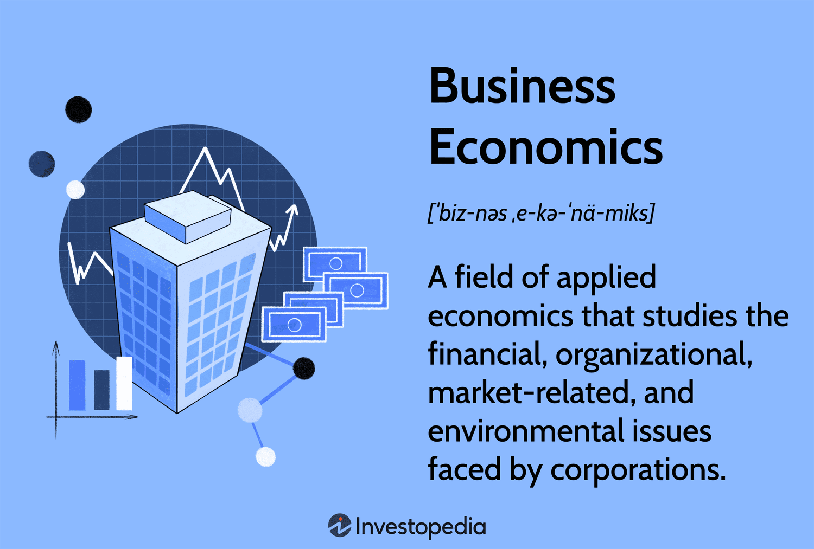

## Table of Contents

## What is business economics?

Business economics is a field that combines economic theories and principles with business practices to help companies make better decisions. It focuses on understanding how businesses work, how they can improve their performance, and how they can adapt to changes in the market. By using tools like supply and demand analysis, cost-benefit analysis, and market research, business economists help companies figure out the best ways to use their resources, set prices, and plan for the future.

One key part of business economics is understanding the market environment. This includes looking at competitors, customers, and overall economic conditions. Business economists use this information to help companies predict future trends and make strategic plans. For example, if a business economist sees that a new technology is becoming popular, they might suggest that the company invest in that technology to stay competitive.

Another important aspect is financial management. Business economists help companies manage their money by analyzing financial data, creating budgets, and planning investments. They also look at how different financial decisions will affect the company's profits and growth. By doing this, they help businesses make smart choices that can lead to long-term success.

## How does business economics differ from general economics?

Business economics and general economics both study how resources are used and how people make choices, but they focus on different things. General economics looks at the big picture. It studies things like how the whole economy works, why prices go up or down, and how government policies affect everyone. It's about understanding the economy as a whole, including things like unemployment, inflation, and international trade.

On the other hand, business economics zooms in on individual businesses and industries. It uses the ideas from general economics to help companies make better decisions. Business economists look at how a company can make more money, how it can compete with other companies, and how it should plan for the future. They use tools like market research and cost analysis to help businesses figure out the best way to use their resources and make profits.

In simple terms, general economics is like looking at a map of the whole world, while business economics is like looking at a detailed map of a specific city. Both are important, but they help us understand different parts of the economy.

## What are the main objectives of business economics?

The main goal of business economics is to help companies make better decisions. It does this by using economic theories and tools to understand how businesses can use their resources in the best way possible. Business economists look at things like how much it costs to make a product, how much people are willing to pay for it, and how the company can make more money. They use this information to help the company decide things like what price to set for their products, how much to produce, and where to invest their money.

Another important objective of business economics is to help companies understand their market and competitors. This means looking at what other companies are doing, what customers want, and what is happening in the economy. By doing this, business economists can help companies predict what might happen in the future and plan accordingly. For example, if a new technology is becoming popular, a business economist might suggest that the company start using it to stay ahead of the competition.

Overall, business economics aims to improve a company's performance and help it grow. It does this by providing insights and strategies that are based on solid economic principles. By understanding the costs, benefits, and market conditions, business economists help companies make smart choices that lead to more profits and long-term success.

## What are the key principles of business economics?

Business economics is all about using simple economic ideas to help companies make good choices. One key principle is understanding supply and demand. This means figuring out how much of a product people want to buy and how much it costs to make it. If a company can find the right balance, they can set a good price that people are willing to pay and still make a profit. Another important principle is cost-benefit analysis. This is when a company looks at the costs of doing something and weighs them against the benefits. If the benefits are bigger than the costs, it's usually a good idea to go ahead with the plan.

Another principle of business economics is knowing the market. This means understanding who the company's customers are, what they want, and what other companies are doing. By doing market research, a company can learn about trends and changes in what people want. This helps them decide what products to make and how to sell them. A third principle is financial management. This involves looking at the company's money, making budgets, and planning investments. Good financial management helps a company use its money wisely and make more profit.

Overall, business economics is about using these simple principles to help companies make smart decisions. By understanding supply and demand, doing cost-benefit analysis, knowing the market, and managing finances well, companies can improve their performance and grow. These principles guide businesses in using their resources in the best way possible to achieve success.

## What are the different types of business economics?

Business economics can be split into different types based on what they focus on. One type is managerial economics, which helps managers make decisions. It uses economic theories to solve everyday business problems, like figuring out the best price for a product or deciding how much to produce. Managerial economics looks at things like costs, revenues, and how to use resources efficiently. It helps managers understand how their choices affect the company's profits and growth.

Another type is financial economics, which deals with money matters in a business. It looks at how a company can manage its finances to make more money. Financial economists study things like investments, how to get money (like loans or selling stocks), and how to manage risks. They help businesses make smart financial decisions that can lead to long-term success. Financial economics is important for planning and making sure a company stays financially healthy.

A third type is industrial economics, which focuses on how companies in the same industry compete with each other. It looks at things like market structures, how companies set prices, and how they can work together or against each other. Industrial economists study the big picture of an industry to help companies understand their position and make strategic plans. This type of business economics helps companies figure out how to stay competitive and grow in their market.

## How do microeconomics and macroeconomics relate to business economics?

Microeconomics and macroeconomics both play important roles in business economics. Microeconomics looks at small parts of the economy, like how individual businesses or consumers make choices. It helps business economists understand things like how much a company should produce, what price to set, and how to manage costs. For example, if a business wants to know how changing the price of a product will affect its sales, they would use microeconomic principles to figure it out. By understanding these small details, business economists can help companies make better decisions about their day-to-day operations and strategies.

Macroeconomics, on the other hand, looks at the big picture of the economy, like how unemployment, inflation, and government policies affect everyone. Business economists use macroeconomic ideas to help companies understand the overall economic environment they are working in. For instance, if the economy is growing, a business might decide to expand because people are likely to spend more money. If the economy is struggling, the business might need to be more careful with its spending. By keeping an eye on these big economic trends, business economists can help companies plan for the future and adapt to changes in the market.

## What role does demand and supply play in business economics?

Demand and supply are key ideas in business economics. They help companies figure out how much to make and what price to charge. Demand is all about how much people want to buy something. If lots of people want a product, the demand is high. Supply is about how much of that product is available. When demand is high and supply is low, the price usually goes up because people are willing to pay more to get it. On the other hand, if there's a lot of supply but not much demand, the price might go down because the company needs to sell what they have.

Understanding demand and supply helps businesses make smart choices. For example, if a company sees that demand for their product is growing, they might decide to make more of it. They could also raise the price a bit because people are willing to pay more. If the supply of their product is too high and it's not selling well, the company might lower the price to get rid of extra stock. By keeping an eye on demand and supply, businesses can set the right prices, make the right amount of products, and stay profitable.

## How can businesses use economic forecasting in their planning?

Businesses can use economic forecasting to plan for the future by predicting what might happen in the economy. Economic forecasting looks at things like how fast the economy is growing, how much people are spending, and what might change in the future. By understanding these trends, businesses can make better decisions about things like how much to produce, what price to set, and where to invest their money. For example, if a forecast shows that the economy is going to grow, a business might decide to expand because people will likely have more money to spend. On the other hand, if a forecast shows that the economy might slow down, a business might choose to be more careful with spending and save money for tougher times.

Economic forecasting also helps businesses understand what their customers might do in the future. By looking at economic data, businesses can predict if people will buy more or less of their products. This can help them plan their inventory and marketing strategies. For instance, if a forecast shows that people will have less money to spend, a business might focus on selling cheaper products or offering discounts to keep sales up. By using economic forecasting, businesses can be ready for changes and make plans that help them stay successful no matter what happens in the economy.

## What are some common economic indicators that businesses should monitor?

Businesses should keep an eye on a few key economic indicators to understand how the economy is doing and how it might affect them. One important indicator is the Gross Domestic Product (GDP), which shows how much the whole economy is growing or shrinking. If GDP is going up, it usually means people are spending more money, which can be good for businesses. Another useful indicator is the unemployment rate. When fewer people are out of work, they have more money to spend, which can lead to more sales for businesses. Businesses also watch inflation rates because they affect how much things cost. If prices are going up quickly, businesses might need to raise their prices too, which can change how much people are willing to buy.

Another set of indicators businesses should monitor includes consumer confidence and retail sales. Consumer confidence tells businesses how people feel about the economy and their own money. If people feel good, they're more likely to spend money on things they want, which can boost sales for businesses. Retail sales numbers show how much people are actually buying, which can help businesses plan how much to produce and what to stock in their stores. Keeping an eye on these indicators helps businesses make smart choices about their plans and strategies. By understanding these economic signs, businesses can be ready for changes and stay successful.

## How does market structure influence business strategies in economics?

Market structure is all about how many companies are in a market and how they compete with each other. It can be things like a monopoly, where one company controls everything, or perfect competition, where lots of small companies sell similar products. The type of market structure a business is in really affects the strategies they use. In a monopoly, a company might focus on keeping prices high because they don't have much competition. But in a market with perfect competition, businesses need to keep prices low and find other ways to stand out, like offering better service or unique products.

Understanding the market structure helps businesses decide how to act. For example, in an oligopoly, where a few big companies control the market, businesses often watch what their competitors are doing closely. They might try to match prices or come up with new products to stay ahead. In a monopolistic competition, where many companies sell similar but slightly different products, businesses focus on making their products special and different from others. By knowing the market structure, businesses can make smart choices about pricing, product development, and marketing to stay competitive and grow.

## What advanced tools and models are used in business economics analysis?

In business economics, people use advanced tools and models to help them understand and predict how businesses will do. One common tool is regression analysis, which helps find out how different things, like price or advertising, affect sales. It's like looking at a bunch of data to see patterns and make guesses about the future. Another useful model is the input-output model, which shows how different parts of a business or an economy depend on each other. For example, it can show how changes in one part, like raw materials, affect other parts, like finished products. These tools help businesses make better decisions by giving them a clearer picture of what's going on.

Another important tool is econometric modeling, which uses math and [statistics](/wiki/bayesian-statistics) to study economic relationships. It can help businesses predict things like how much people will buy or how prices will change. Businesses also use game theory, which is about understanding how companies compete with each other. It helps them figure out the best moves to make, like setting prices or launching new products, by thinking about what their competitors might do. By using these advanced tools and models, businesses can plan better and make choices that help them grow and succeed.

## How can businesses apply game theory to improve their economic decisions?

Game theory helps businesses make better decisions by thinking about what their competitors might do. It's like playing a game where you need to guess what the other players will do next. For example, if a business wants to lower its prices, they use game theory to think about how their competitors might react. Will they also lower their prices, or will they keep them the same? By understanding these possible moves, a business can choose the best strategy to stay ahead. This helps them make smart choices about things like pricing, marketing, and product launches.

Using game theory also helps businesses plan for different situations. They can look at different scenarios and see what might happen if they make one choice or another. For instance, if a business is thinking about starting a new product line, they can use game theory to predict how their competitors might respond. Will they start a similar product, or will they focus on something else? By thinking through these possibilities, businesses can be ready for whatever happens and make decisions that help them succeed in the long run.

## What are the types of algorithmic trading strategies?

Algorithmic trading strategies leverage mathematical algorithms and data analysis to execute trades efficiently and effectively. These strategies are designed to exploit patterns, inefficiencies, or predictable behaviors in markets, aiming for optimized profit outcomes. Here are some of the primary types of [algorithmic trading](/wiki/algorithmic-trading) strategies:

1. **Trend-Following Strategies**: These strategies capitalize on market trends, typically using technical indicators such as moving averages to make trading decisions. Traders identify a market direction and establish positions that will benefit from the continuation of that trend. For example, the simple moving average (SMA) can be calculated over a defined period to detect upward or downward trends. Python can be used to implement this strategy as demonstrated below:

   ```python
   import pandas as pd

   # DataFrame 'data' to include 'Close' price column of market data
   data['SMA_50'] = data['Close'].rolling(window=50).mean()
   data['SMA_200'] = data['Close'].rolling(window=200).mean()

   data['Signal'] = 0
   data.loc[data['SMA_50'] > data['SMA_200'], 'Signal'] = 1  # Buy signal
   data.loc[data['SMA_50'] < data['SMA_200'], 'Signal'] = -1 # Sell signal
   ```

2. **Arbitrage Opportunities**: This strategy exploits price discrepancies of identical or similar financial instruments across different markets or forms. Arbitrage algorithms can execute trades faster than manual trading to secure a risk-free profit before the market corrects the price difference. An example of arbitrage is currency arbitrage, where a trader looks for discrepancies among various currency exchanges to profit from conversions.

3. **Index Fund Rebalancing**: Large index funds regularly rebalance their portfolios to reflect changes in the composition of indices. This rebalancing creates predictable buying and selling patterns. Algorithmic trading can anticipate these moves, allowing traders to benefit from the temporary impact on stock prices. Investors can pre-emptively trade stocks expected to be added or removed from indices based on index fund activities.

4. **Mathematical Model-Based Strategies**: These rely on complex mathematical models to derive trading decisions. Examples include delta-neutral strategies, which seek to keep the portfolio's delta—the rate of change of the portfolio’s value relative to the underlying asset—at zero, thereby hedging against market movements. These strategies often use options to adjust the delta of a portfolio:
$$
   \Delta = \frac{\partial V}{\partial S}

$$

   where $V$ is the price of the option, and $S$ is the price of the underlying stock.

Each strategy type is based on leveraging specific market dynamics and quantitative models to gain an advantage, underlining the critical role of technology and data analysis in modern financial trading.

## References & Further Reading

[1]: Bergstra, J., Bardenet, R., Bengio, Y., & Kégl, B. (2011). ["Algorithms for Hyper-Parameter Optimization."](https://papers.nips.cc/paper/4443-algorithms-for-hyper-parameter-optimization) Advances in Neural Information Processing Systems 24.

[2]: ["Advances in Financial Machine Learning"](https://www.amazon.com/Advances-Financial-Machine-Learning-Marcos/dp/1119482089) by Marcos Lopez de Prado

[3]: ["Evidence-Based Technical Analysis: Applying the Scientific Method and Statistical Inference to Trading Signals"](https://www.amazon.com/Evidence-Based-Technical-Analysis-Scientific-Statistical/dp/0470008741) by David Aronson

[4]: ["Machine Learning for Algorithmic Trading"](https://github.com/stefan-jansen/machine-learning-for-trading) by Stefan Jansen

[5]: ["Quantitative Trading: How to Build Your Own Algorithmic Trading Business"](https://www.amazon.com/Quantitative-Trading-Build-Algorithmic-Business/dp/1119800064) by Ernest P. Chan