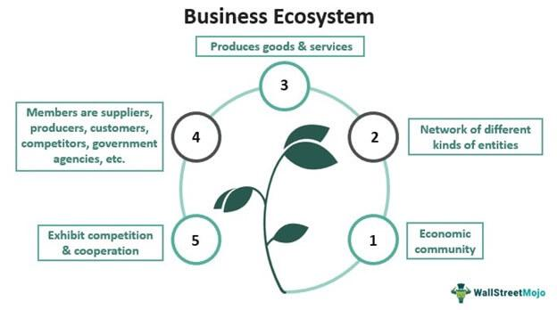

In today's rapidly evolving business landscape, understanding the dynamics of business ecosystems is crucial. Business ecosystems represent networks of interconnected organizations, ranging from suppliers and distributors to customers and sometimes competitors. These complex systems are designed to create and share value among participants, facilitating both competition and cooperation. 

The concept of business ecosystems has gained prominence in recent years as organizations endeavor to adapt to increasingly complex market conditions. By forming networks of strategic partnerships, these organizations can enhance their resilience, optimize resource allocation, and foster innovation.



Advanced technologies have significantly transformed these ecosystems, making the integration of artificial intelligence (AI) and algorithmic trading more prevalent. AI plays a pivotal role in processing vast amounts of data in real-time, enabling businesses to respond swiftly and effectively to changing conditions within their ecosystems. Algorithmic trading, which relies heavily on these technological advancements, exemplifies the profound impact that AI can have on business operations. By leveraging algorithms to execute trades with minimal human intervention, financial markets can achieve greater efficiency and precision.

This article examines the intricacies of business functionality ecosystem dynamics, particularly within the context of algorithmic trading. Understanding how these elements interact is essential for organizations seeking to maintain a competitive edge and navigate the complexities of the modern commercial environment.

## Table of Contents

## Understanding Business Ecosystems

A business ecosystem is a complex network of interconnected entities that collectively contribute to the functioning and evolution of business processes and markets. This ecosystem comprises various players such as suppliers, distributors, customers, competitors, and other stakeholders, each playing a distinct role. These entities operate within a framework that is both competitive and cooperative — sometimes working against each other to gain market share, yet often collaborating to create value that benefits all participants.

The interactions within a business ecosystem can significantly influence the success and survival of individual players. For instance, suppliers must maintain a reliable and cost-effective distribution channel, while distributors and retailers need to ensure efficient logistics and customer satisfaction. Customers, on the other hand, influence the ecosystem by their preferences and spending power, which in turn affects demand and supply dynamics. Moreover, competitors can drive innovation and improvements by introducing new products or enhancing existing services, prompting others to adapt or risk obsolescence.

The concept of business ecosystems gained popularity as a strategic approach to help organizations adapt to increasingly complex market conditions. Traditional linear business models have become less effective as markets globalize and technological advancements accelerate. Business ecosystems offer a more dynamic and flexible structure, allowing entities to respond quickly to changes and leverage one another's strengths. By understanding network behaviors, companies can anticipate shifts in market trends, consumer behavior, and technological innovations.

In essence, a business ecosystem functions similarly to a natural ecosystem, where each species interacts with others in a habitat. A balance is crucial; the decline or enhancement of one entity can have ripple effects throughout the ecosystem. Organizations that effectively navigate this intricate web of relationships can achieve sustainable growth, enhance resilience, and maintain a competitive edge in an ever-evolving marketplace. Understanding these dynamics is therefore vital for businesses aiming to thrive in today's interconnected world.

## The Role of AI and Technology in Ecosystems

Technological advances have significantly reshaped the operation of business ecosystems, with Artificial Intelligence (AI) playing a pivotal role in this transformation. AI has enabled real-time data processing, which is a cornerstone of modern business ecosystems' adaptability. Through the continuous analysis and processing of large data sets, AI can assist in making informed decisions quickly, a critical requirement for businesses that need to adapt swiftly to changing market conditions. 

AI achieves this through various [machine learning](/wiki/machine-learning) techniques, including supervised and unsupervised learning, which allow systems to predict trends, create models, and automate processes. For instance, AI-driven analytics can process customer data to predict buying patterns, enabling more personalized marketing strategies and inventory management. This ability allows businesses to remain competitive by rapidly adjusting to consumer demands.

Furthermore, AI's integration into business ecosystems fosters enhanced efficiency by automating routine tasks, thus freeing up human resources for more strategic activities. Automation tools, powered by AI, can handle complex tasks, such as customer service management through chatbots or predictive maintenance in manufacturing, reducing costs and increasing productivity. An example in Python might include using libraries such as TensorFlow to create models that predict equipment failures, thereby enabling preemptive maintenance scheduling:

```python
import tensorflow as tf
from tensorflow import keras
import numpy as np

# Example model for predictive maintenance
model = keras.Sequential([
    keras.layers.Dense(64, activation='relu', input_shape=(input_shape,)),
    keras.layers.Dense(64, activation='relu'),
    keras.layers.Dense(1, activation='sigmoid'),
])

model.compile(optimizer='adam',
              loss='binary_crossentropy',
              metrics=['accuracy'])

model.fit(training_data, training_labels, epochs=10, batch_size=32, validation_split=0.2)
```

This Python snippet illustrates how predictive maintenance can be structured, training a model to forecast potential equipment failures based on historical sensor data.

Additionally, AI drives innovation within business ecosystems by providing tools to explore new business models and products. For example, AI can streamline research and development processes by simulating scenarios or predicting outcomes, which reduces the time and cost traditionally associated with innovation. The competitive edge offered by AI arises from its ability to leverage vast amounts of data to predict market trends and consumer behaviors, thus providing businesses with actionable insights that can lead to market leadership.

In conclusion, AI and technology are integral to enhancing the functionality and adaptability of business ecosystems. By improving efficiency, fostering innovation, and providing a competitive advantage, AI helps businesses thrive in today’s rapidly evolving technological landscape.

## Algo Trading in the Business Ecosystem

Algorithmic trading, a vital component of contemporary financial markets, is deeply embedded within the dynamics of business ecosystems. At its core, [algorithmic trading](/wiki/algorithmic-trading) involves leveraging advanced algorithms and large data sets to execute trades autonomously, reducing the need for human intervention and allowing for high-frequency trading ([HFT](/wiki/high-frequency-trading-strategies)) and complex strategies. It is increasingly prevalent in markets due to its efficiency and ability to minimize human error.

Central to the success of algorithmic trading is the collaboration among various entities within the trading ecosystem. Data providers, traders, and technology developers form the backbone of this system. Data providers offer the vast streams of real-time information necessary for algorithms to function effectively. These data streams may include stock prices, market news, and social media sentiment, all crucial for comprehensive market analysis.

Traders and financial institutions rely on algorithmic systems to analyze these data sets and execute trades based on predefined conditions. The algorithms can monitor multiple markets and instruments simultaneously, taking advantage of opportunities that arise in milliseconds. For example, a simple moving average crossover strategy can be coded in Python as follows:

```python
def sma_crossover(prices, short_window, long_window):
    short_rolling = prices.rolling(window=short_window).mean()
    long_rolling = prices.rolling(window=long_window).mean()

    signals = pd.DataFrame(index=prices.index)
    signals['signal'] = 0.0
    signals['short_mavg'] = short_rolling
    signals['long_mavg'] = long_rolling
    signals['signal'][short_window:] = np.where(signals['short_mavg'][short_window:] > signals['long_mavg'][short_window:], 1.0, 0.0)
    signals['positions'] = signals['signal'].diff()

    return signals
```

Tech developers play a crucial role by designing and maintaining the software and infrastructure necessary for executing these complex strategies. They ensure that the trading algorithms are robust, scalable, and secure, which is vital for operation within the ultra-competitive landscape of financial trading.

Furthermore, the ecosystem's efficiency and competitive advantage stem from continuous innovation and adaptation. Firms within the ecosystem are constantly developing more sophisticated algorithms and leveraging cutting-edge technologies, such as machine learning and [artificial intelligence](/wiki/ai-artificial-intelligence), to enhance trading accuracy and speed.

The business ecosystem supporting algorithmic trading thrives on the synergies created by integrating diverse technological and informational resources. This interconnectedness not only enhances market [liquidity](/wiki/liquidity-risk-premium) but also facilitates a more stable trading environment by offering diverse perspectives and strategies. Ultimately, the collaboration of these ecosystem participants catalyzes advancements in trading technology, driving the evolution of financial markets.

## Challenges and Opportunities

Ecosystems in business present both formidable challenges and significant opportunities for entities that operate within them. At the core of these ecosystems are intricate networks of relationships and dependencies that businesses must skillfully navigate. The barriers to entry often include high initial costs of technology adoption and the complexity of integrating diverse, rapidly evolving technological elements. For instance, algorithmic trading systems demand significant capital investments in state-of-the-art computational infrastructure and sophisticated algorithms capable of parsing vast datasets in real time.

Simultaneously, these ecosystems also offer substantial opportunities for innovation and growth. The interconnected nature of businesses within an ecosystem enables them to leverage shared resources, fostering a collaborative environment conducive to innovation. Companies that can effectively harness the capabilities of artificial intelligence (AI) and machine learning stand to gain a competitive advantage by improving decision-making processes and operational efficiencies.

Navigating the dynamic interactions and dependencies within a business ecosystem requires businesses to be adaptive and resilient. This adaptability is a key determinant of long-term success. Organizations must continuously evaluate their strategies and adopt a flexible approach to modifying business models in response to shifts within the ecosystem. For example, algorithmic traders may need to recalibrate their models in response to changes in market conditions or regulations.

The ability to evolve in response to ecosystem dynamics helps companies not only to survive but to thrive, fostering an ongoing cycle of innovation and development. In essence, understanding and engaging with these challenges and opportunities is crucial for businesses seeking sustainability and growth in today's competitive landscape.

## Conclusion

Business ecosystems have become foundational to the modern commercial landscape, acting as frameworks within which organizations can thrive through collaboration, competition, and innovation. The integration of Artificial Intelligence (AI) and algorithmic trading (algo trading) represents a significant shift in how businesses operate and compete. The capacity to harness advanced technologies and leverage the dynamics of business ecosystems is crucial for maintaining a competitive edge.

AI and algo trading constitute pivotal components in this transformation, bringing about efficiency and precision in decision-making processes. By effectively employing AI, organizations can analyze massive datasets quickly, allowing for rapid adaptations and strategic decisions that are vital in fast-paced markets. Similarly, algo trading systems capitalize on these capabilities to execute trades efficiently, minimizing human error and capitalizing on market opportunities.

For companies aiming to succeed in such an evolving environment, a deep understanding of ecosystem dynamics is essential. This involves recognizing both the collaborative and competitive interactions within the ecosystem and how these can be managed to foster growth and innovation. Barriers such as entry costs and technological complexities can be surmounted by leveraging the inherent opportunities for innovation within these ecosystems.

Organizations that adopt a strategic approach towards engaging with their ecosystems tend to be better positioned to adapt to changes and capitalize on new opportunities. This approach ensures resilience and continued relevance in a digital era characterized by rapid technological advancements and changing market demands. The future of commerce, driven by AI and algo trading, promises unprecedented levels of efficiency and scope for innovation—provided that organizations are agile and knowledgeable enough to harness the ecosystem's full potential.

## References & Further Reading

[1]: Iansiti, M., & Levien, R. (2004). ["The Keystone Advantage: What the New Dynamics of Business Ecosystems Mean for Strategy, Innovation, and Sustainability."](https://www.jstor.org/stable/4166241) Harvard Business Review Press.

[2]: ["Platform Revolution: How Networked Markets Are Transforming the Economy—and How to Make Them Work for You"](https://www.amazon.com/Platform-Revolution-Networked-Markets-Transforming/dp/0393249131) by Geoffrey G. Parker, Marshall W. Van Alstyne, and Sangeet Paul Choudary

[3]: Lopez de Prado, M. (2018). ["Advances in Financial Machine Learning"](https://www.amazon.com/Advances-Financial-Machine-Learning-Marcos/dp/1119482089) Wiley Finance.

[4]: ["Artificial Intelligence in Finance: A Review"](https://link.springer.com/article/10.1007/s43546-023-00618-x) by Kazuhisa Takahashi et al. 

[5]: ["Algorithmic Trading: Winning Strategies and Their Rationale"](https://www.wiley.com/en-us/Algorithmic+Trading%3A+Winning+Strategies+and+Their+Rationale-p-9781118460146) by Ernest P. Chan