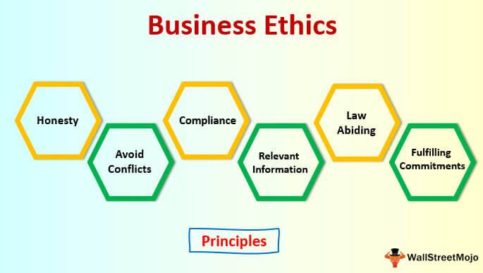

In today's interconnected world, businesses operate across international borders, facing an array of cultural backgrounds and ethical standards. These differences are of particular importance in fields like algorithmic trading, where ethical considerations are critical to maintaining trust and integrity in financial markets. Algorithmic trading relies on technology and algorithms to execute trades with precision and speed, making the ethical frameworks that govern such operations essential for ensuring transparency and fairness.

Understanding the impact of cultural values on business ethics helps delineate why certain practices are deemed acceptable in one region and unacceptable in another. This is paramount for multinational companies aiming to expand globally while respecting the local norms of the countries they enter. The ability to navigate these cultural differences in business ethics is vital for successful international operations. Such navigation not only involves adopting ethical standards that respect local customs and practices but also integrating them with universally accepted ethical principles to maintain a competitive edge in global markets.

This article examines how these cultural differences influence business practices and ethics across various regions. An emphasis is placed on the importance of aligning business operations with ethical standards that accommodate local cultural nuances. As businesses expand into new markets, they must develop strategies to adapt their operations to the ethical expectations of diverse cultural landscapes.

In addition, we explore how businesses can effectively integrate and adapt these ethical standards into their daily operations, fostering an environment where ethical integrity is not sacrificed for corporate gain. By doing so, companies can enhance their reputation and ensure fair practices, particularly in fast-paced industries like algorithmic trading, which demand a high degree of ethical accountability. Recognizing and appreciating cultural diversity in business ethics is, therefore, instrumental for sustainable growth and success on a global scale.

## Table of Contents

## Understanding Business Ethics

Business ethics are the moral principles and standards that serve as guidelines for behavior within business environments. They encompass a wide range of issues, including corporate governance, insider trading, bribery, discrimination, corporate social responsibility, and fiduciary responsibilities. The foundational aim of business ethics is to foster trust, integrity, and accountability in business activities, thereby constructing a reputable image and nurturing positive relationships with stakeholders such as employees, customers, suppliers, and investors.

The significance of business ethics extends beyond mere compliance with laws and regulations; they are essential in forming the cornerstone of a company's reputation. A strong ethical framework can influence a company's bottom line by instilling trust and loyalty among consumers and within the industry. For instance, adhering to ethical standards in advertising by being honest about product features can enhance a brand's credibility, attracting more customers and fostering long-term relationships. Additionally, businesses that uphold high ethical standards tend to enjoy better employee morale and commitment, reducing turnover and increasing productivity.

While certain ethical principles such as honesty, fairness, and transparency are widely accepted across the globe, the interpretation and implementation of these principles can vary significantly due to cultural values and regional norms. For example, notions of corporate responsibility may differ: Western cultures might emphasize shareholder value maximization, whereas Eastern philosophies might prioritize stakeholder and community well-being. This divergence can be attributed to differing historical, philosophical, and social influences that shape business practices and ethical expectations within each cultural milieu.

For multinational corporations aiming to expand their operations globally, understanding these nuances is indispensable. When entering new markets, businesses must navigate the cultural differences and adapt their ethical standards accordingly to align with local expectations while maintaining their core values. For example, while gift-giving might be viewed as a token of respect in some cultures, it could be construed as bribery in others. Consequently, businesses must undertake thorough cultural assessments and imbibe regional ethical practices into their operations to ensure alignment and avoid ethical breaches.

In summary, business ethics are pivotal to building trust and preserving relationships with stakeholders in various regions. Moreover, understanding cultural distinctions in ethical practices and adapting accordingly are critical steps for multinational corporations striving for global competitiveness and ethical congruence. By embracing diverse ethical paradigms, businesses can reinforce their integrity and fortify their reputation across different cultural landscapes.

## Cultural Differences in Business Ethics Across Countries

Cultural values play a pivotal role in shaping business ethics across different countries, impacting corporate governance, approaches to corruption, and social responsibility. These cultural influences create a diverse landscape of ethical standards that businesses must navigate to ensure successful international operations.

Corporate governance varies significantly from one region to another, often reflecting underlying cultural values. In countries with a high power distance, such as China and Russia, hierarchical structures are prevalent, which may lead to top-down decision-making processes. In contrast, countries like Sweden and Denmark, characterized by low power distance, emphasize egalitarianism and participatory management styles. This divergence can lead to contrasting expectations concerning leadership, accountability, and transparency within corporate structures.

Corruption is another area where cultural differences manifest prominently. In some regions, practices that might be deemed corrupt in Western countries are ingrained in the business culture. For instance, in certain parts of Africa and Asia, gift-giving and facilitation payments might be seen as normal business practices, influencing relationships and transactions. However, in North America and Europe, strict anti-corruption laws like the Foreign Corrupt Practices Act (FCPA) in the United States and the UK Bribery Act prohibit such acts, highlighting the need for clear ethical guidelines to navigate these legal landscapes.

Social responsibility is influenced heavily by cultural values, shaping how businesses perceive their role in society. In Western countries, there is a strong emphasis on corporate social responsibility (CSR), driven by consumer demand for ethical behavior and sustainability. These cultures expect companies to go beyond profit-making and contribute positively to the environment and society. Conversely, in some developing nations, immediate economic gains might take precedence over long-term social or environmental goals, necessitating a nuanced approach to implementing CSR initiatives.

These cultural variations can lead to ethical dilemmas for multinational corporations operating across borders. A business might face conflicting ethical standards between its home country and the countries it operates in, necessitating a careful balance between maintaining corporate integrity and respecting local customs. This involves recognizing and understanding these cultural differences to align ethical practices with international and local expectations effectively.

## The Role of International Ethics in Business

International ethics play a crucial role in the global business environment by fostering a level playing field across diverse cultural and regulatory landscapes. This involves the harmonization of ethical standards across borders, which is essential for ensuring fair practices in international markets. Companies operating globally must navigate the complex array of cultural values and regulatory requirements to establish trust and maintain credibility. One of the primary challenges is adapting ethics policies to be in line with international principles while simultaneously respecting local traditions and practices.

This balancing act necessitates a comprehensive understanding of both global ethical norms and local cultural nuances. For instance, a company operating in multiple countries may encounter varying interpretations of ethical practices such as transparency, employee rights, and environmental responsibility. To effectively manage these differences, firms often develop a global code of conduct that serves as a universal ethical framework. This code outlines expectations for behavior and decision-making but allows for adjustments to accommodate local customs and legal requirements.

In practical terms, this might mean implementing ethical training programs tailored to specific regions, ensuring that all employees understand the core values of the organization and how they apply in their local context. Moreover, engaging with local stakeholders, including government bodies and community leaders, can provide valuable insights into culturally acceptable practices and help identify potential ethical dilemmas before they escalate.

Businesses also face the challenge of maintaining consistency in ethical standards without alienating local partners or customers. This requires clear communication and a collaborative approach to ethics policy development. In some cases, companies may establish advisory boards with representatives from different regions to review and guide ethical policies and practices, ensuring they reflect both global aspirations and regional realities.

Furthermore, transparency and accountability are key components in achieving international ethical harmonization. By adopting transparent processes and clear reporting mechanisms, businesses can demonstrate their commitment to ethical standards and gain the trust of stakeholders worldwide. This is particularly important as consumers and investors increasingly prioritize corporate social responsibility in their decision-making processes.

In summary, the role of international ethics in business is to harmonize ethical standards across borders while respecting local nuances, promoting fair play in global markets. Companies that successfully navigate this complex landscape can enhance their reputation, build stronger relationships with stakeholders, and drive sustainable growth in a diverse and dynamic international market.

## Algorithmic Trading and Ethical Considerations

Algorithmic trading, commonly referred to as 'algo trading,' involves the use of computer algorithms to automate trading decisions, often executing trades at speeds and frequencies that are impossible for manual trading. This reliance on technological tools for conducting financial transactions offers substantial efficiency and speed advantages. For instance, algorithms can analyze vast datasets to identify market trends and execute trades in microseconds, significantly reducing transaction costs and optimizing profits.

While the benefits are clear, [algorithmic trading](/wiki/algorithmic-trading) raises ethical concerns surrounding transparency, fairness, and market manipulation. One major ethical issue is the lack of transparency. Algorithms operate with complex and opaque decision-making processes that are often difficult for outsiders, including regulators, to scrutinize. This opacity can lead to situations where it is unclear why certain trading decisions were made, potentially obscuring manipulative practices.

Fairness is another ethical consideration in algorithmic trading. High-frequency trading ([HFT](/wiki/high-frequency-trading-strategies)), a subset of algorithmic trading, can give unfair advantages to firms with superior technology and faster access to market data. This can create an uneven playing field where smaller firms or individual investors are disadvantaged against well-resourced trading entities capable of executing HFT strategies. This disparity raises questions about the equitable treatment of all market participants and the integrity of financial markets.

Market manipulation is an additional concern, as sophisticated algorithms can potentially be programmed to execute schemes that distort prices or create artificial market movements. Known manipulative strategies such as 'spoofing' and 'layering,' where orders are placed with the intent to cancel before execution to mislead markets, can be exacerbated by algorithmic trading if ethical guidelines and strict oversight are not enforced.

Understanding the intersection of cultural and business ethics is crucial for international firms engaging in algorithmic trading. Different countries may have varying levels of regulatory scrutiny and ethical standards regarding financial markets. Businesses must navigate these diverse environments while upholding ethical trading practices. For example, the United States and the European Union have established comprehensive regulatory frameworks like the Dodd-Frank Act and the Markets in Financial Instruments Directive (MiFID II) to address such concerns, yet the interpretation and enforcement of these regulations can differ significantly by region.

Ethical considerations in algorithmic trading necessitate a commitment to transparency and fairness to maintain market integrity across international borders. Implementing robust monitoring systems and adhering to globally recognized ethical standards can help alleviate potential ethical conflicts. By understanding and respecting cultural differences in business ethics, firms can foster trust and stability within the fast-paced, technology-driven realm of algorithmic trading.

## Strategies for Navigating Cultural and Ethical Differences in International Business

In a globalized economy, businesses face the challenge of managing cultural and ethical differences across diverse markets. To navigate these complexities, companies can implement several strategies to ensure ethical integrity and respect for local customs. 

One effective approach is the establishment of robust ethical policies that uphold global standards while accommodating regional variations. This involves crafting a code of ethics that addresses universal principles such as honesty, fairness, and respect, alongside specific guidelines that are sensitive to local cultural contexts. For instance, a company operating in various countries might have a core ethical framework with annexes tailored to address region-specific issues such as gift-giving practices or corporate social responsibilities.

Cultural training is another key component in managing these differences. By providing employees with cultural education, firms can enhance their awareness of how cultural values influence business interactions. This training often includes language learning, etiquette practices, and awareness of historical and social backgrounds. Such education not only facilitates smoother communications and negotiations but also helps in building stronger relationships with local partners and stakeholders. 

Furthermore, engaging in transparent practices is essential for fostering trust and credibility in international markets. Transparency involves clear communication of business operations, decision-making processes, and financial reporting. It helps prevent misunderstandings and reduces the risk of ethical transgressions. Companies can adopt technologies like blockchain to enhance transparency in transactions, ensuring all dealings are recorded and verifiable.

Establishing open channels for ethical discussions is crucial as well. This can be achieved by creating forums or committees where employees can share concerns and seek guidance on ethical dilemmas. These platforms enable the organization to address potential issues proactively and ensure that a diverse range of perspectives is considered in decision-making processes.

By integrating these strategies into their operations, businesses can effectively navigate the complexities of cultural and ethical diversity in international settings, leading to more sustainable and successful practices.

## Conclusion

Cultural differences play a crucial role in shaping business ethics and practices across international landscapes. Businesses that aim to operate globally need to recognize and adapt to these variations to foster seamless operations and uphold ethical integrity. This understanding enables firms to navigate the complexities of international markets while aligning with diverse cultural values.

Algorithmic trading, characterized by its reliance on technology and rapid execution, underscores the necessity of maintaining strict ethical standards to ensure transparency and fairness in financial markets. As firms engage with international markets, they must develop strategies that incorporate local ethical norms without compromising overarching global ethical principles. This includes addressing challenges like data privacy, algorithmic fairness, and preventing market manipulation.

Overall, embracing cultural diversity can transform business strategies, resulting in more sustainable and effective practices worldwide. By acknowledging and respecting cultural differences, companies can enhance their global reach, foster trust with international partners, and contribute to an equitable global marketplace. Businesses that effectively integrate these diverse ethical frameworks are better positioned for longevity and success in the international arena.

## References & Further Reading

[1]: Schwab, K. (2017). ["The Fourth Industrial Revolution"](https://books.google.com/books/about/The_Fourth_Industrial_Revolution.html?id=ST_FDAAAQBAJ) by Klaus Schwab.

[2]: Lopez de Prado, M. (2018). ["Advances in Financial Machine Learning."](https://www.amazon.com/Advances-Financial-Machine-Learning-Marcos/dp/1119482089) John Wiley & Sons.

[3]: Chan, E. P. (2009). ["Quantitative Trading: How to Build Your Own Algorithmic Trading Business."](https://github.com/ftvision/quant_trading_echan_book) John Wiley & Sons.

[4]: Aronson, D. R. (2006). ["Evidence-Based Technical Analysis: Applying the Scientific Method and Statistical Inference to Trading Signals."](https://www.amazon.com/Evidence-Based-Technical-Analysis-Scientific-Statistical/dp/0470008741) John Wiley & Sons.

[5]: Jansen, S. (2020). ["Machine Learning for Algorithmic Trading."](https://github.com/stefan-jansen/machine-learning-for-trading) Packt Publishing.

[6]: U.S. Securities and Exchange Commission. [Foreign Corrupt Practices Act.](https://www.sec.gov/enforcement/foreign-corrupt-practices-act)

[7]: UK Government. [UK Bribery Act 2010.](https://www.legislation.gov.uk/ukpga/2010/23/contents)

[8]: European Parliament. [Markets in Financial Instruments Directive (MiFID II).](https://eur-lex.europa.eu/eli/dir/2014/65/oj/eng)