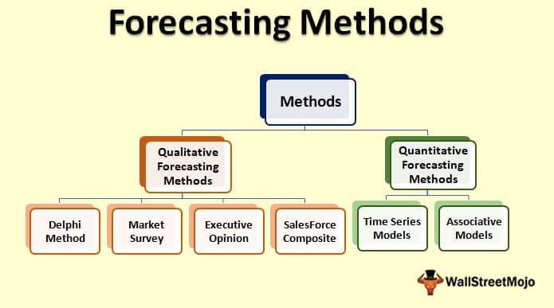

Business forecasting is integral to strategic planning and decision-making in today’s data-driven business environment. It acts as a navigational tool, enabling businesses to anticipate future conditions, trends, and challenges. Forecasting models and methods are invaluable for predicting future trends, allowing businesses to make informed decisions that align with long-term goals. These methods not only help in gauging future market demands but also offer insights into resource allocation and risk management.

Through the lens of forecasting, businesses can proactively address uncertainties and competitively position themselves. This article will explore the different forecasting methods, underscoring their importance in anticipating and shaping future business dynamics. Furthermore, we will discuss the intersection of business forecasting with algorithmic trading, a rapidly evolving domain that leverages complex models to execute trades based on market predictions. By integrating forecasting models with algorithmic trading, businesses can enhance performance, agility, and decision-making accuracy.



In a landscape characterized by rapid changes and intense competition, practical approaches to forecasting can be a game-changer. Businesses are increasingly adopting advanced forecasting techniques not only to maintain competitiveness but also to harness opportunities that arise from informed predictions. Understanding the nuances of forecasting is essential for any organization striving for success, as it equips them with the capabilities to forecast trends and make strategic decisions. Through our exploration, we will illuminate how these predictions fundamentally impact business success, providing a roadmap to navigating the complexities of the modern marketplace.

## Table of Contents

## Understanding Business Forecasting

Business forecasting is a critical practice that allows organizations to anticipate and prepare for future business activities based on the analysis of historical and current data. This analytical approach assists companies in identifying trends, recognizing patterns, and making data-driven decisions to enhance their strategic planning and execution.

Effective forecasting plays a significant role in strengthening various operational aspects. It can substantially improve accuracy in demand planning by predicting customer needs and aligning production levels accordingly. Furthermore, forecasting aids in budgeting by providing a clearer financial outlook, enabling organizations to allocate resources efficiently. This capability ensures that businesses are prepared for potential financial fluctuations and market demands.

Two primary categories of forecasting methods exist: qualitative and quantitative. Qualitative methods typically rely on expert judgment, market research, and insights, making them particularly useful in situations where little to no historical data is available. Common techniques in this category include the Delphi method and market surveys. On the other hand, quantitative methods utilize statistical and mathematical models to predict future outcomes. These methods are most effective when ample historical data is available, facilitating more empirical analysis. Time series analysis and regression models are examples of quantitative approaches.

The essential value of forecasting information lies in its ability to mitigate risks associated with unforeseen events by providing better visibility into future scenarios. With effective forecasting, businesses can optimize operations by adjusting their strategies proactively rather than reactively. This foresight can reduce potential losses and enhance overall performance.

In summary, business forecasting is an indispensable tool in modern business strategy, allowing organizations to harness data in a manner that improves decision-making, risk management, and operational efficiency. By employing the appropriate forecasting method tailored to their specific needs and data availability, businesses can gain a competitive edge in today’s dynamic marketplace.

## Different Forecasting Methods

Different forecasting methods provide businesses with a range of tools to anticipate future trends and make informed decisions. These methods can be broadly categorized into time series analysis, causal models, and judgemental forecasting.

Time series analysis is a quantitative approach that leverages historical data to predict future events by identifying patterns and trends over time. This method is particularly useful for data that exhibit regular fluctuations and are autocorrelated, meaning that past values influence future values. Time series analysis involves several techniques, such as moving averages, exponential smoothing, and more complex models like ARIMA (AutoRegressive Integrated Moving Average) and SARIMA (Seasonal ARIMA). These models help in understanding the underlying patterns in the data, which can be decomposed into components like trend, seasonality, and noise.

To illustrate the application of time series analysis, consider a simple moving average model:

$$
\text{SMA}_n = \frac{1}{n} \sum_{i=t-n+1}^{t} x_i
$$

where $\text{SMA}_n$ is the simple moving average over the last $n$ periods, and $x_i$ is the value at time $i$.

Causal models, also known as explanatory or regression models, differ from time series analysis in that they assume the variable being forecasted is influenced by one or more external factors. These models aim to establish relationships between the dependent variable and independent variables, often using regression analysis to quantify these relationships. A typical causal model might take the form of a linear regression equation:

$$
Y = \beta_0 + \beta_1X_1 + \beta_2X_2 + \ldots + \beta_nX_n + \epsilon
$$

where $Y$ is the dependent variable, $X_i$ are independent variables, $\beta_i$ are coefficients representing the effect of each $X_i$ on $Y$, and $\epsilon$ is the error term.

Judgemental forecasting relies on expert opinions and insights to predict future events. This method is essential in situations where historical data is sparse or non-existent, such as when launching a new product or entering an unexplored market. Judgemental forecasting techniques include methods like Delphi, where experts provide forecasts independently before converging on a consensus, and scenario planning, where various future scenarios are evaluated to aid strategic decision-making.

Each of these forecasting methods offers unique advantages and can be selected based on the nature of the data available and the specific requirements of the business scenario. The integration of these methods allows businesses to enhance their forecasting approaches, maximizing the accuracy and reliability of their predictions.

## Forecasting Models in Business

Forecasting models are integral to anticipating future business outcomes through mathematical constructs that analyze data patterns. Among these, ARIMA (AutoRegressive Integrated Moving Average) and SARIMA (Seasonal ARIMA) models stand out for their effectiveness in time series forecasting. ARIMA models operate by capturing the dependencies in the data through autoregression (AR) and moving averages (MA) while incorporating differencing (I) to ensure stationarity. The formula for an ARIMA model is typically represented as ARIMA(p, d, q), where p denotes the number of lag observations, d represents the degree of differencing, and q indicates the size of the moving average window. SARIMA extends ARIMA by including seasonal components, denoted as SARIMA(p, d, q)(P, D, Q)s, where P, D, and Q represent the seasonal elements and s is the seasonal period.

Regression analysis and econometric models are also pivotal in uncovering relationships between variables. Regression analysis allows businesses to understand how one or more independent variables affect a dependent variable, which is crucial for identifying trends and making predictions. Econometric models further enhance these analyses by incorporating economic theories to provide a more profound understanding of the relationships affecting business variables.

Selecting the appropriate forecasting model involves careful consideration of a company’s objectives and the availability of data. Businesses should evaluate whether the data exhibits patterns that are linear or seasonal, which would influence the choice between ARIMA, SARIMA, or regression models. For instance, time series models are more suitable for datasets with strong historical trends or seasonal patterns, while regression models are often preferred when relationships between multiple variables need to be explored.

When choosing a model, one should also consider the complexity of the data and the desired forecast horizon. More simplistic models might be appropriate for straightforward, short-term forecasts, while complex models like ARIMA or econometric analyses are better suited for intricate data requiring long-term predictions.

Here's a simple Python example using the ARIMA model with the `statsmodels` library:

```python
import pandas as pd
from statsmodels.tsa.arima.model import ARIMA
import matplotlib.pyplot as plt

# Sample data: Monthly sales figures
data = pd.read_csv('monthly_sales.csv', parse_dates=['Date'], index_col='Date')
sales_data = data['Sales']

# Fit the ARIMA model
model = ARIMA(sales_data, order=(1, 1, 1))
model_fit = model.fit()

# Forecast the next 12 months
forecast = model_fit.forecast(steps=12)
print(forecast)

# Plot the forecast
plt.figure(figsize=(10,5))
plt.plot(sales_data, label='Historical Sales')
plt.plot(forecast, label='Forecasted Sales', linestyle='--')
plt.legend()
plt.show()
```

In summary, forecasting models are crucial in providing structured approaches to predict business trends. The selection of an appropriate model is driven by the data characteristics and business goals, ensuring accurate predictions and informed decision-making.

## Algorithmic Trading and Forecasting Models

Algorithmic trading has revolutionized the financial markets by utilizing computer algorithms to execute trades at speeds and frequencies beyond human capability. At its core, forecasting models are pivotal in developing these algorithms, as they enable the prediction of market trends and [volatility](/wiki/volatility-trading-strategies), which are fundamental to making informed trading decisions.

Forecasting models in [algorithmic trading](/wiki/algorithmic-trading) typically employ a variety of techniques to anticipate price movements and market dynamics. Among these, statistical models like ARIMA (AutoRegressive Integrated Moving Average) are frequently used for their ability to model time series data effectively. These models are particularly useful in capturing patterns such as seasonality and trends, thus providing a robust foundation for predicting future price actions.

Moreover, there is a profound, symbiotic relationship between advanced forecasting techniques and their practical execution in financial markets. Algorithmic strategies often leverage these forecasts to optimize trade timing and order execution. For instance, mean reversion strategies benefit from time series analysis by identifying when prices deviate from their historical norms, creating opportunities for profitable trades.

The advent of [machine learning](/wiki/machine-learning) (ML) and [artificial intelligence](/wiki/ai-artificial-intelligence) (AI) has further enhanced the forecasting capabilities of algorithmic trading systems. These technologies are adept at recognizing complex patterns in data that traditional models may overlook. Machine learning models, such as neural networks and support vector machines, can process vast datasets, learning from both historical and real-time data to predict future market movements with increased accuracy.

One example of integrating machine learning in algorithmic trading is the use of [reinforcement learning](/wiki/reinforcement-learning), where algorithms are trained to make sequences of decisions by learning from their interactions with financial environments. This approach allows for the dynamic adaptation of trading strategies in response to new data and evolving market conditions.

Additionally, AI-based forecasting models involve the use of sophisticated techniques such as natural language processing (NLP) to analyze market sentiment from news articles, social media, and other informational sources, providing insights beyond numerical data alone. By integrating these insights, algorithms can better anticipate market reactions to news events and adjust trading strategies accordingly.

In conclusion, the integration of forecasting models with algorithmic trading systems is essential for capturing market opportunities and managing risks. The continuous advancement of AI and machine learning technologies holds the promise of further refining these models, ultimately leading to more precise and efficient trading systems. As such, businesses and trading firms are increasingly investing in these technologies to maintain a competitive edge in the ever-evolving financial landscape.

## Challenges and Limitations

When implementing business forecasting, companies face various challenges and limitations that can hinder the accuracy and reliability of their predictions. One of the primary obstacles is data quality. The efficacy of any forecasting model significantly relies on the quality, consistency, and completeness of the input data. Incomplete, outdated, or erroneous data can lead to inaccurate forecasts, misleading decision-makers, and adversely affecting strategic outcomes. Ensuring high-quality data involves rigorous data cleaning, validation, and real-time updates within data management systems.

Another critical challenge is the selection of an appropriate forecasting model. Different business contexts and data characteristics require tailored models that can effectively capture the nuances of the situation. Selecting an unsuitable model can result in overfitting or underfitting, leading to incorrect trend predictions. Businesses must assess their objectives, data availability, and time constraints before deciding on a model, whether it's time series analysis, regression models, or machine learning algorithms.

Forecasting methods also have inherent limitations, particularly their dependency on historical data. While statistical models excel at identifying patterns and trends within historical datasets, they may falter when predicting outcomes in rapidly changing environments or unprecedented events. The reliance on past data can cause models to overlook novel variables or structural market changes that significantly impact the forecasted results.

Market disruptions present another limitation, as they introduce unforeseeable variables that can alter market dynamics abruptly and unpredictably. Factors such as economic crises, technological advancements, or geopolitical events can render existing models ineffective, necessitating the need for frequent recalibration of forecasting models to incorporate new variables promptly.

To overcome these challenges and improve forecasting accuracy, businesses can employ several strategies. Incorporating advanced technologies such as artificial intelligence and machine learning can enhance predictive capabilities by continuously learning from new data and adjusting models accordingly. These technologies can help identify hidden patterns and relationships within vast datasets, accommodating changes in market conditions more fluidly.

Moreover, adopting a hybrid forecasting approach that integrates both quantitative and qualitative data can mitigate some limitations. For example, combining statistical models with expert judgment can provide complementary insights, especially when historical data is insufficient or outdated. Ensemble models that use multiple algorithms to make predictions can also reduce model-specific biases and improve overall accuracy.

Enhancing data governance and establishing robust data infrastructure are crucial steps to ensure data quality and availability. Implementing data warehousing solutions and cloud-based architectures can facilitate seamless data integration and accessibility, providing businesses with timely and reliable data for forecasting.

In conclusion, while challenges in business forecasting are inevitable, a proactive approach in model selection, data management, and technological adaptation can significantly mitigate these issues and lead to better forecasting outcomes.

## Conclusion

Business forecasting remains an indispensable tool in navigating the complexities of the modern marketplace. Its utility extends far beyond predicting future trends; it serves as a pivotal mechanism for businesses to strategically plan, allocate resources, and mitigate potential risks. By selecting the right forecasting methods and models, organizations can significantly enhance their decision-making processes and business outcomes. The choice of model—be it a time series analysis, econometric model, or qualitative approach—must align with the specific business context and data characteristics. The accuracy and reliability of forecasts depend heavily on this alignment.

Algorithmic trading exemplifies the transformative power of forecasting in practice. By leveraging high-frequency data and sophisticated forecasting models, algorithmic trading systems can identify market trends and anomalies with remarkable precision. These systems integrate advanced statistical methods, such as ARIMA or machine learning algorithms, to optimize trading strategies and achieve superior financial outcomes. The integration of AI and machine learning in forecasting models has redefined traditional approaches, providing traders with powerful insights and unparalleled efficiencies.

To maintain a competitive edge, businesses must embrace continuous improvement and technological advancements in forecasting capabilities. This includes investing in data quality, refining models for greater accuracy, and incorporating emerging technologies like AI and machine learning. By doing so, businesses can enhance their forecasting accuracy, adapt to market changes more swiftly, and ultimately, secure a more robust strategic position in the marketplace. As businesses navigate the evolving market conditions, the role of forecasting as a strategic tool remains ever critical.

## References & Further Reading

[1]: Makridakis, S., Wheelwright, S. C., & Hyndman, R. J. (1998). ["Forecasting: Methods and Applications."](https://www.researchgate.net/publication/52008212_Forecasting_Methods_and_Applications) Wiley.

[2]: Hamilton, J. D. (1994). ["Time Series Analysis."](https://press.princeton.edu/books/hardcover/9780691042893/time-series-analysis) Princeton University Press.

[3]: Hyndman, R. J., & Athanasopoulos, G. (2018). ["Forecasting: Principles and Practice."](https://otexts.com/fpp3/) OTexts. 

[4]: Box, G. E. P., Jenkins, G. M., & Reinsel, G. C. (2008). ["Time Series Analysis: Forecasting and Control."](https://onlinelibrary.wiley.com/doi/book/10.1002/9781118619193) Wiley.

[5]: Lopez de Prado, M. (2018). ["Advances in Financial Machine Learning."](https://www.amazon.com/Advances-Financial-Machine-Learning-Marcos/dp/1119482089) Wiley.

[6]: Goodfellow, I., Bengio, Y., & Courville, A. (2016). ["Deep Learning."](https://www.deeplearningbook.org/) MIT Press.

[7]: Chan, E. P. (2009). ["Quantitative Trading: How to Build Your Own Algorithmic Trading Business."](https://github.com/ftvision/quant_trading_echan_book) Wiley.

[8]: Tsay, R. S. (2005). ["Analysis of Financial Time Series."](https://onlinelibrary.wiley.com/doi/book/10.1002/9780470644560) Wiley.

[9]: Aronson, D. R. (2006). ["Evidence-Based Technical Analysis: Applying the Scientific Method and Statistical Inference to Trading Signals."](https://onlinelibrary.wiley.com/doi/book/10.1002/9781118268315) Wiley.