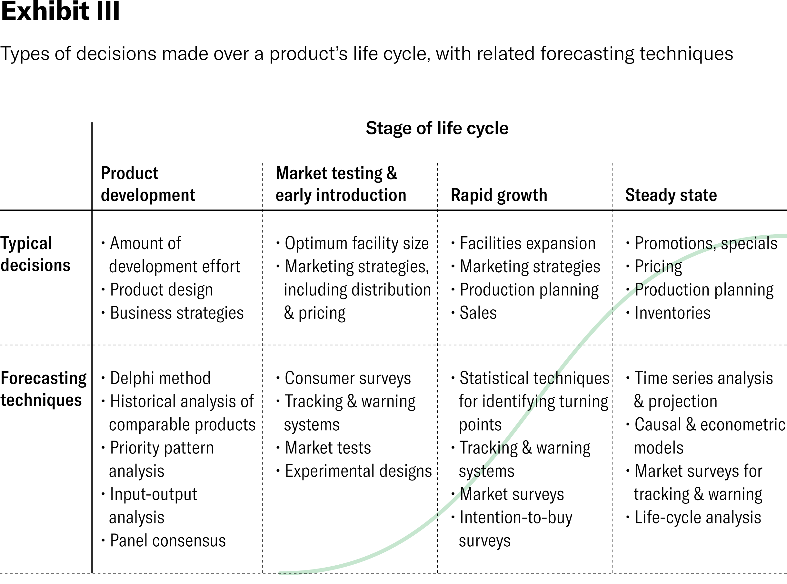

## Table of Contents

## What is business forecasting and why is it important?

Business forecasting is a way for companies to predict what might happen in the future based on information they have now. This includes things like how much they might sell, how much money they will make, or what might happen in the market. They use different methods and tools to make these predictions, like looking at past data, using math models, or even asking experts for their opinions.

It's important because it helps businesses plan better. If a company can guess what will happen, they can make smarter choices about what to do next. For example, if they think they will sell more products, they can make sure they have enough stock. Or if they think there will be less money coming in, they can find ways to spend less. This way, they can avoid problems and take advantage of good opportunities.

## What are the basic types of forecasting methods?

There are two main types of forecasting methods: qualitative and quantitative. Qualitative methods are used when there isn't a lot of past data to look at, or when the future might be hard to predict with numbers alone. These methods involve talking to people who know a lot about the business or the market, like experts or customers. They might use things like surveys, focus groups, or just asking for opinions to get a sense of what might happen.

Quantitative methods, on the other hand, use numbers and math to make predictions. These methods are used when there is a lot of past data available. They look at patterns and trends in the data to guess what will happen next. There are two kinds of quantitative methods: time series analysis, which looks at data over time to find patterns, and causal models, which try to see how different things affect each other. Both types help businesses make more accurate forecasts when they have enough data to work with.

## How does qualitative forecasting differ from quantitative forecasting?

Qualitative forecasting is used when there isn't a lot of past data to look at, or when it's hard to predict the future just by using numbers. Instead of using math, it relies on talking to people who know a lot about the business or the market. These might be experts, customers, or people within the company. They use methods like surveys, focus groups, or just asking for opinions to get a sense of what might happen. This method is helpful when the business is new, or when big changes might happen that can't be easily predicted with numbers.

Quantitative forecasting, on the other hand, uses numbers and math to make predictions. It's used when there is a lot of past data available. This method looks at patterns and trends in the data to guess what will happen next. There are two main types of quantitative forecasting: time series analysis, which looks at data over time to find patterns, and causal models, which try to see how different things affect each other. This method is more accurate when there is enough data to work with, but it might miss out on new or unexpected changes that aren't in the data yet.

## What are some common qualitative forecasting techniques?

Qualitative forecasting techniques are used when there isn't enough past data to make predictions or when the future is hard to guess with numbers. One common technique is the Delphi Method. This involves asking a group of experts their opinions on what might happen in the future. They share their thoughts through surveys, and the results are put together and sent back to them. They then think about the combined opinions and give their new thoughts. This goes on until everyone agrees on a prediction. It's like having a group discussion but with surveys.

Another technique is market research. This means talking to customers or people who might buy the product to see what they think. Companies might use surveys, interviews, or focus groups to ask people about their future plans or what they want. This can help the company guess how much they might sell or what new products they should make. It's a good way to get a feel for what people are thinking and what might happen in the market.

A third technique is the use of panels of experts. This is similar to the Delphi Method but more direct. A group of experts meet together to talk about what they think will happen. They might have meetings or discussions to share their knowledge and come up with a forecast. This method is useful because it brings together a lot of different opinions and experiences to make a prediction. It's like having a team of smart people working together to guess the future.

## Can you explain the time series forecasting method?

Time series forecasting is a way to predict the future by looking at data from the past. It's like trying to guess what will happen next in a story by reading the chapters that came before. This method looks at things like sales numbers, stock prices, or any other information that changes over time. It tries to find patterns or trends in the data. For example, if sales go up every summer, time series forecasting would notice this and predict that sales will go up again next summer.

There are different ways to do time series forecasting, but they all use math to make their guesses. One way is called moving averages, which looks at the average of past data to smooth out any ups and downs. Another way is called exponential smoothing, which gives more importance to recent data than to older data. There's also something called ARIMA, which stands for Autoregressive Integrated Moving Average. This is a more complicated method that looks at how past values and errors affect future values. All these methods help businesses make better guesses about what will happen next based on what has happened before.

## What role do causal models play in business forecasting?

Causal models are used in business forecasting to understand how different things affect each other. These models look at how changes in one thing can cause changes in another. For example, a business might want to see how a change in price affects how much they sell. They would use a causal model to see if lowering the price leads to more sales or if raising it makes people buy less. This helps businesses make better decisions by understanding the cause and effect relationships in their data.

These models are useful because they can show why something happens, not just that it happens. If a business sees that sales go up in the summer, a time series model might just say that sales go up every summer. But a causal model can explain why, like if it's because more people are on vacation or if there's a big event happening. By understanding these causes, businesses can plan better. They might decide to do more advertising before the summer or stock up on products that sell well during that time. This makes their forecasts more accurate and helps them take advantage of opportunities.

## How can businesses use regression analysis for forecasting?

Regression analysis is a way for businesses to guess what might happen in the future by looking at how different things are related. Imagine you want to know how many ice creams you'll sell on a hot day. You can use regression analysis to see how the temperature affects your ice cream sales. By looking at past data, you can find a pattern that shows when it's hotter, you sell more ice cream. This helps you predict how many ice creams you might sell on a hot day in the future. It's like finding a recipe for guessing the future based on what you know now.

Businesses use regression analysis to make better plans. For example, if a company sees that every time they spend more on advertising, they sell more products, they can use regression analysis to figure out how much to spend to reach their sales goals. This helps them make smart decisions about where to put their money. By understanding these patterns, businesses can avoid surprises and be ready for what's coming next. It's like having a map that shows you where you're going based on where you've been.

## What is the difference between short-term and long-term forecasting?

Short-term forecasting is about predicting what will happen in the near future, like in the next few weeks or months. Businesses use it to plan things like how much stuff to buy, how many workers to have, or how to manage their money day-to-day. It's important because it helps them keep things running smoothly without running out of supplies or money. For example, a store might use short-term forecasting to guess how many jackets they'll sell next month so they can order the right amount.

Long-term forecasting looks further into the future, like a year or more ahead. It's used to make big plans and decisions, like building a new factory, starting a new product line, or expanding into new markets. This kind of forecasting is trickier because there are more things that can change over a longer time. But it's really important because it helps businesses grow and be ready for big changes. For example, a car company might use long-term forecasting to decide if they should start making electric cars in the next few years.

## How do advanced statistical models like ARIMA enhance forecasting accuracy?

Advanced statistical models like ARIMA, which stands for Autoregressive Integrated Moving Average, help make better guesses about the future by looking closely at past data. ARIMA is good at finding patterns in the data that might be hard to see with simpler methods. It does this by combining three different ways of looking at the data: autoregression, which looks at how past values affect future ones; differencing, which helps make the data smoother by taking away trends; and moving averages, which look at past errors to improve future guesses. By using all these together, ARIMA can make more accurate predictions, especially for things like sales numbers or stock prices that change over time.

Using ARIMA can really help businesses because it gives them a more detailed and accurate picture of what might happen next. For example, if a company wants to know how many products they will sell next month, ARIMA can look at past sales and find patterns that other methods might miss. This means the company can plan better, order the right amount of stock, and make smarter decisions about their money. Even though ARIMA is a bit more complicated than simpler methods, the extra work can pay off by making the forecasts more reliable and helping the business avoid surprises.

## What are the challenges associated with implementing machine learning in business forecasting?

Using machine learning for business forecasting can be tricky because it needs a lot of good data. Machine learning works best when it has a lot of information to learn from. If the data is missing pieces or not clean, the predictions can be wrong. Also, it can be hard to explain how machine learning makes its guesses. This is called the "black box" problem. People might not trust the predictions if they can't understand why the machine made them. This can be a big problem for businesses that need clear reasons for their decisions.

Another challenge is that machine learning models need a lot of work to keep them running well. They need to be checked and updated all the time to make sure they are still giving good predictions. This takes time and people who know how to do it. It can also be expensive to set up and maintain these systems. Plus, machine learning can sometimes find patterns that aren't real, which is called overfitting. This happens when the model is too focused on the past data and doesn't work well for new situations. Businesses have to be careful to avoid this and make sure their forecasts are useful for the future.

## How can scenario analysis be integrated into forecasting models?

Scenario analysis is a way to think about different things that might happen in the future. You can add it to forecasting models by making different stories or guesses about what could happen. For example, a business might think about what would happen if there's a big storm that stops people from buying things, or if a new law changes how they can sell their products. They would use their forecasting model to see how these different stories would change their sales or profits. This helps them be ready for different situations and make plans for each one.

To put scenario analysis into forecasting models, businesses first need to come up with the different stories or scenarios they want to look at. They might talk to experts or use their own knowledge to think of what could happen. Then, they change the numbers in their forecasting model to match each scenario. For example, if one scenario is a big storm, they might lower the sales numbers in the model to see how it would affect their business. By doing this for different scenarios, they can see what might happen and make plans to handle whatever comes their way.

## What are the best practices for evaluating and improving the accuracy of forecasting models?

To make sure your forecasting models are good and getting better, you need to keep checking them. One way to do this is by looking at how well your predictions match what really happens. If your model says you'll sell 100 units and you actually sell 95, that's pretty close. But if it says 100 and you sell 50, that's not good. You can use numbers like the Mean Absolute Error (MAE) or the Root Mean Square Error (RMSE) to see how far off your guesses are. These numbers help you see if your model is getting better or worse over time. Also, it's a good idea to split your data into two parts: one part to build the model and another part to test it. This way, you can see how well your model works on new data it hasn't seen before.

Another important thing is to keep updating your model with new data. As time goes on, things change, and your old data might not be as useful anymore. By adding new data, you can make your model more accurate. It's also smart to try different models and see which one works best for your business. Sometimes, a simple model might be better than a complicated one if it gives you good enough guesses. And don't forget to talk to people in your business who know a lot about what's happening. They can help you understand why your model might be off and how to fix it. By doing these things, you can keep your forecasting models sharp and ready to help your business make good decisions.

## What are the different forecasting methods?

Different forecasting methods provide businesses with a range of tools to anticipate future trends and make informed decisions. These methods can be broadly categorized into time series analysis, causal models, and judgemental forecasting.

Time series analysis is a quantitative approach that leverages historical data to predict future events by identifying patterns and trends over time. This method is particularly useful for data that exhibit regular fluctuations and are autocorrelated, meaning that past values influence future values. Time series analysis involves several techniques, such as moving averages, exponential smoothing, and more complex models like ARIMA (AutoRegressive Integrated Moving Average) and SARIMA (Seasonal ARIMA). These models help in understanding the underlying patterns in the data, which can be decomposed into components like trend, seasonality, and noise.

To illustrate the application of time series analysis, consider a simple moving average model:

$$
\text{SMA}_n = \frac{1}{n} \sum_{i=t-n+1}^{t} x_i
$$

where $\text{SMA}_n$ is the simple moving average over the last $n$ periods, and $x_i$ is the value at time $i$.

Causal models, also known as explanatory or regression models, differ from time series analysis in that they assume the variable being forecasted is influenced by one or more external factors. These models aim to establish relationships between the dependent variable and independent variables, often using regression analysis to quantify these relationships. A typical causal model might take the form of a linear regression equation:

$$
Y = \beta_0 + \beta_1X_1 + \beta_2X_2 + \ldots + \beta_nX_n + \epsilon
$$

where $Y$ is the dependent variable, $X_i$ are independent variables, $\beta_i$ are coefficients representing the effect of each $X_i$ on $Y$, and $\epsilon$ is the error term.

Judgemental forecasting relies on expert opinions and insights to predict future events. This method is essential in situations where historical data is sparse or non-existent, such as when launching a new product or entering an unexplored market. Judgemental forecasting techniques include methods like Delphi, where experts provide forecasts independently before converging on a consensus, and scenario planning, where various future scenarios are evaluated to aid strategic decision-making.

Each of these forecasting methods offers unique advantages and can be selected based on the nature of the data available and the specific requirements of the business scenario. The integration of these methods allows businesses to enhance their forecasting approaches, maximizing the accuracy and reliability of their predictions.

## References & Further Reading

[1]: Makridakis, S., Wheelwright, S. C., & Hyndman, R. J. (1998). ["Forecasting: Methods and Applications."](https://www.researchgate.net/publication/52008212_Forecasting_Methods_and_Applications) Wiley.

[2]: Hamilton, J. D. (1994). ["Time Series Analysis."](https://press.princeton.edu/books/hardcover/9780691042893/time-series-analysis) Princeton University Press.

[3]: Hyndman, R. J., & Athanasopoulos, G. (2018). ["Forecasting: Principles and Practice."](https://otexts.com/fpp3/) OTexts. 

[4]: Box, G. E. P., Jenkins, G. M., & Reinsel, G. C. (2008). ["Time Series Analysis: Forecasting and Control."](https://onlinelibrary.wiley.com/doi/book/10.1002/9781118619193) Wiley.

[5]: Lopez de Prado, M. (2018). ["Advances in Financial Machine Learning."](https://www.amazon.com/Advances-Financial-Machine-Learning-Marcos/dp/1119482089) Wiley.

[6]: Goodfellow, I., Bengio, Y., & Courville, A. (2016). ["Deep Learning."](https://www.deeplearningbook.org/) MIT Press.

[7]: Chan, E. P. (2009). ["Quantitative Trading: How to Build Your Own Algorithmic Trading Business."](https://github.com/ftvision/quant_trading_echan_book) Wiley.

[8]: Tsay, R. S. (2005). ["Analysis of Financial Time Series."](https://onlinelibrary.wiley.com/doi/book/10.1002/9780470644560) Wiley.

[9]: Aronson, D. R. (2006). ["Evidence-Based Technical Analysis: Applying the Scientific Method and Statistical Inference to Trading Signals."](https://onlinelibrary.wiley.com/doi/book/10.1002/9781118268315) Wiley.