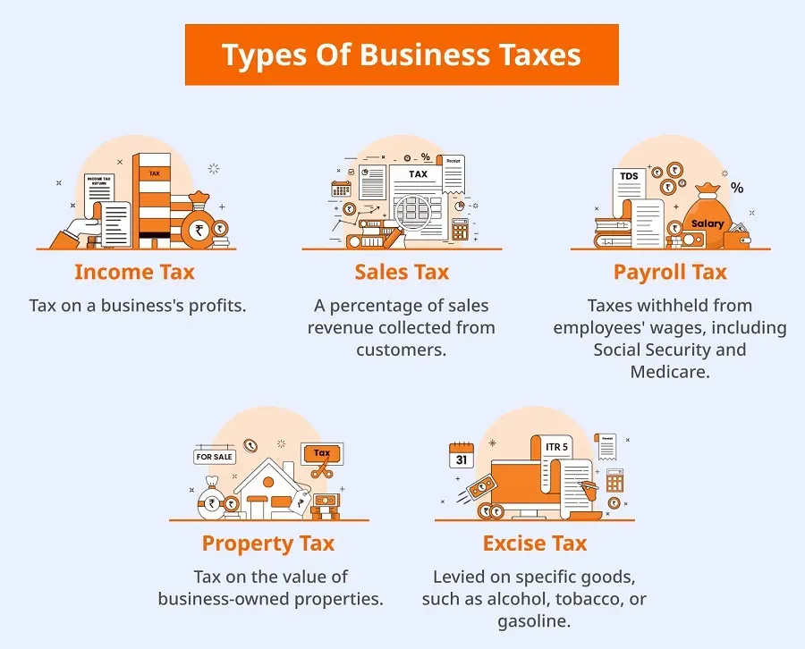

## Table of Contents

## What is business income?

Business income is the money a company earns from its normal business activities. This can include selling products, providing services, or any other main ways the business makes money. For example, if a company sells shoes, the money it gets from selling those shoes is its business income.

This income is important because it shows how well a business is doing. It helps owners and managers see if their business is making enough money to cover costs and make a profit. If a business has more income than expenses, it is profitable. If not, the business might need to make changes to increase its income or reduce its costs.

## How is business income different from personal income?

Business income is the money that a company makes from its main activities, like selling products or services. It belongs to the business, not to the people who own or work for the business. This income is used to pay for things like rent, salaries, and supplies, and whatever is left over can be kept by the business or given to the owners as profit.

Personal income, on the other hand, is the money that a person earns. This can come from a job, investments, or even gifts. It is used to pay for personal things like food, rent, and entertainment. Unlike business income, personal income goes directly to the person and they can spend it however they want.

The main difference is who the money belongs to and what it is used for. Business income is for the company and helps it operate and grow, while personal income is for the individual and helps them live their life.

## What are the common sources of business income?

Business income comes from many places. The main source is usually from selling things or services. For example, a store makes money by selling clothes, and a restaurant makes money by serving food. These are called sales revenue. Another common source is from renting out property or equipment. If a business owns a building and rents it to other companies, the rent money is business income.

There are also other ways to make business income. One way is through investments. If a business buys stocks or bonds and they go up in value, the business can sell them for a profit. Another way is by [earning](/wiki/earning-announcement) interest from money in the bank. If a business keeps money in a savings account, the interest it earns is also business income. These different sources help a business make money and grow.

## How do you calculate business income?

To calculate business income, you start by adding up all the money the business makes from its main activities. This is called gross income. For example, if a store sells shoes, you add up all the money from selling those shoes. If the business also earns money from other sources like renting out property or from investments, you add that money too. This gives you the total income before any expenses are taken out.

Next, you subtract the costs of running the business from the total income. These costs can include things like rent, salaries, supplies, and utilities. The money left after you subtract these costs is called net income or profit. This number shows if the business is making more money than it spends. If the net income is positive, the business is profitable. If it's negative, the business is losing money.

## What expenses can be deducted from business income?

When you run a business, you can take away certain costs from your business income. These costs are called business expenses. Some common expenses include the rent for your business space, the salaries you pay to your employees, and the cost of supplies and materials you use to make your products or provide your services. You can also deduct the cost of utilities like electricity and water, as well as any money you spend on advertising to attract customers.

There are other expenses you can deduct too. For example, if you use a car for business, you can deduct the cost of gas and maintenance. If you travel for business, you can deduct the cost of flights, hotels, and meals. You can also deduct the cost of insurance to protect your business, and any interest you pay on business loans. It's important to keep good records of all these expenses so you can show them on your tax return and lower the amount of tax you have to pay.

## What are the basic tax obligations for business income?

When you make money from your business, you have to pay taxes on that income. The government wants a part of the money you earn, just like they do with personal income. The amount of tax you pay depends on how much money your business makes and what kind of business you have. For example, if you run a small business, you might pay taxes on your business income through your personal tax return. But if you have a big company, you might need to file a separate business tax return.

To figure out how much tax you owe, you start by calculating your business's net income. This is your total income minus your business expenses. You report this number on your tax return. The government then uses tax laws to decide how much tax you need to pay. It's important to keep good records of your income and expenses, so you can show the government everything correctly. If you don't pay the right amount of tax, you might have to pay extra fees or even face legal problems.

## How does the tax rate on business income vary by business structure?

The tax rate on business income can be different depending on what kind of business you have. If you run a sole proprietorship or a partnership, your business income is added to your personal income. Then, you pay taxes on all of that money together. The tax rate you pay depends on how much total money you make. If you make more money, you might have to pay a higher tax rate. This is called a progressive tax system.

If you have a corporation, the tax rules are different. Corporations pay taxes on their income at a flat rate, which means the rate stays the same no matter how much money the corporation makes. This rate can be different depending on where your business is located. Sometimes, the money that the corporation makes can be taxed again when it is given to the owners as dividends. This is called double taxation. Because of these differences, choosing the right business structure can affect how much tax you pay.

## What are the differences between cash and accrual methods of accounting for tax purposes?

The cash method of accounting is simple. It means you count your income when you get the money and you count your expenses when you pay them. If you sell something in December but don't get paid until January, you count that money in January. This method is easy to use and works well for small businesses that don't have a lot of money coming in and going out at different times.

The accrual method of accounting is a bit more complicated. With this method, you count your income when you earn it, even if you haven't gotten the money yet. If you sell something in December, you count that money in December, even if you get paid in January. You also count your expenses when you get the bill, not when you pay it. This method gives a better picture of how your business is doing over time, but it can be harder to keep track of everything.

For tax purposes, the method you choose can make a big difference. The cash method might help you pay less tax one year if you can delay getting paid until the next year. The accrual method might show more income in one year if you have a lot of sales at the end of the year, even if you don't get the money until the next year. The IRS has rules about which method you can use based on the size and type of your business.

## How can businesses optimize their tax strategies regarding income?

Businesses can optimize their tax strategies by carefully choosing the right business structure. For example, if you run a small business, you might want to stay as a sole proprietorship or a partnership. This way, you can add your business income to your personal income and might pay a lower tax rate overall. But if your business grows big, you might want to become a corporation. Corporations pay a flat tax rate on their income, which can be better if you make a lot of money. Plus, you can use different ways to lower your taxes, like paying yourself a salary and taking the rest as dividends.

Another way to optimize your tax strategy is by choosing the right accounting method. If you use the cash method, you can delay getting paid until the next year to lower your taxes for the current year. This can help if you expect to make less money next year. If you use the accrual method, you count your income when you earn it, which can be good if you want to show a better picture of your business's health over time. You should talk to a tax professional to see which method is best for your business and to make sure you follow the IRS rules.

Lastly, businesses can optimize their taxes by keeping good records and taking all the deductions they can. This means writing down all your business expenses, like rent, salaries, and supplies, so you can take them off your income when you file your taxes. You might also be able to take special deductions, like the home office deduction if you work from home, or deductions for buying new equipment. By keeping good records and knowing what you can deduct, you can lower your tax bill and keep more money for your business.

## What are the international tax considerations for businesses earning income abroad?

When businesses earn money in other countries, they have to think about international tax rules. These rules can be different in every country, and they can affect how much tax a business has to pay. For example, if a business makes money in another country, that country might want to tax that money. But the business's home country might also want to tax it. This can lead to double taxation, where the business has to pay taxes on the same money twice. To avoid this, many countries have tax treaties with each other. These treaties help businesses figure out which country gets to tax the income and how to lower their tax bills.

Another thing businesses need to think about is transfer pricing. This is when a business moves goods or services between its different parts in different countries. The price they set for these goods or services can affect how much tax they pay. If they set the price too low or too high, it might look like they're trying to avoid taxes. Countries have rules to make sure businesses set fair prices. Also, businesses need to keep good records of their international income and expenses. This helps them follow the tax laws in different countries and take advantage of any tax breaks they might be able to get.

## How do tax laws affect business income planning and financial decision-making?

Tax laws have a big impact on how businesses plan their income and make financial decisions. When a business knows the tax rules, it can choose the best way to structure itself to pay less tax. For example, a small business might stay as a sole proprietorship to add its income to the owner's personal income and possibly pay a lower tax rate. But if the business grows big, it might become a corporation to pay a flat tax rate, which can be better if it makes a lot of money. Also, businesses can choose when to get paid or when to pay their bills based on tax laws. If they use the cash method of accounting, they might wait to get paid until the next year to lower their taxes for the current year.

International tax laws also play a big role in a business's financial planning. When a business earns money in other countries, it has to deal with different tax rules. This can lead to double taxation, where the business has to pay taxes on the same money in two different countries. To avoid this, businesses need to understand tax treaties between countries, which help decide where the money should be taxed and how to lower their tax bills. They also need to be careful about transfer pricing, which is the price they set for goods or services moved between different parts of their business in different countries. Setting fair prices is important to follow the tax laws and avoid problems.

## What advanced tax planning techniques can businesses use to minimize their tax liability on income?

Businesses can use a few smart tricks to lower their tax bills. One trick is called "income shifting." This means moving money around to pay less tax. For example, a business might pay its owners or employees in a way that lowers the overall tax the business has to pay. They might also use "deferral strategies," where they delay getting paid until the next year if they think they'll be in a lower tax bracket. Another trick is "accelerating deductions," where they pay for things now to take the tax break this year instead of next year. By using these tricks, businesses can keep more money and pay less to the government.

Another way businesses can save on taxes is by using "tax credits" and "deductions." Tax credits are like money the government gives back to the business for doing certain things, like investing in green energy or hiring from certain groups. Deductions are costs the business can take off its income before it figures out its taxes. Businesses can also look into "tax havens," which are countries with low or no taxes. By setting up part of their business in a tax haven, they might pay less tax on the money they make there. But it's important to follow all the rules and work with a tax expert to make sure these tricks are done the right way.

## What is the Role of Finance in Managing Business Income?

Finance is integral to managing business income effectively, especially to minimize tax liabilities. Businesses must carefully evaluate their financial strategies to ensure that their incomes are optimally managed and strategically allocated. By doing so, they can substantially reduce their taxable income, thereby decreasing their overall tax burden.

One key strategy involves the thoughtful allocation of expenses and losses to offset business income. Businesses can capitalize on operational expenses, such as salaries, utilities, and rent, in their tax filings. The Internal Revenue Service (IRS) allows these expenses to be deducted from gross income to arrive at the taxable income. Another crucial financial maneuver is the strategic utilization of losses. Through a process known as "loss carryforward," businesses can apply their current net operating losses (NOLs) to future tax periods, offsetting taxable income in profitable years. The equation for adjusting taxable income using NOLs is as follows:

$$
\text{Adjusted Taxable Income} = \text{Gross Income} - \text{Deductions} - \text{Net Operating Loss}\ (\text{carryforward})
$$

Additionally, businesses often seek investment opportunities and financial products that offer tax advantages. Investment in certain tax-advantaged accounts like 401(k)s or Individual Retirement Accounts (IRAs) allows businesses to enjoy deferred tax benefits. Contributions to these accounts are typically tax-deductible, reducing a company’s taxable income. Moreover, investing in municipal bonds can be another fruitful strategy, as the interest income they generate is often exempt from federal income taxes and, in some cases, state and local taxes as well.

Tax credits also present significant opportunities for reducing tax liabilities. Programs such as the Research and Development (R&D) tax credit provide incentives for businesses to invest in innovation, lowering their taxable income through credits that directly reduce their tax liability.

By deploying these financial strategies, businesses can not only reduce their taxable income but also strategically position themselves to leverage the various elements of the tax code to their advantage, ensuring enhanced financial health and compliance.

 to Algorithmic Trading

Algorithmic trading involves the use of computer programs to execute trades based on predefined criteria and algorithms. This approach to trading is characterized by the integration of advanced mathematical models and automated systems, which enable traders to operate at speeds and frequencies that are impossible for human traders. The adoption of [algorithmic trading](/wiki/algorithmic-trading) has escalated, driven by technological advancements, increased data availability, and a more competitive trading environment.

One of the primary advantages of algorithmic trading is its ability to execute orders with exceptional speed and accuracy. Algorithms can analyze multiple market conditions simultaneously and can execute transactions in fractions of a second, far outpacing any manual trading process. This speed is crucial in markets where prices can fluctuate significantly in a very short span of time, making the ability to enter and [exit](/wiki/exit-strategy) positions swiftly a distinct advantage.

Moreover, algorithmic trading reduces human emotional involvement, which often leads to irrational decision-making. Emotions like fear and greed are eliminated from the trading equation as algorithms approach trading objectively, adhering strictly to their pre-programmed logic. This objectivity ensures that trading strategies are executed precisely as intended, minimizing errors and the potential for human-induced mistakes.

Various strategies have emerged within algorithmic trading, each catering to different types of market opportunities. Trend-following algorithms are one of the most common strategies, designed to identify and exploit market trends. These algorithms continuously analyze technical indicators to predict price movements and generate buy or sell signals based on the identified trends.

Another prevalent strategy is [arbitrage](/wiki/arbitrage), which seeks to take advantage of price discrepancies between different markets or instruments. Arbitrage algorithms are programmed to detect these discrepancies, allowing traders to make profits by simultaneously buying at a lower price in one market and selling at a higher price in another. 

Overall, algorithmic trading has transformed modern financial markets, offering traders a powerful tool to enhance their trading efficiency and effectiveness. As data and technology continue to evolve, the presence and sophistication of algorithmic trading are likely to grow, influencing trading strategies and market dynamics extensively.

## References & Further Reading

[1]: Bergstra, J., Bardenet, R., Bengio, Y., & Kégl, B. (2011). ["Algorithms for Hyper-Parameter Optimization."](https://dl.acm.org/doi/10.5555/2986459.2986743) Advances in Neural Information Processing Systems 24.

[2]: ["Advances in Financial Machine Learning"](https://www.amazon.com/Advances-Financial-Machine-Learning-Marcos/dp/1119482089) by Marcos Lopez de Prado

[3]: ["Evidence-Based Technical Analysis: Applying the Scientific Method and Statistical Inference to Trading Signals"](https://www.amazon.com/Evidence-Based-Technical-Analysis-Scientific-Statistical/dp/0470008741) by David Aronson

[4]: ["Machine Learning for Algorithmic Trading"](https://github.com/stefan-jansen/machine-learning-for-trading) by Stefan Jansen

[5]: ["Quantitative Trading: How to Build Your Own Algorithmic Trading Business"](https://www.amazon.com/Quantitative-Trading-Build-Algorithmic-Business/dp/1119800064) by Ernest P. Chan