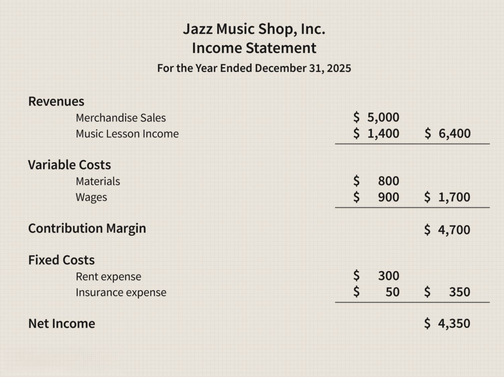

The intersection of taxation, business income, finance, and algorithmic trading presents a multifaceted narrative that captivates the interest of modern investors. With the financial landscape becoming increasingly complex, understanding how these components interact is essential for optimizing financial strategies and adhering to tax regulations. As businesses strive to maximize profits and minimize expenses, the efficient management of business income through strategic financial practices is paramount.

Taxation plays a critical role in shaping the financial outcomes of any business entity. Recognizing the nuances between different forms of business income, such as ordinary income and capital gains, and how they are classified for tax purposes enables businesses to forecast liabilities more accurately. The choice of business structure—be it sole proprietorship, partnership, or corporation—further dictates the manner in which income is reported and taxed, providing both opportunities and challenges in effective tax planning.



Finance serves as the backbone in orchestrating how business income is managed to minimize tax liabilities. Through sophisticated financial strategies, businesses can leverage expenses and losses to offset income, optimize cash flow, and explore investment opportunities that offer tax advantages. These financial maneuvers not only mitigate tax burdens but also enhance the overall financial health of the enterprise.

In recent years, algorithmic trading has revolutionized the investment domain, contributing another layer of complexity to the taxation of investment activities. With its benefits of speed, precision, and impartiality, algorithmic trading presents unique tax implications, particularly in regard to short-term capital gains and the adherence to the wash sale rule. Investors who engage in frequent trading activities must navigate these challenges while seeking strategies to ensure tax efficiency.

Navigating these interrelated aspects requires a comprehensive approach that balances compliance with innovative financial strategies. By examining the intricate connections between taxation, business income, finance, and algorithmic trading, this article aims to equip investors with the knowledge needed to effectively maneuver through these domains, ultimately leading to optimized investment outcomes and regulatory compliance.

## Table of Contents

## Understanding Taxation on Business Income

Business income is a critical facet of taxation, requiring a nuanced understanding of its various forms and classifications for tax purposes. At its core, business income is derived from activities involving the provision of goods or services. This encompasses ordinary income—revenue from sales or services—as well as additional income streams such as dividends, interest, and capital gains.

### Ordinary Income vs. Business Income

Ordinary income primarily includes wages, salaries, dividends, interest, and rental income. Business income, on the other hand, traditionally arises from the active conduct of a trade or business. Distinguishing between these types of income is paramount because tax implications differ significantly. For instance, business entities can often deduct business expenses from their gross business income, thereby reducing their taxable income—an opportunity less available with ordinary income.

### Business Structures and Taxation

The structure of a business—whether it is a sole proprietorship, partnership, or corporation—significantly affects how income is reported and taxed.

1. **Sole Proprietorships**: This is the most straightforward business form where income from the business is reported on the individual's personal tax return. Profits are subject to self-employment taxes but allow for the deduction of business expenses.

2. **Partnerships**: Partnerships report income on an informational tax return, but the tax is not paid at the partnership level. Instead, income, deductions, and credits are passed through to individual partners, who then report these on their personal tax returns.

3. **Corporations**: Corporations face double taxation, where the company pays taxes on its income, and shareholders also pay taxes on dividends received. However, corporations can benefit from a wider range of deductions and credits.

### State and Federal Tax Considerations

Both state and federal taxes significantly influence business income. At the federal level, tax rates and brackets vary by the form of business structure, while state taxes can add another layer of complexity. For example, some states impose their own corporate income taxes with different rates and exemptions. Additionally, businesses must navigate state-specific taxes like sales tax, property tax, and franchise tax, which can impact overall profitability.

Federal considerations also encompass payroll, self-employment, and excise taxes, each impacting business income in distinct ways. Understanding these elements is crucial for proper tax reporting and strategic planning. Errors or omissions in tax filing can lead to audits and penalties, emphasizing the need for comprehensive tax management for business income.

Businesses benefit substantially from understanding these differentials. With proper classification and strategic management of business income, companies can optimize their tax outcomes, ensuring compliance with regulations while enhancing financial performance.

## The Role of Finance in Managing Business Income

Finance is integral to managing business income effectively, especially to minimize tax liabilities. Businesses must carefully evaluate their financial strategies to ensure that their incomes are optimally managed and strategically allocated. By doing so, they can substantially reduce their taxable income, thereby decreasing their overall tax burden.

One key strategy involves the thoughtful allocation of expenses and losses to offset business income. Businesses can capitalize on operational expenses, such as salaries, utilities, and rent, in their tax filings. The Internal Revenue Service (IRS) allows these expenses to be deducted from gross income to arrive at the taxable income. Another crucial financial maneuver is the strategic utilization of losses. Through a process known as "loss carryforward," businesses can apply their current net operating losses (NOLs) to future tax periods, offsetting taxable income in profitable years. The equation for adjusting taxable income using NOLs is as follows:

$$
\text{Adjusted Taxable Income} = \text{Gross Income} - \text{Deductions} - \text{Net Operating Loss}\ (\text{carryforward})
$$

Additionally, businesses often seek investment opportunities and financial products that offer tax advantages. Investment in certain tax-advantaged accounts like 401(k)s or Individual Retirement Accounts (IRAs) allows businesses to enjoy deferred tax benefits. Contributions to these accounts are typically tax-deductible, reducing a company’s taxable income. Moreover, investing in municipal bonds can be another fruitful strategy, as the interest income they generate is often exempt from federal income taxes and, in some cases, state and local taxes as well.

Tax credits also present significant opportunities for reducing tax liabilities. Programs such as the Research and Development (R&D) tax credit provide incentives for businesses to invest in innovation, lowering their taxable income through credits that directly reduce their tax liability.

By deploying these financial strategies, businesses can not only reduce their taxable income but also strategically position themselves to leverage the various elements of the tax code to their advantage, ensuring enhanced financial health and compliance.

 to Algorithmic Trading

Algorithmic trading involves the use of computer programs to execute trades based on predefined criteria and algorithms. This approach to trading is characterized by the integration of advanced mathematical models and automated systems, which enable traders to operate at speeds and frequencies that are impossible for human traders. The adoption of [algorithmic trading](/wiki/algorithmic-trading) has escalated, driven by technological advancements, increased data availability, and a more competitive trading environment.

One of the primary advantages of algorithmic trading is its ability to execute orders with exceptional speed and accuracy. Algorithms can analyze multiple market conditions simultaneously and can execute transactions in fractions of a second, far outpacing any manual trading process. This speed is crucial in markets where prices can fluctuate significantly in a very short span of time, making the ability to enter and [exit](/wiki/exit-strategy) positions swiftly a distinct advantage.

Moreover, algorithmic trading reduces human emotional involvement, which often leads to irrational decision-making. Emotions like fear and greed are eliminated from the trading equation as algorithms approach trading objectively, adhering strictly to their pre-programmed logic. This objectivity ensures that trading strategies are executed precisely as intended, minimizing errors and the potential for human-induced mistakes.

Various strategies have emerged within algorithmic trading, each catering to different types of market opportunities. Trend-following algorithms are one of the most common strategies, designed to identify and exploit market trends. These algorithms continuously analyze technical indicators to predict price movements and generate buy or sell signals based on the identified trends.

Another prevalent strategy is [arbitrage](/wiki/arbitrage), which seeks to take advantage of price discrepancies between different markets or instruments. Arbitrage algorithms are programmed to detect these discrepancies, allowing traders to make profits by simultaneously buying at a lower price in one market and selling at a higher price in another. 

Overall, algorithmic trading has transformed modern financial markets, offering traders a powerful tool to enhance their trading efficiency and effectiveness. As data and technology continue to evolve, the presence and sophistication of algorithmic trading are likely to grow, influencing trading strategies and market dynamics extensively.

## Tax Implications of Algorithmic Trading

Algorithmic trading, characterized by the use of computer algorithms to automate trading decisions, has significant implications for tax reporting and liabilities. A key tax consideration for algorithmic traders is the classification of their trading profits as short-term capital gains. These gains, derived from the sale of securities held for one year or less, are taxed at ordinary income tax rates, which can be substantially higher than the rates for long-term capital gains. This taxation framework directly affects the net profitability of algorithmic trading strategies, especially those involving frequent buying and selling to exploit market inefficiencies.

A particular challenge for algorithmic traders is adhering to the wash sale rule, a regulation designed to prevent taxpayers from claiming a tax deduction for a security sold at a loss and repurchased within a 30-day period. This rule is especially relevant for those engaging in frequent trading activities, as it can limit the ability to use losses to offset gains. The rule applies not only to the same security but also to substantially identical securities, necessitating careful monitoring of trading activities to ensure compliance. To manage the implications of the wash sale rule, traders can adopt strategies such as timing their trades to avoid repurchasing securities within the 30-day window or using different, but not substantially identical, securities to maintain market positions.

Mitigating the tax implications of algorithmic trading requires strategic asset location and tax-efficient investment practices. Tax-efficient asset location involves placing high-turnover investments in tax-advantaged accounts, such as Individual Retirement Accounts (IRAs) or 401(k) plans, where gains can grow tax-deferred. By doing so, algorithmic traders can shield frequent trades from immediate taxation, deferring the tax liability until funds are withdrawn, typically at a lower tax rate in retirement.

Furthermore, traders can employ tax-loss harvesting strategies to offset taxable gains with realized losses, reducing the overall tax burden. This involves deliberately selling underperforming securities at a loss to offset gains realized from other trades, thus lowering the taxable capital gains. Effective tax planning also necessitates ongoing adjustments to trading strategies in response to evolving tax laws and regulations, requiring collaboration with tax professionals to optimize tax outcomes while ensuring compliance.

## Strategies for Tax Efficiency in Algorithmic Trading

Enhancing tax efficiency in algorithmic trading involves employing strategic methods to manage the tax implications of trading activities. One effective approach is diversifying between long-term and short-term trades. By balancing these trades, traders can optimize their tax liabilities since long-term capital gains are generally taxed at a lower rate compared to short-term gains, which are taxed as ordinary income. The strategic timing and holding period of assets can significantly influence the tax outcomes of trading strategies. To practically implement this, algorithmic traders can develop systems that prioritize holding certain investments until they qualify for long-term capital gains treatment based on tax regulations.

Tax-loss harvesting is another powerful tool for reducing taxable income through algorithmic trading. This strategy involves selling securities at a loss to offset taxable gains elsewhere in the portfolio. By systematically harvesting losses, traders can reduce the capital gains reported on their tax returns, thereby decreasing their overall taxable income. Algorithmic systems can be programmed to identify and execute loss-harvesting opportunities by continuously monitoring the portfolio and market conditions. Consider the following Python code snippet that illustrates a conceptual approach to identifying loss-harvesting opportunities:

```python
def identify_loss_harvesting_opportunities(portfolio):
    opportunities = []
    for asset in portfolio:
        if asset.current_price < asset.purchase_price:
            unrealized_loss = asset.purchase_price - asset.current_price
            opportunities.append((asset, unrealized_loss))
    return opportunities

portfolio = [
    {'name': 'Stock A', 'purchase_price': 100, 'current_price': 90},
    {'name': 'Stock B', 'purchase_price': 150, 'current_price': 130},
    # Additional assets
]

loss_opportunities = identify_loss_harvesting_opportunities(portfolio)

for asset, loss in loss_opportunities:
    print(f"Consider selling {asset['name']} to realize a loss of {loss}")
```

Utilizing retirement accounts is a further strategy to enhance tax efficiency. Funds contributed to accounts like 401(k) and IRAs can grow tax-deferred, allowing algorithmic traders to compound returns without the immediate burden of taxes on gains. This deferral can be advantageous for long-term growth strategies within an algorithmic trading framework.

Moreover, adjusting trading strategies regularly to align with evolving tax laws is crucial. Changes in tax regulations can affect the viability of certain strategies. Staying informed and adapting to new laws ensures compliance and maximizes tax efficiency. Traders should consider working with tax professionals to evaluate the impact of tax law changes on their trading strategies and make necessary adjustments.

By integrating these strategies, algorithmic traders can effectively manage their tax liabilities while optimizing trading performance.

## Balancing Algorithmic Trading and Investment Taxation

Integrating tax considerations into algorithmic trading strategies is essential for achieving overall financial success. Algorithmic trading, characterized by its speed and precision, presents unique challenges and opportunities when it comes to taxation. Hence, aligning trading strategies with tax planning can significantly impact an investor's net returns.

One of the key factors in effectively managing the tax implications of algorithmic trading is collaboration with tax professionals. These experts offer insights into how different strategies can be adapted to comply with tax laws while taking advantage of any available tax benefits. For instance, understanding the nuances of short-term versus long-term capital gains tax rates can influence trading strategies. Short-term gains, taxed at ordinary income rates, can have a substantial impact on overall returns if not managed carefully. By consulting with tax professionals, traders can devise strategies that optimize the holding periods of their assets to benefit from lower long-term capital gains rates.

Developing trading algorithms that incorporate tax considerations is another critical approach. These algorithms can be programmed to execute trades in a manner that aligns with tax-efficient strategies. For example, an algorithm might be designed to execute staggered selling of stock lots to maximize the use of tax-loss harvesting. Tax-loss harvesting involves selling securities at a loss to offset capital gains, potentially reducing taxable income. By incorporating this feature, algorithms can proactively manage tax impacts, thereby enhancing net returns.

Moreover, algorithmic trading systems can be designed to adjust trading activity based on changes in tax laws. This adaptability is crucial as tax regulations can evolve, affecting how trading activities should be structured for optimal tax efficiency. Algorithms can be updated to reflect these changes, ensuring ongoing compliance and strategic advantage.

In summary, balancing algorithmic trading and investment taxation requires a holistic approach that integrates tax planning into trading strategies. Collaboration with tax professionals and the development of tax-aware algorithms can mitigate tax liabilities and contribute to overall financial success. By prioritizing tax efficiency in algorithmic trading, investors can optimize their investment outcomes.

## Conclusion

In conclusion, the integration of taxation, business income, finance, and algorithmic trading forms a complex matrix that demands careful navigation by modern investors. Key insights reveal that understanding the nuances of business income classification and the tax implications they [carry](/wiki/carry-trading) is essential for maintaining compliance and optimizing financial outcomes. Finance plays an indispensable role in managing business income effectively, leveraging strategies to minimize tax liabilities and capitalize on investment opportunities that offer fiscal benefits.

Algorithmic trading, a burgeoning force in the financial markets, presents unique challenges and opportunities concerning taxation. The influence of algorithmic trading on tax reporting, particularly in relation to short-term capital gains, underscores the need for strategic planning to mitigate tax burdens. Techniques such as tax-loss harvesting and smart asset allocation can enhance tax efficiency, ultimately boosting net returns.

The importance of continuous education and adaptation to evolving tax and trading environments cannot be overstated. Tax laws and trading landscapes are in constant flux, and staying informed is crucial for maintaining a competitive edge. Investors are encouraged to blend tax-efficient strategies with the precision and speed offered by algorithmic trading, thereby achieving optimized investment outcomes. Collaborating with tax professionals and developing adaptive algorithms that proactively handle tax implications are key strategies for ensuring long-term financial success. By melding these domains, investors can not only maximize their financial returns but also secure a sustainable and compliant financial strategy.

## References & Further Reading

[1]: Bergstra, J., Bardenet, R., Bengio, Y., & Kégl, B. (2011). ["Algorithms for Hyper-Parameter Optimization."](https://dl.acm.org/doi/10.5555/2986459.2986743) Advances in Neural Information Processing Systems 24.

[2]: ["Advances in Financial Machine Learning"](https://www.amazon.com/Advances-Financial-Machine-Learning-Marcos/dp/1119482089) by Marcos Lopez de Prado

[3]: ["Evidence-Based Technical Analysis: Applying the Scientific Method and Statistical Inference to Trading Signals"](https://www.amazon.com/Evidence-Based-Technical-Analysis-Scientific-Statistical/dp/0470008741) by David Aronson

[4]: ["Machine Learning for Algorithmic Trading"](https://github.com/stefan-jansen/machine-learning-for-trading) by Stefan Jansen

[5]: ["Quantitative Trading: How to Build Your Own Algorithmic Trading Business"](https://www.amazon.com/Quantitative-Trading-Build-Algorithmic-Business/dp/1119800064) by Ernest P. Chan