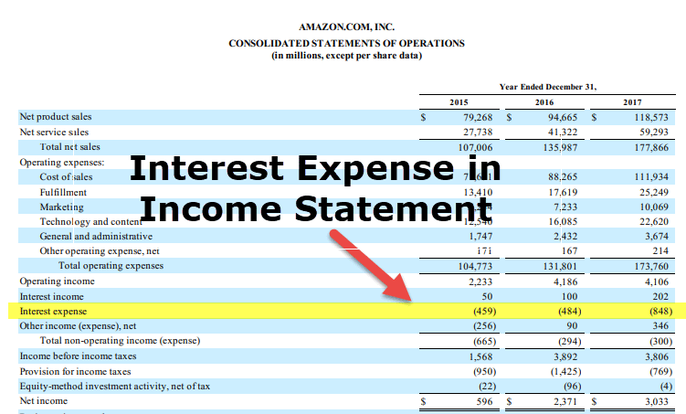

## Table of Contents

## What is business interest expense?

Business interest expense is the cost that a company pays for borrowing money. This can include interest on loans, credit lines, or bonds that the business uses to fund its operations or growth. It's an important part of a company's financials because it affects how much profit the business makes. When a company borrows money, it has to pay back not just the amount it borrowed, but also the interest, which is like a fee for using the money.

Interest expense can be found on a company's income statement, where it is subtracted from the company's earnings before interest and taxes (EBIT). This shows how much money the company has left after paying for the cost of borrowing. Managing interest expense is crucial for a business because high interest costs can eat into profits and make it harder for the company to grow or even stay afloat. Companies often try to find the best balance between using borrowed money to grow and keeping their interest expenses low.

## How is business interest expense calculated?

Business interest expense is calculated by adding up all the interest payments a company has to make on its debts. This includes interest on loans from banks, money borrowed from other sources like bonds, and any other form of credit the company uses. If a company has a loan with an interest rate of 5% and they borrowed $100,000, their interest expense for the year would be $5,000. That's because 5% of $100,000 is $5,000.

To find the total interest expense, you need to look at all the different debts the company has and calculate the interest for each one. Then, you add all those amounts together. For example, if a company has three loans: one at $50,000 with a 4% interest rate, another at $30,000 with a 6% interest rate, and a third at $20,000 with a 5% interest rate, you would calculate the interest for each loan separately and then add them up. The first loan would cost $2,000 in interest (4% of $50,000), the second would cost $1,800 (6% of $30,000), and the third would cost $1,000 (5% of $20,000). Adding these together, the total interest expense for the company would be $4,800.

## Can you explain the difference between interest expense and interest income?

Interest expense and interest income are two sides of the same coin, but they affect a company's finances in different ways. Interest expense is the money a company has to pay for borrowing money. This happens when a company takes out loans or issues bonds to get the cash it needs for its business. The interest on these debts is a cost to the company, and it reduces the company's profit because it's money that goes out.

On the other hand, interest income is the money a company earns from lending money or investing in interest-bearing assets, like bonds or savings accounts. When a company has extra cash, it might decide to put that money into something that will earn interest. This interest income adds to the company's profit because it's money coming in. So, while interest expense is a cost that decreases profit, interest income is revenue that increases profit.

## What types of loans typically generate business interest expense?

Business interest expense usually comes from loans that companies take to help run or grow their business. Some common types of loans that create this expense are bank loans, where a company borrows money from a bank and has to pay back the loan with interest. Another type is bonds, where a company borrows money from investors and pays them interest over time. Credit lines are also used, where a company can borrow money up to a certain limit and only pays interest on the amount they actually use.

Sometimes, businesses also use equipment loans to buy things like machinery or vehicles, and they pay interest on these loans too. Another type is real estate loans, which companies use to buy or improve property. All these loans add to the company's interest expense because they have to pay interest on the money they borrowed. This interest expense is something companies need to manage carefully because it affects how much profit they make.

## How does business interest expense affect a company's financial statements?

Business interest expense shows up on a company's income statement. It's listed as an expense, which means it's subtracted from the company's earnings. When you see earnings before interest and taxes (EBIT), and then you subtract the interest expense, you get to a number called earnings before taxes (EBT). This shows how much money the company has left after paying for the cost of borrowing. If the interest expense is high, it can really eat into the company's profits, making it harder for them to make money.

The interest expense also affects the company's cash flow statement. This statement shows how money moves in and out of the business. When a company pays interest on its loans, that money goes out, so it's shown as a cash outflow in the operating activities section. If a company has a lot of interest to pay, it can make it harder for them to have enough cash to run their business or invest in new things. So, keeping an eye on interest expense is important for understanding a company's financial health.

## What are the tax implications of business interest expense for a business?

Business interest expense can help a company save on taxes. When a company pays interest on its loans, it can usually subtract this amount from its earnings before figuring out how much tax it owes. This means the company's taxable income goes down, so they pay less in taxes. It's like getting a discount on their tax bill because they borrowed money.

But there are rules about how much interest a company can deduct. In some places, there might be limits on how much interest expense a company can take off their taxes. If a company borrows a lot of money and has a high interest expense, they might not be able to deduct all of it. This means they need to be careful and plan how they borrow money to make the most of the tax benefits while still managing their costs.

## How has the Tax Cuts and Jobs Act (TCJA) changed the treatment of business interest expense?

The Tax Cuts and Jobs Act (TCJA), which was passed in 2017, changed the rules about how businesses can handle their interest expense on their taxes. Before the TCJA, businesses could usually deduct all the interest they paid on their loans from their taxable income. But the TCJA set a new limit. Now, businesses can only deduct interest expenses up to 30% of their adjusted taxable income. This means if a business has a lot of debt and pays a lot in interest, they might not be able to deduct all of it from their taxes.

This change can make a big difference for businesses that borrow a lot of money. They need to think more carefully about how much they borrow because they can't deduct as much interest as before. But there's a special rule for small businesses. If a business has average annual gross receipts of $25 million or less, they can still deduct all their interest expense. This helps smaller businesses not be affected as much by the new rule.

## What is the limitation on business interest expense under Section 163(j)?

Section 163(j) of the Internal Revenue Code, which was changed by the Tax Cuts and Jobs Act, puts a limit on how much interest expense a business can deduct from their taxes. Now, a business can only deduct interest up to 30% of their adjusted taxable income. This means if a company has a lot of debt and pays a lot in interest, they might not be able to deduct all of it from their taxes like they used to. This can make a big difference for businesses that borrow a lot of money because they have to pay more in taxes.

There's a special rule for smaller businesses to help them out. If a business has average annual gross receipts of $25 million or less, they can still deduct all their interest expense. This rule helps smaller businesses not be affected as much by the new limit. So, businesses need to think carefully about how much they borrow and how it will affect their taxes under these new rules.

## How can a business optimize its interest expense to improve its financial health?

A business can optimize its interest expense by carefully managing its debt. This means looking at all the loans and credit the business has and trying to pay them off as quickly as possible. If a business can pay down its loans faster, it will pay less interest over time. Another way is to shop around for loans with lower interest rates. Sometimes, a business can refinance its loans to get a better deal, which means they pay less interest each month. This can save the business a lot of money and help it keep more of its profits.

Another important step is to keep a close eye on how much money the business is borrowing. If a business can find other ways to get money, like using its own profits or bringing in investors, it might not need to borrow as much. This can lower the interest expense because the business won't have as many loans to pay interest on. By managing debt wisely and looking for cheaper borrowing options, a business can improve its financial health and have more money to grow or save for the future.

## What are the strategies for managing high levels of business interest expense?

To manage high levels of business interest expense, a company can start by looking at all its loans and figuring out which ones have the highest interest rates. They can try to pay off these high-interest loans first. Another way is to talk to their bank or other lenders about refinancing their loans. Refinancing means getting a new loan with a lower interest rate to replace the old one. This can help the business pay less in interest each month. They can also look for other ways to get money, like using their own profits or bringing in investors, so they don't have to borrow as much.

Another strategy is to keep a close watch on their cash flow. By making sure they have enough money coming in to cover their loan payments, a business can avoid taking on more debt. They can also try to negotiate better terms with their lenders, like asking for a lower interest rate or a longer time to pay back the loan. By doing these things, a business can lower its interest expense and keep more of its profits, which helps them stay financially healthy and grow in the future.

## How do different accounting methods impact the reporting of business interest expense?

Different accounting methods can change how a business reports its interest expense. One big difference is between cash basis accounting and accrual basis accounting. With cash basis accounting, a business only records interest expense when it actually pays the interest. This means if a business pays interest at the end of the year, that's when they will show it on their financial statements. On the other hand, with accrual basis accounting, a business records interest expense as soon as it's owed, even if they haven't paid it yet. This can make the interest expense look higher on the financial statements because it includes all the interest that has built up over time, not just what was paid.

Another way accounting methods can affect interest expense is through how a business handles its debt. For example, if a business uses the straight-line method to account for its loans, it will spread the interest expense evenly over the life of the loan. But if it uses the effective interest method, the interest expense might be higher at the start of the loan and lower at the end. This can make a big difference in how the business's financial health looks on paper. By choosing the right accounting method, a business can show its interest expense in a way that makes sense for its operations and helps it manage its finances better.

## Can you discuss advanced scenarios where business interest expense plays a critical role in financial strategy?

In advanced financial strategies, business interest expense can be a key [factor](/wiki/factor-investing) when companies are looking at mergers and acquisitions. When one company wants to buy another, they often need to borrow a lot of money to do it. The interest they have to pay on this borrowed money becomes a big part of their costs. If the interest expense is too high, it can make the deal less profitable or even not worth doing. Companies need to think carefully about how much they're borrowing and at what interest rate. They might try to negotiate better loan terms or use a mix of their own money and borrowed money to keep the interest expense down. This way, they can make sure the merger or acquisition will help them grow without hurting their profits too much.

Another scenario where interest expense is critical is in leveraged buyouts (LBOs). In an LBO, a company is bought mostly with borrowed money, and the interest expense from these loans can be very high. The people buying the company need to make sure the company they're buying can generate enough cash to cover these interest payments. If the company's cash flow is strong, it can handle the high interest expense and still be profitable. But if the cash flow isn't good enough, the high interest expense can put the company in financial trouble. So, in LBOs, managing interest expense is really important. The buyers need to plan carefully and maybe use strategies like refinancing or paying down the debt quickly to keep the interest costs under control.

## What is the understanding of business finance and interest expense?

Business finance is the cornerstone of managing an organization's financial activities, encompassing various tasks such as raising capital, investing in projects, and maintaining effective cash flow management. These aspects ensure that a business can sustain operations and achieve strategic goals. One critical component of business finance is interest expense, which is the cost incurred by a company when borrowing funds to support its operations and growth. 

Interest expenses arise from different types of debt instruments, such as loans, bonds, or credit lines. The cost of borrowing is typically expressed as an [interest rate](/wiki/interest-rate-trading-strategies), which is a percentage of the principal amount borrowed. Calculating interest expense can be straightforward, using the formula:

$$
\text{Interest Expense} = \text{Principal} \times \text{Interest Rate} \times \text{Time Period}
$$

where the principal is the initial amount borrowed, the interest rate is the cost of borrowing, and the time period reflects the duration for which the money is borrowed.

Effective interest expense management is crucial as it directly affects a company's profitability and cash flow. High interest expenses can reduce net income, as they increase the total cost of financing. Conversely, efficiently managing and minimizing interest expenses can enhance a company's bottom line and free up cash for other uses.

There are several strategies to manage interest expenses effectively. One approach is refinancing existing debt to take advantage of lower interest rates, which can decrease overall interest costs. Additionally, businesses can negotiate better terms with lenders or opt for variable interest rate loans, which might offer lower rates compared to fixed-rate alternatives, depending on market conditions.

Another strategic approach is to optimize the capital structure by balancing debt and equity financing to achieve a lower weighted average cost of capital (WACC). This involves analyzing the costs and benefits of debt versus equity and adjusting the proportions to minimize overall costs while maintaining financial stability.

Finally, ensuring robust cash flow management helps meet interest obligations promptly, avoiding penalties and maintaining a favorable credit rating, which can lead to better borrowing terms in the future.

By applying these principles, businesses can optimize their interest expenses, safeguarding their financial health and reinforcing their capacity for growth and investment.

## What is the role of interest expense in financial strategy?

Interest expenses, a fundamental component of a company's financial strategy, emerge from the necessity to service debts incurred via business loans. These expenses are crucial for maintaining operational [liquidity](/wiki/liquidity-risk-premium) and supporting expansion initiatives. Understanding how interest expenses influence financial statements and optimizing the management of these costs are vital for a company's financial health and strategic growth.

### Influence of Interest Expenses on Financial Statements

Interest expenses are recorded on the income statement as a non-operating expense, directly affecting a company's net income. They are deducted from the operating income, leading to a reduced taxable income, which can be beneficial in lowering tax liabilities.

Mathematically, the impact of interest expenses can be represented as follows:

$$
\text{Net Income} = \text{Operating Income} - \text{Interest Expenses} - \text{Taxes}
$$

This equation highlights the direct subtraction of interest expenses from operating income, which not only reduces net income but can also decrease tax obligations depending on the tax rate and jurisdiction.

### Interest Expense Deductions and Tax Implications

Interest expenses can often be deducted from a company's taxable income, providing a form of tax shield. This deduction can be advantageous, enabling businesses to reduce their effective tax rate. However, the extent of these deductions is subject to tax regulations, which may vary across jurisdictions. In certain regions, limitations such as interest deduction caps or thin capitalization rules may restrict the full deductibility of interest expenses.

For example, under the U.S. Internal Revenue Code, businesses may be able to deduct interest expenses subject to limitations under Section 163(j), which imposes a cap based on a percentage of the adjusted taxable income. Understanding and navigating these regulations is essential for maximizing the benefits of interest expense deductions.

In practice, maintaining a sustainable balance between debt and equity financing is imperative. While debt-financing can provide immediate capital for growth and operations, excessive debt may lead to over-leveraging, resulting in high-interest obligations that could strain financial resources and impact credit ratings.

### Strategic Management of Interest Expenses

To optimize the impact of interest expenses on financial strategy, businesses should consider implementing various management tactics. These include refinancing existing debt to secure lower interest rates, utilizing interest rate swaps to hedge against rate fluctuations, and carefully planning the acquisition of new debt to align with long-term financial goals.

For instance, Python can be employed to model and analyze different interest rate scenarios to assist in strategic decision-making:

```python
import numpy as np

# Function to calculate the total interest expense given principal, rate, and time
def calculate_interest(principal, rate, time):
    return principal * (rate / 100) * time

# Example usage
loan_amount = 500000  # Principal loan amount
interest_rate = 5    # Interest rate in percentage
duration_years = 10  # Loan term in years

total_interest_expense = calculate_interest(loan_amount, interest_rate, duration_years)
print(f"Total Interest Expense over {duration_years} years: ${total_interest_expense}")
```

This code snippet demonstrates a simple way to project total interest expenses over a specified period, helping businesses to plan their financial strategies effectively.

In conclusion, the role of interest expenses is pivotal in financial strategy, necessitating careful management to leverage opportunities such as tax deductions while mitigating potential drawbacks such as increased financial leverage. Understanding these dynamics enables firms to enhance their financial performances and support their strategic objectives.

## How can Leveraging Interest Coverage Ratios be used in Algorithmic Trading?

The interest coverage ratio is a fundamental metric used to evaluate a company's financial health, particularly its ability to meet interest obligations. It is calculated as the ratio of a company's earnings before interest and taxes (EBIT) to its interest expense:

$$
\text{Interest Coverage Ratio} = \frac{\text{EBIT}}{\text{Interest Expense}}
$$

A higher interest coverage ratio indicates a stronger capacity to cover interest payments, providing a buffer against financial stress. This ratio is crucial for investors and traders, offering insights into the company's ability to withstand financial pressures and maintain operational stability.

Incorporating interest coverage ratios into [algorithmic trading](/wiki/algorithmic-trading) strategies can enhance decision-making by factoring in a company's financial robustness as part of the trading criteria. Algorithmic trading platforms can be programmed to monitor this ratio and execute trades based on predetermined thresholds or changes in the ratio over time.

For example, an algorithm might be designed to buy stocks of companies with an interest coverage ratio above a certain threshold, indicating strong financial health, or to sell stocks if the ratio falls below a set level, signaling potential financial difficulties. This approach allows traders to systematically incorporate fundamental financial assessments into their trading strategies, thereby refining the selection process and potentially reducing risk.

Here’s a simple Python code snippet demonstrating how one might incorporate the interest coverage ratio into a trading algorithm:

```python
def calculate_interest_coverage_ratio(ebit, interest_expense):
    if interest_expense == 0:
        return float('inf')  # Infinite ratio if no interest expense
    return ebit / interest_expense

def determine_trade_action(ebit, interest_expense, buy_threshold=3, sell_threshold=1):
    ratio = calculate_interest_coverage_ratio(ebit, interest_expense)
    if ratio >= buy_threshold:
        return "Buy"
    elif ratio <= sell_threshold:
        return "Sell"
    else:
        return "Hold"

# Example usage
ebit = 500000  # Example earnings before interest and taxes
interest_expense = 100000  # Example interest expense
action = determine_trade_action(ebit, interest_expense)
print(f"Suggested trade action: {action}")
```

This code calculates the interest coverage ratio and suggests a trade action based on specified thresholds for buying and selling. Such strategies leverage the interest coverage ratio to filter investment opportunities and manage risk more effectively, aligning trading decisions with broader financial analyses and market trends. This integration of [fundamental analysis](/wiki/fundamental-analysis) into algorithmic trading has the potential to improve trading performance by focusing on financially stable companies.

## References & Further Reading

[1]: Lopez de Prado, M. (2018). ["Advances in Financial Machine Learning"](https://www.amazon.com/Advances-Financial-Machine-Learning-Marcos/dp/1119482089). Wiley.

[2]: Chan, E. P. (2009). ["Quantitative Trading: How to Build Your Own Algorithmic Trading Business"](https://github.com/ftvision/quant_trading_echan_book). John Wiley & Sons.

[3]: Aronson, D. (2006). ["Evidence-Based Technical Analysis: Applying the Scientific Method and Statistical Inference to Trading Signals"](https://www.amazon.com/Evidence-Based-Technical-Analysis-Scientific-Statistical/dp/0470008741). Wiley.

[4]: Jansen, S. (2018). ["Machine Learning for Algorithmic Trading"](https://github.com/stefan-jansen/machine-learning-for-trading). Packt Publishing.

[5]: Hull, J. C. (2018). ["Options, Futures, and Other Derivatives"](https://www.semanticscholar.org/paper/Options%2C-Futures%2C-and-Other-Derivatives-Hull/89bdee500c8623864fc9eb7a471546aa713acc44). Pearson.

[6]: "HyperParameter Optimization in Machine Learning" by Bergstra, J., Bardenet, R., Bengio, Y., & Kégl, B. (2011). ["Algorithms for Hyper-Parameter Optimization."](https://link.springer.com/chapter/10.1007/978-3-030-67024-5_6) Advances in Neural Information Processing Systems 24.