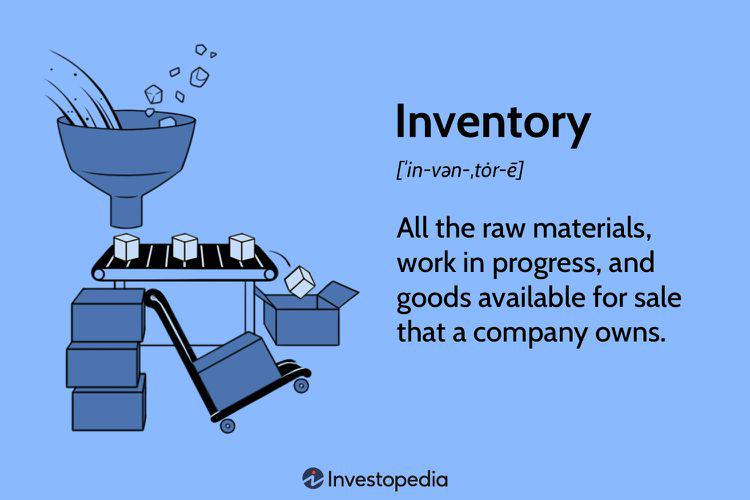

In today’s dynamic economic landscape, understanding business inventories and their management has become increasingly vital. Business inventories, encompassing the total amount of goods held by manufacturers, wholesalers, and retailers, play a central role as an economic indicator. They provide critical insights not only into current supply chain efficiencies but also into the broader economic trends that can influence financial markets.

This article aims to explore how these inventories serve as a significant economic indicator, shedding light on the balance between supply and demand. The management of these inventories is crucial for businesses as it directly impacts their operational efficiency and cost-effectiveness, ultimately influencing their competitiveness and sustainability. Through effective inventory management, companies can streamline their processes, minimize wastage, and reduce holding costs, thereby enhancing business performance.



The implications of inventories extend beyond traditional business management, especially within the trading sector where algorithmic trading has become predominant. This trading approach requires precise data analysis and decision-making based on various inputs, including inventory metrics. Algorithmic trading strategies often exploit market inefficiencies, and the incorporation of inventory data can provide a significant edge in predicting market movements and optimizing trading performance.

In this article, we will examine the intersection between inventory data and algorithmic trading strategies, illustrating the interconnectedness between these metrics and modern trading systems. The goal is to provide a comprehensive understanding of how mastering inventory metrics can influence economic predictions, guide trading strategies, and ultimately contribute to achieving sustainability and growth for traders and businesses alike.

## Table of Contents

## Understanding Business Inventories

Business inventories represent the total quantity of goods held by manufacturers, wholesalers, and retailers at any given time. These inventories are crucial as they provide a clear snapshot of a company’s ability to manage supply and demand effectively. Assessing inventory levels allows businesses to gauge supply chain efficiencies, helping them optimize operations and reduce costs.

Business inventories data are systematically collected through comprehensive surveys and compiled in reports that measure economic health. Among the primary surveys are the Monthly Retail Trade Survey, the Monthly Wholesale Trade Survey, and the Manufacturers' Shipments, Inventories, and Orders Survey. These surveys offer critical insights into the state of business inventories by tracking changes over time.

The Monthly Retail Trade Survey, conducted by the U.S. Census Bureau, focuses on the retail sector, capturing data on sales, inventories, and sales-to-inventories ratios. Similarly, the Monthly Wholesale Trade Survey provides insights into the wholesale sector by tracking sales, inventories, and inventory-to-sales ratios of wholesale firms. The Manufacturers' Shipments, Inventories, and Orders Survey offers valuable details about the manufacturing sector's activities, including new orders, shipments, and inventory changes.

The collected data play a vital role in forecasting future production levels and economic trends. For instance, economists and analysts examine inventory-to-sales ratios to predict economic activity. A high inventory-to-sales ratio may suggest an oversupply of goods, indicating potential slowdowns in sales or overproduction. Conversely, a low ratio may signal strong sales potential or an undersupply, suggesting the need for increased production.

Accurate inventory management based on robust data collection helps businesses anticipate future demand more effectively, while also providing [statistics](/wiki/bayesian-statistics) that policymakers and financial analysts use to devise economic strategies and forecasts. Thus, business inventories are not only a measure of internal supply chain performance but also an essential indicator of broader economic health.

## Role of Inventory Management

Inventory management involves overseeing and controlling the ordering, storage, and use of components that a company will use in the production of the items it sells. Effective inventory management maximizes efficiency and reduces costs by ensuring that the supply chain operates smoothly, without excess stock or shortages that could disrupt production and sales. This not only enhances overall business performance but also secures customer satisfaction through timely delivery of goods.

In the context of trading, particularly [algorithmic trading](/wiki/algorithmic-trading), maintaining optimal inventories is crucial for managing risks and improving capital efficiency. Inventory levels must be strategically managed to align with market demands and investor expectations. By keeping the right amount of stock at the right time, businesses can avoid the costs associated with overstocking and understocking. This balance is critical in high-frequency and algorithmic trading environments where rapid transactions and market [volatility](/wiki/volatility-trading-strategies) can significantly impact inventory valuations and capital allocations.

Strategies such as Economic Order Quantity (EOQ) and portfolio optimization play a pivotal role in achieving optimized inventory levels. EOQ is a mathematical model used to determine the optimal order quantity that minimizes the total costs associated with ordering and holding inventory. The formula for EOQ is given by:

$$
EOQ = \sqrt{\frac{2DS}{H}}
$$

where $D$ is the annual demand, $S$ is the ordering cost per order, and $H$ is the holding cost per unit per year. By applying EOQ, companies can determine the most economical quantity to order that balances the ordering and holding costs.

Portfolio optimization in inventory management involves the strategic allocation of resources to manage inventory risk and maximize returns. This approach considers the statistical correlation and covariance between different stock items, using models that may include linear programming or more sophisticated techniques like Monte Carlo simulations.

Efficient inventory management thus becomes a vital determinant of a company’s ability to remain competitive and sustainable in the long term. Companies that master inventory dynamics can better anticipate demand fluctuations, optimize their supply chains, and maintain resilience in the face of market changes. This adaptability not only improves operational efficiency but also positions businesses to capitalize on emerging opportunities and mitigate potential risks.

## Inventory as an Economic Indicator

Inventory levels are a critical economic indicator that offer insights into both macroeconomic conditions and individual business health. As inventories fluctuate, they reflect underlying trends in demand and supply, which can inform a variety of economic analyses and forecasts.

A central metric used to interpret inventory levels is the inventory-to-sales ratio. This ratio, expressed as:

$$
\text{Inventory-to-Sales Ratio} = \frac{\text{Inventories}}{\text{Sales}}
$$

measures the amount of inventory a company holds in relation to its sales. A high inventory-to-sales ratio may imply that a company is struggling to sell its products, indicating potentially waning consumer demand or overproduction issues. Conversely, a low inventory-to-sales ratio often suggests that sales are robust, pointing to healthy consumer demand or efficient inventory management.

Understanding these indicators is crucial for economists and analysts who aim to forecast economic cycles. For instance, an increasing inventory-to-sales ratio across multiple industries might signal an upcoming economic downturn, as it may indicate that businesses are anticipating lower future sales. On the other hand, a consistent decrease in this ratio could be interpreted as an economic expansion, driven by strong demand.

By analyzing inventory data, businesses can better anticipate market demands and adjust their strategies accordingly. For example, if a company notices a rising inventory-to-sales ratio, it might decide to scale back production or adjust pricing strategies to stimulate sales. On the macroeconomic level, policymakers can utilize inventory metrics as a leading indicator to make informed decisions regarding monetary policy or economic interventions.

In summary, inventory levels serve as a dynamic indicator of economic health and business performance. By interpreting inventory-to-sales ratios and other relevant data, businesses and analysts can make more informed decisions, anticipating economic trends and adjusting strategies to maintain competitiveness.

## Integration of Inventory Data in Algorithmic Trading

Algorithmic trading leverages intricate algorithms and vast datasets to make swift trading decisions, often capitalizing on market inefficiencies. Integrating inventory data in these strategies sharpens the ability to predict market movements by providing critical insights on supply-demand dynamics and resulting price changes. This aspect becomes particularly vital in high-frequency trading ([HFT](/wiki/high-frequency-trading-strategies)), where rapid decision-making can significantly impact profitability.

Inventory data enrich [quantitative trading](/wiki/quantitative-trading) models by revealing patterns in economic activity and corporate performance, which play crucial roles in forecasting price trends and market behaviors. For example, excessive inventories might indicate weaker future demand, prompting algorithmic traders to adjust their strategies preemptively. Conversely, lower inventory levels might signal impending supply constraints and potential price increases, presenting lucrative opportunities for strategic trades.

Top-tier quantitative trading firms, including Two Sigma and Renaissance Technologies, are prominent for harnessing such economic indicators within their sophisticated trading algorithms. By incorporating inventory metrics, these firms can more accurately balance their portfolios' risks and capitalize on inventory-related market signals, thereby optimizing returns.

The mathematical models used in these processes often employ regression analysis, time series forecasting, and [machine learning](/wiki/machine-learning) algorithms to process inventory data. For instance, a simple linear regression model in Python might look something like this:

```python
import numpy as np
import pandas as pd
from sklearn.linear_model import LinearRegression

# Simulated inventory and price data
inventory_levels = np.array([100, 150, 200, 250, 300]).reshape(-1, 1)
market_prices = np.array([10, 9.5, 8.5, 8, 7.5])

# Create and train the regression model
model = LinearRegression()
model.fit(inventory_levels, market_prices)

# Predict the market price for a new inventory level
new_inventory_level = np.array([[350]])
predicted_price = model.predict(new_inventory_level)
print(f"Predicted Market Price: {predicted_price}")
```

This integration of inventory data not only aids in balancing risks and optimizing inventory management processes but also enhances the robustness of trading strategies, ultimately leading to better financial outcomes. By understanding and utilizing these statistical relationships, algorithmic traders can maintain an advantageous position in highly competitive markets.

## Technologies and Tools for Inventory Management and Trading

Advanced technologies are crucial in effectively managing inventories within trading environments. Algorithmic trading platforms such as QuantConnect and MetaTrader play significant roles by providing robust tools that assist in inventory management and risk assessment. These platforms allow traders to develop, backtest, and deploy trading strategies using inventory data, which can enhance decision-making by ensuring that inventories are maintained at optimal levels.

Portfolio management systems are another vital technology, offering comprehensive solutions that integrate inventory data. These systems enable better decision-making by providing real-time analytics and reporting, which allows for the adjustment of inventory levels in response to market changes. By leveraging these systems, businesses can ensure that inventory levels are aligned with market demand, reducing costs and increasing efficiency.

Additionally, machine learning and data analytics platforms are instrumental in developing predictive models that make use of inventory data. These tools analyze past inventory trends and sales data to forecast future demand, helping businesses optimize their inventory levels. For example, machine learning algorithms can predict when a stock replenishment is necessary, minimizing both overstocking and stockouts.

A simple machine learning approach in Python to predict inventory demand might involve using linear regression:

```python
import pandas as pd
from sklearn.model_selection import train_test_split
from sklearn.linear_model import LinearRegression
from sklearn.metrics import mean_squared_error

# Load inventory dataset
data = pd.read_csv('inventory_data.csv')
features = data[['historical_sales', 'seasonality', 'price']]
target = data['future_demand']

# Split data into training and test sets
X_train, X_test, y_train, y_test = train_test_split(features, target, test_size=0.2, random_state=42)

# Train the model
model = LinearRegression()
model.fit(X_train, y_train)

# Make predictions
predictions = model.predict(X_test)

# Evaluate the model
mse = mean_squared_error(y_test, predictions)
print(f'Mean Squared Error: {mse}')
```

This model uses historical sales data, seasonality, and price to predict future demand, which can help in planning inventory requirements more accurately.

In summary, the integration of advanced technologies and tools for inventory management in trading markets enables businesses to optimize operations and enhance strategic planning. Through the efficient use of trading platforms, portfolio management systems, and predictive analytics, companies can better navigate market fluctuations and maintain a competitive edge.

## Real-World Applications and Case Studies

High-frequency trading firms like Virtu Financial rely heavily on the efficient management of inventory to conduct numerous trades with speed and precision. This efficiency is paramount as these firms operate on razor-thin margins and require rapid execution to capitalize on transient market opportunities. By optimizing their inventory management system, Virtu Financial ensures they can meet the fluctuating demands of the market without incurring excessive holding costs or [liquidity](/wiki/liquidity-risk-premium) shortfalls. The utilization of sophisticated algorithms and real-time data analytics enables these firms to fine-tune their inventory levels, maintain balance, and ensure seamless execution.

Hedge funds, such as Bridgewater Associates, leverage inventory management to exploit market inefficiencies. These funds often engage in strategies that require the strategic allocation and reallocation of their asset portfolios based on observed market conditions and predictive analytics. Effective inventory management allows them to promptly adjust holdings to maintain advantageous positions, thereby optimizing returns and managing risk. The integration of economic indicators, including those derived from inventory metrics, supports these adjustments by providing insights into potential market shifts.

Broker-dealers have a critical role in maintaining market liquidity, which necessitates the management of large inventories. Their ability to buy and sell financial instruments in substantial volumes hinges on accurately gauging and managing inventory levels, ensuring they can meet client needs promptly. Efficient inventory strategies allow broker-dealers to facilitate smooth transactions between buyers and sellers, maintaining market stability and satisfying regulatory requirements for capital and risk management.

Exchange-traded fund ([ETF](/wiki/etf-trading-strategies)) providers like BlackRock and Vanguard use inventory management techniques to ensure their funds precisely track their respective indices. The task involves continuous reevaluation and rebalancing of the underlying assets that constitute the ETFs. Precise inventory management minimizes tracking errors and maximizes investment performance for shareholders. By employing advanced data analytics and modeling, these providers maintain the alignment of their funds' portfolio compositions with the target indices.

These examples collectively demonstrate the indispensable role of inventory management across various financial sectors. Whether it be rapid trading execution, strategic reallocation in hedge funds, liquidity provision in broker-dealers, or precise index tracking in ETFs, effective inventory handling is a cornerstone of financial operations. The ability to manage inventories efficiently not only supports immediate operational needs but also provides a foundation for sustained competitive advantage and long-term growth.

## Conclusion

Efficient inventory management plays a pivotal role in enhancing business operations and informing robust trading strategies. Its impact on economic indicators is profound, as inventory levels can signal shifts in market demand and production cycles. By analyzing inventory data, businesses and traders gain vital insights into economic performance, enabling them to make informed decisions that can lead to increased profitability and sustainability.

This comprehensive analysis illustrates that inventory management is a cornerstone of financial market success. When integrated with algorithmic trading, inventory data serves as a crucial input for predictive models that anticipate market trends. This integration provides traders with a competitive edge, allowing for the optimization of trading strategies and improved performance outcomes. Algorithmic frameworks leverage inventory metrics to balance risks and identify market inefficiencies, thus enhancing decision-making processes and returns.

For traders and businesses alike, mastering inventory dynamics is a key [factor](/wiki/factor-investing) in achieving sustainability and growth. By effectively managing inventory, companies can reduce costs, improve supply chain efficiencies, and ultimately maintain a competitive advantage in the market. This understanding empowers stakeholders to anticipate market movements and adjust their strategies accordingly, securing a stable economic presence amid fluctuating market conditions.

## References & Further Reading

[1]: ["Understanding the Inventory-to-Sales Ratio and its impact on the economy."](https://www.indeed.com/career-advice/career-development/inventory-to-sales-ratio) by the Federal Reserve

[2]: ["Monthly Retail Trade Survey"](https://www.census.gov/retail/index.html) conducted by the U.S. Census Bureau

[3]: ["Economic Order Quantity (EOQ) Model"](https://en.wikipedia.org/wiki/Economic_order_quantity) explained on Investopedia

[4]: ["Inventory Practices and Inventory Management: Financial Performance Implications"](https://accountinginsights.org/inventory-managements-impact-on-financial-performance/) By Gaur, V. and Fisher, M. on the Annals of Operations Research

[5]: ["Algorithmic Trading: Winning Strategies and Their Rationale"](https://www.amazon.com/Algorithmic-Trading-Winning-Strategies-Rationale-ebook/dp/B00CY5HC0U) by Ernest P. Chan