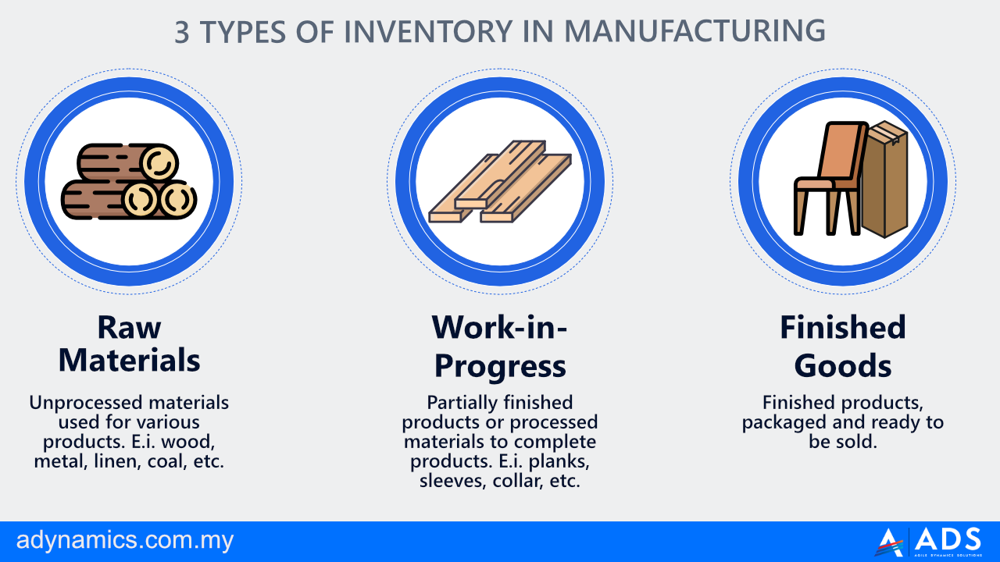

## Table of Contents

## What is a business inventory?

A business inventory is all the stuff a company has that it plans to sell or use to make things. This includes products sitting on shelves, materials waiting to be used, and even items that are on their way to the store. Keeping track of inventory helps a business know what they have and what they need to order more of.

Having a good inventory system is important because it helps a business run smoothly. If a company knows exactly what it has, it can avoid running out of popular items or having too much of things that don't sell well. This can save money and make customers happy because they can always find what they need.

## Why is inventory management important for businesses?

Inventory management is really important for businesses because it helps them keep the right amount of stuff on hand. If a business has too much inventory, it can tie up a lot of money and take up space. But if they don't have enough, they might miss out on sales because customers can't find what they want. Good inventory management helps a business find the sweet spot where they have just enough to meet demand without wasting resources.

It also helps businesses run more smoothly. When a company knows exactly what it has in stock, it can plan better. They can order new items before they run out, and they can also spot trends in what customers are buying. This can help them make smarter decisions about what to stock in the future. Overall, good inventory management can save money, keep customers happy, and help a business grow.

## What are the different types of inventory?

There are several types of inventory that businesses might have. One type is raw materials, which are the basic things a company uses to make its products. For example, a bakery might have flour and sugar as raw materials. Another type is work-in-progress inventory, which is stuff that's in the middle of being made. If the bakery is in the process of baking bread, that bread is work-in-progress inventory. Finally, there's finished goods inventory, which is stuff that's ready to be sold. The bread that's cooled and ready to go on the shelf is finished goods inventory.

Another type of inventory is maintenance, repair, and operations (MRO) inventory. These are the supplies a business needs to keep running smoothly, like cleaning supplies or tools. For example, a factory might have MRO inventory like spare parts for their machines. There's also safety stock, which is extra inventory a business keeps on hand just in case something unexpected happens, like a big rush of customers or a delay in getting new stock. This helps make sure the business can keep going even if something goes wrong.

## How does inventory affect a company's cash flow?

Inventory can have a big impact on a company's cash flow. When a business buys a lot of inventory, it uses up cash. This means the company has less money available to spend on other things like paying bills or investing in new projects. If the inventory sits around for a long time without being sold, it can tie up cash that could be used elsewhere. This can make it hard for the business to manage its cash flow effectively.

On the other hand, if a company manages its inventory well, it can help improve cash flow. When inventory is sold quickly, the business gets cash back faster. This means they can use that money to buy more inventory or cover other expenses. Good inventory management helps a company keep just the right amount of stock, so they don't have too much money tied up in unsold goods. This can make it easier for the business to have a healthy cash flow and keep operations running smoothly.

## What are the basic principles of inventory control?

Inventory control is all about making sure a business has the right amount of stuff at the right time. One of the main principles is keeping track of what you have. This means knowing how much of each item is in stock and where it is. By keeping good records, a business can avoid running out of popular items or having too much of things that don't sell well. Another important principle is setting up a system to reorder items before they run out. This can be done by using a minimum stock level, so when inventory gets low, it's time to order more.

Another principle of inventory control is managing the flow of goods. This means making sure new items come in and old items go out smoothly. A business might use a first-in, first-out (FIFO) system, where the oldest items are sold first to avoid spoilage or obsolescence. It's also important to regularly check the accuracy of inventory records. This can be done through physical counts or using technology like barcode scanners. By following these principles, a business can keep its inventory under control and run more efficiently.

## What are the common methods for tracking inventory?

One common method for tracking inventory is the periodic inventory system. In this system, a business counts its inventory at set times, like once a month or once a year. They look at what they have and compare it to what they had before. This helps them figure out how much they've sold and what they need to order. It's simple but can be hard to keep up with if a business has a lot of items or if they need to know their inventory levels more often.

Another method is the perpetual inventory system. This system uses technology to keep track of inventory all the time. Every time an item is sold or received, it's recorded in a computer system. This gives a business a real-time view of what they have in stock. It's more accurate and helps businesses manage their inventory better, but it can be more expensive to set up because it needs special software and sometimes even barcode scanners or RFID tags.

Some businesses also use a hybrid system, which mixes elements of both periodic and perpetual systems. They might use technology to track their most important items all the time, but do periodic counts for less important ones. This can be a good middle ground, giving a business the benefits of real-time tracking without the full cost of a complete perpetual system.

## How can technology improve inventory management?

Technology can make inventory management a lot easier and more accurate. Tools like barcode scanners and RFID tags help businesses keep track of their stuff in real-time. This means they always know exactly what they have in stock, which can help them order new items before they run out. It also makes it easier to find things in a big warehouse because you can quickly scan items to see where they are. Plus, using technology can cut down on mistakes that can happen when people count things by hand.

Software can also help businesses manage their inventory better. Programs like inventory management systems can automatically keep track of what's coming in and going out. They can even predict how much of something a business will need in the future based on past sales. This can save a lot of time and help a business make smarter decisions about what to stock. Overall, technology makes it easier to keep the right amount of inventory, which can save money and keep customers happy.

## What are the key performance indicators (KPIs) for inventory management?

Key performance indicators (KPIs) for inventory management help businesses understand how well they are doing. Some important KPIs include inventory turnover, which shows how quickly a business sells and replaces its stock. A high turnover rate means products are selling fast, which is good. Another KPI is the days sales of inventory (DSI), which tells a business how many days it takes to turn inventory into sales. A lower DSI means a business is selling its inventory faster, which is also good.

Another important KPI is the stock-to-sales ratio, which compares the amount of inventory a business has to how much it sells. This helps a business know if it has too much or too little stock. The fill rate is also key, showing the percentage of customer demand that is met without running out of stock. A high fill rate means customers are more likely to find what they need. Finally, the accuracy of inventory records is crucial, as it shows how well a business keeps track of what it has. Good accuracy helps prevent overstocking or running out of items.

## How does inventory management impact customer satisfaction?

Inventory management can really affect how happy customers are. If a business keeps the right amount of stuff in stock, customers can usually find what they want when they need it. This makes them happy because they don't have to go somewhere else to buy what they need. On the other hand, if a business runs out of popular items, customers might get frustrated and go to a different store. This can make them less likely to come back in the future.

Good inventory management also means that products are fresh and in good condition. If a business keeps too much stock for too long, items might get old or go bad. Customers don't like buying things that are outdated or spoiled. By managing inventory well, a business can make sure that customers always get fresh, high-quality products. This helps build trust and keeps customers coming back, which is great for the business in the long run.

## What are the challenges of managing inventory in a global supply chain?

Managing inventory in a global supply chain can be tricky because there are so many things to keep track of. When a business gets its stuff from all over the world, it has to deal with different time zones, languages, and rules in each country. This can make it hard to know when items will arrive and how much to order. If something goes wrong, like a delay at a port or a problem with a supplier, it can mess up the whole plan. Plus, keeping track of everything across the world can be a big job, and mistakes can happen more easily.

Another challenge is that costs can change a lot in a global supply chain. Things like shipping fees, taxes, and currency exchange rates can make it hard to predict how much inventory will cost. If these costs go up suddenly, a business might end up spending more than it planned. Also, if there's a big difference in demand for products in different countries, it can be tough to figure out how much to send where. Good communication and planning are really important to handle all these challenges and keep the inventory running smoothly around the world.

## How can businesses optimize their inventory levels using data analytics?

Businesses can use data analytics to make their inventory levels just right. By looking at past sales data, businesses can see which items sell quickly and which ones don't. This helps them know how much to order so they don't have too much or too little stock. Data analytics can also help businesses predict future demand. If they see that certain items sell more during certain times of the year, they can order more of those items before the busy season starts. This way, they can make sure they have enough to meet customer needs without wasting money on extra stock.

Another way data analytics can help is by looking at how inventory moves through the supply chain. Businesses can use data to find out where things might be getting stuck or delayed. This can help them fix problems before they cause big issues. For example, if data shows that a certain supplier is often late, a business might decide to find a new supplier or keep extra safety stock to cover those delays. By using data to make smart decisions, businesses can keep their inventory levels optimized and their operations running smoothly.

## What are the latest trends in inventory management for 2023?

In 2023, one big trend in inventory management is the use of [artificial intelligence](/wiki/ai-artificial-intelligence) (AI) and [machine learning](/wiki/machine-learning). These technologies help businesses predict how much stuff they will need in the future by looking at past sales data. This can make it easier for businesses to keep the right amount of inventory without running out of popular items or having too much of things that don't sell well. AI can also help find problems in the supply chain, like delays or mistakes, so businesses can fix them quickly. This makes inventory management smoother and more efficient.

Another trend is the focus on sustainability. More and more businesses are trying to be eco-friendly by managing their inventory in a way that's good for the planet. This means using less packaging, choosing suppliers who are also sustainable, and trying to waste less. Some businesses are also using technology to keep track of their carbon footprint and make sure they're not harming the environment too much. By being more sustainable, businesses can save money and appeal to customers who care about the environment.

## What is the role of inventory management?

Inventory management involves overseeing and controlling the ordering, storage, and use of components that a company will use in the production of the items it sells. Effective inventory management maximizes efficiency and reduces costs by ensuring that the supply chain operates smoothly, without excess stock or shortages that could disrupt production and sales. This not only enhances overall business performance but also secures customer satisfaction through timely delivery of goods.

In the context of trading, particularly [algorithmic trading](/wiki/algorithmic-trading), maintaining optimal inventories is crucial for managing risks and improving capital efficiency. Inventory levels must be strategically managed to align with market demands and investor expectations. By keeping the right amount of stock at the right time, businesses can avoid the costs associated with overstocking and understocking. This balance is critical in high-frequency and algorithmic trading environments where rapid transactions and market [volatility](/wiki/volatility-trading-strategies) can significantly impact inventory valuations and capital allocations.

Strategies such as Economic Order Quantity (EOQ) and portfolio optimization play a pivotal role in achieving optimized inventory levels. EOQ is a mathematical model used to determine the optimal order quantity that minimizes the total costs associated with ordering and holding inventory. The formula for EOQ is given by:

$$
EOQ = \sqrt{\frac{2DS}{H}}
$$

where $D$ is the annual demand, $S$ is the ordering cost per order, and $H$ is the holding cost per unit per year. By applying EOQ, companies can determine the most economical quantity to order that balances the ordering and holding costs.

Portfolio optimization in inventory management involves the strategic allocation of resources to manage inventory risk and maximize returns. This approach considers the statistical correlation and covariance between different stock items, using models that may include linear programming or more sophisticated techniques like Monte Carlo simulations.

Efficient inventory management thus becomes a vital determinant of a company’s ability to remain competitive and sustainable in the long term. Companies that master inventory dynamics can better anticipate demand fluctuations, optimize their supply chains, and maintain resilience in the face of market changes. This adaptability not only improves operational efficiency but also positions businesses to capitalize on emerging opportunities and mitigate potential risks.

## How does inventory serve as an economic indicator?

Inventory levels are a critical economic indicator that offer insights into both macroeconomic conditions and individual business health. As inventories fluctuate, they reflect underlying trends in demand and supply, which can inform a variety of economic analyses and forecasts.

A central metric used to interpret inventory levels is the inventory-to-sales ratio. This ratio, expressed as:

$$
\text{Inventory-to-Sales Ratio} = \frac{\text{Inventories}}{\text{Sales}}
$$

measures the amount of inventory a company holds in relation to its sales. A high inventory-to-sales ratio may imply that a company is struggling to sell its products, indicating potentially waning consumer demand or overproduction issues. Conversely, a low inventory-to-sales ratio often suggests that sales are robust, pointing to healthy consumer demand or efficient inventory management.

Understanding these indicators is crucial for economists and analysts who aim to forecast economic cycles. For instance, an increasing inventory-to-sales ratio across multiple industries might signal an upcoming economic downturn, as it may indicate that businesses are anticipating lower future sales. On the other hand, a consistent decrease in this ratio could be interpreted as an economic expansion, driven by strong demand.

By analyzing inventory data, businesses can better anticipate market demands and adjust their strategies accordingly. For example, if a company notices a rising inventory-to-sales ratio, it might decide to scale back production or adjust pricing strategies to stimulate sales. On the macroeconomic level, policymakers can utilize inventory metrics as a leading indicator to make informed decisions regarding monetary policy or economic interventions.

In summary, inventory levels serve as a dynamic indicator of economic health and business performance. By interpreting inventory-to-sales ratios and other relevant data, businesses and analysts can make more informed decisions, anticipating economic trends and adjusting strategies to maintain competitiveness.

## References & Further Reading

[1]: ["Understanding the Inventory-to-Sales Ratio and its impact on the economy."](https://www.indeed.com/career-advice/career-development/inventory-to-sales-ratio) by the Federal Reserve

[2]: ["Monthly Retail Trade Survey"](https://www.census.gov/retail/index.html) conducted by the U.S. Census Bureau

[3]: ["Economic Order Quantity (EOQ) Model"](https://en.wikipedia.org/wiki/Economic_order_quantity) explained on Investopedia

[4]: ["Inventory Practices and Inventory Management: Financial Performance Implications"](https://accountinginsights.org/inventory-managements-impact-on-financial-performance/) By Gaur, V. and Fisher, M. on the Annals of Operations Research

[5]: ["Algorithmic Trading: Winning Strategies and Their Rationale"](https://www.amazon.com/Algorithmic-Trading-Winning-Strategies-Rationale-ebook/dp/B00CY5HC0U) by Ernest P. Chan