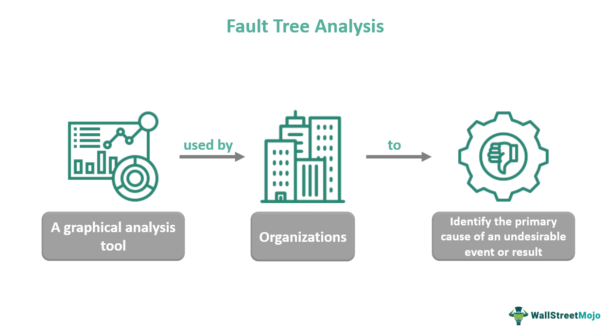

In the modern business environment, the convergence of logic, business rules, and algorithmic trading forms a cohesive framework crucial for the efficiency and effectiveness of both businesses and markets. This intricate system serves as the backbone for facilitating complex business operations, ensuring organizations can respond adeptly to rapidly changing market conditions and consumer demands. 

At the heart of this framework lies business logic, which constitutes the set of custom rules and algorithms designed to manage information flow seamlessly between databases and user interfaces. This operational framework dictates how business activities should be executed, providing a foundation for business software that supports structured workflows and informed decision-making.



Complementing business logic are business rules, which establish essential directives that define an organization’s objectives and procedures. These rules create a guiding structure within which business logic operates, encompassing aspects such as compliance, process guidelines, and performance metrics. By automating business rules through Business Rule Management Systems (BRMS), organizations can achieve dynamic adaptability, adjusting to market shifts with speed and precision.

Algorithmic trading further illustrates the practical application of this synergy. This approach uses automated systems to execute financial transactions based on predetermined strategies and business rules. The integration of business logic and rules in algorithmic trading enables traders to conduct transactions with speed, accuracy, and consistency, highlighting the enhanced performance capabilities afforded by this combined system.

This article explores these components' interconnected nature, offering practical examples and insights into real-world applications. By clarifying how logic, business rules, and algorithmic trading intersect and function collaboratively, businesses can harness their full potential to streamline operations, improve decision-making accuracy, and maintain competitive edges in contemporary markets.

## Table of Contents

## Understanding Business Logic

Business logic is a critical component of any business software system, encapsulating the rules and algorithms that drive the flow of information between databases and user interfaces. It serves as the operational framework that guides how various business activities are conducted. This framework is fundamental, ensuring that systems operate according to the specific needs and goals of the business.

The essence of business logic lies in its ability to dictate workflows effectively. It defines the precise sequence or steps that need to be followed to accomplish certain tasks within an organization. For example, consider an online retail platform where business logic determines the process of handling an order: from the moment a customer completes a purchase, to the inventory check, payment verification, and finally, the shipping of the product. This logical sequence is critical to maintaining efficiency and ensuring customer satisfaction.

Business logic also plays a role in decision-making processes. For instance, a financial application might rely on predefined logic to assess loan applications. By evaluating an applicant's credit score, income level, and existing debts against set criteria, the application can automatically decide whether to approve or reject the loan application. This ensures that decision-making is not only swift but also consistent with organizational policies.

In technical terms, business logic bridges the gap between data storage and user interaction. It encompasses three main types of logic: presentation logic (how data is presented to the user), business rules logic (what the business application does), and workflow logic (how processes flow between states). Together, these ensure that the software not only meets functional requirements but also adheres to the business's strategic objectives.

Here is a simple Python example illustrating the role of business logic in a sales commission scenario:

```python
def calculate_commission(sales_amount):
    # Define business logic for sales commission
    if sales_amount < 1000:
        return 0  # No commission for sales under 1000
    elif 1000 <= sales_amount < 5000:
        return sales_amount * 0.05
    else:
        return sales_amount * 0.10

# Example usage
sales = 6000
commission = calculate_commission(sales)
print(f"Commission for sales of ${sales} is ${commission:.2f}")
```

In this example, the business logic determines that sales below 1000 do not earn a commission, sales between 1000 and 5000 earn 5%, and sales above 5000 earn 10%. Such logic is embedded in the software to automate calculations, ensuring fairness and accuracy according to predetermined business rules.

By carefully structuring business logic, organizations ensure that their operations are efficient, accurate, and aligned with their strategic goals. Properly implemented, it not only supports day-to-day operations but also provides a foundation for scalability and innovation.

## The Role of Business Rules

Business rules serve as critical directives that define an organization’s objectives and procedures, acting as a cornerstone for operational clarity and consistency. These rules typically encompass a broad spectrum of organizational activities, offering guidance on areas such as compliance, operational processes, and performance metrics. Their primary function is to establish a reliable framework within which business logic can manifest, ensuring that the implementation of strategies aligns closely with the overarching goals of the organization.

One fundamental role of business rules is to maintain compliance. By predefining acceptable behaviors and procedures, these rules serve to ensure adherence to statutory requirements and industry standards. For instance, a financial institution might have business rules governing the approval of loans, which include checks for credit scores and income verification. This ensures that the decision-making processes comply with both internal policies and external legal requirements.

In addition to compliance, business rules also streamline processes by providing clear, actionable instructions that reduce ambiguity in task execution. This streamlining enhances the efficiency and accuracy of day-to-day operations. For instance, a business rule might dictate that a sales discount of 10% can only be applied to orders exceeding $500, automatically guiding sales personnel and systems in their transaction processing activities.

Performance metrics are another area where business rules exert significant influence. By defining what constitutes success, business rules help organizations monitor and measure performance effectively. For example, a rule might specify that a customer service representative's performance is considered satisfactory if they resolve 95% of support tickets within 24 hours. These metrics provide tangible targets for performance evaluation and improvement.

Automating business rules through systems such as Business Rule Management Systems (BRMS) enables organizations to adapt rapidly to market changes by dynamically updating rules as needed. These systems allow for the centralization and easy modification of business rules. For example, a retail company could use a BRMS to adjust its pricing rules based on real-time competitive data, ensuring that it remains competitive in the marketplace.

A basic example of how a BRMS might be used in a retail context is demonstrated in the Python code snippet below, which applies a discount to eligible orders:

```python
class Order:
    def __init__(self, amount):
        self.amount = amount
        self.discount = 0

    def apply_discount(self):
        # Business rule: Apply 10% discount to orders over $500
        if self.amount > 500:
            self.discount = self.amount * 0.10
            self.amount -= self.discount

# Example
order = Order(600)
order.apply_discount()
print(f'Final amount after discount: ${order.amount} (Discount: ${order.discount})')
```

In this example, the business rule is straightforward: apply a 10% discount to any order exceeding $500. Automating such rules not only boosts efficiency but also ensures consistency across all transactions.

Overall, business rules are indispensable for defining and guiding organizational operations. By establishing a clear framework for compliance, processes, and performance, and through automation, businesses are better equipped to navigate and respond to dynamic market conditions effectively.

## Business Logic vs. Business Rules

Business rules are formal statements that describe the operations, definitions, and constraints that apply to an organization. They are static and prescriptive, outlining specific conditions that must be fulfilled to achieve desired business outcomes. For instance, a business rule may stipulate that all customer discounts should not exceed 20% of the listed price. These rules establish the essential framework that dictates how processes should proceed and align with organizational goals.

In contrast, business logic serves as the implementation engine executing these static rules within a software system. Business logic utilizes algorithms and workflows to apply business rules in real-time scenarios, enabling automated decision-making and operations. Where business rules provide the "what" and "why," business logic supplies the "how." For example, a business logic system might execute a series of conditional actions within a sales application to automatically apply discounts during checkout based on the amount spent by the customer, adhering to the predefined business rule constraint of a maximum 20% discount.

The interconnectedness between business rules and logic is vital, as it allows organizations to interpret and apply guidelines dynamically. This relationship maintains operational focus and flexibility, tuning processes to meet changing business objectives effectively. In a credit card fraud detection system, for instance, business rules may define certain thresholds for flagging suspicious transactions, such as transactions exceeding $1,000 or transactions made in quick succession within different geographical locations. An operational scenario might involve business logic executing these rules by analyzing transaction data in real-time, identifying any transactions that meet the suspicious criteria, and subsequently placing a hold on those transactions for further review.

By understanding the interplay between business rules and business logic, companies achieve a streamlined synchronization between policy and implementation, ensuring that high-level directives are consistently met with precision and efficiency.

## Examples of Business Logic and Business Rules

Real-world applications of business logic and business rules demonstrate their crucial role in streamlining operations and boosting organizational efficiency. A common example is the implementation of customer discount policies. These policies are governed by predefined business rules, such as providing a 10% discount for purchases over $100 or offering seasonal discounts during specific times of the year. Business logic, in turn, automates the application of these rules across the sales platform, ensuring that customers receive discounts accurately and promptly during checkout without manual intervention.

Automated sales commissions also illustrate the synergy between business logic and business rules. Sales commission structures might include rules such as paying a 5% commission on sales up to $10,000 and 7% on sales exceeding that amount. Business logic automates the calculation and distribution of these commissions based on individual sales records, reducing the likelihood of errors and ensuring timely payments to the sales team.

Moreover, the identification of suspicious transaction triggers is an essential function in financial institutions, designed to enhance security and comply with regulatory standards. Business rules can specify transactions above a certain monetary threshold or in high-risk countries as suspicious. The corresponding business logic then continuously monitors transactions against these rules and flags potential issues for further examination. This automated process aids in quickly identifying fraudulent activities while minimizing human oversight, thereby safeguarding organizational assets and maintaining compliance.

These examples provide a clear depiction of how effectively structured business logic and rules can optimize decision-making processes and maintain operational efficiency. The automation they provide eliminates the need for constant manual updates and oversight, allowing for quick adaptation to new strategies or market conditions. Firms adopting these systems are better positioned to enhance their strategic capabilities in dynamic and competitive environments.

## Algorithmic Trading: Merging Logic and Rules

Algorithmic trading is the practice of using computers to automate market trading processes. At its core, [algorithmic trading](/wiki/algorithmic-trading) systems are programmed with a set of predefined rules and strategies which are executed through complex algorithms. The integration of business logic and business rules within these systems is pivotal for ensuring robust trading operations.

Business logic is employed to dictate the step-by-step processes needed to complete trading operations. This involves making decisions based on real-time data inputs, which are critical in fast-paced market environments. The logic determines how to handle various trading scenarios, such as buy or sell decisions, position sizing, and risk management adjustments. For instance, an algorithm may be designed to buy a certain stock if its moving average drops below a specific threshold, representing the embodiment of business logic in action.

Business rules, on the other hand, define the constraints and guidelines that the automated systems should follow. These rules are crucial in maintaining compliance with regulatory standards and incorporating firm-specific strategic objectives. Examples of business rules in algorithmic trading could include limiting trade volumes to comply with risk policy or ensuring trades are only executed during specific market hours.

The merger of business logic and rules enables the creation of algorithmic trading models that are both flexible and robust. This synergy ensures the trading systems can respond dynamically to market fluctuations while adhering to overarching trading strategies and compliance requirements. It allows traders to backtest strategies against historical data, ensuring that the business logic and rules optimise trading performance and mitigate risks.

One of the prominent benefits of algorithmic trading is the speed at which trades can be executed. Automated systems can process vast amounts of data and execute orders at speeds unattainable by human traders, providing a competitive edge in the market. This speed is crucial in capturing opportunities within microseconds, often determining the profitability of trades.

Accuracy is another significant advantage. Algorithmic systems reduce the risk of human error, ensuring that trades are executed precisely according to the embodied business logic and rules. This precision is important in maintaining trading consistency and reliability, thereby fostering trust in automated trading systems.

Consistency across trades is also enhanced as algorithmic trading eliminates emotional biases that may affect human decision-making. Systems operate based on logic and rules, ensuring uniform application of strategies irrespective of market conditions. This consistency is invaluable in executing trades that align with pre-set strategic objectives, enhancing overall trading performance.

In conclusion, algorithmic trading effectively merges business logic and business rules, creating an efficient and reliable trading environment. The integration of these elements ensures that trading strategies are executed with speed, accuracy, and consistency, thereby maximising trading opportunities while adhering to regulatory and strategic mandates.

## Challenges and Considerations

Adopting business logic and algorithmic trading involves navigating several significant challenges, primarily centered around data management and system complexity.

Data management is crucial to ensuring the successful implementation and operation of business logic systems. Effective data management involves maintaining data quality and integrity, which requires robust data governance strategies. This includes implementing policies for data collection, storage, and retrieval that minimize errors and prevent data loss or corruption. Additionally, it's essential to manage data compliance with regulations such as the General Data Protection Regulation (GDPR) to protect sensitive information and ensure ethical data usage.

System complexity is another considerable challenge. The integration of business logic into existing architectures often necessitates comprehensive system redesigns or enhancements, posing risks of increased computational overhead and system inefficiencies. Development teams must address the scalability of these systems to handle fluctuating data volumes and user demands without compromising performance. This involves optimizing algorithms and employing scalable cloud-based solutions that offer the necessary computational resources.

Accuracy in data processing is imperative to avoid erroneous outcomes in business operations or trading decisions. Machine learning models or procedural algorithms must be refined through continuous testing and validation to improve predictive accuracy.

Regulatory compliance presents an additional layer of complexity. Adhering to financial regulations and industry standards is necessary to mitigate the risk of legal repercussions and fines. Businesses must incorporate compliance checks within their logic systems and stay updated with evolving regulatory frameworks.

Strategies to overcome these challenges include employing modular software architectures that allow easy updates and maintenance. Leveraging [artificial intelligence](/wiki/ai-artificial-intelligence) and [machine learning](/wiki/machine-learning) for real-time data analysis can enhance decision-making processes. Additionally, employing a continuous integration/continuous deployment (CI/CD) pipeline can streamline updates while minimizing disruption.

A practical example of overcoming these challenges can be illustrated in Python by implementing a basic algorithmic trading model:

```python
import pandas as pd
import numpy as np

# Sample function to calculate moving average
def calculate_moving_average(data, window_size):
    return data.rolling(window=window_size).mean()

# Example data
data = pd.Series([1, 2, 3, 4, 5, 6, 7, 8, 9, 10])

# Calculate moving average to aid trading decisions
moving_avg = calculate_moving_average(data, window_size=3)
trading_signal = np.where(data > moving_avg, "Buy", "Sell")

print(trading_signal)
```

This code snippet demonstrates a simplistic approach where moving averages guide trading actions, echoing the careful balance of logic, data accuracy, and adaptability required in real-world applications. Through such strategies, organizations can optimize their systems, ensuring that business logic and algorithmic trading systems deliver maximum efficiency and reliability.

## Conclusion

The integration of business logic, business rules, and algorithmic trading significantly enhances the efficiency and effectiveness of business operations. Business logic provides the blueprint for how tasks are executed, ensuring that all processes align with an organization’s goals. Business rules act as the guiding principles that define objectives and maintain compliance and consistency. When these two components are optimized within an organization, they create a cohesive structure that supports informed decision-making and streamlined workflows.

Algorithmic trading serves as a prime example of this integration, where predefined rules and business logic collaborate to execute trades automatically. This not only increases the speed and accuracy of transactions but also introduces a level of precision that minimizes human error. By leveraging algorithms, businesses can respond swiftly to market changes, maintain consistency in trade executions, and better utilize available data for strategic benefits.

Understanding and implementing these elements helps companies improve accuracy and performance. Accurate data and precise rules can lead to better decision-making processes, improved forecasts, and more effective management strategies. As businesses seek to stay competitive in modern markets, embracing technology-driven solutions becomes essential. Leveraging advanced analytics, machine learning, and automated systems ensures that organizations remain agile and capable of adapting to rapid market shifts.

The future of business operations hinges on the seamless integration of technology and strategic thinking. By adopting frameworks that incorporate business logic, rules, and algorithmic trading, organizations position themselves to harness technological advancements fully, leading to sustainable growth and success in an increasingly complex corporate landscape.

## References & Further Reading

[1]: Bergstra, J., Bardenet, R., Bengio, Y., & Kégl, B. (2011). ["Algorithms for Hyper-Parameter Optimization."](https://dl.acm.org/doi/10.5555/2986459.2986743) Advances in Neural Information Processing Systems 24.

[2]: ["Advances in Financial Machine Learning"](https://www.amazon.com/Advances-Financial-Machine-Learning-Marcos/dp/1119482089) by Marcos Lopez de Prado

[3]: ["Evidence-Based Technical Analysis: Applying the Scientific Method and Statistical Inference to Trading Signals"](https://www.amazon.com/Evidence-Based-Technical-Analysis-Scientific-Statistical/dp/0470008741) by David Aronson

[4]: ["Machine Learning for Algorithmic Trading"](https://github.com/stefan-jansen/machine-learning-for-trading) by Stefan Jansen

[5]: ["Quantitative Trading: How to Build Your Own Algorithmic Trading Business"](https://www.amazon.com/Quantitative-Trading-Build-Algorithmic-Business/dp/1119800064) by Ernest P. Chan