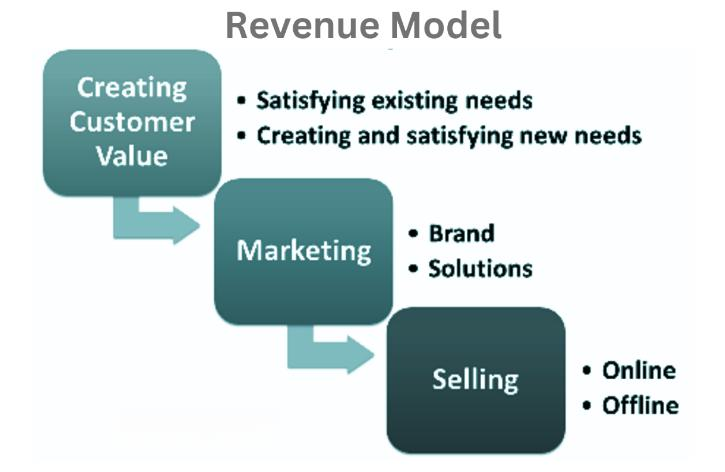

The private prison industry has grown significantly since its inception in the late 20th century, representing a complex intersection of business, politics, and societal issues. At its core, this industry operates based on the contractual agreement between governments and private corporations to manage and operate correctional facilities. This partnership is purported to reduce costs and improve efficiency in the incarceration system, yet it is often mired in controversy due to ethical concerns regarding profit motives and their impact on incarceration rates.

Algorithmic trading, on the other hand, has revolutionized the financial industry with its use of computer algorithms to automate trading, offering increased speed, efficiency, and accuracy over traditional trading methods. This approach leverages vast amounts of data and complex algorithms to execute trades that might otherwise be difficult or impossible for humans to process swiftly. The rise of algorithmic trading across various sectors, including equities, commodities, and currencies, underscores a broader trend towards the integration of technology and data-driven decision-making in business processes.



The objective of this article is to explore the intersection of the private prison industry and algorithmic trading, investigating how automated trading and data analytics might influence investment decisions in this contentious sector. This exploration is crucial for understanding the balance between profitability and ethical considerations, particularly as these systems could potentially prioritize financial returns over human and societal impacts.

As we set the stage for a detailed analysis, it is essential to recognize the dual nature of private prisons as both a business model and a social institution. This industry thrives on multiple economic drivers, including government contracts and the provision of inmate services, rendering it uniquely sensitive to changes in incarceration policies and rates. Simultaneously, the rapid development of algorithmic trading offers a lens through which the financial viability and ethical implications of such investments can be examined, raising questions about the role of automated strategies in sectors that inherently involve human rights considerations.

## Table of Contents

## Understanding the Private Prisons Business Model

The private prison industry represents a significant segment of the corrections landscape within the United States, operating alongside publicly run facilities. This sector emerged in response to the rapid rise in incarceration rates during the late 20th century, driven by stringent sentencing laws and policies such as the War on Drugs. 

### Description of the Private Prison Industry and Its Economic Drivers

The private prison industry comprises firms that manage incarceration facilities on behalf of governmental entities. Its primary economic driver is cost-efficiency, as governments outsource prison management to reduce public spending. The industry promises streamlined operations, purportedly delivering incarceration services at lower costs than state-managed prisons. Companies in this sector often claim to offer more innovative solutions and flexibility compared to their government counterparts.

### Analysis of Key Players and Market Size

Key players in the private prison sector include major corporations like CoreCivic and GEO Group. These companies hold substantial shares of the market, operating numerous facilities across various states. As of recent estimates, the industry holds contracts worth billions of dollars annually, though precise market valuation can fluctuate based on governmental policy changes and public sentiment toward incarceration methods.

### Examination of Revenue Streams, Including Government Contracts and Inmate Services

The primary revenue stream for private prisons stems from government contracts. These contracts typically involve a per-diem rate per inmate, which incentivizes companies to maintain high occupancy levels. Additional revenue is generated through inmate services, which may include commissary sales, telephone services, and rehabilitative programs. Critics argue that these practices can create perverse incentives, prioritizing profit over rehabilitation.

### Impact of Incarceration Rates on Business Success

Incarceration rates directly influence the private prison industry's profitability. Higher incarceration rates correlate with increased demand for prison beds, benefitting private entities under contract. Variation in incarceration policies, decriminalization efforts, and sentencing reforms can significantly impact occupancy rates and, subsequently, the financial health of private prison firms. 

### Highlighting Recent Trends and Challenges in the Private Prison Sector

Recent trends indicate a growing scrutiny of the private prison business model, driven by heightened awareness of social justice issues and the ethics of profiting from imprisonment. Policymakers and activists increasingly challenge the model, advocating for reduced incarceration rates and improved conditions within facilities. Such pressures have resulted in some states terminating or declining to renew contracts with private prison companies. Additionally, financial institutions and investors are reevaluating their involvement, mindful of the reputational risks associated with such investments.

This sector also faces operational challenges, including addressing overcrowding and ensuring adequate staffing and security measures. The demand for integrating rehabilitative and educational services into incarceration strategies adds layers of complexity. As these trends unfold, they pose both threats and opportunities for the industry's future viability.

## Algorithmic Trading: A Brief Overview

Algorithmic trading, often referred to as algo trading, involves using computer programs to automate trading decisions in financial markets. These algorithms can analyze complex data sets much faster than a human trader, executing trades based on pre-defined criteria such as timing, price, or quantity. This method enables trades to be made with high precision and rapid speed, often in fractions of a second, thereby maximizing potential returns and minimizing human error.

The technology behind [algorithmic trading](/wiki/algorithmic-trading) relies heavily on advanced computational models and [artificial intelligence](/wiki/ai-artificial-intelligence). Mathematical models and statistical analyses are crucial for developing trading algorithms that can predict market trends and execute trades successfully. For instance, a basic algorithm might exploit price discrepancies of a stock across different exchanges to profit from [arbitrage](/wiki/arbitrage). More complex algorithms incorporate [machine learning](/wiki/machine-learning) techniques, allowing these systems to adapt to new data and market conditions over time.

The benefits of algorithmic trading are manifold. One primary advantage is speed—algorithms can monitor markets and execute trades significantly faster than human capabilities. This rapid execution is pivotal in high-frequency trading, where opportunities can exist for only milliseconds. Additionally, algorithmic trading enables high levels of accuracy, as trades are automated based on rigorous quantitative analysis, reducing emotional and psychological biases that often affect human traders.

A variety of industries have been transformed by algorithmic trading, particularly the financial services industry. One prominent case study is the rise of high-frequency trading firms on Wall Street, which utilize algorithmic strategies to capitalize on minute market movements. Furthermore, the foreign exchange market has seen increased efficiency and [liquidity](/wiki/liquidity-risk-premium) due to algorithmic trading. Commodities trading, too, has adopted these automated systems to handle the complex pricing data inherent in this sector.

Despite these benefits, algorithmic trading presents substantial challenges and risks. One significant concern is the potential for market disruptions. Algorithms operate without human oversight, leading to the risk of unintended consequences or "flash crashes," like the one in 2010 where major U.S. stock indices plummeted and rebounded in mere minutes. Additionally, the high-speed environment of algorithmic trading can lead to increased market [volatility](/wiki/volatility-trading-strategies) and systemic risk. Regulatory challenges also arise, as financial authorities strive to monitor and control the complex algorithms driving these trades to ensure fair and orderly markets.

In summary, algorithmic trading has revolutionized financial markets by leveraging technology to enhance trading speed and efficiency. While offering numerous benefits, it also presents substantial risks and challenges that must be managed carefully to ensure stability and fairness in financial systems.

## Interplay Between Private Prisons and Algorithmic Trading

Algorithmic trading has the potential to significantly influence investment patterns in the private prison industry. By using complex algorithms that analyze vast datasets at incredible speeds, algorithmic trading can identify investment opportunities in sectors like private prisons, where traditional analysis might be slower or less efficient.

**Data-Driven Decisions in Corrections and Rehabilitation**

Data-driven decision-making in corrections and rehabilitation can improve operational efficiency, reducing recidivism rates through targeted interventions. Algorithms can analyze inmate data to predict behaviors and allocate resources effectively. Investments decisions, therefore, could be influenced by these algorithmic assessments, as facilities demonstrating better outcomes may attract more investment.

**Ethical Implications**

Integrating algorithmic processes with incarceration raises ethical concerns. One major issue is the potential for bias in algorithmic predictions, which can perpetuate systemic inequalities. For instance, if an algorithm is trained on biased historical data, it might suggest decisions that unfairly target certain demographic groups, exacerbating existing disparities.

**Case Study: Private Prison Stocks and Algorithm-Based Investment Strategies**

To illustrate the interplay between private prison stocks and algorithm-based investment, consider firms that track prison performance metrics—such as occupancy rates, cost reductions, and recidivism rates. Algorithmic trading strategies could use these metrics to predict stock performance, buying or selling based on predicted profitability.

```python
import numpy as np

# Example: Predictive model for stock prices based on prison metrics
def predict_stock_price(occupancy_rate, cost_reduction, recidivism_rate):
    # Simple linear model coefficients
    coefficients = np.array([0.5, 0.3, -0.2])
    variables = np.array([occupancy_rate, cost_reduction, recidivism_rate])
    prediction = np.dot(coefficients, variables)
    return prediction

# Sample data
occupancy_rate = 0.85
cost_reduction = 0.1
recidivism_rate = 0.15

predicted_price = predict_stock_price(occupancy_rate, cost_reduction, recidivism_rate)
```

**Public Perception and Regulatory Considerations**

Public perception of the prison industry significantly affects regulatory considerations. If the use of algorithmic trading is seen to prioritize profits over ethical treatment, there may be a push for stricter regulations. Transparency in algorithmic decision-making processes might mitigate some negative perceptions, promoting responsible investment strategies that align with public values.

Overall, the integration of algorithmic trading within the private prison industry presents a complex web of financial and ethical considerations, requiring careful navigation to ensure balanced outcomes.

## The Ethical and Regulatory Landscape

The private prison industry is fraught with ethical concerns, chiefly rooted in the profit motives that may conflict with rehabilitative goals and humane treatment of inmates. Critics argue that the aim of maximizing revenue can lead to practices such as reducing expenditures on inmate care, healthcare, and safety, potentially resulting in substandard conditions. Furthermore, there are issues regarding the incentivization of high incarceration rates, as private prisons often have contracts with government bodies based on occupancy levels, sometimes including clauses that guarantee certain capacities.

Legislation plays a crucial role in shaping the prison industry, acting as both an enabler and a regulator of private prisons' operations. Laws such as the Prison Litigation Reform Act and various state legislations have significant influence over prison conditions, inmate rights, and the extent to which private entities can participate in the correctional system. The oversight provided by governmental legislation is intended to ensure ethical operations, yet, the variability in state laws can lead to inconsistencies in how private prisons are managed across different jurisdictions.

Algorithmic trading introduces another layer of complexity when intertwined with investments in the prison sector. This technology automates investment decisions, potentially amplifying investments in private prisons based on profitability metrics rather than ethical considerations. The major regulatory challenge is ensuring that the algorithms do not inadvertently support or exacerbate unethical practices within the prison industry. Current regulations on algorithmic trading, such as those imposed by the Securities and Exchange Commission (SEC), focus mainly on transparency and the prevention of market manipulation but are less tuned to sector-specific ethical impacts.

Public policy changes can have profound effects on both private prisons and algorithmic trading. Reforms aimed at reducing incarceration rates or enhancing transparency may shift how private prisons are funded or operated. Similarly, policy initiatives that regulate algorithmic trading more tightly could require these automated systems to incorporate ethical considerations in their decision-making processes. Potential public policies could mandate the inclusion of social responsibility metrics alongside financial indicators in the algorithms used for investing in sensitive sectors such as private prisons.

There is ongoing debate about designing more ethical algorithms for managing prison investments. One proposal is to develop algorithms that [factor](/wiki/factor-investing) in ethical considerations directly, perhaps through multi-objective optimization frameworks that include not only profit but also social impact assessment. For example, algorithms could be programmed to evaluate investments based on a combination of financial return and the social responsibility score of the company, potentially guided by established ethical frameworks or standards.

In summary, the intersection of the private prison industry and algorithmic trading involves navigating a complex ethical and regulatory landscape. Addressing these concerns requires collaborative efforts among policymakers, technologists, and financial entities to ensure responsible innovation that prioritizes ethical standards alongside economic interests.

## Future Trends and Considerations

The private prison industry is on the cusp of transformation as technological advancements reshape its operations and investments. Technology is increasingly becoming a pivotal element in corrections management, impacting areas from operational efficiency to ethical oversight. As investors and policymakers look to the future, several trends and considerations are emerging.

### Technological Impact on Private Prisons

The integration of technology promises significant changes in the private prison industry. For instance, the adoption of AI (Artificial Intelligence) and machine learning can enhance inmate management, predictive maintenance of facilities, and streamline administrative processes. These tools offer opportunities to improve security by predicting potential incidents and optimizing resource allocation.

However, the application of AI carries risks, primarily concerning ethical considerations and data privacy. For example, reliance on predictive algorithms for parole decisions may inadvertently reinforce racial biases if historical data is not adequately vetted for fairness. It is essential for policymakers to ensure transparent and unbiased AI systems to mitigate such risks.

### Emerging Trends in Algorithmic Trading

Algorithmic trading continues to evolve, driven by advancements in data analytics and computational power. The ability to process vast quantities of data rapidly allows for precise investment strategies, including those involving private prison stocks. This capability could lead investment firms to reconsider portfolio allocations across industries affected by socio-political factors, such as private incarceration.

The trend towards environmental, social, and governance ([ESG](/wiki/esg-investing)) criteria in investment decisions may also see algorithmic trading applied to assess the ethical viability of investing in private prisons. Enhanced analytic techniques can evaluate the long-term sustainability of these investments, given potential regulatory changes and public scrutiny.

### Societal Shifts and Technological Advancements

Societal attitudes toward incarceration and reform are evolving, influencing legislative movements and public perception of the private prison industry. Technological advancements can either exacerbate or alleviate ethical concerns depending on their application. For instance, adopting smart surveillance tools can raise privacy concerns but also serve to monitor and reduce instances of misconduct.

Additionally, the increased focus on criminal justice reform presents both a challenge and an opportunity for private prison operators. As alternative correctional approaches, such as restorative justice, gain traction, the business model of incarceration is under pressure to adapt, potentially through technological innovation that supports rehabilitation over punishment.

### Strategies for Investors and Policymakers

Investors and policymakers can employ several strategies to navigate these emerging trends. They should prioritize investments in technology that enhance operational efficiency while respecting ethical boundaries. Implementing rigorous oversight mechanisms for AI and machine learning applications is critical to ensuring their responsible use.

Policymakers must engage in proactive dialogue with stakeholders to legislate clear and fair guidelines concerning the use of technology in prisons. As societal values shift, regulators should consider frameworks that encourage private prison operators to align with modern correctional philosophies, focusing on rehabilitation and societal reintegration.

Looking forward, the integration of technology in private prisons and algorithmic trading offers substantial prospects for innovation and reform. Careful balance and thoughtful strategy will be key to harnessing these advancements while addressing ethical and societal concerns.

## Conclusion

The intersection of algorithmic trading and the private prison sector presents a unique set of challenges and opportunities. One key insight is the potential for algorithmic trading to significantly impact investment decisions within the prison industry, leveraging data-driven strategies to maximize returns. While this technology promises enhanced efficiency and profitability, it raises ethical considerations surrounding the commodification of incarceration, where human lives are impacted by market dynamics.

Ethical implications are manifold; the use of algorithmic trading in investment strategies related to private prisons exacerbates concerns about prioritizing profit over social justice. Critics argue that this could incentivize maintaining high incarceration rates, thus clashing with efforts for prison reform and rehabilitation. It is essential to carefully examine the motivations driving such investments and ensure they align with societal values and human rights standards.

The potential for sustainable reforms and technological integration within the prison industry hinges on transparency and ethical oversight. There is an opportunity to use technology not only for investment purposes but also for improving correctional facilities and rehabilitation programs. Incorporating AI and machine learning could revolutionize how the prison system operates, potentially leading to better outcomes for inmates and society.

Encouraging ongoing dialogue and responsible innovation in these fields is crucial. Stakeholders, including policymakers, investors, and the public, must engage in thorough discussions to navigate the complexities of integrating advanced technologies in sectors where ethical considerations are paramount. This dialogue should focus on balancing profitability with ethical responsibilities, ensuring that technological advancements contribute to more just and humane correctional practices.

In conclusion, there is a pressing need for balanced and ethical business strategies as we move forward. Embracing responsible innovation and actively engaging in constructive discussions can lead to business models that benefit all stakeholders while respecting human dignity. A thoughtful approach to aligning technological advancements with ethical imperatives can pave the way for significant improvements in both the private prison industry and the application of algorithmic trading.

## References & Further Reading

[1]: Wacquant, L. (2009). ["Punishing the Poor: The Neoliberal Government of Social Insecurity."](https://www.jstor.org/stable/j.ctv11smrv3) Duke University Press.

[2]: Selman, D., & Leighton, P. (2010). ["Punishment for Sale: Private Prisons, Big Business, and the Incarceration Binge."](http://www.antoniocasella.eu/nume/Selman_Leighton_2010.pdf) Rowman & Littlefield Publishers.

[3]: Duffy, J. & Stubbs-Richardson, M. (2019). ["Private Prisons and the Marketplace: Review and Conceptual Research Agenda."](https://pmc.ncbi.nlm.nih.gov/articles/PMC7550172/) American Behavioral Scientist.

[4]: Narang, R. (2013). ["Inside the Black Box: A Simple Guide to Quantitative and High-Frequency Trading."](https://www.amazon.com/Inside-Black-Box-Quantitative-Frequency/dp/1118362411) John Wiley & Sons.

[5]: Eubanks, V. (2018). ["Automating Inequality: How High-Tech Tools Profile, Police, and Punish the Poor."](https://www.jstor.org/stable/27256515) St. Martin's Press.

[6]: Ashworth, A. & Zedner, L. (2014). ["Preventive Justice."](https://academic.oup.com/book/2737) Oxford University Press.