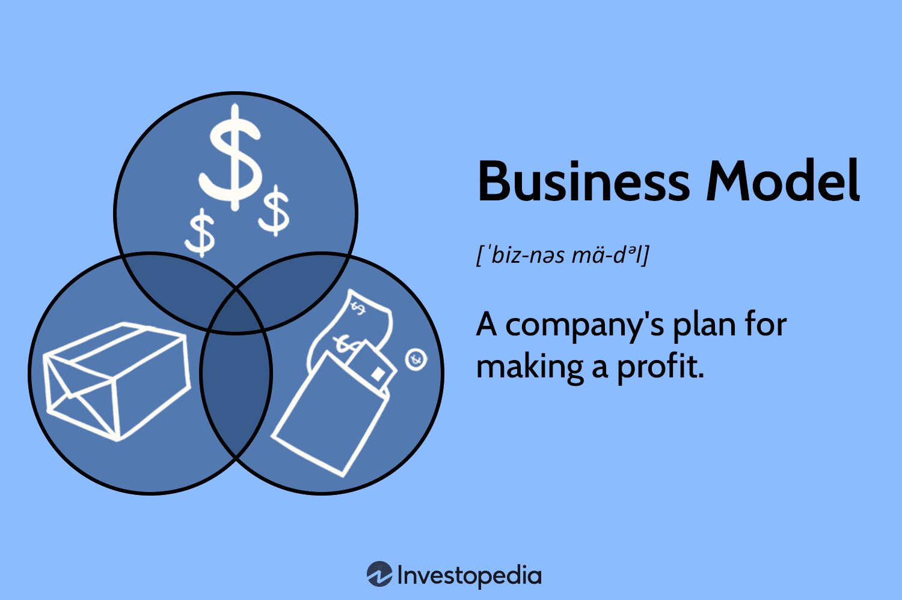

Algorithmic trading has emerged as a transformative force in the financial industry, leveraging computational power and sophisticated algorithms to automate and optimize trading decisions. This evolution is reshaping market dynamics, providing enhanced liquidity, and creating opportunities for both institutional and individual investors. With the increasing complexity and speed of financial markets, algorithmic trading has become an essential component of investment strategies, representing a significant portion of trading volumes across major exchanges.

The significance of sound business models and strategies cannot be overstated when navigating the competitive and ever-evolving landscape of algorithmic trading. Business models define how trading firms create, deliver, and capture value, directly influencing their potential for growth and profitability. Successful firms adopt flexible and innovative business models to adapt to market changes, technological advancements, and regulatory standards.



Developing a robust business plan is crucial to the success of algorithmic trading systems. This plan acts as a roadmap, guiding the strategic development of technological infrastructure, resource allocation, and risk management practices. It ensures alignment between trading strategies and overarching business objectives, fostering a cohesive approach to market participation.

The intersection of business strategies and technical innovation is a focal point for algorithmic trading success. Advanced technologies, including machine learning and artificial intelligence, play a pivotal role in designing and refining trading algorithms. Simultaneously, strategic planning and market analysis provide the necessary framework for harnessing these technologies effectively.

This article will explore core topics such as understanding business models for algorithmic trading, crafting effective business strategies, technical and operational requirements, regulatory compliance, and industry trends. By examining these elements, we aim to provide comprehensive insights into building successful algo trading ventures in today's dynamic financial landscape.

## Table of Contents

## Understanding Business Models for Algorithmic Trading

Business models are foundational frameworks that outline how a company creates, delivers, and captures value. In the context of algorithmic trading firms, they define the manner in which these companies monetize their technologies and services, thereby sustaining operations and facilitating growth. The choice of business model is pivotal, as it largely determines the revenue streams and scalability potential of a firm in the competitive algorithmic trading ecosystem.

Several business models have gained traction in the [algorithmic trading](/wiki/algorithmic-trading) space, each with distinct characteristics and implications for revenue generation and market expansion:

1. **Subscription-Based Models**: These models require clients to pay a recurring fee, usually monthly or annually, for continued access to trading services or platforms. This model offers predictable revenue, aiding firms in strategic planning and resource allocation. QuantConnect and Numerai are notable examples in this space, providing algorithmic trading platforms that operate on a subscription basis.

2. **Freemium Models**: A combination of free and premium services, freemium models allow users to access basic features at no cost, with advanced functionalities available for a fee. This model enables initial user acquisition at a low barrier of entry, cultivating a broad user base. Platforms like Alpaca employ freemium models, offering free commission trading while charging for enhanced features such as premium data feeds or advanced API access.

3. **Licensing Models**: Licensing involves granting permission to use proprietary technology or algorithms in exchange for a license fee. This model capitalizes on intellectual property by allowing multiple users or firms to leverage a company's innovations. Firms like Trading Technologies use licensing to provide access to their trading software, generating substantial income from multiple licensees.

The choice of business model directly influences a firm's revenue streams and scalability. Subscription-based models provide consistent revenue, facilitating long-term planning but can limit growth if the market doesn't expand. Freemium models promote rapid user base growth, though monetization may require time to convert free users to paying customers. Licensing models can scale quickly as more partners adopt the technology, although they may involve more complex negotiations and legal considerations.

Digital platforms play a crucial role in transforming traditional trading business models. By utilizing these platforms, algorithmic trading firms can reach a broader audience efficiently, automate processes, and offer scalable solutions without significant infrastructure investments. Cloud-based services, real-time data analytics, and AI-driven insights are integral to digital transformation in this sector, enabling firms to enhance service delivery, improve client engagement, and maintain competitive resilience in a rapidly evolving market landscape.

## Crafting a Business Strategy in Industry Algo Trading

A strategic plan in algorithmic trading serves as the blueprint that aligns the company's resources, goals, and operations to achieve financial success. It involves a cohesive approach that integrates business objectives with innovative trading strategies, ensuring that each component of the organization works towards a common aim.

A successful business strategy in this context includes several key components:

1. **Market Analysis:** Understanding the market environment is crucial. This involves assessing the competition, identifying trends, and determining the potential rewards and risks associated with different trading strategies. Market analysis helps identify opportunities for differentiation and competitive advantage.

2. **Customer Identification:** Recognizing and targeting the right clientele is essential. Whether the focus is on retail traders or institutional clients, knowing the customer base helps tailor services and products that meet their specific needs, enhancing customer satisfaction and loyalty.

3. **Risk Management:** Effective risk management is core to any trading strategy. This involves setting risk limits, employing hedging strategies, and continuously monitoring all risk factors that could impact trading performance. A robust risk management framework safeguards the firm’s assets and ensures long-term sustainability.

Aligning trading strategies with business objectives is fundamental to realizing the company’s goals. Trading strategies should be designed to not only achieve financial return but also to support broader business metrics such as market expansion or client acquisition.

Innovation and technology are integral to modern business strategy in algorithmic trading. Technological advancements, especially in computational capabilities and [artificial intelligence](/wiki/ai-artificial-intelligence), have significantly enhanced trading strategies. Firms that prioritize innovation in algorithm design, execution speed, and data analytics gain a competitive edge.

Insights from industry leaders emphasize the importance of agility and adaptability in crafting effective business strategies. Successful firms often conduct regular strategic reviews and adapt to changes in regulation, technology, and market dynamics. They also prioritize talent acquisition and foster a culture of continuous learning and improvement.

In conclusion, a well-crafted business strategy in algorithmic trading not only focuses on financial goals but also incorporates market understanding, customer insights, risk management, and innovation. Companies that effectively integrate these elements are better positioned to navigate the complexities of the financial landscape and achieve long-term success.

## Technical and Operational Requirements

Building an algorithmic trading system necessitates a robust technical infrastructure that supports efficiency, speed, and accuracy. Central to this infrastructure are programming languages, data feeds, and computational power, each playing a critical role in executing successful trades.

Programming languages such as Python, C++, and Java are frequently employed in algorithmic trading. Python is particularly favored for its rich ecosystem of libraries and ease of use, allowing traders to develop strategies seamlessly. The following Python code snippet demonstrates a basic structure for executing trades based on simple moving averages:

```python
import pandas as pd

def simple_moving_average(df, window):
    return df['Price'].rolling(window=window).mean()

# Trading strategy based on moving average
def trading_signal(df):
    df['SMA_20'] = simple_moving_average(df, 20)
    df['SMA_50'] = simple_moving_average(df, 50)
    df['Signal'] = 0
    df.loc[df['SMA_20'] > df['SMA_50'], 'Signal'] = 1
    df.loc[df['SMA_20'] < df['SMA_50'], 'Signal'] = -1
    return df

# Sample data
data = {'Price': [20, 21, 20, 23, 22, 24, 23, 25, 24, 26]}
df = pd.DataFrame(data)
print(trading_signal(df))
```

High-quality data feeds from various markets are essential, providing real-time data crucial for executing trades based on current market conditions. Firms integrate such feeds into their systems to facilitate the rapid processing of information.

Computational power also constitutes a fundamental aspect of algorithmic trading systems. High-frequency trading in particular requires substantial computational resources to process large volumes of data and execute trades within milliseconds. This often involves using cloud computing and advanced servers capable of handling complex algorithms and large datasets.

Operational processes are equally vital and include risk management, compliance, and customer support functions. Effective risk management strategies help in identifying, assessing, and prioritizing risks. Using methods such as Value at Risk (VaR) calculations helps in quantifying potential losses. Compliance ensures adherence to regulations set by financial authorities, while robust customer support can address trading issues promptly, contributing to customer satisfaction and trust.

Continuous assessment and adaptation in both technical and operational domains are crucial to maintaining a competitive edge. This includes regular updates to trading algorithms, hardware upgrades, and process improvements to align with market changes and technological advancements.

Firms can leverage technology to bolster operational efficiency and trading performance. Automation of routine tasks, deployment of [machine learning](/wiki/machine-learning) models for predictive analysis, and utilization of distributed ledger technologies can streamline operations and enhance accuracy. For instance, machine learning can be used to detect patterns and predict market trends, assisting traders in making informed decisions. 

In summary, a cohesive technical and operational framework not only supports accurate and efficient trading but also ensures firms remain compliant and adaptable to the ever-evolving financial landscape.

## Regulatory Compliance and Legal Considerations

Algorithmic trading operates within a complex regulatory landscape due to its significant impact on financial markets. Regulators such as the United States Securities and Exchange Commission (SEC) and Commodity Futures Trading Commission (CFTC) play a pivotal role in ensuring that algorithmic trading activities do not disrupt market integrity or create systemic risks. Compliance with these authorities is critical for algorithmic trading firms to maintain operational legitimacy and investor trust.

A primary concern for regulators is the rapid speed and [high frequency](/wiki/high-frequency-trading) of algorithmic trading, which can potentially lead to market manipulation or unintended market crashes. Consequently, firms must adhere to rules that promote transparency and fair trading practices. The SEC, for example, has implemented regulations like the Market Access Rule to ensure that firms have adequate risk controls in place before accessing the market. Similarly, the CFTC requires firms engaged in algorithmic trading of derivatives to register and provide detailed information on their trading algorithms.

Legal considerations in algorithmic trading extend beyond regulatory compliance. Intellectual property (IP) protection is crucial, given that trading algorithms often represent a firm's proprietary technology. Firms need to ensure that their algorithms are shielded against unauthorized use or replication. This necessitates robust IP strategies, including patents where feasible, and stringent internal security measures.

Data privacy is another critical legal consideration. Algorithmic trading relies heavily on data, including sensitive market and client information. Firms must comply with data protection regulations such as the General Data Protection Regulation (GDPR) in the European Union, which enforces strict guidelines on data handling and client consent.

Client agreements need careful drafting to clearly define the responsibilities and liabilities of both the firm and its clients. These agreements should address issues such as data usage, confidentiality, and the circumstances under which trading strategies may be altered or halted.

Challenges in achieving regulatory compliance stem from the dynamic nature of financial regulations and the continuous evolution of trading technologies. Firms must invest in regular compliance audits and updates to their systems and processes to align with regulatory changes. A proactive approach involves engaging with regulators, participating in industry consultations, and staying informed about forthcoming regulatory trends.

Case studies offer valuable insights into overcoming regulatory hurdles. For instance, large financial institutions have successfully implemented comprehensive compliance frameworks that integrate real-time monitoring and reporting systems. These frameworks often involve cross-functional teams that include compliance experts, legal advisors, and IT specialists to ensure a holistic approach to regulatory adherence.

In summary, regulatory compliance and legal considerations are integral to the strategic planning of algorithmic trading operations. Firms must navigate a complex matrix of rules and standards to minimize legal risks while maintaining market competitiveness. A comprehensive strategy that encompasses regulatory compliance, IP protection, data privacy, and clear client agreements is essential for sustaining a successful algorithmic trading business.

## Evaluating Industry Trends and the Competitive Landscape

Algorithmic trading is rapidly evolving, driven by technological advancements and changing market dynamics. This section provides an analysis of current trends, the competitive landscape, the impact of emerging technologies, growth opportunities, and potential threats within the algorithmic trading industry.

### Current Trends and Projected Developments

In recent years, the algo trading industry has seen a notable shift towards higher frequency and lower latency trading. This trend is largely driven by improvements in communication networks and computational power. Furthermore, the rise of cloud computing has reduced infrastructure costs, enabling smaller firms to compete by leveraging on-demand resources for computationally intensive tasks.

Another significant trend is the growing use of machine learning (ML) and artificial intelligence (AI) in developing trading algorithms. These technologies offer significant advantages in pattern recognition and predictive analytics, enhancing decision-making processes. As ML models become more sophisticated, they enable traders to process vast amounts of data and execute trades based on complex strategies.

### Competitive Landscape and Key Players

The algorithmic trading market is characterized by a mix of well-established financial institutions and innovative fintech startups. Key players such as Citadel Securities, Two Sigma Investments, and Renaissance Technologies dominate market share due to their extensive resources and advanced technological capabilities. These firms maintain their competitive edge through substantial investments in research and development, focusing on improving trading algorithms and system performance.

Startups and smaller firms often focus on niche markets or innovative solutions, such as using [alternative data](/wiki/best-alternative-data) sources for generating trading signals. Despite their size, these firms can be highly competitive by offering specialized expertise or developing unique trading strategies that fill gaps left by larger players.

### Impact of Emerging Technologies

Machine learning and AI are significantly impacting the algo trading industry. By utilizing supervised and unsupervised learning techniques, firms can enhance predictive analytics capabilities, improve pattern recognition, and optimize trading strategies. Technologies like natural language processing (NLP) are also being applied to analyze news articles or social media sentiment, providing additional layers of insight for trading decisions.

The integration of blockchain technology and cryptocurrencies is another emerging trend. Blockchain offers potential benefits in terms of transparency and security, while the [volatility](/wiki/volatility-trading-strategies) and unique characteristics of cryptocurrencies present both opportunities and challenges for algorithmic traders.

### Growth Opportunities and Potential Threats

The increasing availability of big data and advanced analytical tools presents substantial growth opportunities for algo trading firms. By exploiting diverse data sets, including social media, satellite images, and internet of things (IoT) data, traders can develop novel insights and competitive trading strategies.

However, these opportunities come with potential threats. Cybersecurity risks are increasingly prevalent, as financial systems become more interconnected and reliant on technological infrastructure. Furthermore, regulatory challenges pose significant hurdles, as policymakers aim to ensure market fairness and stability without stifling innovation.

### Strategies for Maintaining a Competitive Edge

To maintain a competitive edge in the evolving algo trading market, firms should focus on continuous innovation and adaptation. Key strategies include:

1. **Investing in Technology**: Emphasize R&D and technological upgrades to improve algorithm performance and reduce latency.

2. **Leveraging Data**: Utilize diverse and high-quality data sources to gain unique market insights and refine trading strategies.

3. **Enhancing Cybersecurity**: Implement robust cybersecurity measures to protect trading systems and data integrity.

4. **Regulatory Compliance**: Stay informed about regulatory changes and maintain proactive compliance to avoid legal challenges.

5. **Talent Acquisition**: Recruit top talent with expertise in quantitative finance, computer science, and data analytics to foster innovation and drive strategic development.

By strategically addressing these areas, algo trading firms can position themselves for sustained success amidst the rapidly changing industry landscape.

## Scaling the Business Model and Revenue Streams

Scaling an algorithmic trading business is a multidimensional process that involves expanding operations, diversifying revenue streams, and leveraging strategic partnerships. The dynamic nature of financial markets requires businesses to continuously adapt their models to stay competitive and meet customer demands. Key strategies can be identified to ensure successful scaling while maintaining efficiency and profitability.

Diverse revenue streams are essential to sustain growth in algorithmic trading. These can include transaction fees, licensing proprietary technology or trading algorithms, and offering consulting services to other financial institutions. Transaction fees are a traditional source of revenue, particularly for firms executing large volumes of trades. Licensing represents a lucrative opportunity, allowing firms to monetize their intellectual property and reach markets that may not be accessible through direct trading activities. Additionally, consulting services provide expertise to other entities seeking to develop or enhance their own algorithmic trading systems.

Strategic partnerships and alliances play a crucial role in scaling operations. Collaborations with technology providers can enhance infrastructural capabilities, while partnerships with financial institutions can expand market access and client base. Such alliances allow for shared resources, knowledge, and innovation, which can significantly streamline operations and reduce costs. These partnerships can also facilitate entry into new markets or the offering of new services, thus broadening the scope of the business.

Adapting business models to align with market demands and customer needs is vital. This requires a flexible approach that can respond to changing regulations, technological advancements, and consumer preferences. Incorporating customer feedback and market analysis can help refine product offerings and improve service delivery. For example, transitioning to subscription-based models or adopting tiered service levels can cater to diverse customer segments, enhancing customer satisfaction and loyalty.

The importance of technology and infrastructure in supporting scalable operations cannot be overstated. Advanced computational capabilities, robust data management systems, and secure trading platforms form the backbone of any successful algorithmic trading firm. Investment in scalable infrastructure ensures that as the business grows, operational efficiency remains uncompromised. Cloud computing and distributed systems offer scalable storage and processing power, essential for handling large datasets and complex algorithms.

Python, a widely-used programming language in finance, offers tools and libraries to facilitate scaling efforts. Utilizing Python scripts can automate data collection, processing, and analysis tasks, as demonstrated in the following example:

```python
import pandas as pd
import numpy as np

# Load and preprocess market data
data = pd.read_csv('market_data.csv')
data['Returns'] = np.log(data['Close'] / data['Close'].shift(1))

# Define a simple moving average strategy
def moving_average(data, short_window, long_window):
    data['Short_MA'] = data['Close'].rolling(window=short_window, min_periods=1).mean()
    data['Long_MA'] = data['Close'].rolling(window=long_window, min_periods=1).mean()
    data['Signal'] = 0
    data['Signal'][short_window:] = np.where(data['Short_MA'][short_window:] > data['Long_MA'][short_window:], 1, 0)
    data['Position'] = data['Signal'].diff()

    return data

# Apply the strategy
strategy_data = moving_average(data, short_window=40, long_window=100)
```

This script illustrates a basic moving average strategy, highlighting how algorithmic processes can be automated for increased efficiency and scalability. As businesses expand, continuous investment in technology and refinement of both models and infrastructure will be imperative to sustaining competitive advantage and achieving long-term success in the algorithmic trading landscape.

## Building an Experienced Team and Advisory Board

In the algorithmic trading industry, assembling a highly skilled team and an effective advisory board is pivotal for success. A successful algo trading team requires a blend of financial acumen, technological prowess, and risk management skills. This multidisciplinary approach ensures that the team can develop, deploy, and maintain complex trading strategies.

**Skills and Expertise in Algo Trading Teams**

1. **Financial Expertise**: Team members should possess a strong understanding of financial markets and instruments. This includes knowledge of market microstructure, trading strategies, and economic indicators. An understanding of quantitative finance is essential, enabling the team to create models that predict market movements based on statistical data.

2. **Technological Proficiency**: Algorithmic trading relies heavily on technology. Expertise in programming languages such as Python, C++, and Java is crucial for developing trading algorithms. Familiarity with machine learning techniques and data analysis tools is also highly desirable, as they enhance the capacity to process large datasets and improve predictive accuracy.

3. **Risk Management Skills**: Effective risk assessment and management are critical in mitigating potential losses. Team members should be skilled in identifying risks associated with strategies and implementing measures to manage them. This includes developing risk models, performing stress tests, and setting stop-loss orders to protect investment capital.

**Role of a Strong Advisory Board**

A strong advisory board brings strategic oversight and diverse perspectives to the table, which can be instrumental in guiding an algorithmic trading firm. The board should comprise individuals with rich experience in finance, technology, and legal domains. Their insights can steer the firm through strategic decisions, regulatory challenges, and competitive pressures. An advisory board can also leverage their networks to facilitate partnerships, funding, and client acquisition.

**Value of Cross-Disciplinary Teams**

Cross-disciplinary teams that integrate finance, technology, and risk management expertise can foster innovation and adaptability. For example, a quantitative analyst can work alongside a software engineer to develop a robust trading strategy, while a risk manager ensures its viability under various market conditions. This collaborative approach enables the simultaneous consideration of multiple facets of trading, leading to more comprehensive and resilient solutions.

**Recruiting and Retaining Top Talent**

Recruiting and retaining top talent in algorithmic trading involves several strategies:

- **Competitive Compensation**: Offering competitive salaries, performance bonuses, and equity can attract skilled professionals.
- **Professional Development**: Encouraging continuous learning and providing training in emerging technologies and trading techniques can enhance employee satisfaction and retention.
- **Engaging Work Environment**: Creating a stimulating work environment that promotes innovation and autonomy can keep top talent motivated.

**Impact of Leadership and Team Dynamics**

Effective leadership and positive team dynamics are crucial for business success. Leaders should focus on fostering a collaborative culture where team members feel valued and motivated to contribute their best efforts. Open communication, clear goals, and shared responsibility can enhance productivity and innovation, driving the firm toward achieving its strategic objectives. In conclusion, building an experienced team and advisory board in algorithmic trading requires a deliberate and strategic approach, underpinned by a commitment to fostering a collaborative and innovative culture.

## Conclusion

Algorithmic trading has become a pivotal aspect of the financial industry, characterized by its reliance on sophisticated strategies and business models. The key takeaways from an exploration of this domain emphasize the necessity of robust strategic planning, strict adherence to regulatory compliance, and continuous technological innovation. Business models in algorithmic trading, ranging from subscription-based to freemium and licensing models, play a crucial role in determining revenue streams and scalability. The choice of an appropriate model can significantly impact a firm's growth trajectory and capability to adapt to market fluctuations.

Strategic planning within algorithmic trading is foundational, encompassing thorough market analysis, precise customer identification, and comprehensive risk management. These elements ensure that trading strategies align seamlessly with overarching business objectives, facilitating sustainable growth and competitive advantage. The integration of cutting-edge technology, such as machine learning and artificial intelligence, not only enhances trading strategies but also helps firms maintain an edge over competitors.

Readers are encouraged to apply insights from these discussions to optimize their algorithmic trading ventures. Embracing strategic planning and regulatory compliance while fostering technological innovation can lead to substantial improvements in trading performance and operational efficiency. The future of algorithmic trading is poised for further evolution, driven by rapid technological advancements and increasing market competition. Challenges, such as the need for regulatory adaptation and addressing emerging cybersecurity threats, remain critical issues for industry participants.

In conclusion, the evolving role of business strategies serves as a cornerstone for success in algorithmic trading. By marrying strategic foresight with technological prowess and regulatory diligence, firms can navigate the complexities of today's trading environment and position themselves for continued success. The interplay of these elements will shape the future landscape of algorithmic trading, underscoring the importance of well-crafted business strategies in achieving sustained growth and profitability.

## References & Further Reading

[1]: Bergstra, J., Bardenet, R., Bengio, Y., & Kégl, B. (2011). ["Algorithms for Hyper-Parameter Optimization."](https://papers.nips.cc/paper/4443-algorithms-for-hyper-parameter-optimization) Advances in Neural Information Processing Systems 24.

[2]: ["Advances in Financial Machine Learning"](https://www.amazon.com/Advances-Financial-Machine-Learning-Marcos/dp/1119482089) by Marcos Lopez de Prado

[3]: ["Evidence-Based Technical Analysis: Applying the Scientific Method and Statistical Inference to Trading Signals"](https://www.amazon.com/Evidence-Based-Technical-Analysis-Scientific-Statistical/dp/0470008741) by David Aronson

[4]: ["Machine Learning for Algorithmic Trading"](https://github.com/stefan-jansen/machine-learning-for-trading) by Stefan Jansen

[5]: ["Quantitative Trading: How to Build Your Own Algorithmic Trading Business"](https://www.amazon.com/Quantitative-Trading-Build-Algorithmic-Business/dp/1119800064) by Ernest P. Chan