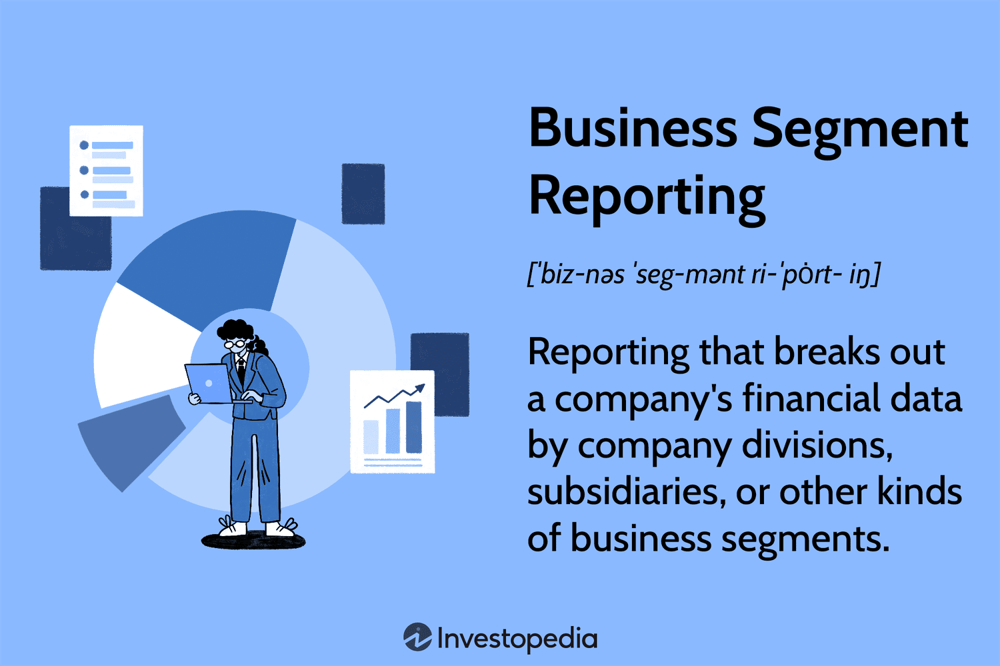

In today's fast-paced financial landscape, understanding business segment financial reporting, segment reporting, and algorithmic trading is crucial for companies wishing to remain competitive. The financial ecosystem is rapidly evolving, driven by technological advancements and the increasing complexity of global markets. In this context, being well-versed in these components is not just advantageous; it is essential for survival and success.

Business segment financial reporting allows companies to present their financial data by various divisions or units, offering a granular view of performance. This breakdown is pivotal because it helps stakeholders—such as investors, analysts, and management—gain a detailed understanding of how different parts of the business contribute to the overall financial health. It promotes transparency, thus aiding in making informed decisions and tailoring strategies to optimize resource allocation.



Segment reporting is vital, as it serves as a tool for identifying risks and opportunities in different business areas. Investors and management can evaluate which segments are thriving and which might require more attention or restructuring. This visibility is integral to strategic decision-making and enhances financial accountability.

Algorithmic trading, on the other hand, uses computer algorithms to execute trades at high speeds, based on predefined criteria. This data-driven approach leverages technology's capability to process vast amounts of information rapidly, optimizing trading strategies through automation. Algorithmic trading has transformed financial markets, making them more efficient and competitive. Its ability to respond to market changes instantaneously is crucial for maintaining a competitive edge.

The interplay between segment reporting and algorithmic trading presents an exciting frontier. By integrating segment data into trading algorithms, companies can refine their trading strategies, thereby increasing accuracy and efficiency. Understanding this interconnectedness is paramount for entities aiming to harness the full potential of their financial operations.

This article aims to provide an in-depth analysis of business segment financial reporting, segment reporting, and algorithmic trading, elucidating their individual significance and the synergies between them. By the conclusion, readers will appreciate how these concepts impact financial transparency and strategic decision-making processes, offering insights into future advancements in financial management.

## Table of Contents

## Understanding Business Segment Financial Reporting

Business segment financial reporting involves categorizing a company's financial data according to its various business segments or divisions. This method of reporting allows stakeholders, including investors, analysts, and management, to obtain a detailed understanding of the company's performance across different operational domains. By dissecting financial results segment-wise, stakeholders can assess how different areas contribute to the company's overall financial health, identify strengths and weaknesses, and make informed decisions.

The Financial Accounting Standards Board (FASB) outlines specific criteria for defining what constitutes a reportable segment. These criteria ensure that the reporting aligns with Generally Accepted Accounting Principles (GAAP), promoting transparency, consistency, and comparability across companies and industries. According to FASB's Accounting Standards Codification Topic 280 (ASC 280), an operating segment is defined as a component of an enterprise that engages in business activities from which it may earn revenues and incur expenses, for which discrete financial information is available, and whose operating results are regularly reviewed by the entity's chief operating decision maker for performance assessment and resource allocation.

To qualify as a reportable segment, an operating segment must meet certain quantitative thresholds, typically concerning its revenue, profit or loss, and identifiable assets. Specifically, a segment is reportable if its revenue (including both external sales and intersegment sales) is 10% or more of the combined revenue of all operating segments, its profit or loss is 10% or more of the greater of (i) the combined profit of all operating segments not reporting a loss, or (ii) the combined loss of all operating segments that did report a loss, or its identifiable assets are 10% or more of the combined assets of all operating segments. Companies need to report at least 75% of their total consolidated revenue through segmental reporting, thus sometimes necessitating the identification of additional reportable segments.

By adhering to these guidelines, companies provide a robust framework for evaluating segment performance, identifying operational bottlenecks, and enhancing financial accountability. This granularity in financial reporting supports stakeholders in delineating the nuances of company performance, facilitates benchmarking against industry peers, and provides a foundation for strategic planning and operational improvements.

## Importance of Segment Reporting

Segment reporting plays a pivotal role in providing a comprehensive view of a company's operations, ensuring that both shareholders and management have access to crucial data necessary for informed decision-making. This detailed reporting breaks down financial information by the company's diverse segments, such as divisions or geographical regions, allowing stakeholders to evaluate the performance of each segment independently.

Investors utilize segment information to gauge the risks and opportunities inherent in different areas of the business. By seeing how each segment contributes to the overall financial health of the company, investors can make more accurate assessments of potential investments. For instance, if a particular segment shows strong performance and growth potential, while another is underperforming, investors can calculate the risk-reward ratio of their investments accordingly. This information is critical for portfolio optimization and risk management.

Moreover, the granular visibility afforded by segment reporting aids strategic decision-making. Management can identify which segments are thriving and which require additional resources or strategic shifts. For example, a company might decide to invest further in a high-margin segment while divesting from a less profitable one. This level of insight enhances the company's ability to align its strategic objectives with its operational realities, ultimately driving better financial performance. 

Furthermore, segment reporting enhances financial accountability by providing a clear and transparent view of a company's earnings, expenses, and investment returns across different segments. This transparency reassures shareholders and potential investors that the company is managing its resources judiciously, fostering trust and confidence in the company's financial reporting practices.

In conclusion, the importance of segment reporting lies in its ability to offer detailed insights into a company's operational profitability, helping both management and investors navigate the complexities of financial data, strategically plan for the future, and maintain accountability in financial reporting.

## Algorithmic Trading: A Brief Overview

Algorithmic trading utilizes computer algorithms to automatically execute trades based on predefined rules and conditions. This method harnesses the power of advanced computing to process vast amounts of financial data rapidly, enabling traders to identify and capitalize on market opportunities with precision and speed. By deploying complex mathematical models, [algorithmic trading](/wiki/algorithmic-trading) strategies can optimize trade execution, minimize market impact, and enhance the profitability of trading operations.

At its core, algorithmic trading leverages historical data analysis, statistical techniques, and predictive models to forecast price movements and make informed trading decisions. The algorithms typically consider multiple factors such as price, timing, and [volume](/wiki/volume-trading-strategy) to determine optimal entry and [exit](/wiki/exit-strategy) points for trades. For example, a simple algorithm might execute a trade when a stock's 50-day moving average crosses above its 200-day moving average, signaling a potential upward trend.

The ability of algorithmic trading to process large volumes of data at high speeds has revolutionized financial markets, allowing traders to respond to market changes in fractions of a second. This high-frequency trading capability is particularly advantageous in volatile markets where rapid decision-making is crucial. Moreover, algorithmic trading reduces human error and emotional bias, providing a more disciplined and systematic approach to trading.

Technological advancements, such as [machine learning](/wiki/machine-learning) and [artificial intelligence](/wiki/ai-artificial-intelligence), have further propelled the evolution of algorithmic trading. These technologies enable more sophisticated data analysis and pattern recognition, enhancing the adaptability of trading algorithms to changing market conditions. Python, with its rich ecosystem of libraries like NumPy, pandas, and scikit-learn, is frequently used in developing algorithmic trading models due to its ease of use and extensive functionality for data analysis and machine learning tasks.

The widespread adoption of algorithmic trading underscores its role as a vital component of contemporary financial markets, facilitating greater efficiency and [liquidity](/wiki/liquidity-risk-premium). As technology continues to evolve, algorithmic trading is expected to play an increasingly prominent role in shaping the future of financial transactions.

## The Interplay Between Segment Reporting and Algo Trading

Segment reporting data plays a pivotal role in enhancing the efficacy of algorithmic trading systems. By breaking down a company's financial performance into distinct segments, this type of reporting provides nuanced insights into different areas of business, allowing for a more detailed risk assessment and management. Each segment often represents unique business lines with varying levels of profitability, risk, and growth potential. Thus, segment data can be particularly useful in refining algorithmic trading strategies.

Algorithmic trading relies heavily on data to execute trades based on specific criteria quickly and efficiently. The granularity of segment reporting data offers opportunities for differentiating risk exposure by assessing each segment's financial health metrics. For instance, a segment with a consistent revenue stream and high profitability might suggest a lower risk profile than one that is struggling. This differentiation can significantly inform trading algorithms designed to minimize risk and optimize returns.

Incorporating segment data into trading algorithms enhances the accuracy and efficiency of trading decisions. When these distinct financial health metrics are integrated into algorithmic models, traders can gain a better understanding of potential market movements and adjust their strategies accordingly. For example, an algorithm could prioritize investments in companies where certain segments are outpacing others, indicating a strong future performance. 

A practical implementation in Python might involve accessing segment reporting data via APIs or data feeds, processing the data to extract necessary metrics, and integrating these metrics into trading algorithms. Here's a simple illustration of how one might start:
```python
import requests
import pandas as pd

# Fetch segment reporting data (hypothetical API call)
response = requests.get("https://api.example.com/financials/segments")
data = response.json()

# Convert data into a DataFrame for analysis
segments_df = pd.DataFrame(data['segments'])

# Evaluate segment performance and integrate into strategy
def evaluate_risk(segment_data):
    # Hypothetical risk evaluation based on profitability and volatility
    profitability = segment_data['profitability']
    volatility = segment_data['volatility']
    risk_score = profitability / volatility
    return risk_score

# Incorporate segment analysis in trading decision
segments_df['risk_score'] = segments_df.apply(evaluate_risk, axis=1)
preferred_segments = segments_df[segments_df['risk_score'] > threshold]  # threshold is a predefined criterion

# Output preferred segments for trading decision-making
print(preferred_segments)
```

This integration provides a competitive edge by allowing trading firms to dynamically adjust their strategies based on segment-specific insights, thereby enhancing the decision-making process. As financial markets continue to evolve, leveraging the intricate details of segment reporting could be increasingly crucial for informed, nuanced trading strategies.

## Challenges and Solutions

One challenge in business segment financial reporting is maintaining data accuracy and consistency across divisions. Disparities in reporting standards and practices can lead to inconsistencies, making it difficult for stakeholders to obtain a reliable view of a company’s performance. Businesses often encounter variations in data collection methods, maturation of reporting technologies, and differences in regional accounting requirements. To mitigate these issues, companies should standardize their reporting practices and invest in integrated financial systems that consolidate data across segments. Utilizing frameworks such as the Financial Accounting Standards Board (FASB) guidelines can further ensure compliance with Generally Accepted Accounting Principles (GAAP), facilitating uniformity in segment disclosures.

In algorithmic trading, handling large volumes of data and ensuring algorithms remain robust during market [volatility](/wiki/volatility-trading-strategies) are principal challenges. As markets become increasingly data-driven, algorithms must process and analyze enormous datasets at high speeds. This requires systems capable of real-time data processing and storage solutions that efficiently manage volume. Additionally, algorithms must be resilient to sudden market changes to prevent erroneous trades that could lead to financial losses.

To overcome these challenges, companies can deploy high-performance computing resources and leverage cloud-based platforms for scalable data management. The application of advanced analytics, such as machine learning techniques, can enhance data integration and processing capabilities, enabling traders to construct more sophisticated models that adapt swiftly to changing market conditions. This can be achieved through machine learning libraries such as TensorFlow or PyTorch, which provide the necessary tools to build and train adaptive models. For instance, employing neural networks to model complex, non-linear relationships in market data can improve the predictive power and stability of trading algorithms.

Investing in robust financial systems and adopting advanced analytics not only addresses the challenges in segment reporting and algorithmic trading but also enhances overall financial management by providing more reliable data insights and improving decision-making processes. With the continued evolution of technology, businesses can achieve greater transparency and efficiency in both financial reporting and trading activities.

## Conclusion

Business segment financial reporting and algorithmic trading are crucial components of contemporary financial management. Companies that effectively harness these tools are better positioned to improve transparency, efficiency, and strategic decision-making. By breaking down financial information by segments, businesses provide stakeholders with detailed insights into performance, risk, and opportunities, driving more informed decisions. Algorithmic trading, harnessing the power of computer algorithms to execute trades with precision, enhances the responsiveness and accuracy of trading operations, often leading to optimized market outcomes.

As technology progresses, the synergy between financial reporting and algorithmic trading is expected to intensify. Advances in data analytics, machine learning, and artificial intelligence will likely drive even deeper integration between these two domains. Enhanced computational capabilities will allow for more sophisticated data analysis and predictive modeling, which can significantly impact both reporting accuracy and trading strategy development. By capitalizing on these advancements, companies can refine their financial operations, reduce risk exposure, and position themselves strategically in an ever-evolving market landscape.

## References & Further Reading

[1]: ["Business Segment Reporting"](https://www.investopedia.com/terms/b/business-segment-reporting.asp) - Financial Accounting Standards Board (FASB) Overview.

[2]: ["Advances in Financial Machine Learning"](https://www.amazon.com/Advances-Financial-Machine-Learning-Marcos/dp/1119482089) by Marcos Lopez de Prado.

[3]: ["Quantitative Trading: How to Build Your Own Algorithmic Trading Business"](https://www.amazon.com/Quantitative-Trading-Build-Algorithmic-Business/dp/1119800064) by Ernest P. Chan.

[4]: ["Machine Learning for Algorithmic Trading"](https://github.com/stefan-jansen/machine-learning-for-trading) by Stefan Jansen.

[5]: ["Evidence-Based Technical Analysis: Applying the Scientific Method and Statistical Inference to Trading Signals"](https://www.amazon.com/Evidence-Based-Technical-Analysis-Scientific-Statistical/dp/0470008741) by David Aronson.