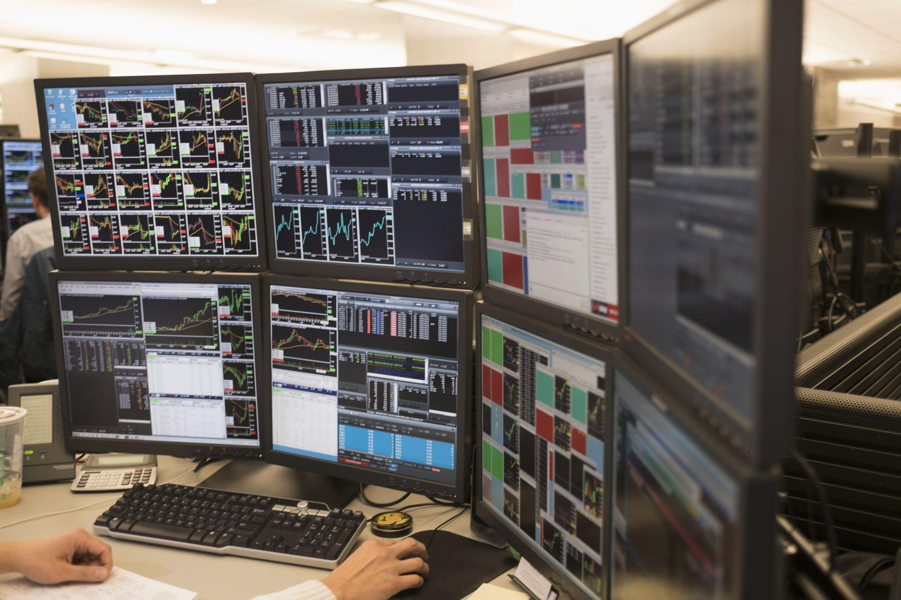

Algorithmic trading refers to the use of computer algorithms to automate the process of buying and selling financial instruments, such as stocks, bonds, and currencies. This practice has significantly transformed the finance industry by utilizing technology to enhance the speed, efficiency, and complexity of trading operations. Traditionally, trading was conducted manually, with traders making decisions based on market observations and executing trades through direct communication with brokers. However, the advent of powerful computing technologies has led to the development of sophisticated algorithms capable of analyzing vast amounts of market data in real-time, enabling rapid decision-making and automation of trading strategies.

Technological advancements have introduced an era where trading operations are executed at speeds much faster than the blink of an eye, commonly known as high-frequency trading (HFT). This speed not only improves efficiency but also allows traders to capitalize on fleeting market opportunities, which would be impossible with manual trading. The integration of technology in trading operations also allows for the deployment of complex mathematical models, enhancing the precision and effectiveness of trade execution.

The value of the algorithmic trading market has been steadily increasing, driven by the growing acceptance and integration of electronic trading platforms and the adoption of algorithmic strategies by institutional investors. According to a report by Mordor Intelligence, the algorithmic trading market is expected to continue its growth trajectory, as financial institutions seek to gain competitive advantages through innovative trading techniques.

A systematic approach in executing trades is crucial in algorithmic trading. Algorithms are designed to follow predefined sets of rules and conditions to execute trades, minimizing human errors and emotional biases. This methodical execution ensures consistency and accuracy in trading activities, leading to more predictable and reliable outcomes. Moreover, systematic trading allows for backtesting, which involves running algorithms against historical data to evaluate their performance and refine strategies before deploying them in live markets. The ability to test strategies rigorously enhances the confidence of traders and investors in their trading models.

In summary, algorithmic trading represents a transformative force in the finance industry, leveraging technology to optimize trading operations. Its growing significance is reflected in the increasing value of the market and its adoption by major financial players. A systematic approach not only improves execution but also provides the necessary framework for managing risk and optimizing returns.

## Table of Contents

## Understanding Algorithmic Trading

Algorithmic trading refers to the process of using computer algorithms to automate the trading of financial instruments, primarily in equity, futures, and currency markets. These algorithms execute pre-defined instructions for trading, encompassing aspects like timing, price, or [volume](/wiki/volume-trading-strategy) of orders, greatly enhancing speed and efficiency over manual trading processes.

Historically, trading involved manual execution where traders executed orders based on intuition, charts, and direct communication. The transition from manual to [algorithmic trading](/wiki/algorithmic-trading) marked a significant milestone in the financial industry. This began in the 1970s with the advent of electronic trading systems and has continuously evolved with technological advancements. The introduction of electronic communication networks (ECNs) in the 1990s allowed for faster and more efficient order matching, setting the stage for algorithmic trading.

Different frequencies characterize algorithmic trading, namely High-Frequency Trading ([HFT](/wiki/high-frequency-trading-strategies)), Medium-Frequency Trading, and Low-Frequency Trading. High-Frequency Trading involves making multiple trades within milliseconds to seconds, capitalizing on minute price fluctuations and depending heavily on sophisticated technology and speedy execution. Medium-Frequency Trading operates on a slightly larger timescale, from minutes to hours, generally utilizing intraday trends. Low-Frequency Trading spans days to months, often focusing on broader market analysis and structural trends.

Popular strategies employed in algorithmic trading include market-making and statistical [arbitrage](/wiki/arbitrage). Market-making involves simultaneously buying and selling a financial instrument to provide [liquidity](/wiki/liquidity-risk-premium) and earn from the spread. For example, a market maker might post a buy order at $10 and a sell order at $10.02, profiting from the $0.02 spread when both are executed.

Statistical arbitrage exploits pricing inefficiencies between related financial instruments, using statistical methods to determine the theoretical fair value and execute trades as market prices diverge from these values. For instance, using Python libraries such as NumPy and pandas, a trader could compute the mean and standard deviation of price-related data and trade based on deviations from the mean.

Algorithmic trading enriches trade execution through efficiency, risk management, and enhanced decision-making capabilities, continually adapting through technological innovations, such as [machine learning](/wiki/machine-learning), thus broadening its role in modern financial markets.

## Setting Up an Algorithmic Trading Business

Establishing an algorithmic trading business involves a series of strategic steps, each crucial to ensuring a successful operation in the competitive financial markets. The following outlines the fundamental aspects required to establish such a business.

### Steps to Establish an Algorithmic Trading Business

1. **Business Plan Development**: Start with a comprehensive business plan that outlines the goals, strategies, market analysis, and financial projections. This plan should include the type of trading algorithms to be developed, targeted asset classes, and risk management strategies.

2. **Regulatory Compliance**: Adherence to the regulatory framework is essential. Different jurisdictions have varying regulations, thus understanding the specific requirements, such as obtaining necessary licenses and fulfilling reporting obligations, is crucial.

3. **Securing Capital**: Capital is one of the most critical components. Initial outlay includes technology infrastructure, human resources, and operational costs. Investors or financial institutions typically provide this in exchange for a share of profits or equity.

4. **Research and Development**: Focus on developing and testing trading algorithms. This involves data collection, backtesting strategies, and simulation under various market conditions to ensure robustness and reliability.

5. **Risk Management**: Develop a comprehensive risk management framework to mitigate potential losses. This includes setting stop-loss limits, diversifying trading strategies, and employing stress testing of trading algorithms.

6. **Technology and Infrastructure**: Establishing a robust trading infrastructure is essential for seamless operations. Key components include:

   - **Trading Platforms**: Select advanced trading platforms capable of handling high-frequency data and executing trades swiftly.

   - **Data Feeds**: Utilize reliable and fast data feeds that provide market data and news in real-time.

   - **Connectivity**: Ensure secure and low-latency connectivity to exchanges and liquidity providers.

### Key Operational Considerations

- **Capital Requirements**: Depending on the scale of operations, capital requirements can vary significantly. Initial costs include technology infrastructure, staffing, and compliance expenses.

- **Market Access**: Establish relationships with prime brokers and exchanges to gain access to desired markets. This might involve negotiating trading agreements and ensuring technical connectivity with trading venues.

- **Risk and Compliance**: Constant monitoring for regulatory changes and market risks is necessary. Adapting algorithms to comply with regulations and to mitigate market risks is crucial for sustainability.

### The Need for Robust Trading Infrastructure and Platforms

Robust trading infrastructure reduces latency, ensures reliability, and enhances execution speed. The infrastructure should be capable of processing large volumes of data and executing complex algorithms efficiently. High-frequency trading, for instance, requires a sophisticated setup to minimize delays and optimize order execution.

### Team Structure and Roles

Assembling a skilled team is vital for the smooth operation of an algorithmic trading business. Key roles often include:

- **Quantitative Analysts**: Responsible for developing trading strategies based on mathematical models and statistical analysis.

- **Software Developers**: Focused on building and maintaining trading algorithms and technology infrastructure.

- **Traders**: Execute and manage strategies, providing market insights and making real-time decisions.

- **Risk Managers**: Oversee the risk management framework, ensuring adherence to set parameters and compliance with regulatory standards.

- **Compliance Officers**: Ensure that all operations comply with government and exchange regulations.

In conclusion, setting up an algorithmic trading business demands careful planning, solid financial backing, and a team of diverse expertise. By prioritizing robust infrastructure and strict adherence to regulations, businesses can position themselves effectively in the competitive financial trading environment.

## Choosing Tools and Platforms for Algorithmic Trading

When selecting an algorithmic trading platform, several factors should be considered to ensure effective and efficient trading operations. These factors include the platform's performance, accessibility, cost, and the range of available features.

One crucial [factor](/wiki/factor-investing) is the platform's performance capabilities. The platform should handle large volumes of data and execute trades with minimal latency. High performance is essential to capitalize on market opportunities and minimize slippage. When evaluating a platform, consider its data handling capacity, speed, and reliability.

Accessibility and ease of use are also important considerations. Many platforms offer user-friendly interfaces that accommodate traders with varying levels of experience. Some platforms provide low-code or no-code (LC/NC) solutions, enabling users to design trading algorithms without extensive programming knowledge. These solutions democratize trading by making it accessible to non-developers while maintaining the power and flexibility of algorithmic trading.

A key example of such accessibility is Alpaca, which offers tools tailored for algorithmic traders. Alpaca's platform provides commission-free trading and allows users to design and deploy algorithms efficiently. It supports Python, which is a popular choice among traders due to its vast array of libraries and ease of use.

Cost is another critical factor, as it directly affects the trading strategy's profitability. Platforms generally charge fees that may include commissions, exchange fees, and data feed costs. It's essential to consider these fees in the context of the overall trading strategy to ensure they do not erode profits.

An effective trading platform should also integrate risk management tools and order management systems (OMS). Risk management is fundamental in trading to minimize potential losses. Platforms should offer features such as stop-loss orders, margin control, and real-time risk assessment to help traders manage their exposure and protect their capital.

Order management systems are crucial for executing and tracking trades efficiently. These systems provide functionalities such as order routing, execution, and monitoring, which are essential for maintaining a seamless trading operation. An OMS streamlines the trading process, ensuring that trades are executed in a timely and orderly manner.

In summary, when choosing tools and platforms for algorithmic trading, it is essential to consider performance, accessibility, cost, and the integration of comprehensive risk management and order management systems. These factors collectively contribute to the successful execution of trading strategies in the competitive financial markets.

## Programming Languages and Libraries

Algorithmic trading requires a synergy of software languages and analytical libraries to implement effective trading strategies. Several programming languages are predominantly used in this domain, each offering distinct advantages that cater to various components of trading algorithms, from data acquisition to execution.

### Programming Languages Suitable for Algorithmic Trading

1. **Python**: Known for its simplicity and readability, Python is extensively used in algorithmic trading. It supports a wide array of libraries for data analysis, machine learning, and quantitative research. Tools like Pandas facilitate data manipulation and analysis, while NumPy and SciPy provide support for complex mathematical computations. Python is preferred for backtesting and simulating trading strategies due to its integration capabilities with backtesting libraries such as Backtrader.

2. **R**: R offers comprehensive statistical and graphical capabilities, making it ideal for traders focusing on statistical models. Its powerful packages like quantmod and TTR cater specifically to quantitative trading and technical analysis. R is particularly suitable for traders who intend to perform exploratory data analysis or examine large datasets through statistical techniques.

3. **C++**: C++ is valued for its performance efficiency, particularly when executing latency-sensitive trading strategies such as high-frequency trading (HFT). Its memory management and execution speed make it suitable for developing trading systems where execution time is critical.

4. **Java**: Java provides a good balance between performance and ease of use, making it suitable for building robust trading platforms that require integration across various systems. Its portability across different operating systems is an added advantage for developers involved in a cross-platform environment.

5. **JavaScript/TypeScript**: Often used in the development of trading front-ends, JavaScript, and its typed superset TypeScript, facilitate interactive web-based trading applications. These languages, coupled with libraries like React, allow the creation of responsive user interfaces for traders.

### Libraries and Tools for Data Analysis

Algorithmic trading is heavily reliant on the processing and analysis of large volumes of financial data. Libraries such as Pandas in Python provide traders with powerful tools to manipulate time-series data effectively. Machine learning libraries like TensorFlow and scikit-learn are increasingly being employed to develop predictive models based on historical market data. These libraries equip traders to perform tasks such as feature selection, model training, and validation efficiently.

In R, libraries such as dplyr and ggplot2 offer functionalities for data arrangement and visualization, aiding in the insightful representation and interpretation of trading data. Furthermore, R’s caret package is invaluable for building predictive models and evaluating model accuracy.

### Specialized Trading Libraries and Their Use Cases

Specialized libraries tailored for algorithmic trading are paramount for implementing complex trading strategies. One such library is QuantLib, which provides tools for managing quantitative finance tasks like derivatives pricing and risk management. This is crucial for traders involved in developing and testing options and other derivative strategies.

For Python users, PyAlgoTrade and Zipline offer streamlined frameworks for strategy development, [backtesting](/wiki/backtesting), and deploying algorithmic trading systems. Zipline, particularly favored for its use in backtesting, operates efficiently with daily data and assists in applying strategies before moving them to live trading environments.

In C++, OpenQuant offers a comprehensive environment for developing and testing [quantitative trading](/wiki/quantitative-trading) strategies. It provides a rich set of components for building complex trading logic while focusing on execution speed.

Each language and library has its own set of features that can cater to different aspects of algorithmic trading, from historical data analysis to live trade execution. The choice of programming language and library therefore largely depends on the specific needs of the trading strategy being developed, the frequency of trades, and the developer's proficiency and familiarity with the language.

## Advantages and Disadvantages of Algorithmic Trading

Algorithmic trading has fundamentally transformed the landscape of financial markets through its inherent advantages and notable downsides. At its core, algorithmic trading involves the use of computer algorithms to execute trades at speeds and frequencies that are impossible for human traders, thus offering several benefits.

**Benefits of Algorithmic Trading**

Speed and efficiency are crucial advantages of algorithmic trading. Algorithms can analyze market conditions, identify trading opportunities, and execute orders within fractions of a second, often measured in microseconds or milliseconds. This rapid execution minimizes the lag time between market signal and trade execution, potentially enhancing profitability.

Efficiency is further manifested through automation, which allows traders to implement complex strategies without continuous human intervention, reducing operational errors. Additionally, algorithmic trading enables backtesting—evaluating trading strategies on historical data to forecast their effectiveness in different market conditions. Backtesting provides traders with insights into potential risks and returns, allowing for strategy optimization before real capital deployment.

**Potential Risks and Challenges**

Despite the advantages, algorithmic trading presents significant risks. Market impact, also known as slippage, can occur when large orders alter the market price unfavorably. This phenomenon is particularly relevant in less liquid markets where large trades can lead to substantial price changes.

Regulatory challenges also pose considerable risks. Financial markets are under stringent regulatory oversight to ensure fair practices and prevent systemic crises. Algorithmic traders must comply with various regulations such as the EU's Markets in Financial Instruments Directive (MiFID II) and the U.S. Securities and Exchange Commission (SEC) rules. These regulations may impose restrictions on certain trading practices and require rigorous reporting and transparency standards.

**Balance Between Model-Driven Trading and Market Changes**

An essential aspect of algorithmic trading lies in striking a balance between reliance on quantitative models and adaptability to market changes. Trading models, primarily based on historical data, might not always account for unforeseen market circumstances, leading to potential losses. Hence, while model-driven trading can offer predictive power and systematic efficiency, it is crucial that traders dynamically adjust their models in response to evolving market conditions. For instance, incorporating machine learning models that continuously learn from new data can provide a degree of adaptability to changing markets.

In conclusion, while algorithmic trading offers substantial gains in speed, efficiency, and strategic backtesting, these benefits come entwined with risks such as market impact and compliance challenges. Successful algorithmic trading necessitates a careful balance between model-based strategies and the adaptive management of market variability.

## Recent Developments and Future Trends

The integration of [artificial intelligence](/wiki/ai-artificial-intelligence) (AI) and machine learning (ML) into algorithmic trading has become more pronounced, marking a significant evolution in how trading models are designed and executed. AI and ML facilitate the processing of vast amounts of data to detect patterns and predict future market movements. Machine learning algorithms, particularly those that employ supervised learning techniques, such as regression analysis and decision trees, are utilized to make more informed decisions and automate the trading process effectively.

Recent advancements in [deep learning](/wiki/deep-learning), a subset of machine learning, enable the creation of more sophisticated models that can identify complex patterns within high-dimensional data, an essential capability for predicting market trends. Reinforcement learning, another ML paradigm, is also gaining traction for its ability to develop adaptive strategies that evolve through trial and error, allowing algorithms to optimize their performance based on market feedback.

Looking ahead, technological advancements are expected to further transform market dynamics. The rise of quantum computing holds the potential to revolutionize algorithmic trading by solving complex problems at unprecedented speeds. This could significantly enhance the capability to analyze multiple market scenarios simultaneously, providing traders a distinct competitive edge.

The increasing reliance on technology in trading operations may result in greater market efficiency due to the ability to process and react to information more rapidly. However, it also introduces new challenges such as increased systemic risk, where technical failures or erroneous algorithms could lead to significant market disruptions. Therefore, regulatory frameworks might need to evolve, ensuring that the balance between innovation and risk management is maintained.

Furthermore, as algorithmic trading continues to expand its footprint globally, its influence on the financial landscape is expected to become more pronounced. With emerging markets embracing technology-driven solutions, we may witness an increase in cross-border trading activities, contributing to more integrated global financial markets.

In summary, AI and machine learning are pivotal in the ongoing transformation of algorithmic trading. With continuous technological advancements, the future of trading is likely to be increasingly data-centric, automated, and sophisticated, necessitating ongoing adaptation and learning among industry participants to harness these opportunities effectively.

## Conclusion

Setting up a successful algorithmic trading business involves a structured approach that encompasses several critical components. Key among these is developing a reliable trading strategy, which can leverage various market conditions using historical data and backtesting to optimize performance. Building a robust infrastructure capable of handling large volumes of data and executing trades at high speeds is equally essential. This includes ensuring secure and efficient access to financial markets, either directly or through intermediaries.

Another foundational element is organizing a skilled team equipped to handle both the technical and financial aspects of algorithmic trading. This ranges from quantitative analysts who construct models to developers who implement these strategies within trading systems, as well as risk management professionals who oversee compliance and manage operational risks.

Adaptation to technological changes in trading cannot be overstated. As financial markets and technologies evolve, remaining competitive requires integrating advancements in artificial intelligence and machine learning, which can introduce new predictive capabilities and efficiencies. This evolution entails not only technical upgrades but also continuous education and upskilling for all team members involved in the trading process.

The dynamic nature of algorithmic trading and the rapid development of new methodologies and technologies highlight the need for continuous learning. Participating in courses, industry seminars, and online forums can provide valuable insights into emerging trends and techniques. Continuous learning ensures that traders and technologists remain adept at identifying and capitalizing on new opportunities, thus enhancing the overall success and sustainability of an algorithmic trading business.

In conclusion, the intricate interplay of strategic planning, technological infrastructure, skilled personnel, and continuous adaptation to technological advancements underpins a thriving algorithmic trading business. Steady investment in knowledge and skills development keeps the approach robust and responsive to future innovations and challenges in the financial markets.

## References & Further Reading

[1]: Bergstra, J., Bardenet, R., Bengio, Y., & Kégl, B. (2011). ["Algorithms for Hyper-Parameter Optimization."](https://papers.nips.cc/paper/4443-algorithms-for-hyper-parameter-optimization) Advances in Neural Information Processing Systems 24.

[2]: ["Advances in Financial Machine Learning"](https://www.amazon.com/Advances-Financial-Machine-Learning-Marcos/dp/1119482089) by Marcos Lopez de Prado

[3]: ["Evidence-Based Technical Analysis: Applying the Scientific Method and Statistical Inference to Trading Signals"](https://www.amazon.com/Evidence-Based-Technical-Analysis-Scientific-Statistical/dp/0470008741) by David Aronson

[4]: ["Machine Learning for Algorithmic Trading"](https://github.com/stefan-jansen/machine-learning-for-trading) by Stefan Jansen

[5]: ["Quantitative Trading: How to Build Your Own Algorithmic Trading Business"](https://books.google.com/books/about/Quantitative_Trading.html?id=j70yEAAAQBAJ) by Ernest P. Chan