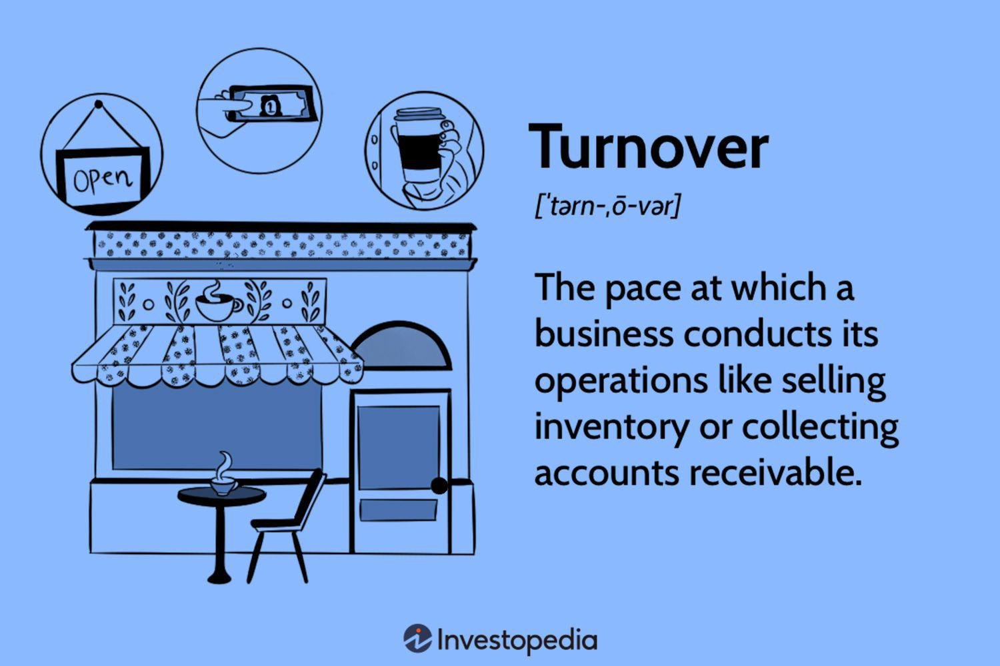

## Table of Contents

## What is business turnover?

Business turnover is the total amount of money a company makes from selling its products or services over a specific period, usually a year. It's like counting all the cash that comes into the business from customers. Turnover is important because it shows how well a business is doing in terms of sales. If a business has a high turnover, it means a lot of people are buying what they're selling.

However, turnover is different from profit. Profit is what's left after you subtract all the costs of running the business from the turnover. So, a high turnover doesn't always mean a business is making a lot of profit. It's possible for a business to have a lot of sales but still spend a lot on things like rent, salaries, and materials, which can reduce the profit. Understanding both turnover and profit helps business owners make better decisions about how to grow and manage their company.

## How is business turnover calculated?

Business turnover is calculated by adding up all the money a business gets from selling its products or services over a certain time, like a year. If you run a bakery, you would add up all the money from selling bread, cakes, and pastries to find your turnover. It's like counting all the cash that comes into your business from customers.

Sometimes, businesses need to take away things like discounts, returns, or taxes from the total sales to get the right turnover number. For example, if you sold $100,000 worth of goods but had to give $5,000 back in returns and $3,000 in discounts, your turnover would be $92,000. This gives a clearer picture of how much money the business is really making from sales.

## Why is business turnover important for a company?

Business turnover is important because it shows how much money a company is making from selling its products or services. It's like a big scoreboard that tells the business how well it's doing in terms of sales. If the turnover is high, it means a lot of people are buying what the company is selling, which is a good sign. This information helps the company understand if its products or services are popular and if it's doing a good job at reaching customers.

Turnover also helps a company plan for the future. By knowing how much money is coming in, the company can decide how much it can spend on things like new products, hiring more staff, or expanding to new locations. It's also useful for comparing the business's performance over different periods or against other companies in the same industry. Even though turnover is not the same as profit, it's a key piece of information that helps the business make smart decisions and keep growing.

## What is the difference between turnover and profit?

Turnover and profit are two important numbers for a business, but they mean different things. Turnover is the total amount of money a business makes from selling its products or services over a certain time, like a year. It's like adding up all the cash that comes into the business from customers. If you run a lemonade stand and sell $100 worth of lemonade, your turnover is $100.

Profit, on the other hand, is what's left after you subtract all the costs of running the business from the turnover. These costs can include things like rent, salaries, and the cost of the materials you use to make your product. Using the lemonade stand example, if it costs you $60 to buy lemons, sugar, and cups, your profit would be $40 ($100 turnover minus $60 costs). So, while turnover tells you how much money you're making from sales, profit tells you how much money you're actually keeping after paying for everything.

## How does turnover affect a company's financial health?

Turnover is really important for a company's financial health because it shows how much money is coming in from sales. If a company has a high turnover, it means a lot of people are buying what they're selling, which is a good sign. This can help the company pay its bills, buy new things, and grow bigger. But if turnover is low, it might be hard for the company to cover its costs and keep running smoothly.

Even though turnover is important, it's not the whole story. A company needs to look at its profit too, which is what's left after paying for everything. A high turnover doesn't always mean a lot of profit. If a company spends a lot on things like rent, salaries, and materials, it might have a high turnover but still not make much profit. So, while turnover is a big part of financial health, it's just one piece of the puzzle. A company needs to keep an eye on both turnover and profit to really understand how healthy its finances are.

## What are common strategies to increase business turnover?

One common strategy to increase business turnover is to attract more customers. This can be done by advertising more, maybe on social media or with posters, to let more people know about the business. Offering special deals or discounts can also bring in more customers because everyone loves a good deal. Another way is to make the business easier to find online by having a good website and using search engine optimization (SEO) tricks to show up higher in search results.

Another strategy is to get existing customers to buy more. This can be done by introducing new products or services that they might like, or by encouraging them to buy more often, maybe with loyalty programs or special offers for repeat customers. Improving the customer experience can also help because happy customers are more likely to come back and spend more money.

Sometimes, businesses can increase turnover by expanding to new places or selling to new markets. This could mean opening new stores in different cities or even selling products in other countries. It's all about finding more people who want to buy what the business is selling and making it easy for them to do so.

## Can high turnover be detrimental to a business? If so, how?

High turnover can sometimes be bad for a business. If a business is always selling a lot but not making much profit, it might be because they're spending too much money on things like rent, salaries, and materials. If the costs are too high, the business might not have enough money left over to grow or even to keep running smoothly. It's like trying to fill a bucket with holes; no matter how much water you pour in, it keeps leaking out.

Also, if a business focuses too much on increasing turnover without thinking about profit, it might make bad decisions. For example, they might lower prices too much just to sell more, but then they won't make enough money on each sale. Or they might spend a lot on advertising to get more customers, but if those customers don't keep coming back, it's not worth it. So, while high turnover can look good on the surface, it's important for a business to make sure it's also making enough profit to stay healthy.

## How does turnover relate to market share and competitive positioning?

Turnover is important when we talk about market share and how a business stands against its competitors. Market share is the part of total sales in an industry that a company has. If a company has a high turnover, it means they are selling a lot, which can lead to a bigger market share. When a company's turnover is higher than its competitors, it can show that it's doing better in the market. This can make the company look strong and attractive to customers and investors.

But turnover isn't the only thing that matters for competitive positioning. A business needs to look at profit too. If a company has a high turnover but low profit, it might not be as competitive as it seems. Other businesses might have lower turnover but make more profit because they manage their costs better. So, while high turnover can help a company gain market share and look good compared to others, it's important to balance it with good profit to really be in a strong competitive position.

## What role does turnover play in business valuation?

Turnover is an important piece of information when people want to figure out how much a business is worth. When someone is thinking about buying a business, they look at the turnover to see how much money the business is making from sales. A high turnover can make a business look more valuable because it shows that a lot of people are buying what the business is selling. It's like a sign that the business is doing well and could keep making money in the future.

But turnover is just one part of the puzzle. People also need to look at the profit, which is what's left after paying for everything. A business might have a high turnover but not much profit if it spends a lot on things like rent and salaries. So, when valuing a business, people use turnover along with other numbers like profit and costs to get a full picture of how healthy the business is and how much it might be worth.

## How can turnover trends be used to predict future business performance?

Turnover trends can help a business guess how it will do in the future. If a business sees its turnover going up over time, it might mean more people are buying its products or services. This could be a sign that the business will keep doing well and maybe even grow bigger. On the other hand, if the turnover is going down, it might mean fewer people are buying, which could be a warning that the business needs to make some changes to stay healthy.

But turnover trends are not the only thing to look at. A business also needs to think about other stuff like how much it's spending and if it's making enough profit. Sometimes, a high turnover might not mean a lot of profit if the costs are too high. So, by looking at turnover trends along with other numbers, a business can get a better idea of what might happen in the future and make smarter plans.

## What are the industry-specific benchmarks for turnover?

Different industries have different benchmarks for turnover because what's normal in one industry might not be the same in another. For example, in the retail industry, a high turnover is expected because they sell a lot of products every day. If a retail store has a turnover of millions of dollars, that might be normal for them. But in a service industry like consulting, where companies might work on fewer, bigger projects, the turnover might be lower but still considered good for that industry.

These benchmarks help businesses see how they're doing compared to others in their industry. If a restaurant's turnover is much lower than the average for other restaurants, it might mean they need to find ways to sell more food or attract more customers. On the other hand, if a tech company's turnover is higher than the industry average, it could mean they're doing really well and might want to keep doing what they're doing or even expand. By knowing these benchmarks, businesses can set goals and make plans to improve their performance.

## How do global economic factors influence business turnover?

Global economic factors can really affect how much money a business makes from sales, which is called turnover. If the world economy is doing well, people usually have more money to spend, which can mean more customers for businesses and higher turnover. But if there's a global economic downturn, like a recession, people might not have as much money to buy things. This can lead to lower sales and lower turnover for businesses. Things like exchange rates also matter. If a business sells things in other countries, a strong local currency might make their products more expensive for foreign buyers, which could hurt turnover.

Also, events like trade wars or new tariffs can change how much a business sells. If a country puts a tax on goods coming from another country, it can make those goods more expensive and less attractive to buyers, which can lower turnover. On the other hand, if trade agreements make it easier to sell things in other countries, it can help boost turnover. Big global events, like pandemics or natural disasters, can also shake up the economy and affect how much money businesses make from sales. So, businesses need to keep an eye on these global factors to understand and predict their turnover.

## What is Turnover in Business?

Turnover in business refers to the speed and frequency with which a company replaces its assets over a designated timeframe. This encompasses various aspects of operations, such as the sale of inventory, collection of receivables, and replacement of staff. Turnover is a term with multifaceted meanings across different regions and industries.

In North America, turnover typically conveys turnover rates related to inventory or employee replacement. It helps businesses understand how efficiently they are managing resources within these categories. For inventory, turnover signifies how quickly a company sells and replaces its stock, which is crucial for maintaining optimal inventory levels without overstocking or stockouts. The formula often used is the cost of goods sold (COGS) divided by the average inventory, represented as:

$$
\text{Inventory Turnover} = \frac{\text{Cost of Goods Sold}}{\text{Average Inventory}}
$$

In the context of receivables, turnover measures the promptness of credit sales collection, providing insights into the effectiveness of credit policies and collection processes. The formula is:

$$
\text{Accounts Receivable Turnover} = \frac{\text{Net Credit Sales}}{\text{Average Accounts Receivable}}
$$

In contrast, in Europe and Asia, turnover commonly refers to a company's total revenue over a given period. This interpretation aligns turnover with the overall sales or business [volume](/wiki/volume-trading-strategy) rather than specific operational metrics. It serves as a broad indicator of the company's market position and success in generating income through its offerings.

No matter the specific application, understanding turnover is crucial for assessing a company's operational efficiency and financial health. Businesses utilize these insights to streamline processes, optimize asset utilization, and align with strategic objectives to maintain competitiveness and profitability.

## What are the types of business turnover?

Several types of turnover ratios are used to evaluate the operational efficiency of businesses, each offering insights into distinct areas of company performance. These ratios help identify how well a company utilizes its assets and manages its financial processes.

1. **Accounts Receivable Turnover**: This ratio assesses how swiftly a company recovers funds from its customers for credit sales. It is calculated using the formula:
$$
   \text{Accounts Receivable Turnover} = \frac{\text{Net Credit Sales}}{\text{Average Accounts Receivable}}

$$

   A higher turnover rate indicates that the company is efficient in collecting its dues. Conversely, a lower rate could suggest issues with the credit policies or inefficiencies in the collection process.

2. **Inventory Turnover**: This ratio examines how quickly a company sells and replaces its inventory over a specific period. The formula is expressed as:
$$
   \text{Inventory Turnover} = \frac{\text{Cost of Goods Sold}}{\text{Average Inventory}}

$$

   High inventory turnover implies effective inventory management and suggests strong sales performance. However, excessively high turnover might indicate too little inventory, risking stockouts and lost sales opportunities.

3. **Portfolio Turnover**: In the context of investment, portfolio turnover represents the percentage of a portfolio's holdings that have been replaced in a specified timeframe. It provides insights into the frequency of trading and the associated costs, impacting the net performance of investment portfolios. High portfolio turnover could suggest an active trading strategy, potentially increasing transaction costs and tax liabilities.

4. **Asset Turnover**: This metric measures how effectively a company uses its assets to generate sales. The calculation is:
$$
   \text{Asset Turnover} = \frac{\text{Net Sales}}{\text{Total Assets}}

$$

   A higher asset turnover ratio indicates that the company is efficiently using its assets to produce revenue. Companies with large asset bases, like manufacturing firms, typically show different ratios compared to those in less asset-intensive industries. 

Recognizing and comprehensively analyzing these turnover types enables businesses and investors to pinpoint areas of improvement, optimize operations, and enhance overall financial performance.

## What is the Accounts Receivable Turnover?

Accounts receivable turnover is a financial metric that gauges the efficiency with which a company collects cash from its credit sales. This metric is crucial for understanding how effectively a company manages its credit policies and accounts receivable. It helps in assessing the company's ability to convert credit sales into cash flow, which is essential for maintaining [liquidity](/wiki/liquidity-risk-premium) and operational efficiency.

The formula for calculating accounts receivable turnover is as follows:

$$
\text{Accounts Receivable Turnover} = \frac{\text{Credit Sales}}{\text{Average Accounts Receivable}}
$$

Where:
- **Credit Sales** refer to the total sales made on credit during a given period.
- **Average Accounts Receivable** is calculated by averaging the beginning and ending accounts receivable for the same period.

An example implementation in Python for calculating the accounts receivable turnover could be:

```python
def calculate_accounts_receivable_turnover(credit_sales, beginning_receivables, ending_receivables):
    average_receivables = (beginning_receivables + ending_receivables) / 2
    turnover = credit_sales / average_receivables
    return turnover

# Example usage
credit_sales = 50000
beginning_receivables = 10000
ending_receivables = 15000
turnover = calculate_accounts_receivable_turnover(credit_sales, beginning_receivables, ending_receivables)
print("Accounts Receivable Turnover:", turnover)
```

A high accounts receivable turnover ratio suggests that a company has a robust collection process in place, efficiently converting its credit sales into cash. This indicates that the company is likely to have fewer outstanding receivables and a steady cash flow, which is conducive to maintaining liquidity and meeting short-term obligations.

Conversely, a low turnover rate may highlight potential problems in the company's credit policies or collection processes. It could suggest that the company is struggling to collect payments from its customers, leading to a higher amount of outstanding receivables. This can have implications for the company's cash flow and may require a review of credit and collection policies to enhance efficiency.

Regular analysis of the accounts receivable turnover ratio is vital for businesses to ensure that their credit policies align with their overall financial strategies and to identify any areas that require improvement in their collection processes.

## What is Inventory Turnover?

Inventory turnover is a crucial financial metric that evaluates how efficiently a company manages its inventory and sales. This ratio measures the number of times a company's inventory is sold and replaced within a specific period, typically annually. By analyzing inventory turnover, businesses can gain insights into the effectiveness of inventory management practices and the strength of sales.

The formula for calculating inventory turnover is:

$$
\text{Inventory Turnover} = \frac{\text{Cost of Goods Sold (COGS)}}{\text{Average Inventory}}
$$

Where:
- **Cost of Goods Sold (COGS)** represents the direct costs attributable to the production of the goods a company sells.
- **Average Inventory** is calculated as the average of the beginning and ending inventory for the period in question.

A higher inventory turnover ratio signifies that a company is effectively managing its inventory and generating sales quickly. This efficiency often reflects well-coordinated inventory management systems and strong consumer demand for the company's products.

Conversely, a lower turnover rate could indicate overstocking, obsolescence, or inadequate sales strategies, resulting in higher holding costs and reduced liquidity. To address this, businesses may need to optimize their supply chain operations, adjust pricing strategies, or explore new market opportunities.

Effective inventory management, as indicated by a high turnover rate, contributes to a company's financial health by minimizing costs tied up in unsold goods and enhancing cash flow. By maintaining optimal inventory levels, businesses can ensure they meet customer demand promptly while reducing the risks associated with excess stock.

## What is Portfolio Turnover in Investment?

Portfolio turnover in investment quantifies the rate at which assets within a portfolio are bought and sold over a given period. This vital metric assesses an investment manager’s trading activity, providing insights into how actively the portfolio is being managed. The portfolio turnover rate is typically expressed as a percentage, calculated by dividing the lesser of total purchases or total sales by the average portfolio size during the period. Mathematically, it can be represented as:

$$
\text{Portfolio Turnover Rate} = \left( \frac{\min(\text{Total Purchases, Total Sales})}{\text{Average Portfolio Value}} \right) \times 100
$$

A high portfolio turnover rate often signals frequent trading, which can lead to higher transaction costs and tax implications. While active management is sometimes necessary to capitalize on emerging market trends and rebalance investments, excessive turnover may erode profitability due to increased transaction fees and potential capital gains taxes.

It is essential for investors to evaluate the cost-effectiveness of a strategy in tandem with its turnover rate. A diligent analysis ensures that an active trading approach is not undermining the net returns. Investment strategies must be structured in a way that balances the benefits of active reallocation with the associated expenses and tax liabilities to optimize overall portfolio performance.

## References & Further Reading

[1]: ["Management Accounting: Principles & Applications"](https://books.google.com/books/about/Management_Accounting_Principles_Applica.html?id=hRTiBAAAQBAJ) by Martin Coombs

[2]: ["Financial Statement Analysis & Valuation"](https://mybusinesscourse.com/book/financial-statement-analysis-valuation-6e) by Peter D. Easton

[3]: ["Algorithmic Trading: Winning Strategies and Their Rationale"](https://www.wiley.com/en-us/Algorithmic+Trading%3A+Winning+Strategies+and+Their+Rationale-p-9781118460146) by Ernest P. Chan

[4]: DeMiguel, V., Garlappi, L., & Uppal, R. (2009). ["Optimal Versus Naive Diversification: How Inefficient is the 1/N Portfolio Strategy?"](https://www.jstor.org/stable/30226017) Management Science, 55(5), 775-790.

[5]: ["Principles of Corporate Finance"](https://info.mheducation.com/rs/128-SJW-347/images/bre80948_fm_i-xxx.pdf) by Richard A. Brealey, Stewart C. Myers, and Franklin Allen