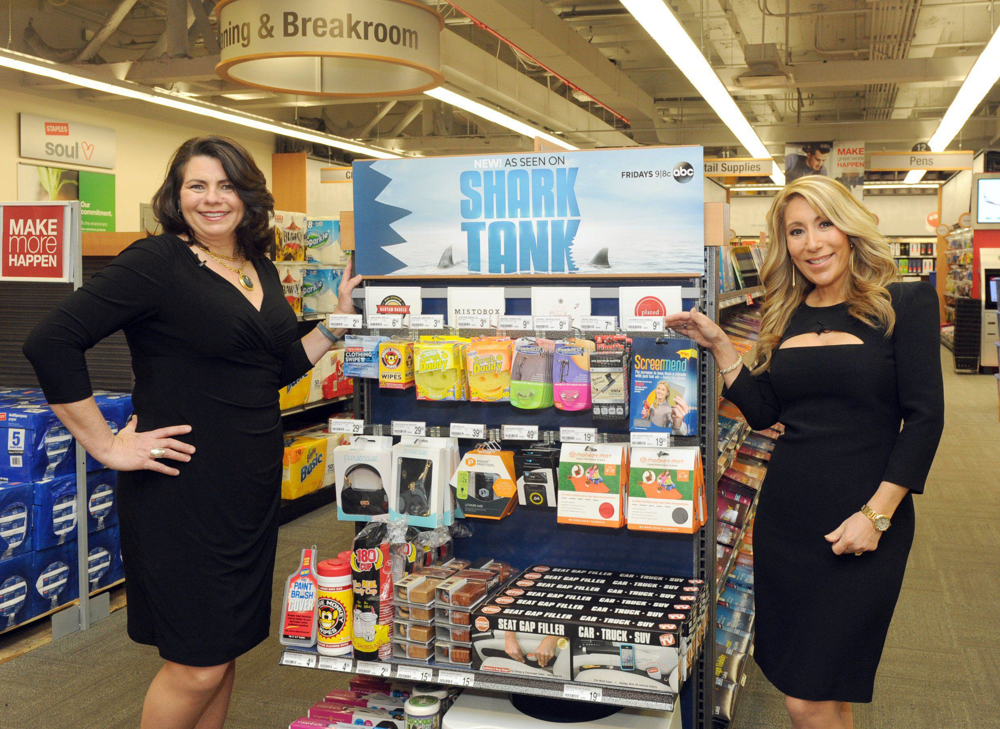

## Table of Contents

## What is business valuation and why is it important on Shark Tank?

Business valuation is the process of figuring out how much a business is worth. It's like putting a price tag on a company. People do this by looking at things like how much money the business makes, how much it owns, and how much it owes. It's important because it helps people decide if they want to buy, sell, or invest in a business.

On Shark Tank, business valuation is really important because the Sharks need to know how much the business is worth before they decide to invest. When someone comes on the show to ask for money, they say how much they want and how much of their business they are willing to give up. The Sharks then use business valuation to see if the deal is a good one. If the business is worth less than what the person is asking, the Sharks might offer less money or no deal at all. This helps them make smart choices about where to put their money.

## How do Sharks typically value a business on the show?

On Shark Tank, the Sharks usually value a business by looking at a few main things. They start by checking how much money the business makes and how much it could make in the future. They also look at how much the business is already worth based on its sales and profits. The Sharks think about the costs to run the business and any debts it has. They also consider if the business has something special that makes it different from others, like a unique product or a strong brand.

Another thing the Sharks do is compare the business to others in the same industry. They want to see if the business is doing better or worse than its competitors. This helps them decide if the business is a good investment. The Sharks also talk to the person running the business to see if they trust them and believe in their plan. All these things together help the Sharks figure out a fair price for the business and decide if they want to invest.

## What are the key financial metrics Sharks look at during valuation?

When Sharks are figuring out how much a business is worth on Shark Tank, they mainly look at two big financial numbers: revenue and profit. Revenue is all the money the business makes from selling its stuff. Sharks want to see if the business is making a lot of money and if that money is growing over time. Profit is what's left after the business pays for everything it needs to run. Sharks like to see a good profit because it means the business is doing well and can keep going strong.

Besides revenue and profit, Sharks also check out the business's costs and any debts it has. They want to know how much it costs to make and sell the product, and if the business owes money to anyone. This helps them see if the business can make money even after paying all its bills. Sharks also look at the business's value based on what similar businesses are worth. They compare these numbers to make sure the business is a good deal for their investment.

## How does the valuation process differ for startups versus established businesses on Shark Tank?

When Sharks on Shark Tank value startups, they often have to guess more because startups don't have a long history of making money. They look at things like how much the startup could make in the future and if the product or idea is really special. Sharks also think about the team running the startup. They want to see if the team can make the business grow. Because startups are riskier, Sharks might ask for a bigger piece of the business to make up for the risk.

For established businesses, the valuation process is a bit easier for the Sharks because these businesses already have a track record. They can look at past sales and profits to see how well the business is doing. Sharks check if the business is making money now and if it can keep doing that. They also compare the business to others in the same industry to see if it's a good deal. Because established businesses are less risky, Sharks might be willing to invest more money for a smaller piece of the business.

## What role does the entrepreneur's pitch play in the valuation on Shark Tank?

The entrepreneur's pitch is super important for how the Sharks value the business on Shark Tank. When someone comes on the show, they tell a story about their business. They talk about what makes their product special, how much money they're making, and what they plan to do next. This story helps the Sharks understand the business better. If the pitch is good and the Sharks believe in the entrepreneur's vision, they might think the business is worth more money. A strong pitch can make the Sharks feel excited and confident about investing.

But if the pitch is not so good, it can make the Sharks doubt the business. If the entrepreneur can't explain things clearly or if their numbers don't make sense, the Sharks might think the business is worth less. They might offer less money or no deal at all. So, the pitch is a big part of how the Sharks decide what the business is worth. It's not just about the numbers; it's also about how well the entrepreneur can sell their idea and themselves.

## How do Sharks adjust their valuation based on the entrepreneur's ask and equity offered?

When an entrepreneur comes on Shark Tank, they ask for a certain amount of money and offer a piece of their business in return. This is called the "ask" and the "equity offered." The Sharks look at this and use it to figure out how much the whole business is worth. For example, if someone asks for $100,000 for 10% of their business, the Sharks can guess that the business is worth $1 million because $100,000 is 10% of $1 million. If the Sharks think this number is too high, they might offer less money or ask for more of the business to make the deal fair.

The Sharks also think about if the ask and equity offered make sense for the business's current value and future potential. If the entrepreneur is asking for too much money for too little of the business, the Sharks might see it as a bad deal. They could then adjust their offer to a lower amount of money or a bigger piece of the business. On the other hand, if the Sharks think the business is worth more than the entrepreneur's valuation, they might offer the asked amount but for less equity, making it a better deal for them. This back-and-forth helps the Sharks find a valuation that they feel good about investing in.

## What are common valuation methods used by Sharks, and how are they applied?

Sharks on Shark Tank often use a few common methods to figure out how much a business is worth. One method is the "Revenue Multiple" approach, where they look at how much money the business makes and then multiply it by a number that's common in that industry. For example, if a business makes $1 million a year and the industry standard is to multiply by 3, the business might be valued at $3 million. Another method is the "Earnings Multiple," where they look at the business's profit and multiply it by a number to find its value. This helps them see if the business can keep making money after paying all its bills.

Another way Sharks value businesses is by using the "Discounted Cash Flow" (DCF) method. This method is a bit more complicated, but it's about guessing how much money the business will make in the future and then figuring out what that money is worth now. If a business is expected to make a lot of money down the road, it might be worth more now. Sharks also use the "Comparable Company Analysis," where they compare the business to others that are similar. If a similar business sold for a certain amount, they might think the business on Shark Tank should be worth about the same. These methods help the Sharks decide if the business is a good investment and what it's really worth.

## How do market conditions and industry trends influence valuations on Shark Tank?

Market conditions and industry trends play a big role in how Sharks value businesses on Shark Tank. When the market is doing well and people are spending more money, Sharks might think a business is worth more because it has a better chance to grow. On the other hand, if the market is not doing well and people are not buying as much, Sharks might value the business lower because it could be harder for the business to make money. Industry trends also matter a lot. If a certain type of product is really popular right now, like eco-friendly items, Sharks might see a business in that industry as more valuable because it can ride the wave of that trend.

Sharks also think about where the industry is headed in the future. If they believe an industry will grow a lot, they might be willing to pay more for a business in that field. For example, if technology is expected to keep getting bigger, a tech startup might get a higher valuation. But if an industry is shrinking, like maybe some traditional retail stores, Sharks might offer less money because they see less potential for growth. So, understanding the market and industry trends helps Sharks make smarter decisions about how much a business is really worth.

## Can you explain a case where a Shark significantly altered their initial valuation and why?

In one episode of Shark Tank, Mark Cuban significantly changed his initial valuation of a company called BeatBox Beverages. When the founders came on the show, they asked for $1 million for 10% of their business, which meant they valued their company at $10 million. Mark Cuban initially thought the valuation was too high because the company was still new and hadn't made a lot of profit yet. He offered them $1 million but for 33% of the company, which meant he valued it at about $3 million.

However, after hearing more about the founders' plan and seeing how passionate they were, Mark Cuban changed his mind. He realized that BeatBox had a unique product and a strong marketing strategy that could help it grow fast. He also saw that the founders were willing to work hard and take his advice. So, Mark ended up agreeing to the original deal of $1 million for 10% of the company, showing that he now believed in the higher valuation of $10 million. This case shows how a good pitch and a strong belief in the business can change a Shark's valuation.

## How do Sharks handle valuation disagreements among themselves during negotiations?

When Sharks on Shark Tank disagree about how much a business is worth, they usually talk it out during the show. They each share their thoughts on why they think the business should be valued one way or another. Sometimes, one Shark might think the business is worth a lot because it has a cool new idea, while another Shark might think it's not worth as much because it hasn't made much money yet. They might argue a bit, but it's all part of trying to find the best deal. If they can't agree, some Sharks might drop out of the deal, while others might keep going and try to make an offer that works for them.

In some cases, Sharks might work together to make a deal. If they both like the business but have different ideas about its value, they might team up and offer a deal together. This way, they can split the risk and maybe get a better deal by combining their money and ideas. But if they can't come to an agreement, they might end up making separate offers, and it's up to the entrepreneur to choose which one they like best. Either way, the Sharks always try to find a fair price that they feel good about investing in.

## What advanced valuation techniques might Sharks use that are not immediately apparent on the show?

Sometimes, Sharks might use a method called "option pricing" to value a business. This method is a bit tricky because it's like betting on the future. They think about how much the business could be worth if everything goes well and how much it could be worth if things don't go so well. They use this to figure out if the business is a good investment even if it's risky. This isn't something you see on the show because it's more about numbers and guessing the future, but it helps Sharks decide if they want to take a chance on a business.

Another advanced way Sharks might value a business is by looking at "customer lifetime value" (CLTV). This means they try to guess how much money they can make from each customer over time. If a business has customers who keep coming back and buying more stuff, it could be worth more money. Sharks might not talk about this on the show, but they think about it to see if the business can keep making money in the long run. This helps them understand if the business is a good investment for the future, not just right now.

## How does the concept of 'Shark Tank effect' impact a business's valuation post-show?

The 'Shark Tank effect' is when a business gets more popular and valuable after being on the show. When a business goes on Shark Tank, it gets a lot of attention from people watching at home. If people like what they see, they might start buying the product, which can make the business grow fast. This extra attention can make the business worth more money because it's making more sales and getting more customers.

But the 'Shark Tank effect' can also be tricky. Sometimes, the business gets a lot of orders right away, but it can be hard to keep up with all the new customers. If the business can't handle the growth, it might not do as well as people hoped. So, while being on Shark Tank can make a business more valuable, it also depends on how well the business can use the attention to grow in a good way.

## What is Understanding Business Valuation?

Business valuation is a crucial process in assessing the economic worth of a business or company. It plays a significant role in investment decisions as investors, stakeholders, or potential buyers need a concrete estimate of a company's value to make informed decisions. Valuation serves as a fundamental tool not only for mergers and acquisitions but also for determining the fair share price of a business, thus facilitating the proper allocation of capital in financial markets.

Several methods can be employed to conduct business valuation, each offering distinct approaches based on the specific financial metrics and goals:

1. **Revenue Multiples**: This valuation method involves using the company's revenue to estimate its value by applying a predetermined multiple. The premise is that businesses in the same industry often trade at similar revenue multiples. For example, a tech startup with annual revenues of $1 million could be valued at a 4x revenue multiple, giving it a valuation of $4 million. The formula is:
$$
   \text{Valuation} = \text{Revenue} \times \text{Multiple}

$$

   Here, the multiple is a benchmark derived from industry standards or comparable company analysis.

2. **Earnings Multiples**: This approach uses a company's earnings before interest, taxes, depreciation, and amortization (EBITDA) to determine value. Earnings multiples are preferred as they consider profitability, unlike revenue multiples. For example, if a company has an EBITDA of $500,000 and the industry average earnings multiple is 6, the company’s valuation would be $3 million.
$$
   \text{Valuation} = \text{EBITDA} \times \text{Multiple}

$$

3. **Future Market Valuation**: This method anticipates future financial performance by forecasting profits and cash flow, then discounting them back to their present value. This can involve complex models like the Discounted Cash Flow (DCF) method, which projects future cash flows and applies a discount rate to calculate the present value. The DCF model can be expressed as:
$$
   \text{DCF} = \sum_{t=1}^{n} \frac{CF_t}{(1 + r)^t}

$$

   Where $CF_t$ is the cash flow at time $t$, $r$ is the discount rate, and $n$ is the number of periods.

In dynamic and competitive environments like "Shark Tank," business valuation is particularly impactful for investor decisions. On the show, entrepreneurs pitch their businesses to a panel of investors, or "Sharks," who scrutinize each company's valuation rigorously. High valuations may deter investment unless justified by strong growth potential or proprietary advantages, while undervaluations might lead to offers from multiple investors, thus benefiting the entrepreneur.

Valuation serves as a pivotal [factor](/wiki/factor-investing) for investors, as it facilitates a common ground for negotiation and decision-making, balancing the perceived risks and rewards associated with a business opportunity. Understanding these various valuation methods provides investors a toolkit for evaluating business potential and aligning it with their strategic financial goals.

## References & Further Reading

[1]: Damodaran, A. (2012). ["Investment Valuation: Tools and Techniques for Determining the Value of Any Asset."](https://books.google.com/books/about/Investment_Valuation.html?id=5SRHAAAAQBAJ) John Wiley & Sons.

[2]: Mulford, C. W., & Comiskey, E. E. (2005). ["Creative Cash Flow Reporting: Uncovering Sustainable Financial Performance."](https://www.amazon.com/Creative-Cash-Flow-Reporting-Sustainable/dp/0471469181) John Wiley & Sons.

[3]: Pardo, R. (2008). ["The Evaluation and Optimization of Trading Strategies."](https://onlinelibrary.wiley.com/doi/book/10.1002/9781119196969) John Wiley & Sons.

[4]: Segal, T., & Segal, J. (2020). ["Shark Tank: The Ultimate Guide to Discovering How to Pitch Your Business."](https://www.sciepub.com/reference/242721)

[5]: Knight, J. (2011). ["The Complete Guide to Business Valuation."](https://books.google.com/books/about/Financial_Intelligence_Revised_Edition.html?id=7TfCiz1LkMMC) Bloomberg Press.

[6]: Chan, E. (2009). ["Quantitative Trading: How to Build Your Own Algorithmic Trading Business."](https://github.com/ftvision/quant_trading_echan_book) John Wiley & Sons.

[7]: Lopez de Prado, M. (2018). ["Advances in Financial Machine Learning."](https://www.amazon.com/Advances-Financial-Machine-Learning-Marcos/dp/1119482089) Wiley.

[8]: Jansen, S. (2018). ["Machine Learning for Algorithmic Trading: Predictive Models to Extract Signals from Market and Alternative Data for Systematic Trading Strategies with Python."](https://www.amazon.com/Machine-Learning-Algorithmic-Trading-alternative/dp/1839217715) Packt Publishing.