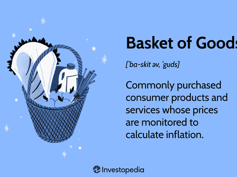

## Table of Contents

## What is the basic definition of a bust in economic terms?

A bust in economic terms refers to a period of time when an economy or a specific market experiences a sharp decline in activity. This often follows a period of rapid growth or a boom, where things were doing really well. During a bust, businesses may struggle, people might lose their jobs, and the overall mood about the economy can become negative.

Busts can happen for many reasons, like too much borrowing, overproduction, or when prices of assets like houses or stocks drop suddenly. When a bust happens, it can lead to what's called a recession, which is when the economy shrinks for a while. Governments and central banks often try to help by lowering interest rates or spending more money to get things going again.

## How does a bust differ from a recession?

A bust and a recession are related but not exactly the same thing. A bust is like a sharp drop in a specific part of the economy, like the housing market or the stock market. It's when things that were doing really well suddenly start doing poorly. This can happen because of too much borrowing, too many things being made, or when prices for things like houses or stocks fall quickly.

A recession, on the other hand, is when the whole economy starts to shrink and doesn't grow for a while. It's more widespread and lasts longer than a bust. A bust can lead to a recession if it spreads to other parts of the economy. For example, if a housing bust makes people lose their jobs and stop spending money, it can pull the whole economy down into a recession. Governments and central banks watch out for both busts and recessions and try to fix them by changing interest rates or spending more money to help the economy recover.

## What are the common causes of an economic bust?

An economic bust often starts when there's too much of something in the economy, like too many houses being built or too many loans being given out. When there's too much of something, the prices start to drop. If people borrowed a lot of money to buy these things and the prices drop, they might not be able to pay back their loans. This can lead to people losing their homes or businesses going bankrupt, which makes the bust even worse.

Another common cause is when people get too excited about investing in things like stocks or real estate, causing prices to go way up. This is called a bubble. When the bubble bursts, prices fall quickly, and people who invested a lot of money can lose a lot. This can make people scared to spend or invest, which slows down the whole economy. Sometimes, external factors like a big drop in oil prices or a financial crisis in another country can also start a bust.

Governments and central banks try to stop busts from happening by watching the economy closely. They can raise interest rates to cool down an overheated market or step in to help banks if they're in trouble. But even with these efforts, busts can still happen because they're hard to predict and control.

## Can you explain the phases of a business cycle that lead to a bust?

A business cycle has different phases that can lead to a bust. It starts with a boom or expansion phase, where the economy is growing, people are spending more money, and businesses are doing well. During this time, people might start to borrow more money to buy things like houses or invest in the stock market. Everything seems to be going great, but sometimes this growth can get out of control, leading to too much borrowing or too many things being made.

After the boom, things can start to slow down, which is called the peak phase. This is when the growth starts to level off, and signs of trouble might start to show. If people borrowed too much money during the boom, they might struggle to pay it back. Prices for things like houses or stocks might start to drop, and if they drop a lot, it can lead to a bust. During a bust, businesses might go bankrupt, people might lose their jobs, and the whole economy can start to shrink.

The bust phase can lead to a recession if it spreads to other parts of the economy. But after a bust, the economy usually starts to recover, which is called the trough phase. This is when things start to get better, and the cycle can start all over again with another expansion. Governments and central banks try to help during a bust by lowering interest rates or spending more money to get the economy going again.

## What industries are typically most affected during a bust?

During a bust, the industries that often feel the biggest impact are the ones that grew a lot during the boom times. For example, if there was a big boom in the housing market, the construction industry and real estate businesses are usually hit hard when a bust happens. People stop buying new homes, construction projects get canceled, and real estate companies can lose a lot of money. Another industry that can be affected a lot is finance. Banks and other financial companies might have given out too many loans during the boom, and when people can't pay them back during a bust, these companies can get into big trouble.

Other industries that often suffer during a bust include manufacturing and retail. If people are worried about the economy, they might stop buying new cars or big items, which hurts factories that make these things. Retail stores can also see fewer customers coming in, which can lead to stores closing and people losing their jobs. Overall, any industry that depends a lot on people spending money can be hit hard during a bust, because when a bust happens, people usually try to save their money instead of spending it.

## How do governments and central banks respond to a bust?

When a bust happens, governments and central banks step in to try to fix things. They usually start by lowering interest rates. This makes it cheaper for people and businesses to borrow money. When borrowing is cheaper, people might start spending more money again, which can help the economy start to grow. Central banks can also buy government bonds or other assets to put more money into the economy, a process called quantitative easing. This is another way to encourage spending and help businesses.

Governments can also help by spending more money themselves. They might start new projects, like building roads or schools, which creates jobs and gets money moving in the economy. Sometimes, governments will give people money directly, like tax cuts or direct payments, to encourage them to spend more. All these actions are meant to stop the bust from getting worse and help the economy start recovering. Governments and central banks keep a close eye on the economy to make sure their plans are working and adjust them if needed.

## What are the long-term implications of a bust on an economy?

A bust can have big effects on an economy that last a long time. After a bust, people might be scared to spend or invest money because they remember how bad things got. This can slow down the economy's growth for years. Businesses that went bankrupt during the bust might not come back, which means fewer jobs and less money moving around in the economy. Also, if a lot of people lost their homes or savings during the bust, they might have a hard time getting back on their feet, which can keep the economy from growing as fast as it could.

Governments and central banks might also change the way they do things after a bust. They might make new rules to stop another bust from happening, like stricter rules for banks or limits on how much people can borrow. These new rules can help make the economy safer, but they can also make it harder for businesses to grow and for people to get loans. In the end, a bust can change how an economy works for a long time, making people more careful but also slowing down growth until things get back to normal.

## How can investors predict the onset of a bust?

Investors can try to predict a bust by watching certain signs in the economy. One big sign is when prices for things like houses or stocks go up really fast. This can mean there's a bubble, and bubbles often burst, leading to a bust. Another thing to watch is how much people are borrowing. If a lot of people are taking out big loans, it could be a problem if they can't pay them back when things slow down. Also, if businesses are making a lot more stuff than people are buying, that can be a warning sign too.

Another way to predict a bust is by looking at economic data. If the economy is growing too fast, it might be overheating, which can lead to a bust. Investors can also keep an eye on things like unemployment rates and consumer confidence. If people start losing their jobs or feeling worried about the economy, it might mean a bust is coming. It's hard to predict exactly when a bust will happen, but by watching these signs, investors can get a good idea of when things might start to go wrong.

## What are some historical examples of major economic busts?

One famous bust happened in the United States in 2007-2008. It started with the housing market. People were buying a lot of houses with loans they couldn't really afford. When house prices started to drop, people couldn't pay back their loans, and banks got into big trouble. This led to a financial crisis that spread all over the world. Many people lost their jobs and homes, and it took years for the economy to get better. Governments and central banks had to step in with a lot of help to fix things.

Another big bust was the Dot-com bubble in the late 1990s and early 2000s. A lot of people were investing in new internet companies, thinking they would make a lot of money. But many of these companies were losing money and didn't have good plans. When people realized this, the stock prices of these companies crashed. A lot of investors lost money, and it hurt the economy for a while. This bust showed how dangerous it can be when too many people get excited about investing in something without thinking about the risks.

## What role does consumer confidence play in exacerbating or mitigating a bust?

Consumer confidence plays a big role in how bad a bust can get. When people feel good about the economy, they spend more money. This spending helps businesses and keeps the economy growing. But when a bust starts, and people see things like job losses or falling prices, their confidence can drop. If people get scared and stop spending, it can make the bust worse. Businesses might have to close if no one is buying their products, leading to even more job losses and more people feeling worried about the economy.

On the other hand, if consumer confidence stays strong during a bust, it can help the economy recover faster. If people keep spending money even when things look tough, it can keep businesses going and help prevent a deeper bust. Governments and central banks often try to boost consumer confidence by doing things like lowering interest rates or giving people money to spend. When people feel more confident, they're more likely to spend, which can help the economy get back on track.

## How do global economic interdependencies influence the impact of a bust?

Global economic interdependencies mean that what happens in one country can affect others. When a bust happens in a big economy like the United States, it can spread to other countries. For example, if people in the U.S. stop buying things from other countries, those countries can lose money and jobs. Also, if banks in one country get into trouble, it can make banks in other countries worried and stop lending money. This can make a bust in one place turn into a global problem.

Because countries are so connected, they often work together to try to stop a bust from getting worse. Governments and central banks around the world might lower interest rates or spend more money at the same time to help each other out. But even with this help, a bust in one country can still make things hard for others. It's like a chain reaction where one problem can lead to more problems in different places.

## What strategies can businesses employ to survive and thrive post-bust?

After a bust, businesses need to be smart to survive and do well. One important thing is to cut costs. This means looking at all the money the business spends and finding ways to spend less. It might mean letting some workers go, moving to a smaller office, or finding cheaper ways to make things. By saving money, a business can keep going even when times are tough. Another good idea is to focus on what the business does best. If a company makes the best shoes, it should stick to making shoes and not try to start making hats too. By being really good at one thing, a business can keep its customers happy and keep making money.

Another strategy is to look for new opportunities. After a bust, some businesses might close down, which can leave gaps in the market. A smart business can find these gaps and start offering things that people need but can't get anymore. It's also a good time to try new ways of selling things, like selling online if the business used to only have a store. By being flexible and trying new things, a business can find new ways to make money. Finally, keeping good relationships with customers is really important. If customers trust a business and like what it does, they will keep coming back even when times are tough. By focusing on customers, a business can build a strong base that helps it survive and grow after a bust.

## References & Further Reading

[1]: Reinhart, C. M., & Rogoff, K. S. (2009). ["This Time is Different: Eight Centuries of Financial Folly."](https://www.nber.org/system/files/working_papers/w13882/w13882.pdf) Princeton University Press.

[2]: World Bank. (2021). ["World Development Report 2021: Data for Better Lives."](https://www.worldbank.org/en/publication/wdr2021) 

[3]: Lopez de Prado, M. (2018). ["Advances in Financial Machine Learning."](https://www.amazon.com/Advances-Financial-Machine-Learning-Marcos/dp/1119482089) John Wiley & Sons.

[4]: Aronson, D. R. (2006). ["Evidence-Based Technical Analysis: Applying the Scientific Method and Statistical Inference to Trading Signals."](https://www.amazon.com/Evidence-Based-Technical-Analysis-Scientific-Statistical/dp/0470008741) John Wiley & Sons.

[5]: Jansen, S. (2020). ["Machine Learning for Algorithmic Trading."](https://github.com/stefan-jansen/machine-learning-for-trading) Packt Publishing.

[6]: Chan, E. P. (2009). ["Quantitative Trading: How to Build Your Own Algorithmic Trading Business."](https://github.com/ftvision/quant_trading_echan_book) John Wiley & Sons.