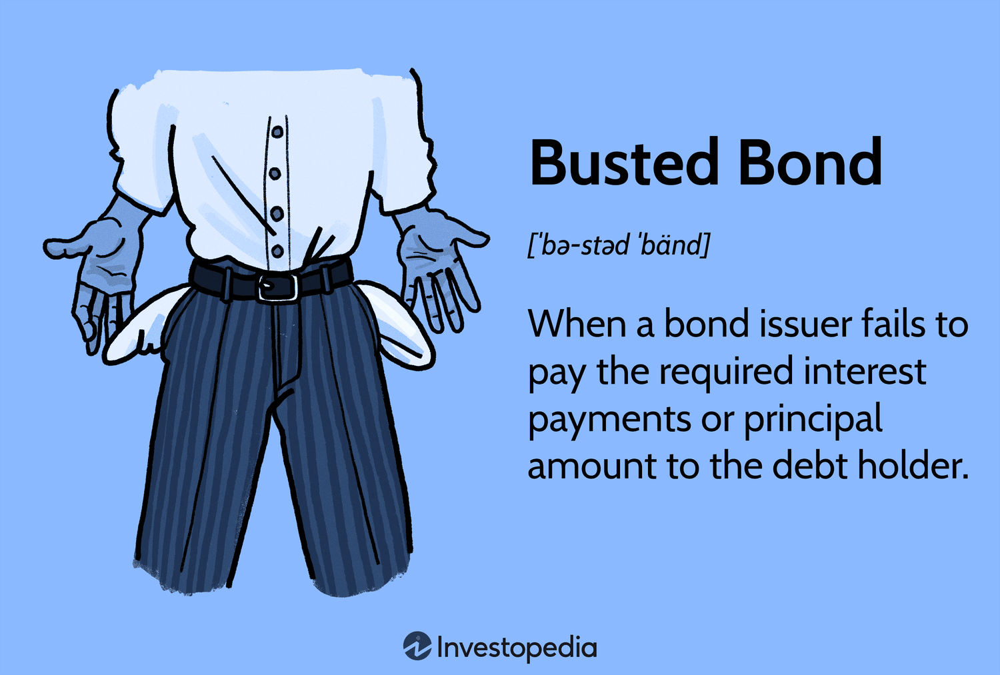

## Table of Contents

## What are busted bonds?

Busted bonds are bonds that have lost a lot of their value. They are usually issued by companies that are having financial trouble. When a company's financial situation gets worse, investors start to worry that the company might not be able to pay back the bond. This makes the bond's price drop a lot.

Sometimes, busted bonds can be a good investment if you think the company will get better. But they are also risky because the company might go bankrupt. If that happens, you could lose all your money. So, it's important to be careful and do a lot of research before buying busted bonds.

## How do busted bonds differ from regular bonds?

Busted bonds and regular bonds are both types of bonds, which are loans that investors give to companies or governments. The main difference is that busted bonds have lost a lot of their value because the company that issued them is having financial trouble. This makes investors worried that they won't get their money back, so they sell the bonds, causing the price to drop a lot. Regular bonds, on the other hand, are usually from companies that are doing well financially, so their value stays more stable.

Busted bonds can be riskier than regular bonds because there's a higher chance the company could go bankrupt. If that happens, investors might lose all their money. But, if you think the company will recover, buying busted bonds at a low price could lead to big profits later. Regular bonds are generally safer because the companies are more stable, but they might not offer the same potential for high returns as busted bonds.

## What causes a bond to become busted?

A bond becomes busted when the company that issued it starts to have money problems. This can happen if the company is not making enough money, or if it has too much debt. When investors see that the company is struggling, they start to worry that the company might not be able to pay back the bond. This makes them want to sell the bond, and when a lot of people try to sell at the same time, the price of the bond goes down a lot.

Sometimes, things outside the company can cause a bond to become busted. For example, if the economy is doing badly, or if there are big changes in the market, it can make it harder for the company to do well. These outside problems can make investors lose faith in the company, and that can lead to the bond losing value and becoming busted.

## What are the risks associated with investing in busted bonds?

Investing in busted bonds can be very risky. The main risk is that the company might go bankrupt. If that happens, you could lose all the money you put into the bond. Busted bonds are from companies that are already having money problems, so there's a good chance they could fail completely.

Another risk is that the bond's value might keep going down. If more bad news comes out about the company, people might want to sell their bonds even more. This can make the price drop even lower than it already is. It's hard to know when the price will stop falling, so you might end up selling at a loss or holding onto a bond that keeps losing value.

Even if you think the company might get better, it's a big gamble. It can take a long time for a company to recover, and there's no guarantee it will happen. So, you need to be ready to wait a long time and still risk losing your money if the company doesn't improve.

## Can busted bonds be a good investment opportunity?

Yes, busted bonds can be a good investment if you are willing to take a big risk. If you buy a busted bond when its price is very low and the company gets better later, you could make a lot of money. The bond's price might go up a lot, and you could sell it for more than you paid. This can happen if the company fixes its money problems or if the economy gets better and helps the company do well.

But, it's important to know that this is a big gamble. There's a good chance the company could go bankrupt, and then you would lose all your money. It can also take a long time for a company to get better, so you need to be ready to wait and not know if you will make money or lose it. So, while busted bonds can be a good investment, they are also very risky and you need to be careful and do a lot of research before you buy them.

## How are busted bonds typically priced in the market?

Busted bonds are usually priced much lower than when they were first sold. This happens because the company that issued the bond is having money problems, and people are worried they won't get their money back. When a lot of people want to sell the bond at the same time, the price goes down a lot. This makes busted bonds cheaper to buy than regular bonds.

The price of a busted bond can keep changing based on new news about the company. If things get worse, the price might go down even more. But if there's good news and people think the company might get better, the price could start to go up. It's hard to know exactly what the price will do, so buying busted bonds is risky.

## What strategies can investors use to mitigate the risks of busted bonds?

Investors can lower the risks of busted bonds by doing a lot of research before buying them. They should look at the company's money problems and see if there's a chance it could get better. It's also good to check the economy and see if it might help the company. By understanding these things, investors can make smarter choices about which busted bonds to buy.

Another way to reduce risk is to not put all your money into one busted bond. Instead, spread your money across different busted bonds or other types of investments. This way, if one company goes bankrupt, you won't lose all your money. It's also important to be patient and ready to wait a long time for the company to recover. By being careful and spreading out your investments, you can lower the chances of losing a lot of money on busted bonds.

## How does the credit rating of a bond influence its likelihood of becoming busted?

The credit rating of a bond shows how likely it is that the company will be able to pay back the money it borrowed. If a bond has a high credit rating, it means the company is doing well and is less likely to have money problems. But if a bond has a low credit rating, it means the company might be struggling and could have a hard time paying back the bond. When a bond's credit rating goes down a lot, it can become a busted bond because people start to worry about getting their money back.

When a bond's credit rating drops, its price usually goes down too. This is because more people want to sell the bond and fewer people want to buy it. If the credit rating keeps getting worse, the bond can become busted. Investors need to watch the credit ratings of the bonds they own because a big drop in the rating can be a warning sign that the bond might become busted.

## What are the legal and regulatory considerations for trading busted bonds?

When you trade busted bonds, you need to know about the rules that control them. Different countries have different rules about buying and selling bonds, especially when the bonds are from companies that are having money problems. In the United States, for example, the Securities and Exchange Commission (SEC) has rules to make sure people know what they are buying and that the market is fair. If a company is close to going bankrupt, there might be special rules about how you can trade its bonds. It's important to check these rules before you buy or sell busted bonds.

Also, if a company goes bankrupt, there are laws that say who gets paid back first. Bondholders might not be at the front of the line, so you could lose money even if the company tries to pay back its debts. Sometimes, there are rules that stop you from selling the bond for a while, or you might need to report your trades to a government agency. Knowing these legal and regulatory things can help you make better choices and avoid getting into trouble when trading busted bonds.

## How do busted bonds impact the overall financial market?

Busted bonds can affect the whole financial market because they show that some companies are having big money problems. When a lot of people see that a company's bonds are losing value fast, they might start to worry about other companies too. This can make the whole market feel less safe, and people might start selling their investments. This can lead to lower prices for stocks and bonds everywhere, not just for the busted bonds. It can also make it harder for other companies to borrow money because banks and investors might be more careful about lending.

Sometimes, busted bonds can make the economy slow down. If a lot of companies are having trouble paying back their bonds, it can make people feel less sure about spending money. This can lead to less spending and slower growth in the economy. On the other hand, if investors think the market will get better, they might buy busted bonds hoping to make money later. This can help the market recover, but it's a risky move and depends a lot on the economy getting better.

## What historical examples illustrate the impact of busted bonds on economies?

One big example of busted bonds hurting an economy happened during the 2008 financial crisis. Many big banks and companies had bonds that lost a lot of value because they were tied to bad home loans. When people couldn't pay their home loans, the bonds became busted, and this made the whole financial market very scared. Banks stopped lending money to each other and to people, which made the economy slow down a lot. Many people lost their jobs, and it took years for things to get better.

Another example is the Latin American debt crisis in the 1980s. Many countries in Latin America had borrowed a lot of money by selling bonds. When they couldn't pay back these bonds, the bonds became busted. This caused big problems for the whole world's economy because banks in other countries had bought these bonds. The crisis made it hard for these countries to grow and caused a lot of economic trouble for a long time. It showed how busted bonds in one place can affect the whole world.

## What advanced financial models can be used to predict the likelihood of a bond becoming busted?

One way to predict if a bond might become busted is by using a model called the Altman Z-score. This model looks at different parts of a company's money situation, like how much profit it makes and how much debt it has. By putting these numbers into a special formula, the Altman Z-score can tell you if a company is likely to go bankrupt soon. If the score is low, it means the company is in trouble, and its bonds might become busted. This model helps investors see warning signs early and make better choices about buying or selling bonds.

Another useful model is the Merton model, which is based on the idea that a company's value can be thought of like a stock option. This model looks at the company's overall value and how much debt it has to see if it can pay back its bonds. If the company's value goes down a lot, the Merton model can show that the bonds are at risk of becoming busted. By using this model, investors can understand how changes in the company's value might affect its ability to pay back its debts. Both the Altman Z-score and the Merton model help investors make smarter decisions and avoid big losses.

## What are busted bonds?

A busted bond arises when the issuer fails to fulfill its interest payment or principal repayment obligations. This situation typically stems from financial distress or adverse market conditions, potentially resulting in the issuer's bankruptcy. A good example is a company facing declining revenue due to economic downturns, leaving it unable to meet debt service requirements.

Convertible bonds, a subset often examined in the context of busted bonds, may become 'busted' when the conversion price substantially exceeds the current market value of the underlying asset. For instance, if a convertible bond is convertible into a company's stock at $100 per share, but the stock's market price falls to $50, the bond is considered "busted" since conversion is unattractive to the bondholder.

Busted bonds occupy a vital position in a company's capital structure, particularly during bankruptcy proceedings. They hold a priority claim above equity stakeholders, meaning bondholders are more likely to recover part or all of their investments before equity holders receive any compensation. This precedence stems from the legal hierarchy of claims against a bankrupt entity's remaining assets: bondholders, who are creditors, are higher on the repayment ladder compared to shareholders, who are residual claimants.

Understanding the causes and implications of busted bonds is crucial for investors aiming to manage risks in their fixed-income portfolios. Investors should scrutinize an issuer's financial health and prevailing market conditions to assess the likelihood of bonds becoming busted. Moreover, incorporating credit analysis, such as evaluating [liquidity](/wiki/liquidity-risk-premium) ratios and debt service coverage, can enhance the assessment process. For example, the quick ratio, a measure of short-term liquidity, is given by:

$$
\text{Quick Ratio} = \frac{\text{Current Assets} - \text{Inventory}}{\text{Current Liabilities}}
$$

A low quick ratio may signal potential liquidity issues leading to busted bonds. Therefore, through diligent financial analysis and market monitoring, investors can proactively manage and mitigate the risks associated with busted bonds in their portfolios.

## References & Further Reading

[1]: Bergstra, J., Bardenet, R., Bengio, Y., & Kégl, B. (2011). ["Algorithms for Hyper-Parameter Optimization."](https://proceedings.neurips.cc/paper/2011/file/86e8f7ab32cfd12577bc2619bc635690-Paper.pdf) Advances in Neural Information Processing Systems 24.

[2]: ["Advances in Financial Machine Learning"](https://www.amazon.com/Advances-Financial-Machine-Learning-Marcos/dp/1119482089) by Marcos Lopez de Prado

[3]: ["Evidence-Based Technical Analysis: Applying the Scientific Method and Statistical Inference to Trading Signals"](https://www.amazon.com/Evidence-Based-Technical-Analysis-Scientific-Statistical/dp/0470008741) by David Aronson

[4]: ["Machine Learning for Algorithmic Trading"](https://github.com/stefan-jansen/machine-learning-for-trading) by Stefan Jansen

[5]: ["Quantitative Trading: How to Build Your Own Algorithmic Trading Business"](https://www.amazon.com/Quantitative-Trading-Build-Algorithmic-Business/dp/1119800064) by Ernest P. Chan