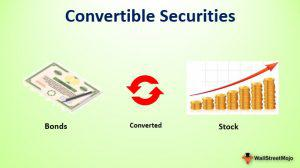

Welcome to the world of convertible bonds, an intriguing class of financial instruments blending the characteristics of both debt and equity. As hybrid securities, these bonds offer opportunities for portfolio diversification and enhanced returns, behaving like traditional bonds but with the added feature of conversion into equity shares at specified terms. Convertible bonds, thereby, serve as a dynamic tool for investors seeking exposure to equity markets with controlled risk.

In this article, we will explore the concept of busted convertible securities — a notable subclass where the value of the issuing company's stock trades significantly below its conversion price. This phenomenon influences the performance and attractiveness of the securities, embedding them with unique risk-reward profiles. Understanding these busted convertibles is crucial for investors looking to capitalize on their specific circumstances.



Additionally, these financial instruments exist in a rapidly evolving market landscape, where algorithmic trading plays an increasing role. The integration of automation and sophisticated data analytics in trading strategies allows for enhanced efficiency and decision-making in managing convertible securities. Algorithmic trading systems provide sophisticated tools for identifying and executing trades in these complex markets, opening new avenues for strategic financial gains.

Throughout this article, we will examine how convertible bonds function within financial markets, analyze their advantages and risks, and discuss how investors can strategically leverage both conventional and busted convertible securities. This exploration aims to equip investors with the insights needed to navigate the challenges and capitalize on the potential of these intricate financial products.

## Table of Contents

## Understanding Convertible Bonds

Convertible bonds are distinctive financial instruments that embody characteristics of both debt and equity, functioning as a versatile tool for both issuers and investors. They are essentially corporate bonds that afford bondholders the option to convert the debt into a predetermined number of shares of the issuing company's common stock, within specified periods and usually at the discretion of the bondholder. This dual nature offers a blending of the predictable income potential from the bond's fixed interest payments and the capital appreciation opportunity from equity ownership.

The typical structure of a convertible bond involves elements such as the par value, coupon rate, and maturity date, akin to traditional bonds. However, it also includes conversion features such as the conversion ratio and conversion price, settings which dictate the number of shares received upon conversion and the price at which conversion becomes beneficial. The conversion ratio is calculated as:

$$
\text{Conversion Ratio} = \frac{\text{Par Value of the Bond}}{\text{Conversion Price}}
$$

For example, if a bond has a par value of $1,000 and a conversion price of $50, the conversion ratio would be 20, meaning each bond could be converted into 20 shares of stock.

Convertible bonds are favored in financial markets for their potential to allow issuers to raise capital at lower costs compared to straight debt. This is because investors typically accept lower interest rates due to the embedded option to convert into equity. For investors, convertible bonds offer downside protection through fixed-income features while providing upside potential should the issuing company's stock price appreciate significantly. 

The pricing of convertible bonds can be complex, influenced by factors such as credit spreads, [volatility](/wiki/volatility-trading-strategies) of the underlying stock, interest rates, and the issuer's creditworthiness. Due to these dynamics, convertible bonds tend to exhibit a unique risk-return profile that requires careful analysis. In financial markets, these bonds often attract sophisticated investors who seek to benefit from strategic investments driven by the equity conversion aspect, as well as income generation from interest payments.

The hybrid nature of convertible bonds necessitates specialized valuation approaches, often integrating models used for both fixed-income securities and options. Sophisticated valuation methods, such as binomial tree models and Black-Scholes based models, are often utilized to assess fair value by accounting for various market conditions and volatility scenarios.

In conclusion, convertible bonds offer a complex yet appealing investment choice that taps into the strengths of both debt and equity securities, making them a versatile instrument in the toolkit of knowledgeable investors. Their functional dynamics not only enable strategic portfolio diversification but also furnish issuers with a nuanced method of capital management.

## Busted Convertible Security

A busted convertible security arises when the underlying stock of a convertible bond trades significantly below its conversion price, rendering the conversion feature economically unviable. The conversion price is predetermined, based on the bond's terms, and is the price at which the bondholder can exchange the bond for shares of the issuing company. When the market price of the stock drops well below the conversion price, the bond's equity component becomes worthless, or "busted", but the bond does not lose all its value. It continues to represent a debt obligation with its intrinsic interest payments and principal return features.

**Causes of a Convertible Bond Becoming 'Busted':**

1. **Market Conditions**: Adverse market conditions or company-specific issues, such as a decrease in investor confidence, can lead to a decline in the price of the underlying stock. Negative earnings reports, changes in management, or broader market downturns may contribute to a convertible bond becoming busted.

2. **Volatility**: High volatility in a company's stock can increase the likelihood of the price falling below the conversion threshold. Greater price swings make it challenging for investors to predict when and if the stock will rise above the conversion price.

3. **Intrinsic Value Deterioration**: As the company's stock value decreases, the intrinsic value of the option to convert also diminishes. If the market believes that the stock will not reach the conversion price within a reasonable period, the bond effectively becomes a straight bond.

**Investment Potential of Busted Convertibles:**

Despite their status, these securities can still hold investment potential. The interest payments associated with the bond component continue to provide regular income, potentially making them attractive in a low-interest-rate environment. Investors may find value in buying at a discount when the market has excessively penalized the convertible bond.

Furthermore, the potential for recovery remains if the issuing company's fundamentals improve, leading to a potential increase in stock valuation. The hybrid nature of convertible bonds allows them to benefit from price appreciation of the underlying stock while simultaneously offering the protection typically associated with bond investments.

For example, suppose a busted convertible bond has a face value of $1,000 with a coupon rate of 5%. Despite the stock's underperformance, investors earn $50 annually in interest payments. Should the stock eventually exceed the conversion price, investors can convert and capitalize on the equity upturn. 

To summarize, while busted convertibles present a unique set of challenges, their potential upside, backed by regular interest income and eventual opportunity for stock conversion (if conditions improve), can offer strategic value to investors willing to assess and undertake the associated risks.

## Investment Opportunities and Risks

Busted convertible securities, despite their below-par performance, offer unique investment opportunities largely due to their distinctive risk-reward profile. These securities, whose conversion option is not immediately valuable because the stock price trades significantly below the conversion price, still possess inherent value that can be tapped into by discerning investors.

One of the notable advantages of investing in busted convertibles lies in the potential yield they offer. These securities often trade with higher yields compared to traditional fixed-income instruments. The yield of a busted convertible bond can be appealing to income-focused investors who are seeking higher returns than typical bonds. This is largely because the risk perceived by the market for these securities is higher, leading to a higher yield to compensate for the potential risk of default or credit deterioration of the issuer.

The valuation of busted convertibles is influenced by multiple factors, including the [interest rate](/wiki/interest-rate-trading-strategies) environment, credit quality of the issuer, and the overall market volatility. The bond's valuation can change based on fluctuations in these factors, which can either enhance or diminish the potential returns. Investors must analyze these elements and consider strategies such as interest rate hedging or credit default swaps to manage associated risks.

Despite the potential for higher yields, investing in busted convertibles requires careful consideration of the risks involved. Market volatility plays a significant role in determining the investment's success. Since the convertible bond is closely tied to the performance of the issuer's stock, significant market swings can impact the bond's value, even if the convertible feature is not in the money. Moreover, issuer credit risk is paramount; a declining stock price may signal financial distress for the issuer, increasing the probability of default. Investors must perform thorough due diligence regarding the issuer's financial health and stability when considering investing in busted convertibles.

For illustration, consider a simplified scenario using Python to model a convertible bond's potential yield. A basic model might compute the yield to maturity (YTM) for a busted convertible bond, accounting for factors like credit spread and interest rate:

```python
def calculate_ytm(face_value, coupon_rate, market_price, years_to_maturity):
    annual_coupon = face_value * coupon_rate
    ytm = (annual_coupon + (face_value - market_price) / years_to_maturity) / ((face_value + market_price) / 2)
    return ytm

face_value = 1000
coupon_rate = 0.05
market_price = 800
years_to_maturity = 5

ytm = calculate_ytm(face_value, coupon_rate, market_price, years_to_maturity)
print(f"The Yield to Maturity is: {ytm:.2%}")
```

In this code, a hypothetical convertible bond with a face value of $1,000, a coupon rate of 5%, and a market price of $800 over five years to maturity yields a higher rate due to its reduced market price. This illustrates the attractive yield proposition of busted convertibles for potential investors.

Successful investment in busted convertibles demands a strategic balance between exploiting higher yields and mitigating the elevated risks, requiring adept assessment of credit situations and market conditions to achieve favorable outcomes.

## Algorithmic Trading of Convertible Bonds

Algorithmic trading, which employs complex algorithms and data analytics, has become an integral part of trading convertible bonds, including busted convertibles. This approach automates and optimizes the trading process, offering efficiency and precision that manual trading often lacks. 

The application of [algorithmic trading](/wiki/algorithmic-trading) to convertible bonds involves several critical components. Firstly, algorithms are developed to analyze vast datasets swiftly and accurately. These datasets may include historical price data, market trends, and company-specific information, allowing traders to identify profitable opportunities with greater accuracy. By utilizing [machine learning](/wiki/machine-learning) models, algorithms can continuously improve their decision-making capabilities based on new data, enhancing their ability to predict market movements.

Automation plays a pivotal role in algorithmic trading by executing trades at speeds and frequencies that human traders cannot achieve. This is particularly beneficial in the convertible bond market, where pricing can be volatile and time-sensitive trading decisions become crucial. For instance, algorithmic trading systems can simultaneously monitor multiple market indicators, enabling quick responses to price changes in the underlying stocks of convertible bonds.

Data analytics further enhances trading efficiency by offering deep insights into market behavior and investor sentiment. Advanced analytics tools dissect large datasets to reveal trends and anomalies, helping traders to better understand market conditions and refine their strategies accordingly.

A practical example of algorithmic trading's impact on convertible bond trading is seen in hedge funds employing delta-neutral strategies. Delta-neutral strategies aim to hedge against price movements in the underlying asset, maintaining a stable portfolio regardless of market volatility. Algorithms can calculate the delta, or rate of change, of a convertible bond's price related to the price of the underlying stock, and automatically make hedging adjustments as needed. 

Consider an algorithm that uses Python to monitor a convertible bond's price and its underlying stock's performance:

```python
import numpy as np

# Simulated bond and stock price data
bond_prices = np.array([100, 102, 101, 103, 105])
underlying_stock_prices = np.array([50, 51, 50, 52, 53])

# Calculate deltas
delta = np.diff(bond_prices) / np.diff(underlying_stock_prices)

# Automatically adjust holdings to maintain a delta-neutral position
def maintain_delta_neutral(bond_position, deltas):
    adjustments = []
    for d in deltas:
        adjustment = -bond_position * d
        adjustments.append(adjustment)
    return adjustments

bond_position = 10  # Example bond holding position
adjustments = maintain_delta_neutral(bond_position, delta)
print("Adjustments needed to maintain delta-neutral:")
print(adjustments)
```

Another real-world application is in the utilization of high-frequency trading ([HFT](/wiki/high-frequency-trading-strategies)) strategies, where algorithms pursue [arbitrage](/wiki/arbitrage) opportunities within the convertible bonds market. These strategies exploit the discrepancies in prices between convertible bonds and their corresponding stocks, which can occur due to mispricing or lag in market information dissemination.

Algorithmic trading not only offers potential profits but also introduces risks such as technical failures and model inaccuracies. Therefore, continuous monitoring and updating of algorithms are essential to mitigate these risks. Overall, the sophistication and adaptability of algorithmic trading make it a powerful tool for managing the complexities of convertible bond trading.

## Conclusion

Convertible bonds and busted convertible securities offer investors a compelling, albeit intricate, avenue for financial engagement. Their dual nature—melding characteristics of both debt and equity—presents a unique investment profile that can serve both conservative and growth-focused objectives. These instruments have the potential to provide valuable diversification benefits and the opportunity for enhanced returns. However, the intricacies involved in their operation demand a nuanced understanding of associated risks and potential rewards.

Investors must undertake a comprehensive analysis of their financial goals to appropriately balance the risks and opportunities that convertible bonds present. A thorough understanding of market volatility, conversion terms, and issuer creditworthiness is crucial. These factors play a significant role in determining whether the strategic use of such securities aligns with an investor's risk tolerance and return expectations.

With the rise of algorithmic trading, the landscape of convertible securities has been transformed. Algorithmic strategies, leveraging automation and advanced data analytics, offer sophisticated tools to enhance trading efficiency and decision-making capabilities. By employing algorithms, traders can execute transactions at speeds and precision levels that are beyond human capacity, thus enabling more accurate capital allocation and risk management.

Overall, the integration of algorithmic trading in convertible bond markets facilitates a more dynamic approach to investment, allowing participants to capitalize on fleeting market inefficiencies. As financial technology continues to evolve, its application in the domain of convertible securities offers promising possibilities for both optimizing performance and mitigating risk in an ever-changing financial climate.

## References & Further Reading

[1]: Calamos, N. P. (1998). ["Convertible Securities: The Latest Instruments, Portfolio Strategies, and Valuation Analysis."](https://archive.org/details/convertiblesecur00cala) McGraw-Hill.

[2]: Hull, J. C. (2017). ["Options, Futures, and Other Derivatives"](https://www.semanticscholar.org/paper/Options%2C-Futures%2C-and-Other-Derivatives-Hull/89bdee500c8623864fc9eb7a471546aa713acc44) (10th Edition). Pearson.

[3]: Fabozzi, F. J., Choudhry, M., & Chen, R.-R. (2003). ["Fixed Income Analysis Workbook."](https://www.amazon.com/Credit-Derivatives-Instruments-Applications-Pricing/dp/047146600X) Wiley.

[4]: Lopez de Prado, M. (2018). ["Advances in Financial Machine Learning."](https://www.amazon.com/Advances-Financial-Machine-Learning-Marcos/dp/1119482089) Wiley.

[5]: Jarrow, R. A., & Turnbull, S. M. (1996). ["Derivative Securities."](https://archive.org/details/derivativesecuri0000jarr) South-Western College Publishing.