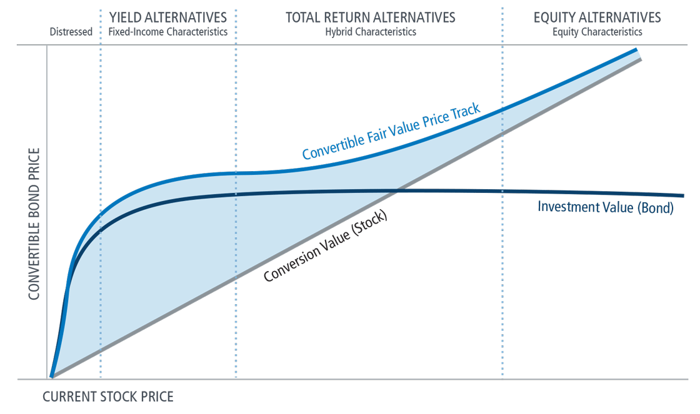

## Table of Contents

## What is a convertible security?

A convertible security is a type of investment that can be changed into another type of security, usually common stock. It's like having a special ticket that you can use to get something different later on. For example, you might buy a convertible bond, which is a bond that you can later turn into shares of the company's stock if you want to.

These securities are popular because they offer flexibility. If the company does well and the stock price goes up, you can convert your security into stock and make more money. But if the stock price doesn't go up, you can keep your bond and still get the interest payments. This makes convertible securities a good choice for people who want to balance risk and reward.

## What does 'busted' mean in the context of convertible securities?

In the world of convertible securities, a 'busted' convertible is one that is not doing well. It means the price of the stock that the security can be converted into is lower than the price at which you can convert it. So, it doesn't make sense to turn the security into stock because you would lose money.

For example, imagine you have a convertible bond that you can turn into stock at $50 per share. But right now, the stock is only worth $40 per share. If you convert your bond into stock, you would be getting a worse deal. That's why it's called 'busted' – the conversion feature isn't useful anymore. Investors might still hold onto these securities for the interest payments, but they won't be converting them into stock anytime soon.

## How does a busted convertible security function?

A busted convertible security is a type of investment that you can turn into stock, but it's not a good idea to do that right now. Imagine you have a special bond that you can swap for shares of a company's stock at a certain price. But if the stock's current price is lower than the price you need to convert it, you would lose money by making the swap. So, you keep the bond instead of turning it into stock.

Even though the conversion part isn't useful, the bond still pays interest. This means you can still earn money from the interest payments, even if you can't benefit from turning it into stock. Investors might hold onto these busted convertibles because of the steady income from interest, hoping that the stock price might go up in the future and make the conversion worthwhile again.

## What are the main characteristics of a busted convertible security?

A busted convertible security is a special kind of investment that you can turn into stock, but it's not a good idea to do that right now. Imagine you have a bond that you can swap for shares of a company's stock at a set price. If the stock's current price is lower than the price you need to convert it, you would lose money by making the swap. So, it's better to keep the bond instead of turning it into stock. This situation is what makes the convertible security "busted" – the option to convert isn't useful anymore.

Even though you can't benefit from turning the bond into stock, it still pays interest. This means you can earn money from the interest payments, even if you can't use the conversion feature. Investors might hold onto these busted convertibles because of the steady income from interest. They might hope that the stock price will go up in the future, making the conversion worthwhile again. So, while the conversion part is busted, the bond itself still has value because of the interest it pays.

## What are the benefits of investing in busted convertible securities?

Investing in busted convertible securities can be a good choice for some people. One big benefit is that you still get to earn interest from the bond, even if turning it into stock isn't a good idea right now. This can give you a steady income, which is great if you're looking for regular money coming in. It's like getting paid for holding onto your investment, even if the stock part isn't working out.

Another benefit is that there's still a chance the stock price could go up in the future. If that happens, the busted convertible could become valuable again because you could then turn it into stock at a better price. So, you're not just stuck with a bad investment. You're holding onto something that could get better over time. This makes busted convertibles a hopeful investment, where you get paid while you wait for things to improve.

## What are the risks associated with busted convertible securities?

Investing in busted convertible securities comes with some risks. One big risk is that the stock price might stay low or even go down more. If that happens, you can't turn your bond into stock without losing money, and you're stuck just getting the interest payments. Those payments might not be enough to make up for the fact that the stock part of your investment isn't working out.

Another risk is that the company might run into financial trouble. If the company struggles, it might not be able to keep paying the interest on your bond. That means you could lose the steady income you were counting on. And if the company does really badly, your bond might lose value too, making your whole investment worth less than you paid for it. So, while busted convertibles can offer some benefits, they also come with risks that you need to think about carefully.

## How do busted convertible securities compare to traditional convertible securities?

Busted convertible securities and traditional convertible securities are similar because they both start out as bonds that you can turn into stock. The big difference is that with a traditional convertible security, it makes sense to turn the bond into stock because the stock's price is higher than the price you need to convert it. This means you can make more money by converting. But with a busted convertible, the stock's price is lower than the conversion price, so it doesn't make sense to convert it. You would lose money if you did.

Even though busted convertibles can't be turned into stock profitably, they still pay interest. This means you can still earn money from the interest payments, which can be a good thing if you're looking for a steady income. Traditional convertibles also pay interest, but the main attraction is usually the potential to make more money by converting them into stock. So, while both types of securities offer the chance to earn interest, traditional convertibles are more about the possibility of turning a profit through conversion, while busted convertibles are more about the steady income from interest, with a hope that the stock price might go up in the future.

## What factors contribute to a convertible security becoming 'busted'?

A convertible security becomes 'busted' when the price of the stock it can be turned into falls below the price at which you can convert it. Imagine you have a bond that you can swap for stock at $50 per share. If the stock's price drops to $40 per share, it doesn't make sense to convert because you would be getting a worse deal. This situation makes the convertible security 'busted' because the option to turn it into stock isn't useful anymore.

Several things can cause a stock's price to fall, leading to a busted convertible. For example, if the company isn't doing well financially or if the overall market is going down, the stock price can drop. Bad news about the company, like lower profits or losing important customers, can also make investors sell the stock, pushing its price down. When the stock price stays below the conversion price for a long time, the convertible security becomes busted, and investors focus more on the interest payments rather than the conversion option.

## How can investors identify a busted convertible security?

Investors can spot a busted convertible security by looking at the stock price and the conversion price. The conversion price is the set price at which you can turn your bond into stock. If the current stock price is lower than this conversion price, the security is busted. For example, if you can convert your bond into stock at $50 per share but the stock is only worth $40 per share, it's a busted convertible because converting it would mean losing money.

To find out if a convertible security is busted, investors need to keep an eye on the company's stock price. If the stock price drops and stays below the conversion price for a while, that's a sign the security is busted. It's important to check these prices regularly because the situation can change. Even though the conversion option isn't useful, the bond still pays interest, so investors might still hold onto it for that steady income.

## What strategies can be used to trade busted convertible securities?

One strategy for trading busted convertible securities is to buy them when you think the stock price might go up in the future. Even though the security is busted now, if the stock price goes above the conversion price, you can turn your bond into stock and make a profit. You can also earn money from the interest payments while you wait for the stock price to improve. This way, you're getting paid to hold onto your investment, with the hope that it will become valuable again.

Another strategy is to focus on the steady income from the interest payments. If you don't think the stock price will go up anytime soon, you can still benefit from the regular interest the bond pays. This is a good choice if you're looking for a reliable source of income. You might hold onto the busted convertible until it matures, collecting interest along the way, and then decide what to do with the money when the bond reaches its end date.

## How do market conditions affect the performance of busted convertible securities?

Market conditions can have a big impact on busted convertible securities. If the stock market is doing well and stock prices are going up, there's a chance the stock price of the company behind the busted convertible could go up too. If it goes above the conversion price, the busted convertible could become valuable again because you could turn it into stock and make a profit. But if the market is doing badly and stock prices are falling, the stock price might stay low or even drop more, keeping the convertible busted. This means you would keep the bond for its interest payments instead of converting it into stock.

Interest rates are another important part of market conditions that can affect busted convertibles. If interest rates go up, the interest payments from the bond might not seem as good compared to other investments that are now paying more interest. This could make the busted convertible less attractive to investors. On the other hand, if interest rates go down, the interest payments from the bond might look better, making the busted convertible more appealing for its steady income. So, both the stock market and interest rates play a big role in how well busted convertible securities perform.

## What advanced financial models are used to evaluate busted convertible securities?

To figure out if a busted convertible security is a good investment, people use special math models. One popular model is called the Black-Scholes model, which is used to guess how much a stock option might be worth. For busted convertibles, this model helps investors understand the value of the option to turn the bond into stock, even if it's not a good idea to do that right now. The model looks at things like how much the stock price might move around, how long until the bond can be turned into stock, and what interest rates are doing. By using this model, investors can see if there's a chance the stock price might go up enough to make the busted convertible valuable again.

Another model that's used is the binomial model. This one is good for figuring out the value of a busted convertible over time, because it breaks down the future into little steps and looks at what might happen at each step. It's like playing a game where you guess what the stock price will do at different times. The binomial model can show investors if there's a path where the stock price goes up enough to make converting the bond into stock a good idea. Both of these models help investors make smarter choices about whether to buy, sell, or keep holding onto a busted convertible security, by giving them a better idea of what might happen in the future.

## What are Convertible Bonds and How Do They Work?

Convertible bonds are distinctive financial instruments that embody characteristics of both debt and equity, functioning as a versatile tool for both issuers and investors. They are essentially corporate bonds that afford bondholders the option to convert the debt into a predetermined number of shares of the issuing company's common stock, within specified periods and usually at the discretion of the bondholder. This dual nature offers a blending of the predictable income potential from the bond's fixed interest payments and the capital appreciation opportunity from equity ownership.

The typical structure of a convertible bond involves elements such as the par value, coupon rate, and maturity date, akin to traditional bonds. However, it also includes conversion features such as the conversion ratio and conversion price, settings which dictate the number of shares received upon conversion and the price at which conversion becomes beneficial. The conversion ratio is calculated as:

$$
\text{Conversion Ratio} = \frac{\text{Par Value of the Bond}}{\text{Conversion Price}}
$$

For example, if a bond has a par value of $1,000 and a conversion price of $50, the conversion ratio would be 20, meaning each bond could be converted into 20 shares of stock.

Convertible bonds are favored in financial markets for their potential to allow issuers to raise capital at lower costs compared to straight debt. This is because investors typically accept lower interest rates due to the embedded option to convert into equity. For investors, convertible bonds offer downside protection through fixed-income features while providing upside potential should the issuing company's stock price appreciate significantly. 

The pricing of convertible bonds can be complex, influenced by factors such as credit spreads, [volatility](/wiki/volatility-trading-strategies) of the underlying stock, interest rates, and the issuer's creditworthiness. Due to these dynamics, convertible bonds tend to exhibit a unique risk-return profile that requires careful analysis. In financial markets, these bonds often attract sophisticated investors who seek to benefit from strategic investments driven by the equity conversion aspect, as well as income generation from interest payments.

The hybrid nature of convertible bonds necessitates specialized valuation approaches, often integrating models used for both fixed-income securities and options. Sophisticated valuation methods, such as binomial tree models and Black-Scholes based models, are often utilized to assess fair value by accounting for various market conditions and volatility scenarios.

In conclusion, convertible bonds offer a complex yet appealing investment choice that taps into the strengths of both debt and equity securities, making them a versatile instrument in the toolkit of knowledgeable investors. Their functional dynamics not only enable strategic portfolio diversification but also furnish issuers with a nuanced method of capital management.

## References & Further Reading

[1]: Calamos, N. P. (1998). ["Convertible Securities: The Latest Instruments, Portfolio Strategies, and Valuation Analysis."](https://archive.org/details/convertiblesecur00cala) McGraw-Hill.

[2]: Hull, J. C. (2017). ["Options, Futures, and Other Derivatives"](https://www.semanticscholar.org/paper/Options%2C-Futures%2C-and-Other-Derivatives-Hull/89bdee500c8623864fc9eb7a471546aa713acc44) (10th Edition). Pearson.

[3]: Fabozzi, F. J., Choudhry, M., & Chen, R.-R. (2003). ["Fixed Income Analysis Workbook."](https://www.amazon.com/Credit-Derivatives-Instruments-Applications-Pricing/dp/047146600X) Wiley.

[4]: Lopez de Prado, M. (2018). ["Advances in Financial Machine Learning."](https://www.amazon.com/Advances-Financial-Machine-Learning-Marcos/dp/1119482089) Wiley.

[5]: Jarrow, R. A., & Turnbull, S. M. (1996). ["Derivative Securities."](https://archive.org/details/derivativesecuri0000jarr) South-Western College Publishing.