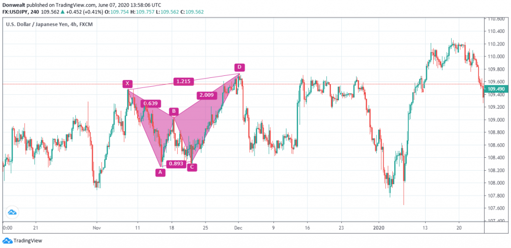

## Table of Contents

## What is the Butterfly Harmonic Pattern in trading?

The Butterfly Harmonic Pattern is a tool used in trading to predict when the price of something, like a stock or currency, might change direction. It looks like a butterfly with its wings spread out. Traders use this pattern to find good times to buy or sell. The pattern is made up of four specific points on a price chart, labeled X, A, B, and C. These points form certain ratios between the movements of the price, which help traders spot the pattern.

To spot a Butterfly Harmonic Pattern, traders look for the price to move from point X to A, then pull back to B, move again to C, and finally reach point D. The key is that the distances between these points should follow certain Fibonacci ratios. For example, the move from X to A might be related to the move from A to B by a specific ratio, like 0.618 or 0.786. When all these ratios line up correctly, it suggests that the price might reverse at point D, giving traders a chance to make a trade.

## How does the Butterfly Harmonic Pattern differ from other harmonic patterns?

The Butterfly Harmonic Pattern is different from other harmonic patterns mainly because of its specific structure and the Fibonacci ratios it uses. While all harmonic patterns use Fibonacci numbers to find important points where the price might change direction, the Butterfly pattern has a unique shape that looks like a butterfly. It uses ratios like 0.786 for the XA to AB leg, and the critical point D often reaches beyond the starting point X, which is not common in other patterns like the Gartley or Bat.

Other harmonic patterns, like the Gartley or Bat, have different key ratios and shapes. For example, the Gartley pattern usually has a 0.618 ratio for the AB to CD leg, and its point D doesn't go beyond the starting point X. The Bat pattern, on the other hand, uses a 0.886 ratio for the XA to AD leg, and its point D is very close to the X point. So, even though they all use Fibonacci numbers, the Butterfly pattern stands out because of its extended reach to point D and the specific ratios that define its structure.

## What are the key Fibonacci levels used in identifying the Butterfly Pattern?

The Butterfly Pattern uses special numbers called Fibonacci levels to help traders spot it on price charts. The main Fibonacci level for the Butterfly Pattern is 0.786. This number is used to find the distance between the first move from point X to A and the retracement from A to B. When the move from A to B is about 78.6% of the move from X to A, it's a good sign that a Butterfly Pattern might be forming.

Another important Fibonacci level for the Butterfly Pattern is 1.618. This level helps traders find the distance from point B to D. The move from B to D should be about 161.8% of the move from A to B. This means that point D often goes beyond the starting point X, which is what makes the Butterfly Pattern look like a butterfly with its wings spread out. By using these Fibonacci levels, traders can better predict where the price might change direction.

## How can traders identify the Butterfly Harmonic Pattern on a price chart?

To identify the Butterfly Harmonic Pattern on a price chart, traders first need to spot the four key points: X, A, B, C, and D. They start by looking at the price movement from point X to A. This is the initial move. Then, they watch for the price to pull back from A to B. The distance from A to B should be about 78.6% of the distance from X to A. This 78.6% is a special number called a Fibonacci level, and it's crucial for spotting the Butterfly Pattern.

Next, traders look for the price to move again from B to C. After that, the price should move from C to D, and this is where things get interesting. The move from B to D should be about 161.8% of the move from A to B. This means point D will often go beyond the starting point X. When all these moves and their Fibonacci ratios line up correctly, it forms the shape of a butterfly on the chart. Traders use this pattern to guess when the price might turn around at point D, helping them decide when to buy or sell.

## What are the entry points for trading the Butterfly Harmonic Pattern?

When trading the Butterfly Harmonic Pattern, the entry point is usually at point D. This is where the pattern completes and traders expect the price to turn around. If the pattern is a bullish Butterfly, meaning the price is expected to go up after point D, traders enter a buy order a little bit above point D. They do this to make sure the price is really turning around before they buy. If it's a bearish Butterfly, meaning the price is expected to go down, traders enter a sell order a little bit below point D for the same reason.

Sometimes traders might also look at other signs to help them decide when to enter a trade. They might use other tools or indicators to confirm that the price is likely to turn around at point D. This can make their trading decision more confident. But the main thing is to enter the trade right after point D, either by buying above it for a bullish pattern or selling below it for a bearish pattern.

## What are the stop-loss and take-profit strategies when trading the Butterfly Pattern?

When trading the Butterfly Pattern, setting a stop-loss is important to limit how much money you could lose if the trade goes wrong. For a bullish Butterfly, where you expect the price to go up, you should put your stop-loss a bit below point D. This way, if the price keeps going down instead of turning around like you thought, you won't lose too much money. For a bearish Butterfly, where you expect the price to go down, you should put your stop-loss a bit above point D. This stops you from losing a lot if the price goes up instead of down.

For take-profit, you can use the Fibonacci levels again to figure out where to take your profits. In a bullish Butterfly, you might set your first take-profit at the 38.2% retracement level of the move from X to A, and another at the 61.8% level. This means you take some profit when the price goes up to these points. In a bearish Butterfly, you would set your take-profit levels at the same Fibonacci retracement levels but in the opposite direction, so at 38.2% and 61.8% of the move from X to A going down. This helps you make money if the price turns around like you expected.

## Can the Butterfly Harmonic Pattern be used in different time frames, and how does this affect trading?

The Butterfly Harmonic Pattern can be used on different time frames, like minutes, hours, days, or even weeks. This means traders can look for the pattern on short-term charts if they want to make quick trades, or on long-term charts if they want to hold their trades for a longer time. The key is that the pattern's shape and Fibonacci ratios stay the same no matter the time frame. But, trading on shorter time frames might mean more trades and quicker decisions, while trading on longer time frames might mean fewer trades but holding them for longer.

Using the Butterfly Pattern on different time frames can affect how you trade. For example, if you spot the pattern on a short-term chart, like a 5-minute chart, you might enter and [exit](/wiki/exit-strategy) trades within a few minutes or hours. This can be exciting but also risky because short-term price movements can be unpredictable. On the other hand, if you find the pattern on a longer-term chart, like a daily or weekly chart, you might hold your trade for days or weeks. This can be less stressful and might give you a better chance to see the pattern play out as expected, but it also means you need to be patient and wait longer for your profits.

## What are the common mistakes traders make when using the Butterfly Harmonic Pattern?

One common mistake traders make when using the Butterfly Harmonic Pattern is not waiting for the pattern to fully complete before entering a trade. They might get excited and jump into a trade before point D is reached, which can lead to losses if the price doesn't turn around as expected. It's important to be patient and wait for the pattern to finish forming before making a move. Another mistake is not using other tools or indicators to confirm the pattern. Relying only on the Butterfly Pattern without looking at other signs can be risky. Traders should use things like trend lines, other harmonic patterns, or even simple moving averages to make sure the pattern is likely to work out.

Another mistake is setting stop-losses too tight. If a trader sets their stop-loss too close to point D, a small price movement might trigger it, even if the pattern is still playing out as expected. It's better to give the trade some room to breathe by setting the stop-loss a bit further away from point D. Lastly, some traders might not take profits at the right levels. They might get greedy and hold onto a trade too long, hoping for more profit, only to see the price turn against them. Using the Fibonacci levels to set take-profit points can help traders lock in gains at the right time.

## How can the Butterfly Pattern be combined with other technical indicators for better results?

Combining the Butterfly Pattern with other technical indicators can help traders make better decisions and increase their chances of success. One common way to do this is by using trend lines to confirm the direction of the market. If the Butterfly Pattern forms in the same direction as the overall trend, it's a stronger sign that the pattern might work out. For example, if the trend is going up and a bullish Butterfly Pattern appears, it adds more confidence to the trade. Another useful tool is the Relative Strength Index (RSI), which shows if a market is overbought or oversold. If the RSI confirms that the price is ready to turn around at point D, it can give traders more assurance before entering a trade.

In addition to trend lines and RSI, moving averages can also be helpful when used with the Butterfly Pattern. A moving average smooths out price data to show the direction of the trend over time. If the price is above a moving average and a bullish Butterfly Pattern forms, it suggests a good time to buy. On the other hand, if the price is below a moving average and a bearish Butterfly Pattern appears, it might be a good time to sell. By combining the Butterfly Pattern with these other indicators, traders can get a fuller picture of the market and make more informed trading decisions.

## What are the psychological aspects traders need to consider when trading the Butterfly Pattern?

When trading the Butterfly Pattern, traders need to be patient. It can take time for the pattern to form completely, and jumping into a trade too early can lead to mistakes. It's important to wait until point D is reached before making a move. This patience can be hard, especially if the market is moving quickly, but it's key to giving the pattern a chance to work out as expected. Traders also need to manage their emotions well. It's easy to get excited or nervous when trading, and these feelings can make people act without thinking. Staying calm and sticking to a plan helps traders make better decisions and avoid big losses.

Another psychological aspect is dealing with the fear of missing out (FOMO). Sometimes, traders see the Butterfly Pattern forming and want to jump in right away, worried that they'll miss a good opportunity. But acting too soon can lead to entering a trade at the wrong time. It's important to trust the pattern and the other indicators being used, rather than letting FOMO push you into a hasty decision. Additionally, traders need to be okay with taking profits at the right times. Greed can make someone hold onto a trade too long, hoping for more gains, only to see the price turn against them. Using the Fibonacci levels to set take-profit points can help traders lock in gains and avoid this kind of mistake.

## How does market volatility affect the effectiveness of the Butterfly Harmonic Pattern?

Market [volatility](/wiki/volatility-trading-strategies) can make it harder to use the Butterfly Harmonic Pattern correctly. When the market moves a lot, the price can change quickly and unpredictably. This means that the pattern might not form as clearly as it should. Traders might see what looks like a Butterfly Pattern, but because of the big price swings, the pattern could be broken before it's complete. This can lead to false signals, where traders think they see a good trade but end up losing money because the pattern didn't work out as expected.

However, high volatility can also create more chances to spot the Butterfly Pattern. In a very active market, there are more price movements, which means more opportunities for the pattern to appear. If traders are good at spotting the pattern and using other tools to confirm it, they might be able to take advantage of these extra chances. But they need to be careful and patient, making sure the pattern is really there before they trade. Using other indicators and being ready for quick changes can help traders deal with the ups and downs of a volatile market.

## What are some advanced techniques for optimizing trades based on the Butterfly Harmonic Pattern?

One advanced technique for optimizing trades based on the Butterfly Harmonic Pattern is to use multiple time frames to confirm the pattern. Traders can look at the pattern on both short-term and long-term charts to make sure it's really there. If the Butterfly Pattern shows up on a 5-minute chart and also on a daily chart, it's a stronger sign that the pattern will work out. This can help traders feel more confident about entering a trade. They can also use this method to set better entry and exit points, by seeing how the pattern looks on different time scales.

Another technique is to combine the Butterfly Pattern with other harmonic patterns like the Gartley or Bat. If a Butterfly Pattern forms at the same time as another harmonic pattern, it can give traders a clearer idea of where the price might turn around. This can help them set more accurate stop-loss and take-profit levels. Traders can also use advanced Fibonacci tools, like Fibonacci extensions and projections, to find even more precise levels for entering and exiting trades. By using these extra tools and looking at the pattern from different angles, traders can make better decisions and improve their chances of making money.

## References & Further Reading

[1]: Pesavento, L. (1997). ["Fibonacci Ratios with Pattern Recognition."](https://www.amazon.com/Fibonacci-Ratios-Pattern-Recognition-Pesavento/dp/0934380368) New Classics Library.

[2]: Carney, S. (2010). ["Harmonic Trading, Volume One: Profiting from the Natural Order of the Financial Markets."](https://www.amazon.com/Harmonic-Trading-One-Profiting-Financial/dp/0137051506) FT Press.

[3]: Nenninger, N. J. (2008). ["Harmonic Trading, Volume 2: Advanced Strategies for Profiting from the Natural Order of the Financial Markets."](https://scholar.google.com/citations?user=Ob63snkAAAAJ) FT Press.

[4]: Gilmore, B. ["Geometry of the Fibonacci Series."](https://math.libretexts.org/Bookshelves/Applied_Mathematics/Book%3A_College_Mathematics_for_Everyday_Life_(Inigo_et_al)/10%3A_Geometric_Symmetry_and_the_Golden_Ratio/10.04%3A_Fibonacci_Numbers_and_the_Golden_Ratio) Wavebreaker Publishing.

[5]: Lopez de Prado, M. (2018). ["Advances in Financial Machine Learning."](https://www.amazon.com/Advances-Financial-Machine-Learning-Marcos/dp/1119482089) Wiley.

[6]: Pardo, R. (2008). ["The Evaluation and Optimization of Trading Strategies."](https://onlinelibrary.wiley.com/doi/book/10.1002/9781119196969) Wiley Trading.

[7]: Aronson, D. R. (2007). ["Evidence-Based Technical Analysis: Applying the Scientific Method and Statistical Inference to Trading Signals."](https://onlinelibrary.wiley.com/doi/book/10.1002/9781118268315) Wiley.