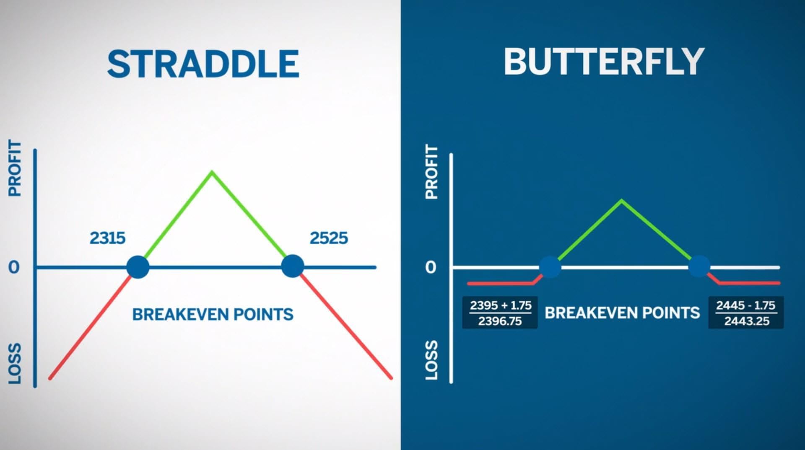

In the world of options trading, numerous strategies are available for traders aiming to capitalize on fluctuations in market conditions. One such strategy is the butterfly spread, which stands out due to its potential for delivering considerable returns while maintaining a bounded risk profile. By employing combinations of call or put options with different strike prices but identical expiration dates, traders can structure a butterfly spread to benefit predominantly from minimal movements in the underlying asset's price.

In recent years, the landscape of options trading has been notably altered by the advent of algorithmic trading technologies. The integration of algorithms not only streamlines the execution of butterfly spread strategies but also enhances the precision and efficiency with which these strategies are applied. Algorithmic trading allows the automation of complex trading strategies, optimizing for conditions that a human trader might find challenging to monitor continuously. This technological enhancement is pivotal, as it minimizes the potential for human error and ensures that trading strategies can adapt swiftly to market changes.



This article investigates into the intricacies of butterfly spread strategies while emphasizing the transformative role of algorithmic trading. It aims to elucidate how traders can effectively leverage these innovative techniques to achieve successful outcomes in options trading. Whether you are a novice beginning to explore the vast landscape of options or a seasoned trader seeking to refine your approach, an understanding of this sophisticated strategy can significantly enrich your trading toolkit. As technology continues to evolve at a rapid pace, staying informed about and adaptable to these advancements is crucial for any trader looking to succeed in contemporary financial markets.

## Table of Contents

## Understanding the Butterfly Spread Strategy

The butterfly spread is a distinctive options trading strategy that utilizes a combination of multiple call or put options. The construction of a butterfly spread involves three different strike prices within the same expiration date, establishing two distinct spreads: the lower and upper wings flanking a middle strike price. 

Typically, the strategy is set up by purchasing one option at the lower strike price, selling two options at the middle strike price, and purchasing one option at the higher strike price. This creates a position that profits if the underlying asset's price remains near the middle strike price at expiration. The goal is to capture the potential convergence of market prices with the middle strike while minimizing cost.

For example, consider setting up a butterfly spread using call options:
1. Buy one call option at a lower strike price $K_1$.
2. Sell two call options at a middle strike price $K_2$.
3. Buy one call option at a higher strike price $K_3$.

The net cost or premium paid is the difference between the cost of the purchased options and the received premiums from the sold options. The potential maximum profit is the difference between the middle and lower strike prices minus the net premium paid, realized if the underlying asset closes exactly at the middle strike price $K_2$ at expiration.

Mathematically, the maximum profit $P_{\text{max}}$ can be calculated as:

$$
P_{\text{max}} = K_2 - K_1 - \text{Net Premium Paid}
$$

The strategy is most effective in low-[volatility](/wiki/volatility-trading-strategies) markets where the underlying asset is expected to remain stable around the middle strike price. Under such conditions, the price fluctuations are minimal, enhancing the likelihood of realizing the maximum profit as the options near expiration.

Market conditions appropriate for a butterfly spread include situations where significant movements in the underlying asset are unlikely, such as during periods of economic stability or when an asset has a historically stable price range. Understanding volatility trends and having a clear forecast of minimal price variation is crucial before implementing this strategy.

In summary, the butterfly spread offers a calculated approach to exploiting low volatility in options trading, requiring a precise alignment of market conditions and careful construction for optimal effectiveness.

## Benefits and Risks of Butterfly Spreads

Butterfly spreads are a popular options trading strategy due to their capacity to limit risk while offering the potential for favorable reward-to-risk ratios. A butterfly spread typically involves buying and selling options across three different strike prices but with the same expiration date. This strategy can be structured using either call or put options and is designed to profit when the underlying asset's price remains near the middle strike price at expiry.

**Advantages of Butterfly Spreads:**

1. **Limited Risk Exposure:** One of the primary attractions of the butterfly spread is the bounded risk profile it offers. The maximum loss is typically limited to the initial net premium paid for setting up the spread. This is advantageous compared to other strategies where potential losses can be indefinite.

2. **Potential for High Reward-to-Risk Ratios:** If the underlying asset's price settles near the middle strike price at expiration, the potential returns can be significant relative to the capped risk. This is particularly beneficial when traders correctly anticipate a narrow trading range for the asset.

3. **Ideal for Low Volatility Markets:** Butterfly spreads are optimally suited for markets characterized by low volatility. When price movements are minimal, the likelihood that the asset's price will settle near the middle strike increases, thus enhancing the chances of profitability.

**Risks of Butterfly Spreads:**

1. **Limited Profit Potential:** The profit from a butterfly spread is capped, as the maximum potential gain occurs when the underlying asset's price is exactly at the middle strike price upon expiration. If the price moves significantly in either direction, the profitability diminishes as the strategy becomes less effective.

2. **Market Condition Sensitivity:** The effectiveness of a butterfly spread is heavily reliant on accurate forecasting of market conditions. Any significant deviation from expected price stability can result in suboptimal returns or a total loss of the premium paid.

3. **Complex Setup and Management:** While the strategy itself may appear straightforward, constructing and managing butterfly spreads requires precision and an understanding of option pricing dynamics. Incorrect setup or mismanagement during the lifecycle of the trade can erode potential advantages.

**Considerations for Traders:**

Before executing a butterfly spread, traders should perform a detailed analysis of the underlying asset, anticipate low volatility scenarios, and remain vigilant about transaction costs, which can impact the overall profitability of the strategy. Additionally, understanding the Greeks, particularly delta and theta, can provide valuable insights into how the position may change in response to price movements and time decay.

By considering these factors, traders can better navigate the benefits and risks associated with butterfly spreads and potentially capitalize on their strategic advantages.

## Algorithmic Trading and Butterfly Spreads

Algorithmic trading, commonly referred to as algo trading, utilizes computer algorithms to execute trades with a predetermined set of rules. These algorithms can process vast amounts of data, identify trading opportunities, and execute trades at speeds far beyond human capability. When applied to butterfly spread strategies in options trading, [algorithmic trading](/wiki/algorithmic-trading) offers numerous advantages that can lead to enhanced profitability and efficiency.

Butterfly spread strategies involve the simultaneous purchase and sale of options with three different strike prices but the same expiration date. The goal is to capitalize on minimal price movement of the underlying asset, with maximum profits achieved when the asset's price at expiration is close to the middle strike price of the options. However, manually executing butterfly spreads can be complex, requiring precise timing and an ability to react swiftly to market changes.

Algorithms come into play by automating this complex process. They are capable of scanning the market for suitable conditions to establish a butterfly spread as defined by the trader's strategy and criteria. For example, an algorithm might be programmed to execute a butterfly spread when the implied volatility of the underlying asset reaches a specific threshold or when the asset's price nears a predefined level relative to the strike prices.

By leveraging algorithms, traders can enhance precision as these programs execute trades at the most opportune moments based on real-time data analysis, without the lag associated with human decision-making. This capability is crucial in options trading, where market conditions can shift rapidly. The algorithms ensure that trades are placed with millisecond precision, reducing the risk of slippage and other inefficiencies.

Moreover, integrating algorithms into butterfly spread strategies imposes discipline on the trading process. Human traders can often be swayed by emotions or biases, leading to inconsistent decision-making. Algorithms, on the other hand, adhere strictly to the specified rules, ensuring that trades are executed with consistency and logic. This discipline can be particularly advantageous in volatile markets, where sticking to a predefined strategy can prevent rash decisions.

The reduction of human error is another significant benefit of utilizing algorithmic strategies. Manual trading is susceptible to errors such as incorrect order entry or misinterpretation of market signals. These mistakes can be costly, especially in options trading where precision is paramount. Algorithms, being systematic and consistent, significantly mitigate this risk by executing trades according to a strict set of programmed instructions.

In conclusion, the integration of algorithmic trading with butterfly spread strategies marks a significant advancement in options trading. Through automation, it enhances efficiency, precision, discipline, and reduces human error, thereby reshaping the execution of these strategies to yield potentially more consistent and profitable outcomes in various market conditions.

## Real-World Applications and Case Studies

In recent years, the integration of algorithmic trading with butterfly spread strategies has proven effective in various financial markets. The following case studies highlight the successful application of this innovative combination, providing insight into both its potential and complexities.

### Case Study 1: Equity Options Market

In the equity options market, a notable application of the butterfly spread strategy was observed with a major trading firm utilizing algorithmic trading to optimize their approach. The firm implemented automated systems to execute butterfly spreads on large-cap stocks, taking advantage of low volatility periods. By setting predefined criteria, the algorithms could swiftly react to market conditions, adjusting positions in real-time to maintain optimal strike price alignments. This minimized human error and allowed the traders to focus on strategic decisions, ultimately resulting in improved profit margins and reduced risk.

Automated scripts used in this setting incorporated Python libraries such as `QuantLib` and `Pandas` to handle option pricing and data analysis respectively. The algorithms continuously scanned market data for opportunities that matched the firm's risk tolerance and strategic goals, showcasing the adaptability of technology-enhanced strategies.

### Case Study 2: Forex Options Trading

In the foreign exchange market, a proprietary trading firm employed algorithmic execution for butterfly spreads on currency pairs. The firm faced the challenge of high-frequency data fluctuations but utilized algorithms to identify stable trading periods where the currency pairs displayed minimal volatility. The algorithms took advantage of short-term price movements, capturing small profits with controlled risk parameters.

Through the use of [machine learning](/wiki/machine-learning) models, the firm enhanced the predictive power of their algorithms, allowing for better anticipation of low-volatility windows. By employing techniques such as decision tree classifiers, the algorithms improved their accuracy in executing trades, further demonstrating the effectiveness of integrating advanced computational methods with traditional trading strategies.

### Case Study 3: Commodity Markets

In the commodity markets, a [hedge fund](/wiki/hedge-fund-trading-strategies) effectively employed butterfly spreads on options for agricultural products. Here, algorithmic trading helped navigate the unique volatility exhibits by seasonal crops. The hedge fund utilized statistical models to predict periods of price stability within the growing season and executed butterfly spreads accordingly.

The use of Python's `Scikit-learn` library enabled the creation of predictive models that took historical price data and weather patterns into account. This facilitated precise timing in the execution of butterfly spreads, leading to advantageous entry and [exit](/wiki/exit-strategy) points that leveraged predicted low-volatility phases.

### Insights and Analysis

The real-world applications outlined above underscore the strategic benefits and challenges of using algorithm-enhanced butterfly spreads. Key takeaways include the necessity for robust data analysis tools, the importance of adaptable algorithms to respond dynamically to market shifts, and the value of integrating machine learning models to enhance predictive accuracy.

These case studies illustrate how traders can craft more robust trading strategies by leveraging technology to automate and enhance traditional approaches. The adaptability and precision offered by algorithmic trading make it a powerful ally in executing butterfly spreads across diverse market conditions, allowing traders to unlock new opportunities while effectively managing risk.

## Best Practices and Tips for Traders

Aspiring traders looking to integrate butterfly spreads into their portfolios can significantly enhance their probability of success by adhering to several best practices. 

Firstly, performing a thorough analysis is pivotal. This starts with comprehensively understanding the current market conditions. Traders should analyze historical price patterns, implied volatility, and other key financial indicators. By leveraging technical analysis tools, traders can better predict whether the market is likely to stay within a range suitable for butterfly spreads. 

It is also essential to continuously refine trading algorithms. Given the rapid pace of technological advancement, traders should routinely evaluate and optimize their algorithms to ensure they effectively respond to changing market conditions. This may involve [backtesting](/wiki/backtesting) strategies using historical data to validate their profitability and make necessary adjustments. For instance, ensuring that algos efficiently analyze the Greeks (Delta, Gamma, Theta, Vega) can provide insights into how changes in market conditions affect the butterfly spread.

A sample Python snippet for backtesting a butterfly spread strategy could look like this:

```python
import numpy as np

def backtest_butterfly_spread(prices, strike_prices, expiration_days):
    # Simulate option values at expiration based on historical prices
    payoffs = [(max(0, prices[-1] - strike_prices[1]) - 
                max(0, prices[-1] - strike_prices[0]) - 
                max(0, prices[-1] - strike_prices[2])) for price in prices]

    # Calculate the average payoff
    average_payoff = np.mean(payoffs)
    return average_payoff

prices = [100, 102, 98, 101, 104]  # example historical prices
strikes = [100, 105, 110] # example strike prices for Long Call Butterfly
expiration_days = 30

expected_payoff = backtest_butterfly_spread(prices, strikes, expiration_days)
print(f"Expected Payoff: {expected_payoff}")
```

Risk management remains a crucial component of a successful options trading strategy. Proper sizing of trades is essential to ensure the potential loss from a single position does not significantly affect the trader’s overall portfolio. Employing stop-loss orders and hedging techniques can also help protect against unexpected market movements. Traders should familiarize themselves with calculating the maximum risk and reward of their butterfly spread positions.

Finally, aspiring traders should maintain a discipline of continuous learning. The financial markets and technological solutions for trading are constantly evolving. Subscribing to financial reports, attending webinars, and participating in trading forums can provide traders with up-to-date knowledge and innovative strategies.

By implementing these practices, traders can maximize the efficacy of butterfly spreads and algorithmic trading tools, enhancing their overall success rate in options trading.

## Conclusion

The butterfly spread is a sophisticated options trading strategy offering unique benefits, particularly when combined with algorithmic trading. This combination of strategy and technology allows traders to exploit market inefficiencies with greater precision and efficiency. The inherent structure of the butterfly spread, characterized by its limited risk and potential for high reward-to-risk ratios, makes it an attractive option for traders aiming to achieve consistent returns.

Algorithmic trading enhances this process by automating the execution of trades based on predefined conditions. This not only reduces the likelihood of human error but also improves the execution speed and accuracy, thereby optimizing the overall strategy. For instance, algorithms can rapidly identify and respond to opportunities for butterfly spreads based on real-time market data, adjusting positions to maximize profitability while minimizing risk.

As technology continues to innovate the financial market space, understanding and leveraging these advancements are crucial for traders. Staying informed and comfortable with such strategies ensures traders remain competitive and can adeptly respond to evolving market dynamics. Ultimately, the integration of algo trading with traditional strategies like the butterfly spread equips traders with a more robust and adaptive toolkit.

The advancement of trading technology represents a critical juncture for the future of options trading. Traders who embrace algorithmic tools and methodologies are better positioned to capitalize on market movements, thus reinforcing the importance of adaptability in a continuously evolving landscape. As the financial world progresses, those who blend classic trading strategies with modern technology are likely to achieve substantial success.

## References & Further Reading

[1]: ["Option Volatility & Pricing: Advanced Trading Strategies and Techniques"](https://www.amazon.com/Option-Volatility-Pricing-Strategies-Techniques/dp/0071818774) by Sheldon Natenberg

[2]: ["Options, Futures, and Other Derivatives"](https://www.pearson.com/en-us/subject-catalog/p/options-futures-and-other-derivatives/P200000005938/9780136939917) by John C. Hull

[3]: Avellaneda, M., & Stoikov, S. (2008). ["High-Frequency Trading in a Limit Order Book"](https://math.nyu.edu/~avellane/HighFrequencyTrading.pdf). Quantitative Finance, 8(3), 217-224.

[4]: ["Algorithmic Trading: Winning Strategies and Their Rationale"](https://www.wiley.com/en-us/Algorithmic+Trading%3A+Winning+Strategies+and+Their+Rationale-p-9781118460146) by Ernie Chan

[5]: Chan, E. (2009). ["Quantitative Trading: How to Build Your Own Algorithmic Trading Business"](https://github.com/ftvision/quant_trading_echan_book)