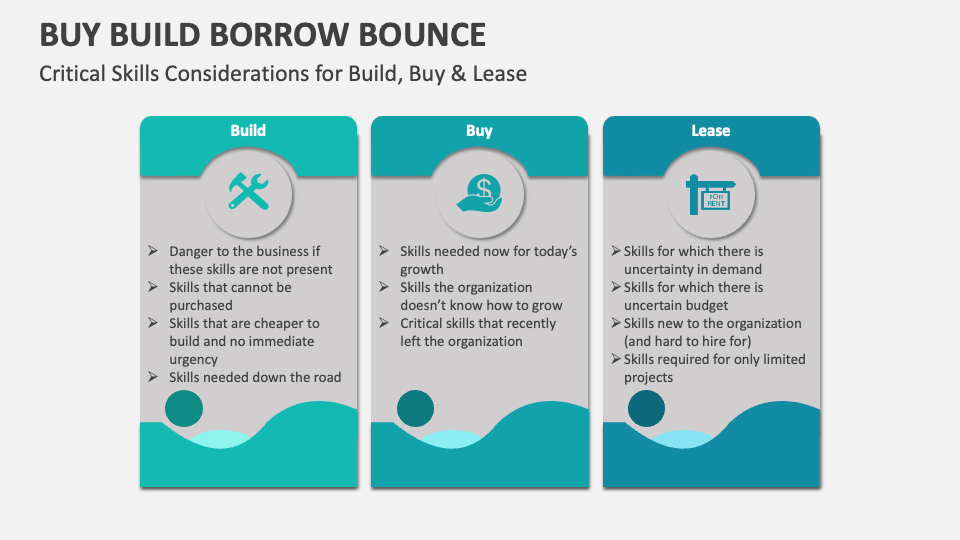

## Table of Contents

## What is the basic concept of 'Buy a Bounce'?

The basic concept of 'Buy a Bounce' is a trading strategy where you buy a stock or asset after its price has dropped, expecting it to rise again. Imagine a ball that you throw down; it hits the ground and then bounces back up. In trading, when the price of a stock goes down, traders think it might go back up soon. So, they buy it at the lower price, hoping to sell it later at a higher price.

This strategy is often used when traders believe the drop in price is temporary. They might see the drop as an overreaction to some news or event, and they think the stock's value will recover. It's like catching a good deal during a sale, but instead of buying clothes, you're buying stocks. The key is to predict correctly when the price will bounce back, which can be tricky and involves understanding market trends and news.

## How does 'Buy a Bounce' differ from other trading strategies?

'Buy a Bounce' is different from other trading strategies because it focuses on buying a stock right after its price has fallen, expecting it to rise again soon. Other strategies might involve buying stocks that are steadily going up, or selling stocks that are going down. With 'Buy a Bounce,' the trader is trying to take advantage of what they see as a temporary dip in the stock's price. They believe the stock is still good and will go back up, so they buy it when it's cheaper.

Another way 'Buy a Bounce' differs is in the timing and risk involved. Strategies like 'Buy and Hold' involve keeping a stock for a long time, hoping it grows over years. 'Buy a Bounce' is more about quick moves, trying to make money from short-term changes in price. It can be riskier because if the stock doesn't bounce back, the trader could lose money. Other strategies might be less risky but could also take longer to see profits.

## What are the key indicators to look for when planning to 'Buy a Bounce'?

When planning to 'Buy a Bounce,' one of the key indicators to look for is a clear reason for the price drop. This could be a piece of bad news or a market event that caused the stock's price to fall suddenly. You want to make sure the drop seems like an overreaction and that the company's fundamentals are still strong. For example, if a company reports lower earnings than expected but still has good long-term prospects, that might be a good time to buy.

Another important thing to watch is the stock's trading [volume](/wiki/volume-trading-strategy). If the price drops with a lot of trading activity, it might mean many people are selling off their shares. But if the volume is low, it could be a smaller dip, and the stock might bounce back quicker. Also, keep an eye on technical indicators like the Relative Strength Index (RSI). If the RSI shows the stock is oversold, it could be a sign that the price might go back up soon.

## Can you explain the mechanism behind 'Buy a Bounce' in simple terms?

The 'Buy a Bounce' strategy is like waiting for a ball to hit the ground and then bounce back up. When a stock's price goes down because of some news or event, traders using this strategy believe it will go back up soon. They buy the stock when it's cheaper, hoping to sell it later at a higher price. It's like finding a good deal at a store; you buy something when it's on sale, expecting its value to go back up.

The key to 'Buy a Bounce' is to figure out if the price drop is just temporary. Traders look for signs that the stock is still good and that the drop was an overreaction. They might check if the company is still doing well overall or if the trading volume was low when the price fell. If everything looks okay, they buy the stock, expecting it to bounce back to its higher price soon.

## What are the common entry and exit points in a 'Buy a Bounce' strategy?

In a 'Buy a Bounce' strategy, the common entry point is right after the stock's price has dropped. Traders look for a clear reason for the drop, like bad news or a market event, and they want to make sure it seems like an overreaction. They also check if the stock's fundamentals are still strong and if the trading volume was low during the drop. If everything looks good, they buy the stock when it's at a lower price, hoping to catch it before it starts to go back up.

The common [exit](/wiki/exit-strategy) point for a 'Buy a Bounce' strategy is when the stock's price starts to rise again and reaches a level where the trader thinks it's a good time to sell. This could be when the price gets back to what it was before the drop or when it hits a certain target that the trader set. The goal is to sell the stock at a higher price than what they bought it for, making a profit from the bounce back.

## How do market trends affect the success of a 'Buy a Bounce' strategy?

Market trends can really change how well a 'Buy a Bounce' strategy works. If the overall market is going up, it's more likely that a stock will bounce back after a drop. People are more confident and ready to buy, so the stock's price can recover quickly. But if the market is going down, it's harder for a stock to bounce back. More people might be selling their stocks, which can keep the price low and make it harder for the 'Buy a Bounce' strategy to work.

It's also important to watch for big trends in the market, like if everyone is moving away from a certain type of stock or if there's a lot of uncertainty because of big news. These trends can make it riskier to use a 'Buy a Bounce' strategy because the stock might not bounce back as expected. Traders need to keep an eye on these market trends and be ready to change their plans if the market doesn't look good for a bounce back.

## What are the risks associated with 'Buy a Bounce', and how can they be mitigated?

One of the biggest risks with 'Buy a Bounce' is that the stock might not bounce back like you expect. If the price keeps going down instead of going up, you could lose money. Another risk is timing. It can be hard to know the perfect time to buy and sell. If you buy too early or sell too late, you might not make as much profit or could even lose money. Also, if the market is going down, it can be harder for the stock to bounce back, making your strategy less likely to work.

To lower these risks, it's important to do your homework. Look at why the stock's price dropped and make sure it's a good company that can recover. Watch the trading volume and use tools like the Relative Strength Index (RSI) to see if the stock is oversold. It can also help to set clear goals for when you'll sell the stock, so you don't wait too long and lose money. Keeping an eye on market trends can also help you decide if it's a good time to use the 'Buy a Bounce' strategy or if you should wait for a better opportunity.

## Can you provide a real-world example of a successful 'Buy a Bounce' trade?

Imagine a company called TechGrow that makes smartphones. One day, TechGrow's stock price drops a lot because of a rumor that their new phone has a big problem. But after checking, it turns out the rumor was wrong and the phone is actually good. A trader using the 'Buy a Bounce' strategy sees this and thinks the price drop was just a mistake. So, they buy TechGrow's stock when it's cheap, right after the price dropped.

A few days later, TechGrow clears up the rumor and the stock price starts to go back up. The trader who bought the stock when it was low sells it now that the price is higher. They made a profit because they bought the stock during the dip and sold it when it bounced back. This is a good example of how the 'Buy a Bounce' strategy can work when the trader picks the right time to buy and sell.

## How do technical analysis tools enhance the 'Buy a Bounce' strategy?

Technical analysis tools help traders using the 'Buy a Bounce' strategy by giving them more information about when to buy and sell a stock. One important tool is the Relative Strength Index (RSI). The RSI shows if a stock is overbought or oversold. If the RSI is low, it means the stock might be oversold, which could be a good time to buy because the price might go back up soon. Another tool is the moving average, which helps traders see the general direction of the stock's price. If the price drops below the moving average but then starts to go back up, it could be a sign that the stock is about to bounce back.

These tools can also help traders decide when to sell the stock after it bounces back. For example, if the stock's price goes above a certain moving average after a drop, it might be a good time to sell and take a profit. Technical analysis tools give traders more clues about what the stock might do next, making it easier to pick the right times to buy and sell. By using these tools, traders can feel more confident in their 'Buy a Bounce' strategy and hopefully make better trades.

## What are the psychological factors traders need to consider when using 'Buy a Bounce'?

When using the 'Buy a Bounce' strategy, traders need to think about their own feelings and emotions. It can be scary to buy a stock when its price just dropped. You might worry that the price will keep going down and you'll lose money. This fear can make it hard to stick with your plan. It's important to stay calm and trust the research you did before buying the stock. If you let your emotions take over, you might miss out on a good chance to make money.

Another big part of 'Buy a Bounce' is knowing when to sell the stock. It can be tough to decide when to sell, especially if the price starts going up. You might feel greedy and want to wait for the price to go even higher, but if you wait too long, the price could drop again. On the other hand, if you sell too soon, you might not make as much profit as you could have. It's important to have a clear plan for when to sell and stick to it, even if your feelings are telling you to do something different.

## How can advanced traders optimize their 'Buy a Bounce' strategy using algorithmic trading?

Advanced traders can use algorithmic trading to make their 'Buy a Bounce' strategy work better. They can write computer programs that look at lots of data really fast, like stock prices, trading volumes, and technical indicators. These programs can find the best times to buy a stock after it drops, using rules set by the trader. For example, the program might be told to buy a stock if its price drops a lot but the RSI shows it's oversold. This can help traders buy at the right time without letting their feelings get in the way.

Once the stock starts to go back up, the algorithm can also help decide when to sell. The program can watch the stock's price and sell it when it reaches a certain level or when other signs show it's time to get out. This can help traders make more money because the computer can act faster and stick to the plan better than a person might. By using algorithms, advanced traders can make their 'Buy a Bounce' strategy more accurate and less risky.

## What are some expert-level adjustments to the 'Buy a Bounce' strategy that can be made based on different market conditions?

Expert traders can adjust their 'Buy a Bounce' strategy depending on what's happening in the market. If the market is going up and everyone is feeling good about buying stocks, traders might be more willing to buy a stock right after it drops. They might set their buying point a bit higher because they know the stock is more likely to bounce back quickly. But if the market is going down and people are worried, traders might wait for a bigger drop before buying. They might also use more strict rules for selling, like selling the stock as soon as it goes up a little, to make sure they don't lose money if the market keeps going down.

Another way to adjust the strategy is by looking at different types of stocks. If a stock is in a sector that's doing really well, like technology during a tech boom, traders might be more confident in buying a bounce. They might also hold onto the stock longer, waiting for a bigger bounce. But if the stock is in a sector that's struggling, like energy during a downturn, traders might be more careful. They might buy less of the stock and sell it as soon as it starts to go up, to avoid the risk of the stock not bouncing back at all. By changing their approach based on market conditions and the type of stock, expert traders can make their 'Buy a Bounce' strategy work better.

## What are the underlying mechanics and how can we understand them?

In contemporary trading strategies like "Buy a Bounce," technical analysis is crucial for predicting price rebounds by identifying key support levels. Support levels represent price points where a security tends to stop falling and potentially reverses direction as buying interest increases. Accurately identifying these levels allows traders to make informed decisions about when to purchase.

Two widely used envelope channels, Bollinger Bands and Donchian Channels, aid in pinpointing buy signals. Bollinger Bands consist of a moving average along with upper and lower bands set at standard deviations above and below this average. The formula for the Bollinger Bands' positions is given by:

$$
\text{Upper Band} = \text{MA}(n) + k \cdot \sigma
$$
$$
\text{Lower Band} = \text{MA}(n) - k \cdot \sigma
$$

where $\text{MA}(n)$ is the moving average over $n$ periods, $\sigma$ is the standard deviation, and $k$ is a predetermined multiplier, typically set to 2.

Donchian Channels, on the other hand, set the bands using high and low price points over a set period, usually used to highlight price extremes. The formulas for Donchian Channels are:

$$
\text{Upper Band} = \max ( \text{Price}_{\text{high}}(n) )
$$
$$
\text{Lower Band} = \min ( \text{Price}_{\text{low}}(n) )
$$

These channels help traders spot potential price bounces by illuminating points where the asset's price is statistically stretched, often coinciding with support levels. When a security touches the lower Bollinger Band or the lower Donchian Channel, it indicates a potential buying opportunity.

The "Buy a Bounce" strategy fundamentally depends on consistent trading between defined support and resistance levels. Resistance levels are the opposite of support, where prices often halt their upward movement. The trading logic underscores purchasing at support and selling at resistance. By following these levels, traders aim to capitalize on predictable price patterns.

Engaging with this strategy necessitates precise monitoring, as traders need to act quickly upon observing price interactions with these bands. Mathematical models and [algorithmic trading](/wiki/algorithmic-trading) can enhance this strategy's efficiency by providing tools for better automation and execution, enabling traders to avoid emotional pitfalls and focus on statistical probabilities.

## What are Technical Indicators and Tools?

Enveloped channels, such as Bollinger Bands, play a pivotal role in the 'Buy a Bounce' trading strategy by helping traders evaluate price movements in relation to support lines. Bollinger Bands, developed by John Bollinger in the 1980s, consist of a central moving average surrounded by two standard deviation lines that form an envelope around price data. This arrangement allows traders to visualize price [volatility](/wiki/volatility-trading-strategies) and potential entry points when securities hit support levels.

The Bollinger Bands are calculated as follows:

- The middle band is a simple moving average (SMA) of the price, typically over 20 periods.
- The upper and lower bands are plotted as two standard deviations away from the SMA.

Mathematically, the bands can be expressed as:

$$
\text{Upper Band} = \text{SMA}_{20} + 2 \times \sigma
$$

$$
\text{Lower Band} = \text{SMA}_{20} - 2 \times \sigma
$$

where $\sigma$ represents the standard deviation of the asset's price over the same period.

By analyzing these bands, traders can observe when prices are at levels that may suggest a bounce, especially as they approach the lower band. This points to potential buying opportunities in adherence with the 'Buy a Bounce' strategy.

Another useful tool is the Donchian Channels, which utilize the highest high and the lowest low over a selected period to define upper and lower bands. These are particularly useful for identifying [breakout](/wiki/breakout-trading) points and for maintaining positions between support and resistance levels. The calculation for Donchian Channels is simpler:

- The upper band is the highest price over a chosen period, often 20 days.
- The lower band is the lowest price over that same period.

This method allows traders to establish whether a security is trading at an extreme, indicating an impending reversal.

Employing these technical tools effectively enhances risk management and strategic planning. By confirming potential bounces before entering a trade, traders can better anticipate market movements and capitalize on profitable opportunities. Additionally, understanding these indicators helps reduce the risks posed by sudden market shifts, presenting clearer buy signals amid market noise.

Implementing such strategies often requires integrating them into algorithmic trading systems for optimal execution. Through programming language tools like Python, traders can automate the monitoring of enveloped channels, ensuring swift reaction to potential bounces. An example of a simple Bollinger Bands plot using Python and the Matplotlib library is as follows:

```python
import matplotlib.pyplot as plt
import pandas as pd

# Assume 'data' is a DataFrame containing the stock prices with a column 'Close'
data['SMA_20'] = data['Close'].rolling(window=20).mean()
data['Upper_Band'] = data['SMA_20'] + (data['Close'].rolling(window=20).std() * 2)
data['Lower_Band'] = data['SMA_20'] - (data['Close'].rolling(window=20).std() * 2)

plt.figure(figsize=(12,6))
plt.plot(data['Close'], label='Close Price')
plt.plot(data['SMA_20'], label='20-Day SMA', linestyle='--')
plt.plot(data['Upper_Band'], label='Upper Band', linestyle='--')
plt.plot(data['Lower_Band'], label='Lower Band', linestyle='--')
plt.fill_between(data.index, data['Lower_Band'], data['Upper_Band'], color='grey', alpha=0.1)
plt.title('Bollinger Bands')
plt.legend()
plt.show()
```

This graphical representation aids in spotting when prices are approaching the support level, helping traders make informed decisions aligned with the 'Buy a Bounce' strategy.

## References & Further Reading

[1]: Bergstra, J., Bardenet, R., Bengio, Y., & Kégl, B. (2011). ["Algorithms for Hyper-Parameter Optimization."](https://dl.acm.org/doi/10.5555/2986459.2986743) Advances in Neural Information Processing Systems 24.

[2]: ["Advances in Financial Machine Learning"](https://www.amazon.com/Advances-Financial-Machine-Learning-Marcos/dp/1119482089) by Marcos Lopez de Prado

[3]: ["Evidence-Based Technical Analysis: Applying the Scientific Method and Statistical Inference to Trading Signals"](https://www.amazon.com/Evidence-Based-Technical-Analysis-Scientific-Statistical/dp/0470008741) by David Aronson

[4]: ["Machine Learning for Algorithmic Trading"](https://github.com/stefan-jansen/machine-learning-for-trading) by Stefan Jansen

[5]: ["Quantitative Trading: How to Build Your Own Algorithmic Trading Business"](https://www.amazon.com/Quantitative-Trading-Build-Algorithmic-Business/dp/1119800064) by Ernest P. Chan