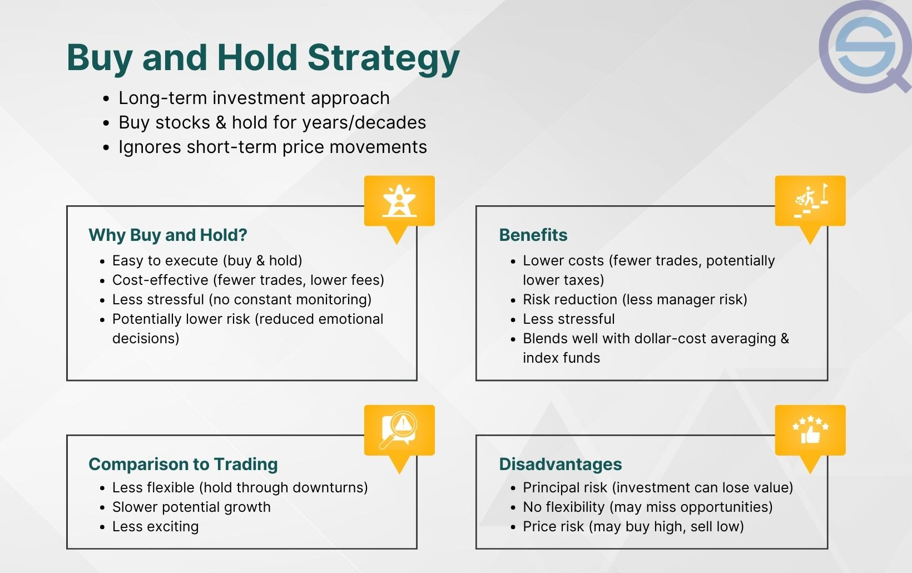

## Table of Contents

## What is the Buy and Hold investment strategy?

The Buy and Hold investment strategy is a simple approach where you buy stocks or other investments and keep them for a long time. Instead of trying to buy and sell quickly to make money, you believe that over many years, the value of your investments will grow. This strategy is popular because it doesn't need you to watch the market every day or make many decisions. It's based on the idea that, over time, the economy and good companies will grow, making your investments worth more.

One big advantage of the Buy and Hold strategy is that it's easy to follow. You don't need to be an expert in the stock market or spend a lot of time researching. Once you choose your investments, you can mostly leave them alone and let them grow. However, this strategy also has risks. If you pick the wrong investments, you might lose money, especially if you hold onto them for too long hoping they will recover. It's important to pick quality investments and be patient, understanding that markets can go up and down but tend to increase over the long term.

## How does the Buy and Hold strategy differ from active trading?

The Buy and Hold strategy and active trading are two different ways to invest in the stock market. Buy and Hold is about buying investments and keeping them for a long time, often many years. You believe that over time, your investments will grow in value. This strategy doesn't require you to watch the market every day or make quick decisions. It's simpler and needs less work, but you need to be patient and pick good investments that you believe in for the long haul.

On the other hand, active trading is about buying and selling investments more often, trying to make money from short-term changes in the market. Active traders watch the market closely and make decisions quickly, hoping to buy low and sell high in a short time. This approach can be more exciting and potentially more profitable in the short term, but it also involves more risk and requires more time and knowledge about the market. Active trading is harder work and can be stressful, but some people enjoy the challenge and the potential for quick gains.

In summary, Buy and Hold is a long-term, patient approach that's easier to manage, while active trading is a short-term, more hands-on strategy that requires constant attention and skill. Both strategies have their pros and cons, and the best choice depends on your goals, how much time you can spend, and how much risk you're willing to take.

## What are the key benefits of adopting a Buy and Hold strategy?

One key benefit of the Buy and Hold strategy is its simplicity. You don't need to spend a lot of time watching the stock market every day or making quick decisions. Once you pick your investments, you can mostly leave them alone and let them grow over time. This makes it a good choice if you don't want to spend a lot of time managing your investments. It also means you don't need to be an expert in the stock market to use this strategy.

Another benefit is that it can lead to good results over the long term. The Buy and Hold strategy is based on the idea that the economy and good companies will grow over time, which means your investments will likely increase in value. By holding onto your investments for many years, you can ride out the ups and downs of the market and benefit from long-term growth. This approach can be less stressful than trying to time the market and can help you build wealth over time.

## What types of investments are best suited for a Buy and Hold approach?

The best types of investments for a Buy and Hold approach are often stocks in solid, well-established companies. These are companies that have a history of steady growth and are likely to continue growing over time. Examples might include large tech companies like Apple or Microsoft, or well-known consumer goods companies like Procter & Gamble. These companies are less likely to have big ups and downs in their stock prices and are more likely to increase in value over the long term. By holding onto these stocks for many years, you can benefit from their steady growth and the overall growth of the economy.

Another good choice for Buy and Hold investors are index funds or ETFs that track a broad market index like the S&P 500. These funds give you a piece of a large number of companies, spreading out your risk. Over time, the stock market as a whole tends to go up, so by holding onto an index fund, you can ride this long-term growth. Index funds are also easy to manage because you don't have to pick individual stocks, making them a simple and effective choice for a Buy and Hold strategy.

## How long should one typically hold investments in a Buy and Hold strategy?

In a Buy and Hold strategy, you should usually plan to keep your investments for a long time, like many years or even decades. This long-term approach works because it gives your investments time to grow and recover from any short-term drops in value. It's based on the idea that the economy and good companies will get bigger over time, which means your investments should be worth more in the future.

How long you hold your investments can depend on your goals. If you're saving for something far away, like retirement, you might hold your investments for 20, 30, or even more years. But if you're saving for something sooner, like buying a house in 5 or 10 years, you might still use a Buy and Hold strategy but for a shorter time. The key is to be patient and not to sell your investments just because the market goes down for a little while.

## What are the potential risks and drawbacks of the Buy and Hold strategy?

One risk of the Buy and Hold strategy is that if you pick the wrong investments, you might lose money. If a company you invest in does badly or goes out of business, holding onto its stock for a long time won't help. It's important to pick good, strong companies to invest in. Another risk is that the stock market can have big drops, and if you need to take your money out during a downturn, you could lose a lot. You need to be ready to wait out these bad times and not panic.

A drawback of the Buy and Hold strategy is that it might not be the best way to make money quickly. If you want to see big gains in a short time, this strategy might not work for you. It's all about being patient and waiting for your investments to grow over many years. Also, sticking to the same investments for a long time means you might miss out on other good opportunities that come up. You need to be okay with not always having the newest or most exciting investments.

## How can one build a diversified portfolio using the Buy and Hold method?

To build a diversified portfolio using the Buy and Hold method, you should spread your money across different types of investments. This means buying stocks from different industries, like technology, healthcare, and consumer goods. It also means you might want to include other types of investments, like bonds or real estate investment trusts (REITs). By having a mix of investments, you reduce the risk that one bad investment will hurt your whole portfolio. For example, if the tech industry has a bad year, your healthcare stocks might still do well, helping to balance things out.

Once you have your mix of investments, the Buy and Hold strategy means you keep them for a long time. You don't need to check on them every day or make quick changes. Instead, you believe that over many years, your diverse set of investments will grow in value. This approach can help you build wealth slowly but steadily. To start, you might want to look into index funds or ETFs that track a broad market, like the S&P 500, because they automatically give you a piece of many different companies and industries.

## What role does dollar-cost averaging play in a Buy and Hold strategy?

Dollar-cost averaging is a smart way to invest money over time, and it fits well with the Buy and Hold strategy. Instead of putting all your money into the market at once, you invest a fixed amount of money at regular times, like every month. This means you buy more shares when prices are low and fewer shares when prices are high. It's like smoothing out the ups and downs of the market. By using dollar-cost averaging, you don't have to worry about trying to guess the best time to buy. You just keep investing the same amount, no matter what the market is doing.

This approach works well with Buy and Hold because it helps you build your investments slowly over many years. Since you're buying regularly, you're spreading out your risk and taking advantage of the long-term growth of the market. It's easier to stick to your Buy and Hold plan because you're not putting all your money in at one time. Over time, as you keep adding to your investments, they can grow into a big portfolio. This makes dollar-cost averaging a good friend to the Buy and Hold strategy, helping you invest without stress and build wealth over the long term.

## How should one monitor and rebalance a Buy and Hold portfolio?

Monitoring a Buy and Hold portfolio doesn't mean you need to check it every day. Instead, you should look at it every few months or once a year. When you do check, see if your investments are doing what you expected. Are they growing? Have any companies you invested in had big changes? This helps you make sure your money is still in good places. But remember, the Buy and Hold strategy is about being patient, so don't panic if the market goes down for a little while.

Rebalancing your Buy and Hold portfolio means making sure your money is spread out the way you want it to be. Over time, some of your investments might grow faster than others, so your mix can change. For example, if your tech stocks have done really well, they might now be a bigger part of your portfolio than you planned. To rebalance, you sell some of the investments that have grown a lot and buy more of the ones that haven't done as well. This keeps your portfolio balanced and in line with your long-term plan. You don't need to rebalance often, maybe once a year or every few years, depending on how much things have changed.

## What historical data supports the effectiveness of the Buy and Hold strategy?

Historical data shows that the Buy and Hold strategy can work well over the long term. For example, if you look at the S&P 500, which is a big group of American companies, it has gone up a lot over many years. If you had bought and held the S&P 500 for the last 30 years, your money would have grown a lot. Even with big drops in the market, like in 2008, the S&P 500 has always come back and kept growing. This shows that if you pick good investments and hold them for a long time, they can grow in value.

Another piece of evidence comes from looking at famous investors like Warren Buffett. He is known for using a Buy and Hold strategy. Buffett buys stocks in companies he believes in and keeps them for many years. Over time, his investments have grown a lot. His success shows that if you pick good companies and hold onto them, you can do well in the long run. This is why many people trust the Buy and Hold strategy for building wealth over time.

## How do taxes and transaction costs impact the Buy and Hold approach?

Taxes and transaction costs can make a difference when you use the Buy and Hold approach. With Buy and Hold, you buy investments and keep them for a long time. This means you don't have to pay taxes on your gains until you sell your investments. If you hold your investments for more than a year, you might pay a lower tax rate on your profits, called long-term capital gains tax. This can save you money compared to selling your investments more often and paying regular income tax rates on your gains.

Transaction costs are another thing to think about. These are the fees you pay when you buy or sell investments. With Buy and Hold, you don't buy and sell very often, so you don't pay these fees as much. This can save you money over time because the fewer times you buy or sell, the fewer fees you have to pay. By keeping your investments for a long time, you can keep more of your money working for you instead of paying it out in taxes and fees.

## What advanced techniques can enhance the returns of a Buy and Hold strategy?

One advanced technique to enhance the returns of a Buy and Hold strategy is to use dividend reinvestment. Many companies pay dividends, which are payments to shareholders from the company's profits. Instead of taking these dividends as cash, you can choose to reinvest them by buying more shares of the company. Over time, this can help your investment grow faster because you're adding more shares to your portfolio without spending extra money. It's like compounding your returns, where your money grows not just from the stock price going up, but also from the dividends you reinvest.

Another technique is to use a value investing approach within your Buy and Hold strategy. Value investing means looking for companies that are undervalued, or cheaper than they should be, based on their earnings and other financial measures. By [picking](/wiki/asset-class-picking) these undervalued stocks and holding onto them, you can benefit as the market realizes their true value and the stock price goes up. This can lead to higher returns over the long term. It takes some research to find these good deals, but combining value investing with Buy and Hold can really boost your portfolio's growth.

## What is Understanding Long-Term Investing?

Long-term investing centers on the fundamental principle of holding investment assets over extended periods, typically years or decades, with the aim of capitalizing on enduring market growth and trends. Central to this strategy is the belief in the ability of markets to generate returns in the long run, even amidst short-term volatility. This method counters the more frenetic pace of short-term trading, which often seeks to exploit immediate price movements.

A historical analysis underscores the efficacy of long-term investing over short-term trading. For instance, the U.S. stock market, as represented by the S&P 500 index, has shown an average annual return of around 10% since its inception in the 1920s. This trend illustrates the concept of "mean reversion," where prices eventually return to their long-term average. In contrast, short-term trading can incur significant risks and costs, often exacerbated by unpredictable market fluctuations and psychological biases, such as fear and greed.

One of the primary benefits of long-term investing is stability. By committing to a prolonged investment horizon, investors can ride out periods of market downturns and reduce the impact of [volatility](/wiki/volatility-trading-strategies) on their portfolios. Additionally, long-term investing harnesses the power of compound interest, where earnings from previous periods are reinvested to generate further earnings. The formula for compound interest is given by:

$$
A = P \left(1 + \frac{r}{n}\right)^{nt}
$$

where $A$ is the future value of the investment, $P$ is the principal investment, $r$ is the annual interest rate, $n$ is the number of times interest is compounded per year, and $t$ is the number of years the money is invested for.

Moreover, long-term strategies incur reduced transaction costs. By minimizing the frequency of buying and selling, investors can significantly decrease the costs associated with brokerage fees and taxes. These savings, accumulated over time, contribute to the overall return on investment.

Despite these advantages, long-term investing is not devoid of risks. Market downturns, inflation, and changes in economic policies can impact the value of investments. However, these risks can be mitigated through diversification, which involves spreading investments across different asset classes, industries, and geographic regions to reduce the impact of any single economic event. Diversification can be illustrated by the concept of the correlation coefficient, which measures the degree to which two securities move in relation to each other. By selecting assets with low or negative correlation, investors can reduce the overall portfolio risk.

By adhering to the principles of patience and maintaining discipline amid market turbulence, long-term investors can enhance their potential for success and financial growth over time.

## What is the Buy and Hold Strategy?

The buy-and-hold strategy is a foundational long-term investing approach that involves purchasing financial securities and holding them for an extended period, irrespective of market fluctuations. This strategy is predicated on the belief that, despite short-term volatility, markets tend to rise over time, thereby allowing investors to capitalize on growth.

Historically, the buy-and-hold strategy has proven effective as it harnesses the upward trajectory of markets. By maintaining a long-term perspective, investors can benefit from the appreciation of asset prices, dividends, and compound interest, which can significantly enhance returns. For instance, the S&P 500 index, a benchmark of the U.S. stock market, has averaged an annual return of around 10% before inflation over several decades, highlighting the potential gains from such an approach.

Warren Buffett, CEO of Berkshire Hathaway, epitomizes the success of buy-and-hold investing. Known for his investment acumen, Buffett has consistently championed the strategy, emphasizing the value of investing in fundamentally strong companies and retaining those investments over the long haul. His stake in Coca-Cola, initiated in 1988, is often cited as a prime example of this methodology yielding substantial returns.

The buy-and-hold strategy's advantages are numerous. It simplifies the investment process by reducing the need for constant market analysis and timing, which is notoriously challenging and fraught with uncertainties. This approach allows for compounding growth, a powerful investment concept where earnings on an asset generate their own earnings. A simple mathematical representation of compounding is given by the formula:

$$
A = P \left(1 + \frac{r}{n}\right)^{nt}
$$

where:

- $A$ is the future value of the investment/loan, including interest.
- $P$ is the principal investment amount.
- $r$ is the annual interest rate (decimal).
- $n$ is the number of times that interest is compounded per unit year.
- $t$ is the time the money is invested for in years.

Despite its merits, the buy-and-hold strategy is not without challenges and misconceptions. One common misconception is that it encourages complacency, leading some investors to neglect portfolio reviews or necessary adjustments. It's essential to realize that while the strategy advocates holding onto investments, it does not exempt investors from periodic evaluations in response to significant changes in financial goals or market conditions.

Moreover, critics argue that the buy-and-hold approach may expose investors to prolonged periods of underperformance during extended market downturns. Diversification, however, remains a critical tool in mitigating such risks, ensuring that the investor’s portfolio maintains a balance across various asset classes and sectors.

In essence, the buy-and-hold strategy stands as a testament to the virtues of patience and discipline in investing, offering a straightforward path to leveraging the natural growth elements of the market over time.

## References & Further Reading

[1]: ["Common Stocks and Uncommon Profits and Other Writings"](https://www.amazon.com/Common-Stocks-Uncommon-Profits-Writings/dp/0471445509) by Philip A. Fisher

[2]: ["The Intelligent Investor"](https://en.wikipedia.org/wiki/The_Intelligent_Investor) by Benjamin Graham

[3]: ["A Random Walk Down Wall Street: The Time-Tested Strategy for Successful Investing"](https://www.amazon.com/Random-Walk-Down-Wall-Street/dp/0393358380) by Burton G. Malkiel

[4]: ["The Little Book of Common Sense Investing"](https://www.amazon.com/Little-Book-Common-Sense-Investing/dp/1119404509) by John C. Bogle 

[5]: ["The Visual Investor: How to Spot Market Trends"](https://www.amazon.com/Visual-Investor-Spot-Market-Trends/dp/0470382058) by John J. Murphy 

[6]: ["Algorithmic Trading: Winning Strategies and Their Rationale"](https://books.google.com/books/about/Algorithmic_Trading.html?id=WAlFDwAAQBAJ) by Ernest P. Chan

[7]: ["Equity Valuation and Analysis with eVal"](https://www.amazon.com/Equity-Valuation-Analysis-w-eVal/dp/0073526894) by Russell Lundholm and Richard Sloan

[8]: ["Trading and Exchanges: Market Microstructure for Practitioners"](https://www.amazon.com/Trading-Exchanges-Market-Microstructure-Practitioners/dp/0195144708) by Larry Harris